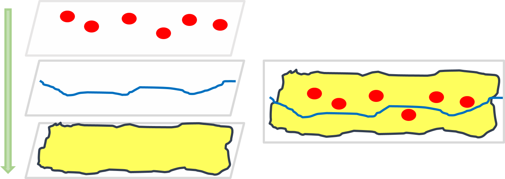

# GISの基本概念
　本教材は、初学者向けにGISの基本概念や用語を簡単にまとめたものです。各項目に関する詳しい解説は、[地理情報科学教育用スライド（GIScスライド）]が参考になります。本教材を使用する際は、[利用規約]をご確認いただき、これらの条件に同意された場合にのみご利用下さい。

[地理情報科学教育用スライド（GIScスライド）]:http://curricula.csis.u-tokyo.ac.jp/slide/2.html
[利用規約]:../../../master/利用規約.md

**Menu**
------
- [地理情報システムとは](#地理情報システムとは)
- [ソフトウェア](#ソフトウェア)
- [地理情報データ](#地理情報データ)
- [ベクトルデータ](#ベクトルデータ)
- [ラスタデータ](#ラスタデータ)
- [地物とレイヤ構造](#地物とレイヤ構造)
- [測地系と座標系](#測地系と座標系)
- [ウェブと地理情報システム](#ウェブと地理情報システム)

**スライド教材**
スライドのダウンロードは[こちら](../../../../raw/master/GISオープン教材/01_GISの基本概念/GISの基本概念.pptx)

----------

## 地理情報システムとは

- GISは、Geographic Information System の頭文字をとったものであり、コンピューターを用いて、地理空間情報（地理空間データ）を、可視化、作成、編集、検索、分析する際に用いられるものである。

- 地理空間情報とは、位置情報をもった、人間（社会・経済・文化等）及び自然環境に関する情報のことである。

- GISでは、地理空間情報をデータとして表現し、コンピューターで処理を行う。

[▲メニューへもどる]

## ソフトウェア

- GISソフトウェアは、有償のものから無償で利用できるオープンソースのものまで様々あり、用途によって選択することが一般的である。

- 本教材は、Free Open Source for GeoSpatial（FOSS4G）とよばれる無償利用できるオープンソースのGISを中心に構成している。

- オープンソースのGISは、世界中の開発者により、開発が進められている。

[▲メニューへもどる]

## 地理情報データ
　GISでよく利用するデータとしてベクトルデータとラスタデータがある。

| データ|特徴|代表的なファイル|
|---|---|---|
|ベクトル|・座標値で表現するため拡大縮小による劣化がない ・細かい形状を表現するのに適している ・属性データを複数保持できるが管理が煩雑|SHAPE, KML, GeoJSON |
|ラスタ|・解像度は、ピクセルの大きさに依存するため拡大縮小で劣化する ・地形や気温のような連続性のあるデータに適している ・構造が単純なため計算や比較がしやすい(1ピクセルに1つの値を保持)|GeoTIFF, PNG, JPEG |

## ベクトルデータ

- ベクトルデータとは、座標値を持った点のデータである。

- 地物は、ポイント（点）、ライン（線）、ポリゴン（面）で表現される。

- 座標値で位置が決まるため、拡大縮小しても劣化しない。

- 位置情報の他に、複数の属性情報をもつことができる。

  例）店舗データの場合
  店舗名、住所、業種、店舗の面積、階数、従業員数、定休日など

- 代表的なファイル形式として、ESRIのシェープファイル（Shapefile）がある。

### シェープファイルとは
 ESRI社の提唱したファイル形式で、多くのGISソフトウェアがサポートしている。シェープファイル(Shapefile)は、.shp、.shx、.dbfなど複数からなる。データの移動時に.shpのみを移動してしまっために、データが表示されないというミスがよく見られる。

[▲メニューへもどる]

## ラスタデータ

- ラスタデータとは、ピクセル（画素）で区分されたデータである。

- ピクセルごとに値を用いて地物を表現する。

- 拡大や縮小により、データの見え方が変化する。

- 地表面の標高値を保持したDEM（Digital Elevation Model）のような地形の可視化に用いられることが多い。

- 位置情報を保持した代表的なファイル形式として、GeoTIFFがある。

[▲メニューへもどる]

## 地物とレイヤ構造

- GISではデータ（レイヤ）を重ね合わせて地物を表現する。

- 地物(Feature)は、道路、河川、建物、境界、線路など、地球上にあるすべてのものを示す概念です。

面の下に点や線を配置すると面で隠れてしまうため、複数のレイヤを用いて重ね合わせする際には、注意が必要である。

[▲メニューへもどる]

## 測地系と座標系
地理空間データには、位置を示すため座標系が定義されている。GISでデータを処理する際は、座標系に注意する必要がある。
測地座標系の変換手法については、[空間データ]の教材で詳しく解説しているが、事前に以下の内容を把握しておくとよい。

- 測地系とは、地球上の座標を楕円体に基づいて経緯度で規定するもので、測地系から座標系を定義する。

- 空間データは、座標系に基づいた位置情報を保持している。

- 座標系は、大きく分けると経緯度で定義された地理座標系と平面上で定義された投影座標系の2つがある。

- GIS上で同一地域のデータが異なって、表示される場合は座標系を確認する。

**※ QGISでは、オンザフライCRS変換（オンザフライ投影）という機能があり、異なる測地座標系のデータをシステム内で変換し表示する機能がある。デフォルトでは、その機能が有効になっている。**

[▲メニューへもどる]

## ウェブと地理情報システム

- Web GISとは、Web上で動作するGISのことである。

- 大きく分けるとサーバーで処理を行うものとデータを配信するものに分けられる。

- Web GISの利点として、GISソフトウェアのインストールが不要であることがあげられる。

- 最近では、行政や企業が情報を発信する以外に、個人レベルで地図を作成しWebで配信する事例もみられる。

[▲メニューへもどる]

#### ライセンスに関する注意事項
　本教材で利用しているキャプチャ画像の出典やクレジットについては、[その他のライセンスについて]よりご確認ください。

[その他のライセンスについて]:../その他のライセンスについて.md
[空間データ]:../08_空間データ/空間データ.md
[▲メニューへもどる]:GISの基本概念.md#menu
