# 既存データの地図データと属性データ
　本教材は、「既存データの地図データと属性データの実習用教材」です。GISで利用できる地図データや属性データのダウンロード手法について解説しています。データのダウンロードには、WEBブラウザを用いています。この教材では 、ダウンロードしたデータの活用法についての解説はしていません。講義用教材として、[地理情報科学教育用スライド（GIScスライド）]の2章が参考になります。

　課題形式で使用する場合は、本教材を一読した後、[課題ページ]へお進みください。GIS初学者は、本教材を進める前に[GISの基本概念]の教材を確認しておいてください。本教材を使用する際は、[利用規約]をご確認いただき、これらの条件に同意された場合にのみご利用下さい。

※本教材は、2015年8月現在の情報で作成しています。そのため、ダウンロードサイトの仕様等に変更がある場合がある可能性があります。

[地理情報科学教育用スライド（GIScスライド）]:http://curricula.csis.u-tokyo.ac.jp/slide/2.html
[利用規約]:../../../../master/利用規約.md

**Menu**
-----
**国・地方自治体のGISデータのダウンロード**
- [国土交通省のGISデータ基盤地図情報(国土地理院)](#国土交通省のGISデータ基盤地図情報(国土地理院))
- [国土交通省のGISデータ国土数値情報](#国土交通省のGISデータ国土数値情報)
- [環境省のGISデータ](#環境省のGISデータ)
- [総務省のGISデータ](#総務省のGISデータ)
- [その他のGISデータ](#その他のGISデータ)
- [オープンデータ](#オープンデータ)

**スライド教材**

スライドのダウンロードは[こちら]

[こちら]:../../../../raw/master/GISオープン教材/07_既存データの地図データと属性データ/既存データの地図データと属性データ.pptx

----------
## 国土交通省のGISデータ基盤地図情報(国土地理院)</a>
　基盤地図情報は、国土交通省国土地理院が整備しているデータです。市町村や2次メッシュ単位で、測量の基準点のほか、行政区画の境界（2500レベル以上）や道路縁（2500レベル以上）等がダウンロードできます。また、地形表現や解析等で用いることのできるDEM（Digital Elevation Model）もダウンロードすることができます。基盤地図情報として提供されているデータは、ダウンロード後に変換が必要です。以下では、基盤地図情報からデータをダウンロードする手法について解説しています。教材に従って任意のファイルを選択し、ダウンロードを試してください。

※基盤地図情報の利用については、測量法に従ってください。また、DEMデータの変換手法は、[ラスタデータの分析]教材で解説しています。

基盤地図情報をダウンロードするため、[国土地理院]のサイトにアクセスする。地図・空中写真・地理調査をクリックし、基盤地図情報をクリックする。

基盤地図情報のダウンロードをクリックし、ログインを行う。登録をしていない場合は、新規登録を行う。

ログインIDとパスワードを入力する。ログインが完了したら、アンケートを入力し、次へをクリックする。

基盤地図情報基本項目をクリックし、基盤地図情報のダウンロード画面へ進む。

ダウンロードしたい基盤地図情報基本項目にチェックをいれ場所を選択し 次へ をクリックする。今回は、基本項目全てをダウンロードするため、全ての項目をチェックし、まとめてダウンロードをクリックする。ダウンロード後、Zipファイルを解凍する。

### 基盤地図情報ビューアをダウンロードする
　以下では、ダウンロードした基盤地図情報をQGISで使用できるシェープファイルに変換する手法について解説しています。

[基盤地図情報のサイト](https://fgd.gsi.go.jp/download/menu.php) から、データをシェープファイルに変換するためのビューアをダウンロードする。

ダウンロードしたZipファイルを解凍し、.exeファイルを開くと、ビューア（FGDV）が立ち上がる。
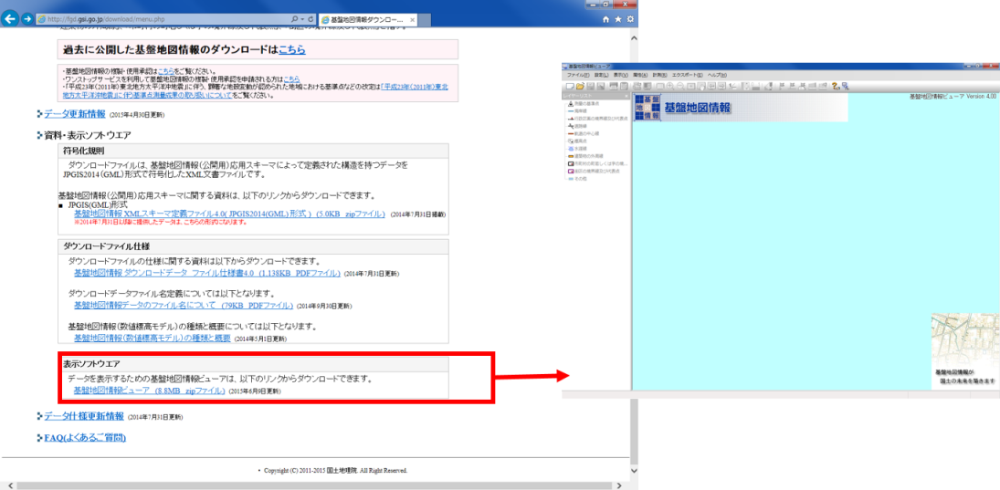

FGDVを利用し、QGISで利用できるようにデータを変換する。

①ファイルを開き、新規プロジェクト作成をクリックする。
②追加からダウンロードしたファイルを選択。
③保存先フォルダを作成し、指定する。
④OKをクリックする。

しばらくするとデータが表示されるが、読み込むデータの量によってフリーズする（PCの動作が停止する）ことがある。

各値を設定し、シェープファイルの出力を行う。
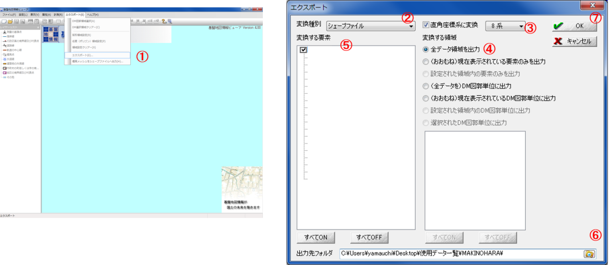
①エクスポートをクリックする。
②シェープファイルを選択する。
③8系を選択する（データによって変わるため注意する）。
④全データ領域を出力にチェック（データ量によって変えること）する。
⑤全てにチェックをつける（データ量や目的によって変えること）する。
⑥出力先のフォルダを選択する。
⑦OKをクリックする。

変換が終わるまで時間がかかる。また、途中でフリーズする可能性があるため、広範囲、高密度のデータを変換する場合は、データを分けて変換することが望ましい。

### 地理院地図
国土地理院が提供するデジタル地図として、[地理院地図](https://maps.gsi.go.jp)があります。地理院地図では、2万5千分の1地形図や空中写真等を電子化した電子国土基本図のほか、土地条件図などの主題図を閲覧することができます。地理院地図は、オープンソースとして提供されています。タイルで配信されているデータは、WEB地図やGISソフトウェアで背景地図として利用することができます。

[▲メニューへもどる]

## 国土交通省のGISデータ国土数値情報</a>
　国土数値情報は、国土交通省が整備しているGISデータで、国土計画の策定や推進のために提供されているものです。ほとんどのデータが、シェープファイルで提供されています。以下では、国土数値情報のサイトから、データをダウンロードする手法について解説をしています。教材に従って任意のファイルを選択し、ダウンロードを試してください。

データをダウンロードするため、[国土数値情報]のサイトにアクセスする。統一フォーマット（SHP・GML）をクリックし、任意の項目にチェックをいれて、下段の選択をクリックする。
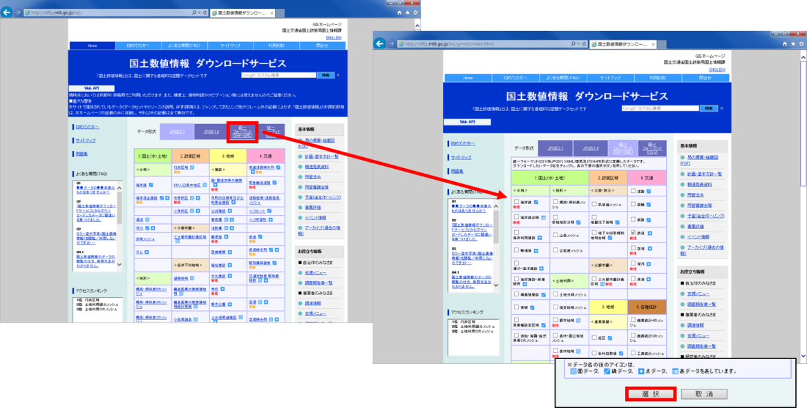

データの範囲を決めるため、任意の地域にチェックをいれ選択をクリックする。今回は最新版の世界測地系のデータをダウンロードするため、該当する項目にチェックをいれ、選択をクリックする。
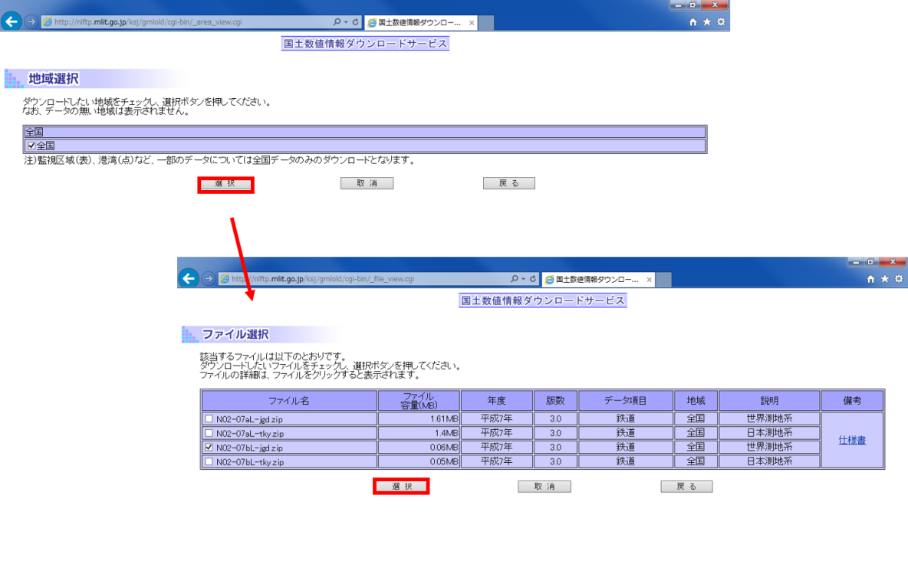

アンケートに回答し、利用約款を読み はい をクリックする。
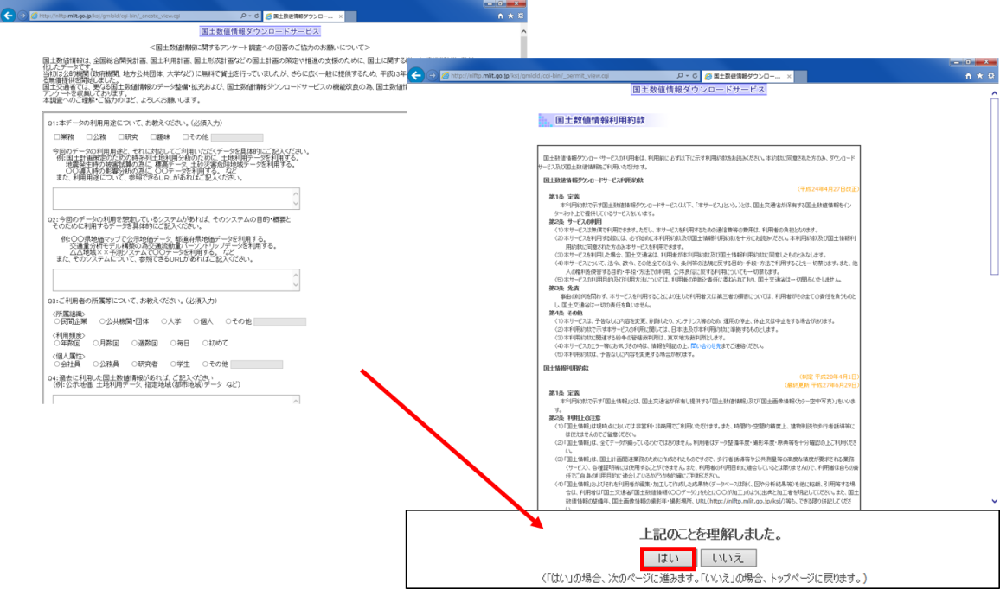

ダウンロードをクリックすると、データが保存できる。QGISなどでデータを読み込む場合は、ダウンロード後に.Zip形式のファイルを解凍する必要がある。
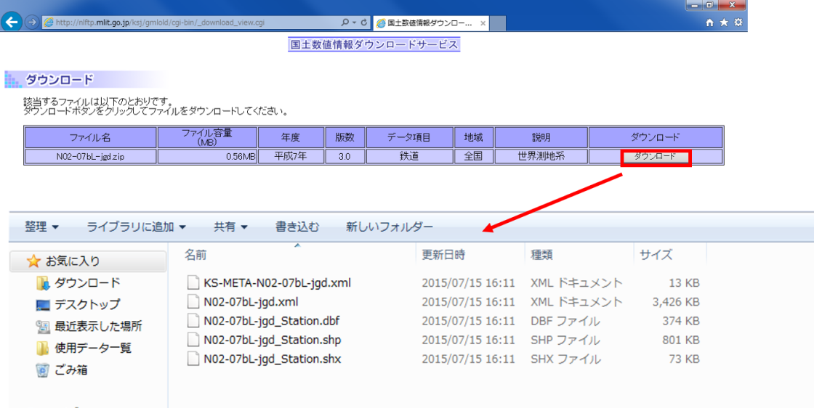

[▲メニューへもどる]

## 環境省のGISデータ</a>
　以下では、環境省が公開している生物多様性サイトのGISデータのダウンロード手法について解説しています。このサイトでは、植生等に関するGISデータが提供されています。教材に従って任意のファイルを選択し、ダウンロードを試してください。

[生物多様性]のサイトにアクセスし、自然環境GISをクリックする。ダウンロードできるデータの形式として、KMLファイルとシェープファイルが選択できる。
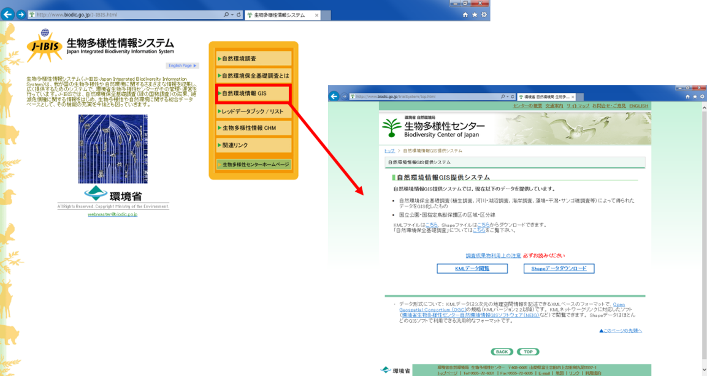

取得したいデータを選択し、ダウンロード画面へ進む。
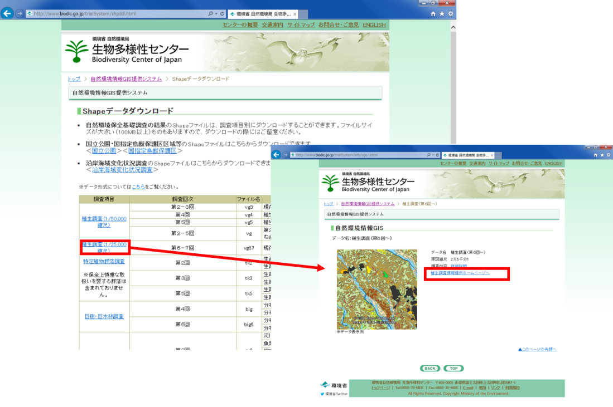

地図で場所を選択し、GISデータ（シェープファイル）をダウンロードする。
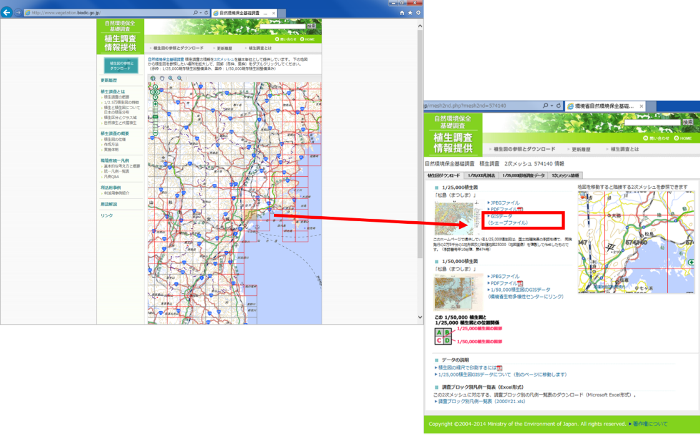

アンケートに回答し、注意事項に同意し、データのダウンロードを行う。
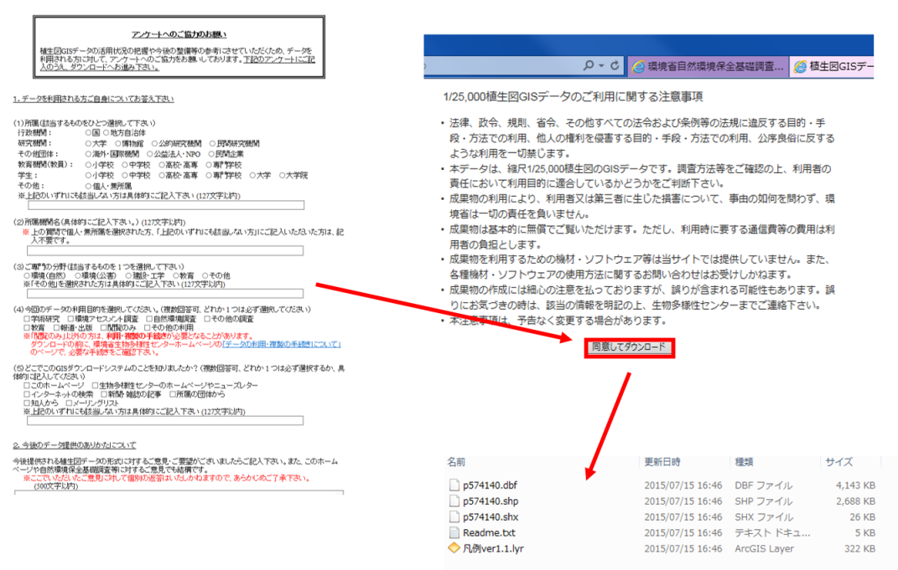

  [▲メニューへもどる]
## 総務省のGISデータ</a>
　以下では、総務省が公開しているGISデータのダウンロード手法について解説しています。[e-Stat]では、国勢調査、経済センサス、事務所・企業統計調査、農林業センサスなどがダウンロードできます。GISで扱えるデータとして、市区町村境界のデータも提供されています。教材に従って任意のファイルを選択し、ダウンロードを試してください。

[e-Stat]のサイトにアクセスする。地図で見る統計（統計GIS）をクリックし、データダウンロードをクリックする。
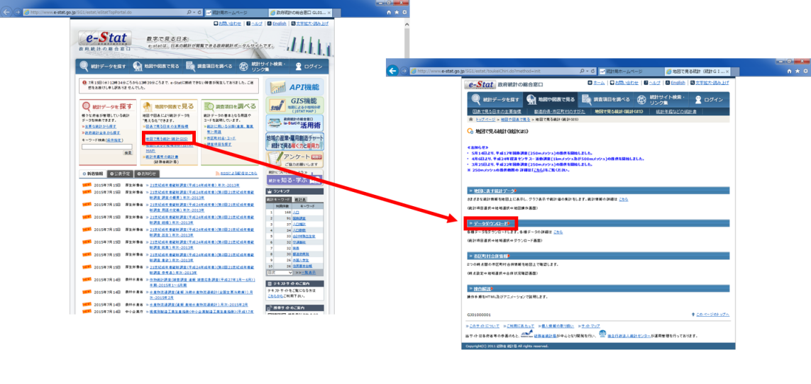

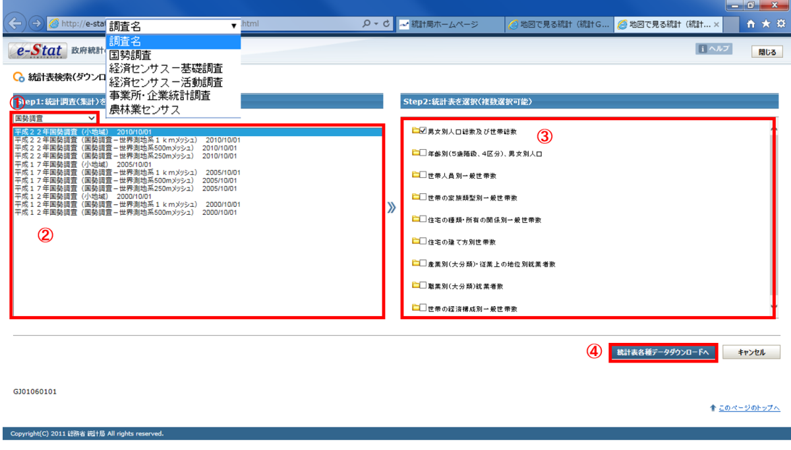
①調査の種類を選択する。
②調査の年代、データ種類を選択する。
③調査の項目を選択する。
④統計各種データダウンロードへをクリックする。

地域を選択してデータをダウンロードする。境界データをダウンロードする際は、データの違い（空間座標系の違い等）に注意する。今回は、世界測地系の平面直角座標系のデータを利用する。
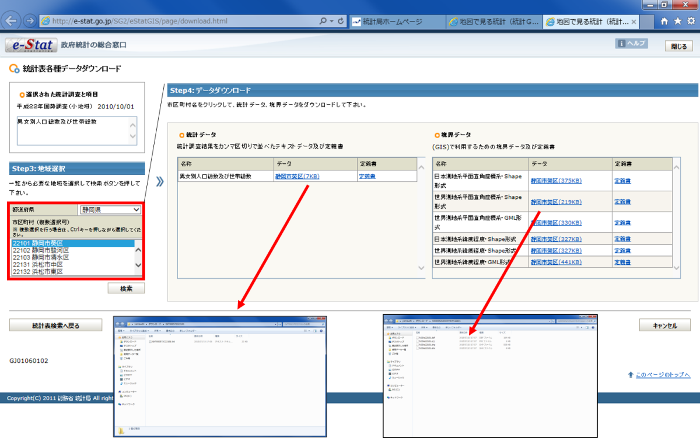

[▲メニューへもどる]

## その他のGISデータ</a>
### 属性データを地図化するためのデータ
属性データを地図化するためのデータとして、[Municipality map]のサイトを利用する手法について解説しています。教材に従って任意のファイルを選択し、ダウンロードを試してください。

[Municipality map]のサイトにアクセスし、ページを開く。このサイトでは、市区町村区域のGISデータをダウンロードすることができる。ダウンロードしたい年月を選択し、区域データを生成するをクリックする。

### 地方自治体のGISデータ
地方自治体は様々なデータをWeb GISで公開していています。ダウンロードできるものと、閲覧のみのものがあります。以下では、その例をいくつか紹介しています。

(例)
* [ぎふ県域統合型GIS]
* [おかやま全県統合型GIS]
* [静岡県統合基盤地理情報システム]
* [長野県統合型地理情報システム]
* [京都府・市町村共同_統合型地理情報システム（GIS）]

[▲メニューへもどる]

## オープンデータ</a>
　オープンデータとは、「機械判読に適したデータ形式で、二次利用が可能な利用ルールで公開されたデータ」であり「人手を多くかけずにデータの二次利用を可能とするもの」のことを言います([総務省オープンデータ戦略の推進]より引用）。以下では、オープンデータのダウンロード手法について解説しています。教材に従って任意のファイルを選択し、ダウンロードを試してください。

- オープンデータとGIS
  - 自治体が、様々な情報をCSV、Shapeデータで配信している。
  - オープンデータを利用した地図アプリなども普及している。

### オープンデータの公開例
公開されているオープンデータの例

* [福井県鯖江市]
* [千葉県流山市]
* [神奈川県横浜市（よこはまオープンデータカタログ（試行版））]
* [北海道室蘭市（むろらんオープンデータライブラリ）]
* [静岡県（ふじのくにオープンデータカタログ）]

[▲メニューへもどる]

#### この教材の[課題ページ]へ進む

#### ライセンスに関する注意事項
本教材で利用しているキャプチャ画像の出典やクレジットについては、[その他のライセンスについて]よりご確認ください。

[その他のライセンスについて]:../その他のライセンスについて.md
[▲メニューへもどる]:既存データの地図データと属性データ.md#menu
[ぎふ県域統合型GIS]:https://gis-gifu.jp/gifu/portal/index.html
[おかやま全県統合型GIS]:http://www.gis.pref.okayama.jp/map/top/index.asp
[静岡県統合基盤地理情報システム]:http://www.gis.pref.shizuoka.jp
[京都府・市町村共同_統合型地理情報システム（GIS）]:http://g-kyoto.gis.pref.kyoto.lg.jp/g-kyoto/top/
[長野県統合型地理情報システム]:http://www3.pref.nagano.lg.jp/gis/top/
[福井県鯖江市]:http://www.city.sabae.fukui.jp/pageview.html?id=12768
[千葉県流山市]:http://www.city.nagareyama.chiba.jp/10763/index.html
[神奈川県横浜市（よこはまオープンデータカタログ（試行版））]:http://www.city.yokohama.lg.jp/seisaku/seisaku/opendata/catalog.html
[北海道室蘭市（むろらんオープンデータライブラリ）]:http://g-kyoto.gis.pref.kyoto.lg.jp/g-kyoto/top/
[静岡県（ふじのくにオープンデータカタログ）]:http://open-data.pref.shizuoka.jp/
[e-Stat]:<http://www.e-stat.go.jp/SG1/estat/eStatTopPortal.do>
[生物多様性]:<http://www.biodic.go.jp/J-IBIS.html>
[ラスタデータの分析]:../15_ラスタデータの分析/ラスタデータの分析.md
[総務省オープンデータ戦略の推進]:<http://www.soumu.go.jp/menu_seisaku/ictseisaku/ictriyou/opendata/>
[Municipality map]:<http://www.tkirimura.com/mmm/>
[GISの基本概念]:../01_GISの基本概念/GISの基本概念.md
[国土地理院]:<http://www.gsi.go.jp/>
[課題ページ]:../課題/課題ページ/既存データの地図データと属性データ.md
[国土数値情報]:http://nlftp.mlit.go.jp/ksj/
