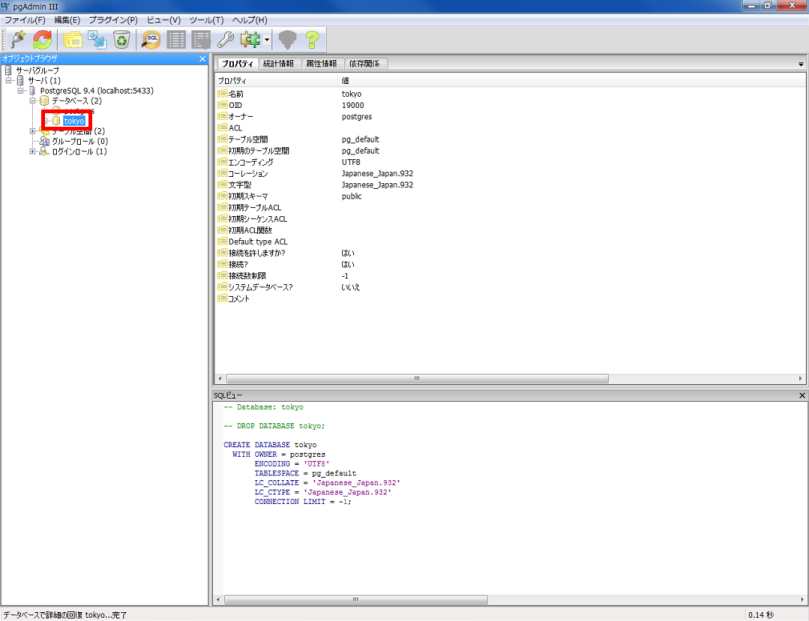
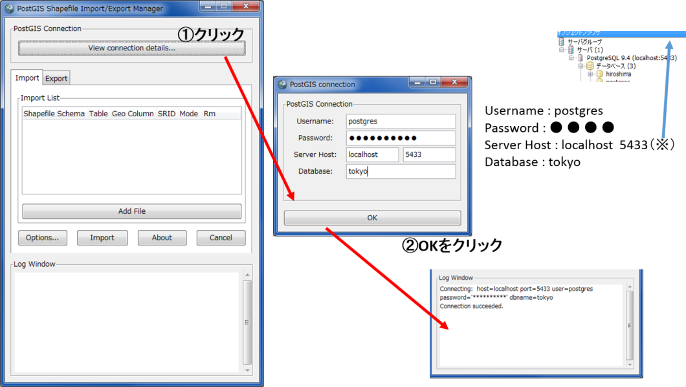
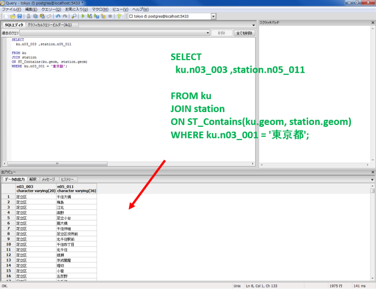
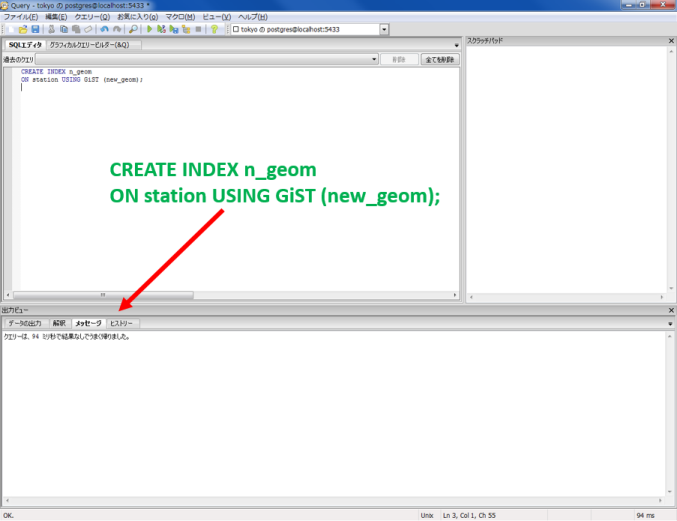
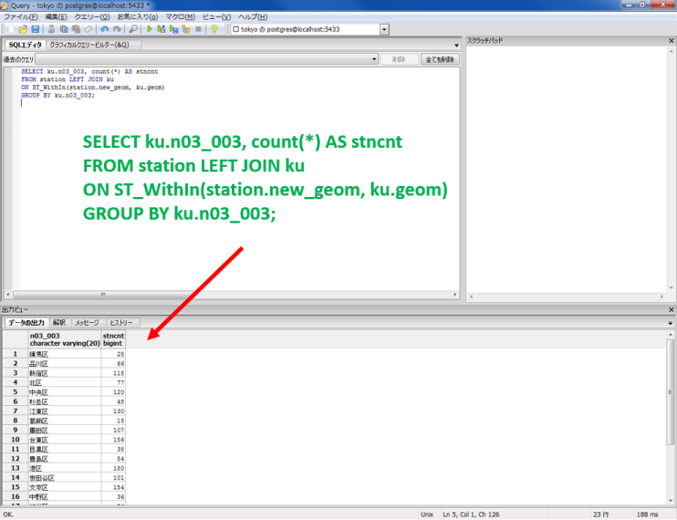
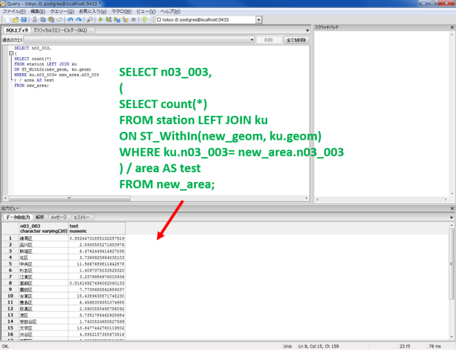
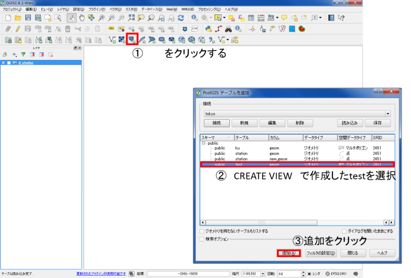
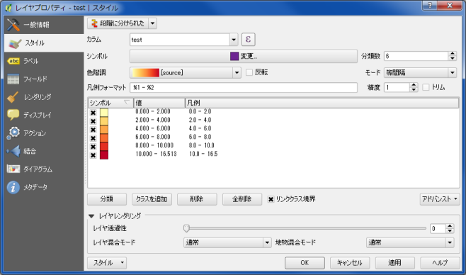

# 空間データベース
　本教材は、「空間データベース」の実習用教材です。空間データベースを用いて、属性検索や空間検索の手法について解説しています。この教材では、PostGISを利用します。事前にpgAdmin IIIとPostGISをインストールしてください。
　課題形式で使用する場合は、本教材を一読した後、[課題ページ](../課題/課題ページ/空間データベース.md)へお進みください。GIS初学者は、本教材を進める前に[GISの基本概念]の教材を確認しておいてください。本教材を使用する際は、[利用規約]をご確認いただき、これらの条件に同意された場合にのみご利用下さい。

[地理情報科学教育用スライド（GIScスライド）]:http://curricula.csis.u-tokyo.ac.jp/slide/3.html
[利用規約]:../../../master/利用規約.md
[GISの基本概念]:../01_GISの基本概念/GISの基本概念.md

**Menu**
----------
* [PostGISとは？](#PostGISとは？)
* [pgAdmin IIIの起動](#pgAdmin IIIの起動)
* [データベースの作成とテーブルの表示](#データベースの作成とテーブルの表示)
* [よく使うSQL文](#よく使うSQL文)
* [属性検索](#属性検索)
* [空間検索](#空間検索)
* [空間結合](#空間結合)
* [23区の駅密度を計算しQGISで表示](#23区の駅密度を計算しQGISで表示)


**利用データ**
* 国土交通省国土政策局「[国土数値情報] 東京都行政区画データと全国鉄道データ）」を23区のみのデータに加工し、利用。
* [東京都オープンデータ]　地域別人口.xlsx（出典:【地域別人口　（2-3表）】、東京都、クリエイティブ・コモンズ・ライセンス 表示 2.1（[https://creativecommons.org/licenses/by/2.1/jp/](https://creativecommons.org/licenses/by/2.1/jp/)）
）を利用し、平成25年1月人口をcsvに加工したものを利用。

（行政区画とテーブル結合→面積計算→utf-8で保存したものを用意する。）

[東京都オープンデータ]:http://www.metro.tokyo.jp/SUB/OPENDATA/
[国土数値情報]:http://nlftp.mlit.go.jp/ksj/index.html

**スライド教材**
スライドのダウンロードは[こちら]
[こちら]:../../../../raw/master/GISオープン教材/09_空間データベース/空間データベース.pptx

-------

## <a name="PostGISとは？"></a>PostGISとは？
* PostGISは、PostgreSQLというデータベース管理システムの拡張パックであり、 GIS オブジェクを格納できる。
* PostgreSQLとPostGISは、オープンソースであり、無料で利用できる。
* ライセンスはGNU General Public License (GPL)。
>[PostGIS Project]による[PostGIS 2.0.0マニュアル日本語訳]を参考に作成
[PostGIS Project]: http://www.postgis.org
[PostGIS 2.0.0マニュアル日本語訳]:http://www.finds.jp/docs/pgisman/2.0.0/postgis.html

[▲メニューへもどる]
[▲メニューへもどる]:空間データベース.md#menu

## <a name="pgAdmin IIIの起動"></a>pgAdmin IIIの起動
　この教材では、pgAdmin IIIを用いてPostGISを扱っていきます。そのため、以下ではpgAdmin IIIでPostGISを利用する手法について解説しています。

インストールしたpgAdmin IIIを起動する。


画面左側のオブジェクトブラウザのサーバの中のPostgreSQL9.4(localhost...)をクリックする。
ローカルサーバに接続するためパスワードを入力する。
パスワードは、インストール時に設定したものを入力する。


データベースが編集できる状態になる。


[▲メニューへもどる]

## <a name="データベースの作成とテーブルの表示"></a>データベースの作成とテーブルの表示
　以下では、pgAdmin IIIを用いたデータベースの作成、空間データの読み込み、テーブルデータの表示について解説しています。作成したデータベースは、QGISで読み込むことができます。

### 新規データベースの作成
pgAdmin IIIを用いて、新規にデータベースを作成する際は、以下のようにする。

① データベースの上にカーソルをあわせて右クリックし、新しいデータベースを選択する
② 名前をtokyo、オーナーをpostgresにする。
③ OKをクリックする。
※　定義からエンコードを確認しておく（utf-8）

下の図のように、新しいデータベースが作成される。



### PostGISを追加し、空間解析機能を追加する
pgAdmin IIIに拡張機能としてPostGISを追加してする。

① 任意のＳＱＬクエリを実行するボタンをクリックする。
②　緑の矢印の先に、以下を入力する。

```
  CREATE EXTENSION postgis;
```

③ F5を押し、クエリを実行する。
④ 結果が表示され、PostGISが追加される。

以下のように、Extensions へ`postgis`が追加される。


### PostGIS 2.0 Shapefile and DBF Loader ExporterでDBにShapefileを読み込む
PostGISにシェープファイルを読み込むために、すべのプログラムからPostGIS 2.0 Shapefile and DBF Loader Exporterを立ち上げる。

「View connection details...」をクリックし、以下を入力する。

```
Username : postgres
Password : ● ● ● ●
Server Host : localhost  5433（※）
Database : tokyo
```

インポートするシェープファイルの情報を入力する。

① 「Add File」をクリックする。
② SRIDを入力（世界測地系平面直角9系）する。
③ 「Import」をクリックする。
※日本語ディレクトリはNG
※読み込むファイルのエンコードを確認しておく

以下のように、シェープファイルが追加される。


### テーブルの表示
以下のように、テーブルを選択して、赤枠のボタンををクリックするとテーブルの中身が参照できることを確認する。


### QGISでデータベースを読み込む
QGISを立ち上げ、データベースの読み込みボタンをクリックする。


以下の項目を入力し、「接続テスト」をクリックするとデータベースに接続できる。


```
名称　任意
ホスト　localhost
ポート　5433（チェックしておく）
ユーザー名　postgres
パスワード　● ● ● ●
```

QGISでデータベースに格納したデータを表示するには、レイヤを選択し、「追加」をクリックする。


以下のように、データベースに格納されたデータが表示される。


[▲メニューへもどる]
## <a name="よく使うSQL文"></a>よく使うSQL文
 pgAdmin IIIでは、SQLでデータベース内の検索や分析を行います。以下は、よく使うSQL文について解説したものです。

```
SELECT文・・・・・DBのテーブルからデータを検索し、取得する文
SLECT ・・・・・ 列名
FROM　・・・・・テーブル名
WHERE　・・・・条件の指定（表示するデータの選択)列＝値など

列 = 値　・・・　　列が値と一致するものを抽出
列 >= 値　・・・　列が値（数値）より大きいものを抽出
列 <= 値　・・・　列が値（数値）より小さいものを抽出

※ 他に良く使うもの　　AND a=b and c>=d aがbと一致していてcがd(数値)以上のもの
    OR a=b and c>=d aがbと一致しているかcがd(数値)以上のもの
    LIKE a＝ LIKE '新％' a列に含まれる新○○を抽出する　あいまい検索
    (　チェック　　　GROUP BY　・・・・ グループ化する集約関数）

```

[▲メニューへもどる]

## 属性検索
空間データベースを利用して、属性検索と空間検索をする手法について解説しています。

#### テーブルを表示する


```
SELECT n03_003 FROM ku;
```

※n03_003・・・kuテーブルの区名が含まれる列名

#### テーブルを複数表示する


```
SELECT n03_003,area2 FROM ku;
```


#### 東京23区内のJR駅を表示する


```
SELECT n05_011
  FROM station
  WHERE n05_003 = '東日本旅客鉄道（旧国鉄）';
```

23区内に98駅抽出できた。

#### 鉄道会社ごとに駅の数を計算する


```
  SELECT n05_003,count(n05_011)
  FROM station
  GROUP BY n05_003 ;
```

※count()　データを数える関数

#### 23区内の人口を計算する


```
SELECT sum(h25_10pop) AS population
FROM ku

```

Sum()・・・合計を計算する関数
AS　・・・　別の列名として表示する

#### 23区内の人口密度を計算をする


```
SELECT sum(h25_10pop) / sum(area2) *1000000 AS population_density
FROM ku
```

人口密度＝人口÷面積×1000000（単位をkmにするため）
※h25_10pop・・・kuテーブルの平成27年6月の区人口を含む列

#### 23区ごとの人口密度を計算をする


```
SELECT n03_003, sum(h25_10pop) /sum(area2) *1000000 AS population_density
FROM ku
GROUP BY n03_003
```

[▲メニューへもどる]

## 空間検索

#### 勝どき駅のジオメトリを表示する


```
SELECT n05_011,geom
FROM station
WHERE n05_011 = '勝どき';
```
#### 勝どき駅から半径1000m以内の駅を表示する


```
SELECT n05_011
FROM station
WHERE ST_DWithin(
        station.geom,
        '0101000020930900009B863076BADEB3C0D37989A18B79E2C0',
        1000
      );
```
※ST_DWithin(geometry列名,値 ,○○ｍ)・・・ジオメトリと範囲を指定して、それに該当するレコードを抽出する関数

[▲メニューへもどる]

## 空間結合
以下では、空間データベースを利用して、空間結合をする手法について解説しています。

#### kuテーブルのgeom(ジオメトリー)に含まれる勝どき駅を抽出する。


```
SELECT
  station.n05_011,ku.n03_003
FROM ku
JOIN station
ON ST_Contains (ku.geom, station.geom)
WHERE station.n05_011 = '勝どき';

```

JOIN テーブル名 ON 条件式・・・テーブルを結合する式

ST_Contains(a,b)・・・a（ジオメトリー）に含まれるb（ジオメトリーを）抽出する関数

#### 千代田区に含まれる駅を表示する


```
SELECT
  ku.n03_003 ,station.n05_011
FROM ku
JOIN station
ON ST_Contains(ku.geom, station.geom)
WHERE ku.n03_003 = '千代田区';
```

#### 東京都に含まれる駅を表示する


```
SELECT
  ku.n03_003 ,station.n05_011
FROM ku
JOIN station
ON ST_Contains(ku.geom, station.geom)
WHERE ku.n03_001 = '東京都';
```

[▲メニューへもどる]

## 23区の駅密度を計算する
以下では、空間データベースを利用して、23区内の駅を抽出し、密度を計算する手法について解説しています。計算結果はQGISで表示することができます。

#### 新規にジオメトリカラムをもつテーブルをもつ列を作成する


```
SELECT AddGeometryColumn(
'station', ‘new_geom', 2451, 'POINT', 2);
```

AddGeometryColumn()・・・テーブルにジオメトリカラムを作成する
‘テーブル名’, ‘新規ジオメトリカラムの列名（任意）’, 2451（SRID）, ‘データタイプ’, 2（ｘとｙなので2）

#### すべてのレコードを表示する

新規にジオメトリカラムをもつテーブルをもつ列（new_geom）が作成された。
```
SELECT *
From station;

```
SELECT * ・・・　* すべてのレコードを表示する

#### 空間インデックスの作成


```
CREATE INDEX n_geom
ON station USING GiST (new_geom);
```

- `CREATE INDEX` ・・・インデックスを作成する
- `USING GiST`・・・インデックスを空間インデックスとする

#### 列に駅のジオメトリーを追加する


```
UPDATE station SET new_geom = ST_Centroid(geom);
```

UPDATE テーブル SET 列名 ・・・テーブル内の列の値を更新する
= ST_Centroid(geom);・・・中心座標を取得する関数


列（new_geom）に、駅のジオメトリーが新規に追加された。

#### 別のテーブルを用いて、23区ごとに駅数を計算する


```
SELECT ku.n03_003, count(*) AS stncnt
FROM station LEFT JOIN ku
ON ST_WithIn(station.new_geom, ku.geom)
GROUP BY ku.n03_003;
```
a LEFT JOIN b ・・・ aが結合条件に一致しなくてもレコードを表示する（外部結合）

#### 面積の単位をｋ㎡にする


```
SELECT
n03_003,
area2 / 1000000
FROM ku;
```

#### 駅密度を計算するために新規にテーブルを作成する


```
SELECT
n03_003,
Sum(area2 / 1000000)
AS area
INTO new_area
FROM ku GROUP BY n03_003;
```

以下のように、区ごとに駅密度が計算された。



```
SELECT n03_003,
(
SELECT count(*)
FROM station LEFT JOIN ku
ON ST_WithIn(new_geom, ku.geom)
WHERE ku.n03_003= new_area.n03_003
) / area AS test
FROM new_area;
```

WHERE ku.n03_003= new_area.n03_003
) / area AS test　・・・・　駅数/面積＝駅密度

#### QGISで表示するためのVIEWを作成する


```
CREATE VIEW test AS
SELECT gid, ku.n03_003, geom,
( SELECT count(*)
FROM station LEFT JOIN ku
ON ST_WithIn(new_geom, ku.geom)
WHERE ku.n03_003= new_area.n03_003
) / area AS test
FROM ku LEFT JOIN new_area
ON ku.n03_003=new_area.n03_003;
```

CREATE VIEW　 仮想テーブルであるVIEWを作成する

#### QGISで計算結果を表示する
QGISを起動し、データベースを接続とデータの表示を行う。


以下のように、QGISでデータが表示される。


属性テーブルを確認しすると、計算結果が追加されているため、これに従って分類する。


1ｋ㎡あたりの駅の割合を色分けしていく。


下の図のように、駅密度が表示される。


## 参考サイト

- PostGISの使い方を勉強したい方　Boundless作成　PostGISワークショップ資料
http://workshops.boundlessgeo.com/postgis-intro-jp/index.html

- 本教材の参考サイト　農業・食品産業技術総合研究機構 近畿中国四国農業研究センター　寺元郁博 氏 作成
http://lets.postgresql.jp/documents/tutorial/PostGIS

- PostgreSQLを勉強したい方　PostgreSQL公式ページ
https://www.postgresql.org/

- PostGISを勉強したい方　PostGISマニュアル
http://postgis.net/docs/index.html

- PostGISの使い方を勉強したい方　Geopacific.org作成
http://geopacific.org/postgis/


[▲メニューへもどる]

**その他のライセンス**
本教材で利用しているキャプチャ画像の出典やクレジットについては、[その他のライセンスについて]よりご確認ください。
[その他のライセンスについて]:../その他のライセンスについて.md
