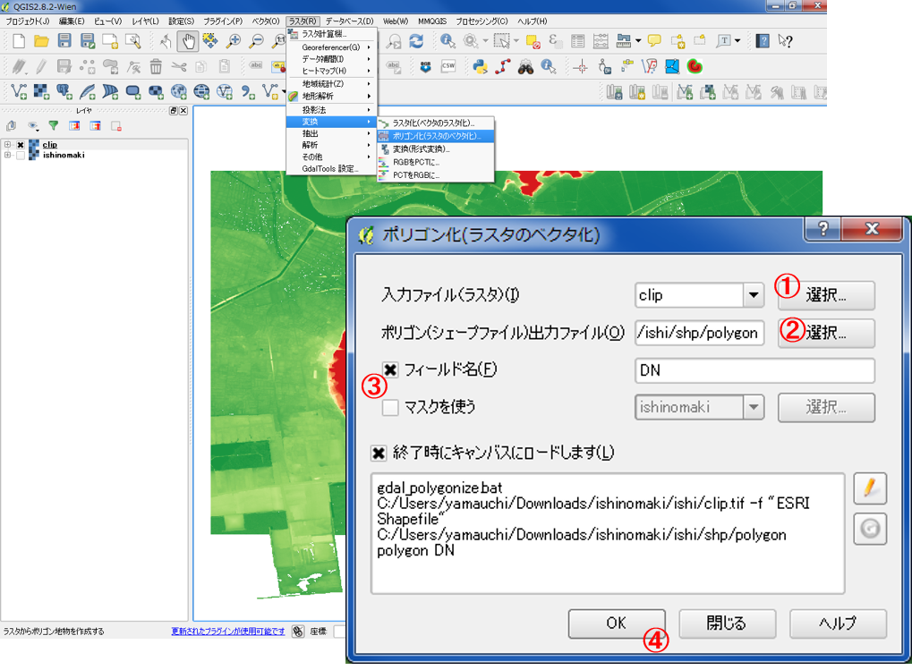
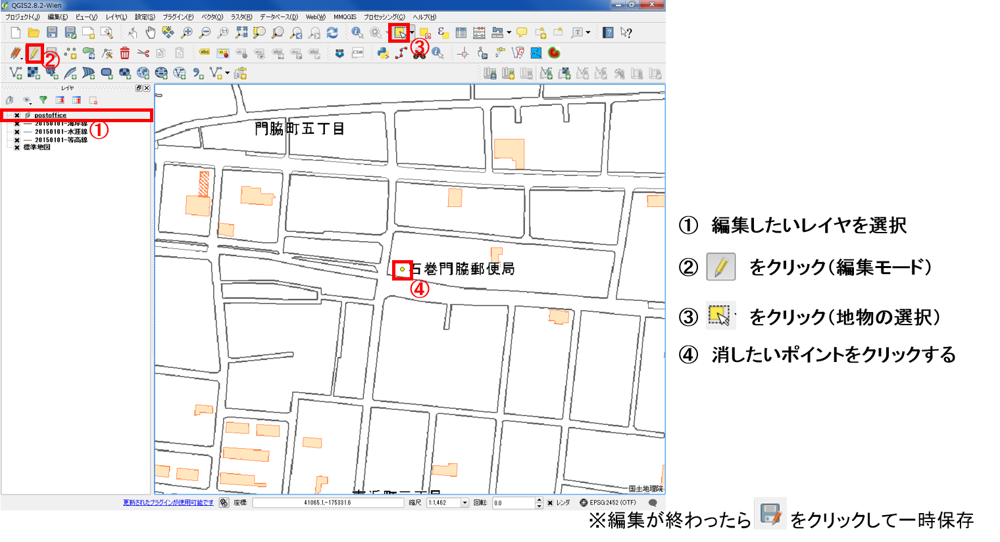
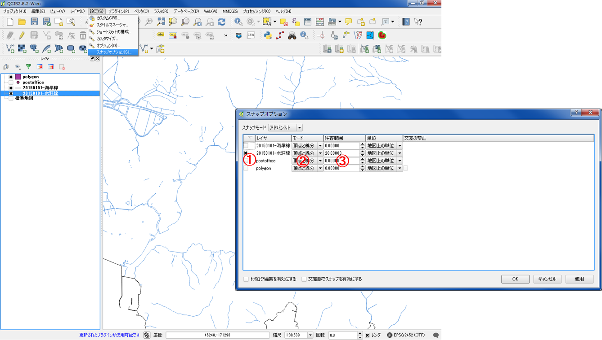
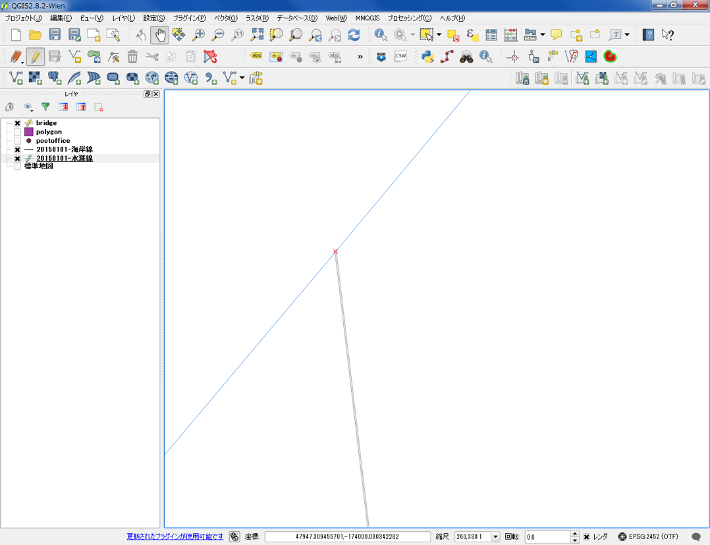
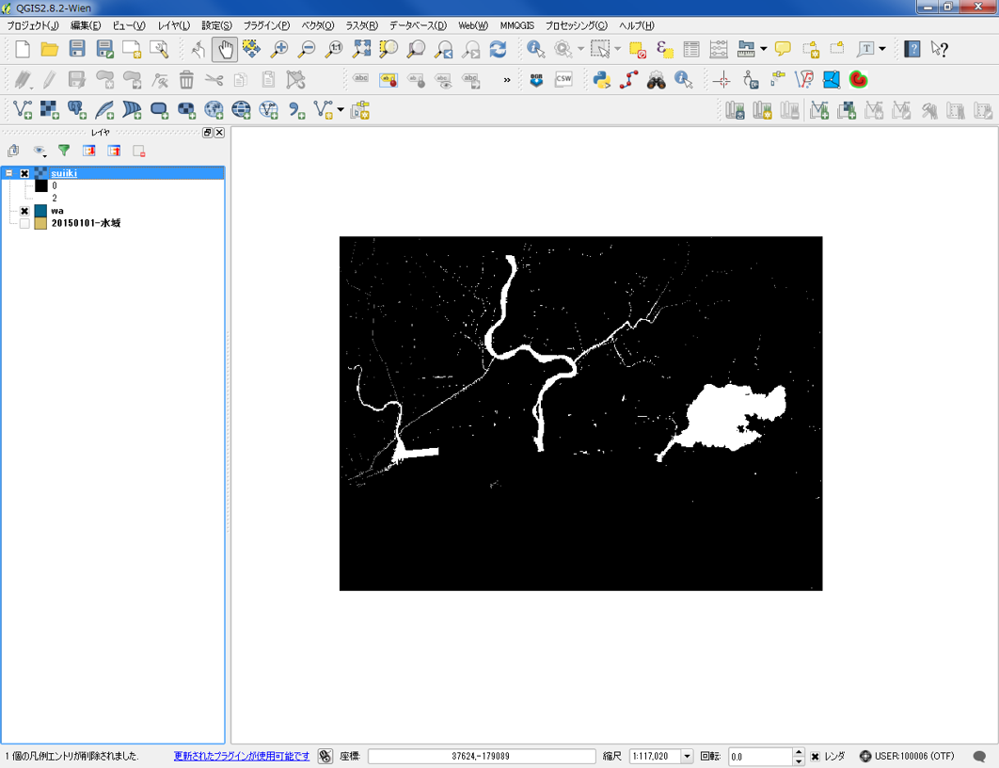
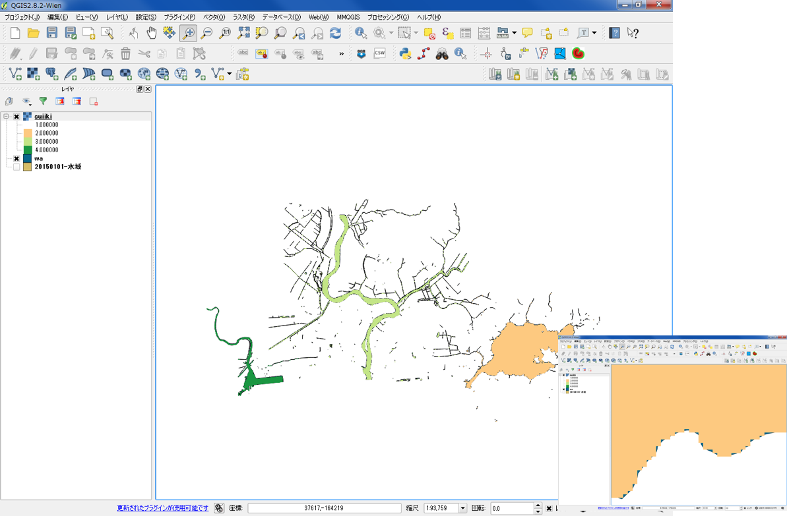

# 空間データの統合・修正
　本教材は、「空間データの統合・修正」の実習用教材です。GISで用いられるラスタデータ（以下、ラスタという）とベクトルデータ（以下、ベクタという）の統合、修正、変換などデータの編集手法について解説しています。ソフトウェアは、無償で利用できるQGISを用いています。

　課題形式で使用する場合は、本教材を一読した後、[課題ページ]へお進みください。GIS初学者は、本教材を進める前に[GISの基本概念]の教材を確認しておいてください。本教材を使用する際は、[利用規約]をご確認いただき、これらの条件に同意された場合にのみご利用下さい。

**Menu**
---------
* [ラスタのモザイクとクリップ](#ラスタのモザイクとクリップ)
* [等高線の抽出](#等高線の抽出)
* [ラスタをベクタへ](#ラスタをベクタへ)
* [新規ベクタの作成](#新規ベクタの作成)
* [ベクタの修正](#ベクタの修正)
* [ベクタをラスタへ](#ベクタをラスタへ)

**使用データ**

[既存データの地図データと属性データ]教材と[ラスタデータの分析]教材を参考に、以下のデータのダウロードおよび変換を行ってください。

* 国土地理院　[基盤地図情報]　基本項目　石巻周辺（574142、574143、574152、574153）
* 国土地理院　[基盤地図情報]　数値標高モデル　5ｍメッシュ　石巻周辺（574142、574152）

* 国土交通省国土政策局「[国土数値情報]（宮城県　郵便局データ）」を加工し、利用

>国土数値情報の座標変換が上手くいかない場合は、[よくある質問とエラー:国土数値情報の変換](../よくある質問とエラー/よくある質問とエラー.md#国土数値情報の変換)を参照

* [地理院タイル]（国土地理院）
>地理院タイルの利用は、[QGISビギナーズマニュアル:TileLayerPluginのインストール]の教材を参照。

**スライド教材**

スライドのダウンロードは[こちら](../../../../raw/master/GISオープン教材/10_空間データの統合・修正/空間データの結合・修正.pptx)

------

## ラスタのモザイクとクリップ
　以下では、[基盤地図情報]からダウンロードした5mDEMを用いて、ラスタデータの結合と任意範囲での切り抜きの解説を行っています。DEMは、Digital Elevation Modelの略であり、各セルごとに標高値を保持しるデータです。以下に従って、ダウンロードしたデータから任意地域からデータの切り出しを試してください。

ラスタを読み込むボタンをクリックして、変換したラスタを全て読み込む。

### ラスタのモザイク
ラスタを一括で処理しやすいように、ダウンロードしたラスタを一枚の画像にする（モザイク）。

ラスタ＞その他＞結合
1. 入力ファイルを選択する。
2. 出力先とファイル入力する。
3. ＯＫをクリックする。

※データが無い値は、0や-9999などを必要に応じて指定する。

以下のように、ラスタが結合できる。

このデータの場合、ラスタのセルごとに標高値を保持しているため、標高値による色分けができる。

1. プロパティ ＞ スタイルから、レイヤタイプを単バンド疑似カラーにする。
2. 新規カラーマップを作成から等間隔モードにし、分類数と配色を設定し、「分類」をクリックする。
3. 各値上でクリックを行い分類数に応じて値を書き換える（ラベルも書き換える）。
4. 適用をクリックし、配色を確認後OKをクリックする。

以下のように、標高値ごとに色わけができた。

### ラスタのクリップ
解析に必要な範囲のデータの切り取りを行うことで、解析を効率よく行うことができる。以下では、その手法について解説している。

ラスタ＞抽出＞クリッパー
1. 入力ファイルを選択する。
2. 出力先とファイル入力する。
3. 地図から切り抜きたい範囲を選択する。
4. ＯＫをクリックする。

※データが無い値は、0や-9999等を必要に応じて指定する。

ラスタが切り抜けた後、切り抜いたラスタの配色を変更する。

### ラスタの座標変換
ラスタの座標変換が必要な場合は、以下のように行う。詳しくは、[ラスタデータの分析]で解説している。

ラスタ＞投影法＞ワープを選択し、上のように値を設定し、OKをクリックする。

[▲メニューへもどる]

## 等高線の抽出
　作成したラスタデータは、各セルごとに標高値を保持している。そのため、セルの値を用いて、等高線を作成することができる。以下では、等高線を作成する手法について解説しています。

クリップしたラスタを利用して、等高線を作成する。
ラスタ＞抽出＞等高線をクリックする。

1. 入力ファイルを選択する。
2. 出力先とファイル入力する。
3. 等高線の間隔を入力（単位はｍ）する。
4. チェックを入れる
5. ＯＫをクリックする。

等高線は任意に指定した間隔で作成できる。以下では、例として、1mと5mの等高線を作成している。

以下のように、1mと5mの等高線が出力された。

[▲メニューへもどる]

## ラスタをベクタへ
　GISでは、処理の内容やデータの表現のため、ラスタデータやベクタデータを使い分けて使用します。以下では、ラスターデータをベクタデータに変換する手法について解説しています。

ラスタをベクターに変換する。

ラスタ＞変換＞ポリゴン化（ラスタのベクタ化）
1. 入力ファイルを選択する。
2. 出力先とファイル入力する。
3. チェックを入れる。
4. ＯＫをクリックする。

下の図のように、ラスタがベクタに変換できた。

### ポリゴンから特定の値（例：10m以上の地域）を表示する場合
作成したポリゴンから、特定の値の地域の抽出しデータを表示する場合は、以下のように行う。レイヤの上で右クリックし、プロパティ>スタイルをクリックする。

「段階に分けられた」を選択し、カラムに「DN」値を指定する。
分類数を1にし、「分類」をクリックする。値をクリックし10-最大値を入力し、OKをクリックする。

[▲メニューへもどる]

## 新規ベクタの作成
　GISでは、データを自作をすることができます。以下では、新規にベクトルデータを作成する手法について解説しています。

新規にベクトルデータを作成する。以下では、ポイントデータの作成について解説しているが、ラインやポリゴンデータの作成もほとんど同じ手法で行うことができる。

1. レイヤ＞レイヤの作成＞新規シェープファイルレイヤを選択する。
2. 作成したいレイヤのタイプを点，ライン，ポリゴンから選択する。
3. エンコーディングと座標系を設定する。

4. 新規ポイントに追加したい属性を「新しい属性」から設定する。

「名称」はカラム名、「タイプ」はデータ型にあわせる、「幅」と「精度」は入力するデータによる。

「タイプ」・・・値が整数ならInteger、小数を含むならReal、テキストならStringとなる。
「幅」＞桁数、「精度」＞表示する小数の位
（上の画像のように標高値を設定すると、幅が4桁で小数第3位まで表示するため、9.999以上の値が入力できなくなる）

5. OKを押し保存先を選択する。

※新規ベクタ作成では、ポイント、ライン、ポリゴンを同時に作成することができない。各レイヤを作成する場合ごとに、新規レイヤ作成が必要となる。

下の図の赤枠の編集モード切替アイコンから、編集モードをオンにして任意の場所でクリックする。ポイントの追加や削除は、編集モードの隣の赤枠のボタンを利用する。
地物属性を入力するウィンドウが立ち上がるため、各項目に値を入力する。
OKをクリックするとポイントが作成される。ポイントの追加が完了したら、編集モード切替アイコンをクリックし、編集を保存する。

※ポリゴンやラインの作成：作成手法はポイントとほぼ同じである。編集時にラインや面の終点で右クリックすると、id等の属性値を入力するウィンドウが立ち上がる。

## ベクタの修正
　GISでは、既存のデータを編集することができます。地物の位置が実際とは異なっている場合や解析用に属性を編集したい場合などに、既存データを改変することがあります。以下では、ベクトルデータの修正について解説しています。

### ベクタの修正 1.ポイント
以下では、ある地点のポイントが実際の位置とは異なっていると仮定して、位置を修正する手法について解説しています。[国土数値情報]から宮城県の郵便局のデータをダウンロードし、QGISでデータを読み込んでください。

※実際には、座標変換が必要となる場合がありますが、今回はデータ編集の練習のため変換は必須ではありません。右下のEPSGと書かれたボタンから、「オンザフライCRS変換を有効にする」をチェックしておいてください。

QGISで国土数値情報でダウンロードした宮城県の郵便局のデータを読み込み、背景地図に地理院地図を利用（タイルレイヤプラグイン）する。

#### ポイントの削除
以下では、ベクタ編集の練習として、ポイントを削除する手法について解説をしています。石巻門脇郵便局と石巻中央郵便局のポイントを利用していますが、データの範囲内であればどのポイントを使用してもかまいません。

ポイントの削除を行う。

1. 編集したいレイヤを選択する。
2. 編集モードをクリックする。
3. 地物の選択をクリックする。
4. 消したいポイントをクリックする。

※編集が終わったら編集の保存ボタンををクリックして一時保存する。

ポイントが削除できた。

#### ポイントの移動
ベクタ編集の練習として、ポイントの移動を行う。

1. 編集したいレイヤを選択する。
2. 編集モードであることを確認する。
3. 地物の移動をクリックする。
4. ポイントを動かす。

※編集が終わったら編集の保存ボタンををクリックして一時保存する。

ポイントが移動できた。

#### ポイントの追加
ベクタ編集の練習として、ポイントの追加を行う。

1. 編集したいレイヤを選択する。
2. 編集モードであることを確認する。
3. ポイントの追加をクリックする。
4. 追加したい地点をクリックする。
5. 属性テーブルを参考に、任意の値を入力しＯＫをクリックする。

#### 属性テーブルを編集する
QGISでは、属性情報を編集することができます。以下では、その手法について解説しています。

1. 編集したいレイヤを選択する。
2. 編集モードであることを確認する。
3. 属性テーブルを開く。
4. テーブルを編集する。
※編集が終わったら編集の保存ボタンををクリックして一時保存する。

編集が完了したらたら編集ボタン(下の図の左上赤枠)をクリックすると編集モードが終了する。この時、メッセージが出る場合は、保存をクリックする。

### ベクタの修正 2.ラインとポリゴン
以下では、ラインとポリゴンの編集について解説しています。以下を試す前に、新規ベクタの作成を参考に任意の形のポリゴンを新規に作成して下さい。ラインは、基盤地図情報から石巻市周辺の水涯線をダウンロードして利用してください。

#### ポリゴンの修正
以下のようなポリゴンを新規に作成する。

ポリゴンの頂点を編集し、形状の変更を行う。

1. 編集したいレイヤを選択する。
2. 編集モードをクリックする。
3. ノードツールをクリックする。
4. 頂点を編集する。

頂点を移動するとポリゴンの形状が変わり、線上でダブルクリックすると頂点が増える。

#### 新規ポリゴンを連結させる
GISで扱うポリゴンやラインは、データが連結している方が望ましい場合があります。データが重なっていなかったり、重複していると解析に支障が生じることがあります（例えば、道路データを分析する場合、ラインとラインの間に隙間がないことが条件になる。）。そこで、以下ではポリゴンやラインを連結する手法について解説しています。

まず、ポリゴンの作成ボタンをクリックし、新しいポリゴンを作成する。

連結させるようにポリゴン同士の頂点を重ねる。

下の図は連結しているようにみえるが、拡大すると連結していないことが確認できる。この方法では、ポリゴンを連結することはできないことを理解する。

#### 頂点の重ね合わせ
以下では、万石浦に橋を建設することを仮定して、QGISで頂点を重ねる手法について解説しています。基盤地図情報からダウンロードした石巻周辺の水涯線のデータを利用しています。

QGISで基盤地図情報からダウンロードした石巻市のデータを読み、頂点の連結を確認する。
編集したいレイヤを選択後に編集モードをオンにし、ノードツールをクリックする。

ラインやポリゴンは頂点でつながっていることを確認するため、頂点を移動する（保存はしない）。

頂点に重ねられるようにするため、設定＞スナップオプションをクリックする。スナップオプションの設定を以下のように指定する。

1. 編集したいレイヤにチェックを入れる。
2. 頂点と線分を選択する。
3. 許容範囲を入力（今回は20）する。

#### ラインと頂点の編集（万石浦に橋を作成）
新規のラインを作成し、万石浦に橋を作成していく。レイヤ＞新規シェープファイルレイヤをクリックする。

1. ラインを選択する。
2. エンコーディングを選択する。
3. ＣＲＳを選択する。
4. ＯＫをクリックする。
5. 出力先とファイル名を入力し保存する。
※今回は、属性を追加しない。

以下のように、新規のラインが追加された。わかりやすいように、プロパティからスタイルを変更しておくと良い。

#### ラインのレイヤを新規に作成する
ラインの頂点を連結させ、万石浦に橋（ライン）を作成する。

編集モードで、水涯線にカーソルをあてるとカーソルの色が変化する。この状態で、編集を続けていく。ラインの終点で右クリックをするとラインが作成できる。

編集が完了したらたら編集ボタンをクリックすると編集モードが終了する。この時、メッセージが出る場合は、保存をクリックする。

以下のように、頂点が重なっていることが確認できる。

[▲メニューへもどる]

## ベクタをラスタへ
　GISでは、処理の内容やデータの表現のため、ラスタやベクタを使い分けて使用します。以下では、石巻市周辺の水域ポリゴンをラスタへ変換する手法について解説しています。また、以下ではラスタ変換用に加工した水域ポリゴンを使用しています。水域ポリゴンの作成は、中級者向けになるので、初級者には以下の教材が難しい可能性があります。

ラスタ変換用に、加工した主な水域ごとに値を分類したポリゴンを作成する。

→属性テーブルを整理し、1列にしておく。
→選択して水域ごとに値を入れる。
→シングルパートをマルチパートにする。

ベクタをラスタに変換する。

ラスタ＞変換＞ラスタ化（ベクタのラスタ化）
1. ベクタを選択する。
2. 色分けに使う、属性フィールドを選択する。
3. 出力先とファイル名を入力する。
4. チェックする。
5. ＯＫをクリックする。

水域ポリゴン（ベクタ）がラスタに変換された。

色分けすると主な水域ごとに色分けができる。また、拡大するとラスタであることが確認できる。

[▲メニューへもどる]

#### この教材の[課題ページ]へ進む

#### ライセンスに関する注意事項
本教材で利用しているキャプチャ画像の出典やクレジットについては、[その他のライセンスについて]よりご確認ください。

[その他のライセンスについて]:../その他のライセンスについて.md
[ラスタデータの分析]:../15_ラスタデータの分析/ラスタデータの分析.md
[QGISビギナーズマニュアル]:../QGISビギナーズマニュアル/QGISビギナーズマニュアル.md
[既存データの地図データと属性データ]:../07_既存データの地図データと属性データ/既存データの地図データと属性データ.md
[基盤地図情報]:http://www.gsi.go.jp/kiban/
[国土数値情報]:http://nlftp.mlit.go.jp/ksj/index.html
[地理院タイル]:http://maps.gsi.go.jp/development/ichiran.html
[課題ページ]:../課題/課題ページ/空間データの統合・修正.md
[地理情報科学教育用スライド（GIScスライド）]:http://curricula.csis.u-tokyo.ac.jp/slide/3.html
[利用規約]:../../../master/利用規約.md
[GISの基本概念]:../01_GISの基本概念/GISの基本概念.md
[QGISビギナーズマニュアル:TileLayerPluginのインストール]:../QGISビギナーズマニュアル/QGISビギナーズマニュアル.md#tilelayerpluginのインストール
[▲メニューへもどる]:空間データの統合・修正.md#menu
<h2 style="background-color:#F8F5FD;text-align:center;">教材の利用に関するアンケート</h2>　本プロジェクトでは、教材の改良を目的とした任意アンケートを実施しています。ご協力いただける方は、<a href="https://customform.jp/form/input/14328/">アンケート</a>にお進みください。ご協力のほどよろしくお願いいたします。  ※ 本アンケートの成果は、教材の改良のほか、学会での発表等の研究目的でも利用します。また、本アンケートでは、個人が特定できるような質問は設けておりません。
