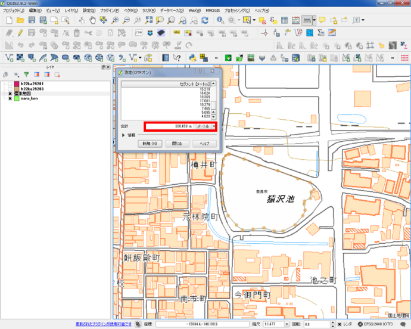
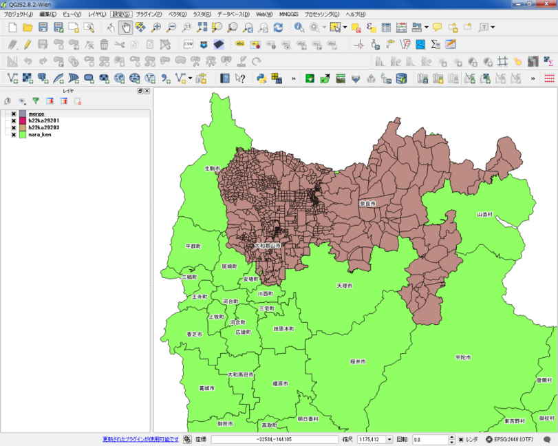
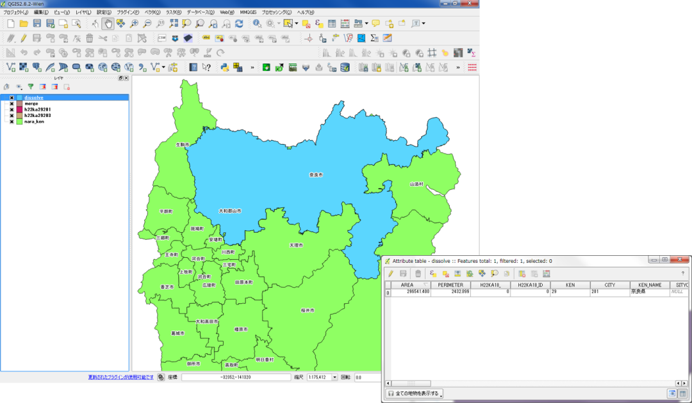

# 基本的な空間解析
　本教材は、「基本的な空間解析」の実習用教材です。GISソフトウェア（QGIS）を用いた、地物の計測、ディゾルブ、クリップなどの空間解析手法について解説しています。講義用教材として、[地理情報科学教育用スライド（GIScスライド）]の4章が参考になります。
　課題形式で使用する場合は、本教材を一読した後、[課題ページ](../課題/課題ページ/基本的な空間解析.md)へお進みください。GIS初学者は、本教材を進める前に[GISの基本概念]の教材を確認しておいてください。本教材を使用する際は、[利用規約]をご確認いただき、これらの条件に同意された場合にのみご利用下さい。

[地理情報科学教育用スライド（GIScスライド）]:http://curricula.csis.u-tokyo.ac.jp/slide/4.html
[利用規約]:../../../master/利用規約.md
[GISの基本概念]:../01_GISの基本概念/GISの基本概念.md

**Menu**
------
* [基本量の測定と空間オブジェクトの選択](#基本量の測定と空間オブジェクトの選択)
* [その他の空間データの操作](#その他の空間データの操作)
* [オーバーレイ分析](#オーバーレイ分析)

**使用データ**  
　実習をはじめる前に、以下のデータをダウンロードしてください。なお、すべてのデータをJGD2000の平面直角座標系第Ⅵ系で統一する。e-satのデータは、世界測地系、JGD2000の平面直角座標系第Ⅵ系でダウンロードする。国土数値情報のデータはダウンロード後に「JGD2000の平面直角座標系第Ⅵ系」へ座標変換する。国土数値情報データの読み込み時に空間参照設定のウィンドウが表示されたら、JGD2000を選択する（QGIS2.8.4の場合）。  

* 「国土交通省国土政策局「国土数値情報（奈良県　行政区域、学校、河川データ）」を加工（座標変換[EPSG:2448] ）し利用
* 政府統計の総合窓口([e-Stat]) 奈良市、大和郡山市境界データを利用
* 国土地理院　[地理院タイル]

[国土数値情報]:http://nlftp.mlit.go.jp/ksj/
[e-Stat]:http://www.e-stat.go.jp/
[地理院タイル]:http://maps.gsi.go.jp/development/ichiran.html

**スライド教材**
スライドのダウンロードは[こちら](../../../../raw/master/GISオープン教材/11_基本的な空間解析/基本的な空間解析.pptx)

--------

## 基本量の測定と空間オブジェクトの選択
　GISでは、データの形状や属性を用いて、地物の長さや面積を計測することができます。この章では、[e-stat]からダウンロードしたシェープファイルと地理院タイルを用いて、猿沢池の周長と面積の計測を行います。QGISでの計測には、手動のものと自動のものがあり、以下ではその手法を解説します。
　奈良市の境界データを先に読み込んだ後に、タイルレイヤプラグインから地理院タイルの標準地図を読み込んで下さい。タイルレイヤプラグインについては、[QGISビギナーズマニュアル]を参照してく下さい。

### 手動で、長さ と 面積 を計測する
計測ツールをクリックし、線の長さを測るを選択する。

#### 猿沢池の周長を測定
池の外周を縁取るように、点を打ち、最初の点と重なったところで右クリックする。
線の長さが計測できるが、計測結果に個人差がある。
※　手動　－　周長：338.459m

#### 猿沢池の面積を測定
池の外周を縁取るように、点を打ち、最初の点と重なったところで右クリックする。
線の長さが計測できるが、計測結果に個人差がある。
※　手動　－　面積： 7,320.962 ㎡

### フィールド演算から、長さ と 面積 を計測する
奈良県の行政区域データから市町村の境界の長さと面積を計算する。

① 属性テーブルを開き、編集モードに切り替える。
② フィールド計算機を開く。

新規フィールドを作成し、フィールド演算を行う。

① 「新しいフィールドを作る」にチェックする。
② フィールド名：　perimeter
③ 出力フィールドタイプ：　real
④ 出力フィールド幅：　10 ※任意で変更可
⑤ 精度：　5 ※任意で変更可
⑥ 関数：　ジオメトリから$perimeterをダブルクリックする。※式に$perimeterが表示される。
※今回は周長なので$perimeterを選択する。
線長を計測する場合には、$lengthを使用する。
⑦ OKをクリックする。
※面積の計測には、同じ手順で、$areaを使用する。

周長(length)と面積(area)のフィールドがつくられる。

### フィールド計算を用いた計算
フィールド計算機では、様々な関数による計算を行うことができる。以下では、よく利用される関数を紹介したものである。

|関数名|処理内容|
|---|---|
|$length|線長|
|$area|面積|
|$geometry|ジオメトリ|
|$x|x座標|
|$y|y座標|
|$id|連番|

### 空間オブジェクトの選択
空間選択（地図の選択機能）から、奈良市を検索する。

地図から選択する場合、選択ボタンを利用する。
レイヤウィンドウで対象レイヤをクリックし、青色になっているのを確認したのち、地物選択をクリックする。
奈良市をクリックすると、色が黄色（選択色）になる。

属性テーブルから、選択したエリアの情報を表示することができる。

① 属性テーブルを開き選択した地物を表示する。
② 地図で選択した地物のみ表示される。

[▲メニューへもどる]

## その他の空間データの操作
　GISでは、データの位置、形状、属性を用いて新たにデータを作成することができます。以下では、マージ（複数のデータを1つに結合）、ディゾルブ（属性を用いてデータを融合する）、クリップ（重なっているデータを指定し、特定の範囲を切り取る）する手法について解説します。マージ、ディゾルブ、クリップの詳しい説明は、[地理情報科学教育用スライド（GIScスライド）]の4章を参照してください。
　奈良市と大和郡山市にある学校データをダウンロードし、QGISで読み込んでください。

※あらかじめ、新規にフォルダーを作成し、複数のデータを一つのフォルダーへ移動して下さい。
※シェープファイルは複数のデータで一つのファイルであるため、移動の際はすべてを動かすようにして下さい。

### 奈良市と大和郡山市のポリゴンをマージ(Merge)する
ベクタ＞データマネージメントツール＞複数のシェープファイルを一つに結合する からマージを行う。

① ポリゴンを選択する。
② ブラウズから入力ディレクトリを選択する。
③ ブラウズから出力するシェープファイルの保存する場所と名前を入力する。
④ OKをクリックする。

奈良市と大和郡山市がマージされ、一つのポリゴンになった。

### マージしたポリゴンをデイゾルブ(Dissolve)する
ベクタ＞空間演算ツール＞融合 からディゾルブを行う(町丁目界のないポリゴンの作成)。

① 入力ベクタレイヤを選択する。
② 融合フィールドを指定する。
融合フィールドは、属性が統一されている行を選択する。
③ ブラウズから、出力場所と名前を入力する。
④ OKを入力する。

町丁目界がなくなり、単純なポリゴンが作成できた。

### ディゾルブしたポリゴンをもとに学校をクリップ(Clip)する。
ベクタ＞空間演算ツール＞クリップ からクリップを行う（対象エリアにあるレイヤの切り取り）。

① 入力ベクタレイヤに学校レイヤを追加する。
② クリップレイヤにデイゾルブした市域のレイヤを追加する。
③ ブラウズから、出力場所と名前を入力する。
④ OKを入力する。
※入力レイヤ：　切り取りたいレイヤ
　クリップレイヤ：　クリップに使うレイヤ

奈良市と大和郡山市にある学校が抽出できた。

[▲メニューへもどる]

## オーバーレイ分析
　オーバーレイ分析は、空間データを重ね合わせブール演算をもとに領域を抽出する手法である。以下では、インターセクトとユニオンの手法について解説している。インターセクトとユニオンの詳しい説明は、[地理情報科学教育用スライド（GIScスライド）]の4章を参照してください。

### インターセクト(Intersect)
国土数値情報の河川レイヤを用いて、大和郡山市と交わる水域を、インターセクトし(Intersect)別のポリゴンを作成する。
ベクター＞空間演算ツール＞交差 からインターセクトを行う。

① 入力ベクタレイヤを水域にする。
② 交差レイヤを大和郡山市にする。
③ ブラウズから、出力場所と名前を入力する。
④ OKを入力する。

大和郡山市と交差するレイヤが新規に作成された。
※属性情報をチェックしクリップとの違いを確認する。ポリゴンやラインは、長さや面積の再計算が必要な場合がある。

### ユニオン (Union)
奈良県と奈良市町丁目のポリゴンを一つのポリゴンに統合する。
ベクター＞空間演算ツール＞統合からユニオンを行う。

① 入力ベクタレイヤを奈良市にする。
② 交差レイヤを奈良県にする。
③ ブラウズから、出力場所と名前を入力する。
④ OKを入力する。

奈良県と奈良市町丁目のポリゴンを一つのポリゴンに統合できた。

[▲メニューへもどる]

**その他のライセンス**
本教材で利用しているキャプチャ画像の出典やクレジットについては、[その他のライセンスについて]よりご確認ください。

[▲メニューへもどる]:基本的な空間解析.md#menu
[その他のライセンスについて]:../その他のライセンスについて.md
[QGISビギナーズマニュアル]:../../QGISビギナーズマニュアル/QGISビギナーズマニュアル.md
