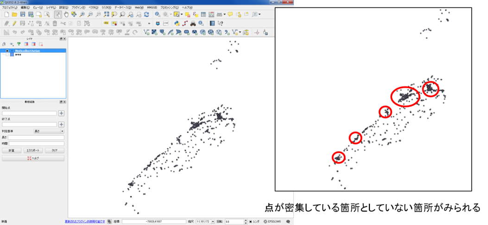
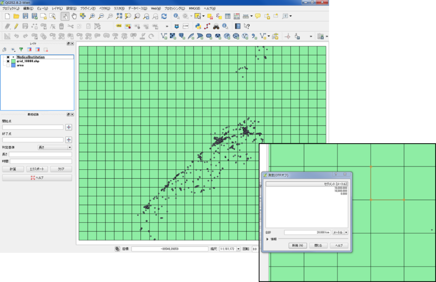
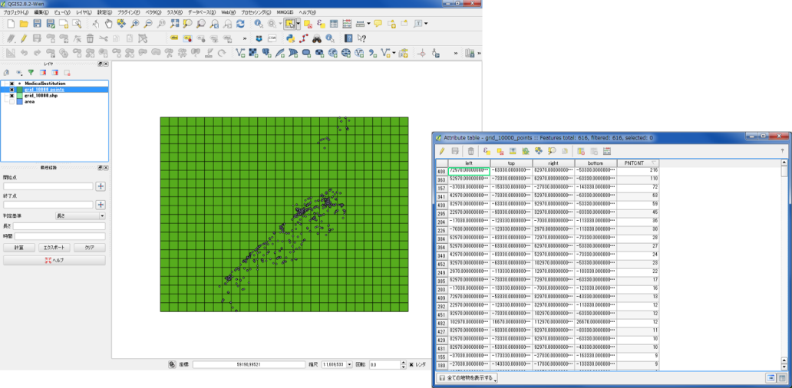
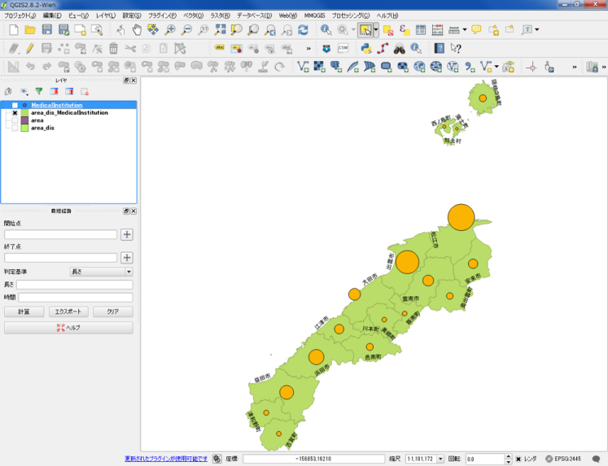
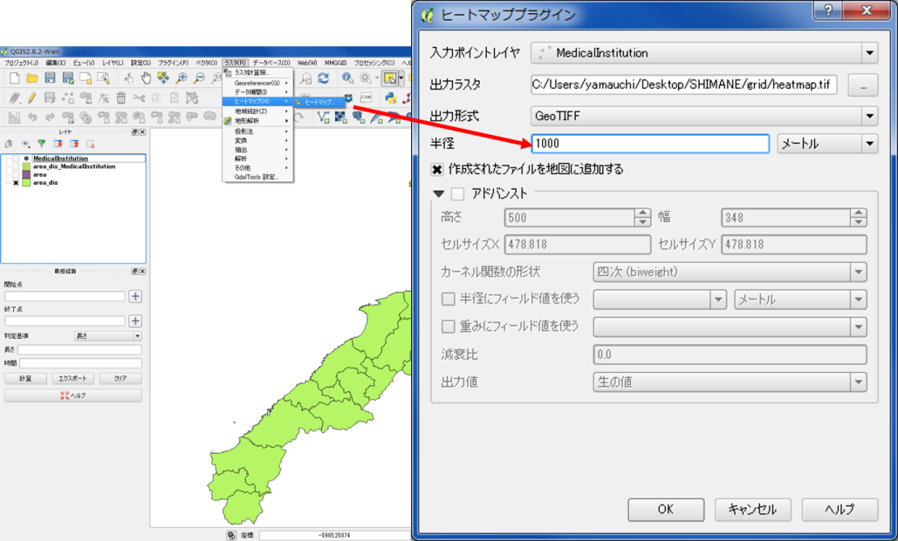
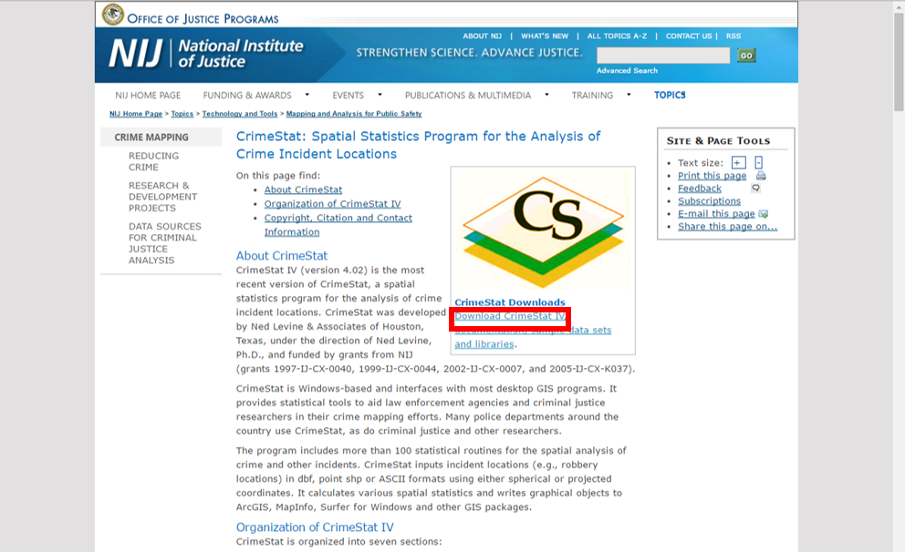

# 点データの分析
　本教材は、「点データの分析」の実習用教材です。GISソフトウェア（QGIS）を用いて、点データの密度を可視化し視覚的に分析する手法や点パターン分布を数理的に分析する手法について解説しています。詳しい概念や理論の解説は、講義用教材の[地理情報科学教育用スライド（GIScスライド）]の4章が参考になります。
　課題形式で使用する場合は、本教材を一読した後、[課題ページ](../課題/課題ページ/点データの分析.md)へお進みください。GIS初学者は、本教材を進める前に[GISの基本概念]の教材を確認しておいてください。本教材を使用する際は、[利用規約]をご確認いただき、これらの条件に同意された場合にのみご利用下さい。

[地理情報科学教育用スライド（GIScスライド）]:http://curricula.csis.u-tokyo.ac.jp/slide/4.html
[利用規約]:../../../master/利用規約.md
[GISの基本概念]:../01_GISの基本概念/GISの基本概念.md

**Menu**
------
**視覚的分析**
* [点の分布密度](#点の分布密度)
* [メッシュによる点密度の表示](#メッシュによる点密度の表示)
* [行政区内の点密度](#行政区内の点密度)
* [カーネル密度推計](#カーネル密度推計)

**数理的分析**
* [CrimeStatのインストール](#CrimeStatのインストール)
* [平均最近隣距離法](#平均最近隣距離法)
* [K-関数法](#K-関数法)
* [標準偏差距離と標準偏差楕円](#標準偏差距離と標準偏差楕円)

**使用データ**
　実習をはじめる前に、以下のデータをダウンロードしてください。なお、すべてのデータをJGD2000の平面直角座標系に統一して下さい国土数値情報のデータはダウンロード後に「JGD2000の平面直角座標系第Ⅵ系」へ座標変換する。国土数値情報データの読み込み時に空間参照設定のウィンドウが表示されたら、JGD2000を選択した後（QGIS2.8.4の場合）に変換の処理を行ってください。

* [国土数値情報] 「国土交通省国土政策局「国土数値情報（島根県　行政区域(H28)、消防署（H24）、医療機関データ（H26））」
>ダウンロード手法は、[既存データの地図データと属性データ]の教材を参考とする。座標系の変換手法は[空間データ]の教材を参考とする。

[国土数値情報]:http://nlftp.mlit.go.jp/ksj/index.html

**スライド教材**
スライドのダウンロードは[こちら](https://raw.githubusercontent.com/yamauchi-inochu/demo/master/GIS%E3%82%AA%E3%83%BC%E3%83%97%E3%83%B3%E6%95%99%E6%9D%90/14_%E7%82%B9%E3%83%87%E3%83%BC%E3%82%BF%E3%81%AE%E5%88%86%E6%9E%90/%E7%82%B9%E3%83%87%E3%83%BC%E3%82%BF%E3%81%AE%E5%88%86%E6%9E%90.pptx)

-------
## 視覚的分析
　以下では、国土数値情報の病院のデータを用いて、QGISでポイントデータの密度を視覚的に分析する手法について解説しています。前提として、点データの視覚的分析では、メッシュや行政区画などの空間集計に用いるオブジェクトの大きさに影響されることを注意する必要があります。

## 点の分布密度
QGISで国土数値情報の病院のデータを表示する。

点が密集していることはわかるが、地域ごとの密度の違いはよくわからない
→　メッシュや行政区画ごとに密度を求め、可視化を行う。

## メッシュによる点密度の表示
プラグイン＞プラグインの管理とインストール　からMMQGISプラグインを検索し、インストールする。

### メッシュの作成
表示範囲にメッシュを作成するため、点データの領域にズームし全体を表示する。
MMQGIS＞Create＞Create Grid Lines Layer　からメッシュを作成する。

① Shape TypeをRectanglesにする。
② X、Y Spacingをそれぞれ10000（m）にする。
③ 出力先を指定する。
④ OKをクリックする。

※　OKを入力後に、座標系を選択するウィンドウが出現したらEPSG:2445を指定する（今回の場合のみ）。

下の図のように、10km×10kmのメッシュが作成できる。

### メッシュ内のポイント数を計算する
ベクタ＞解析ツール＞ポリゴン内の点の数を数える　からッシュ内のポイント数を計算していく。
入力ポリゴンベクタレイヤにメッシュを指定し、入力ポイントベクタレイヤに病院のレイヤを指定する。
出力フィールド名を入力し、出力先と新規データー名を入力して、OKをクリックする。

メッシュ内のポイント数を含んだ、新規ポリゴンが作成された。
属性テーブルを開き、一番端の列のデータを並び替えて表示すると、計算結果が追加されている。
メッシュ内のポイント数をもとに色分けを行う。

### メッシュ内のポイント数で色分け
メッシュ内のポイント数に応じてポリゴンの色分けを行う。

メッシュごとに病院の密度が可視化された。

## 行政区内の点密度
以下では、行政区画のポリゴンを利用し、行政区ごとの点密度を計算していきます。
※事前に、デイゾルブして、行政区画を簡素化しておく。

ベクタ＞空間演算ツール＞融合　から行政区画のポリゴンをディゾルブする。
入力レイヤに行政区画のポリゴンを指定し、融合フィールドに市町村名のフィールドを選択する。

下の図のように設定し、行政区ごとの病院数を計算する。

計算結果のスタイルをプロパティから設定する。

行政区画ごとのポイント数を円の大きさで表現できた。

## カーネル密度推計
カーネル密度分析は犯罪発生マップなどに用いられる手法で、カーネル関数を用いてポイントの分布密度を連続的な密度局面としてモデル化する手法です。今回の場合は、医療機関数を病人の発生個所と仮定して行います。

ヒートマッププラグインをインストールする。
（ヒートマッププラグインについては、[QGISユーザガイド]を参照）

入力ポイントレイヤと出力ラスタを設定し、半径(バンド幅)を1ｋｍに設定する。

出力されたラスタの配色を設定し、表示する。

半径の値を変えると、値が変化し平滑なカーネルが出力される。

バンド幅を広くとったカーネルは広域的傾向把握に有効である。一方で、局地的な値への対応が難しくなる。そのため、バンド幅の設定には注意が必要。

[▲メニューへもどる]

## 数理的分析
以下では、国土数値情報の病院のデータを用いて、CrimeStatでポイントデータの分布パターンを数理的に分析する手法について解説しています。以下の手法等の理論については、講義用教材の[地理情報科学教育用スライド（GIScスライド）]の4章が詳しいです。

## CrimeStatのインストール
[NIJのサイト]にアクセスし、CrimeStat IV をダウンロードし、解凍後に.exeファイルを起動する。

### 起動とデータのインポート
crimestat.exeをダブルクリックし、CrimeStatを起動する。
Data Setupタグから、分析したいデータを選択する。
Data Setup > Primary File > Select Files(typeで.shpを選択し、Browseからファイルを指定) 。

Columから、ポイントデータのX,Yを指定する。
projectedとMetersにそれぞれチェックをつける。

[▲メニューへもどる]

## 平均最近隣距離法
Spatial description >  Distance Analysis I　を選択する。
Nearest neighbor analysis にチェックをつけ、Computeをクリックする。

[▲メニューへもどる]

## K-関数法
Spatial description >  Distance Analysis　を選択する。
Ripley’s K statistic(Ripley K)にチェックをいれUnitをMetersとし、Computeをクリックする。

[▲メニューへもどる]

## 標準偏差距離と標準偏差楕円
Spatial description > Spatial Distribution　を選択する。
Save result to をクリックし、ファイルの形式と出力先のフォルダを指定する（事前にフォルダを作成しておく）。
項目ごとに出力先の指定後、computeをクリックする(指定したフォルダに出力される)。

ポイントデータと計算結果をQGISで表示する。
標準偏差距離がSDD.shp、標準偏差楕円がSDE.shpとなって出力されている。

[▲メニューへもどる]
[▲メニューへもどる]:点データの分析.md#menu

**その他のライセンス**
本教材で利用しているキャプチャ画像の出典やクレジットについては、[その他のライセンスについて]よりご確認ください。
[その他のライセンスについて]:../その他のライセンスについて.md

[QGISユーザガイド]:http://docs.qgis.org/2.2/ja/docs/user_manual/plugins/plugins_heatmap.html
[NIJのサイト]:http://nij.gov/topics/technology/maps/Pages/crimestat.aspx
