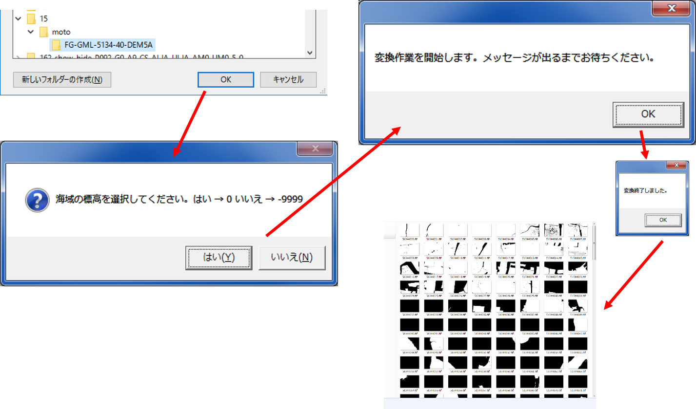
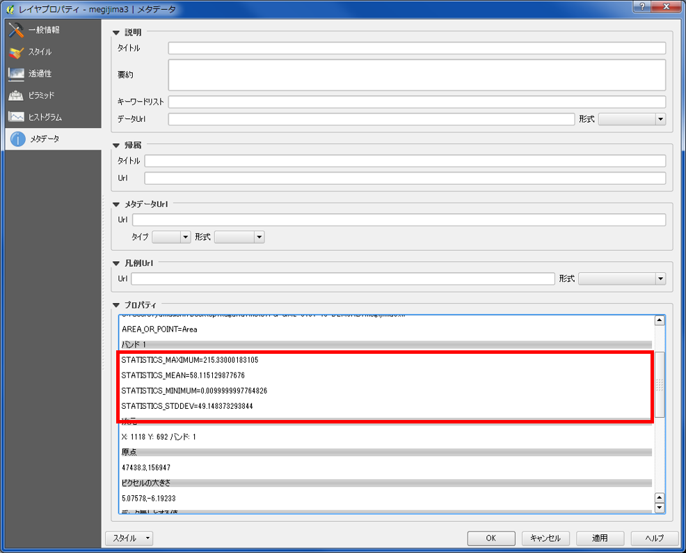
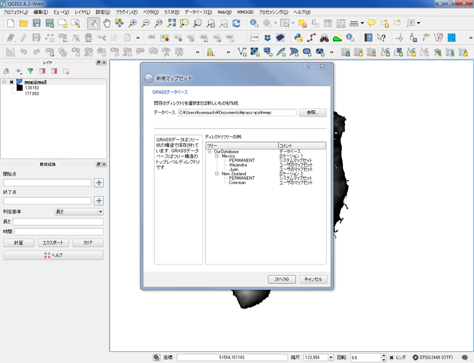
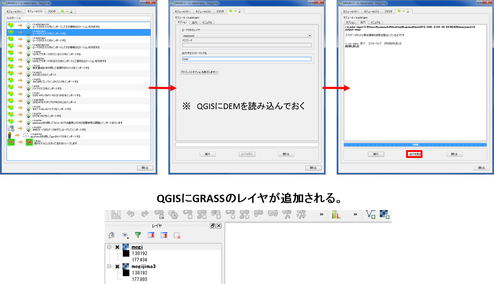
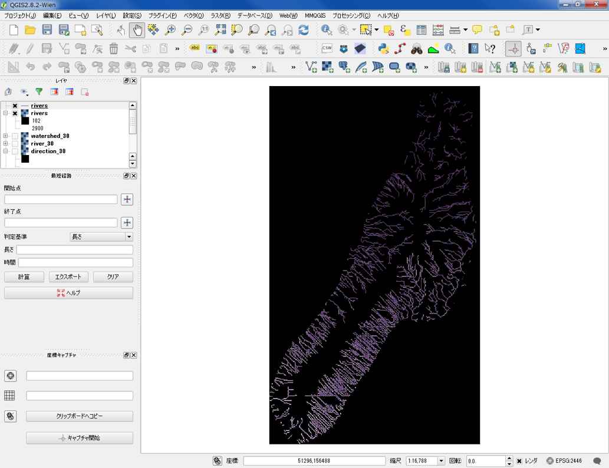
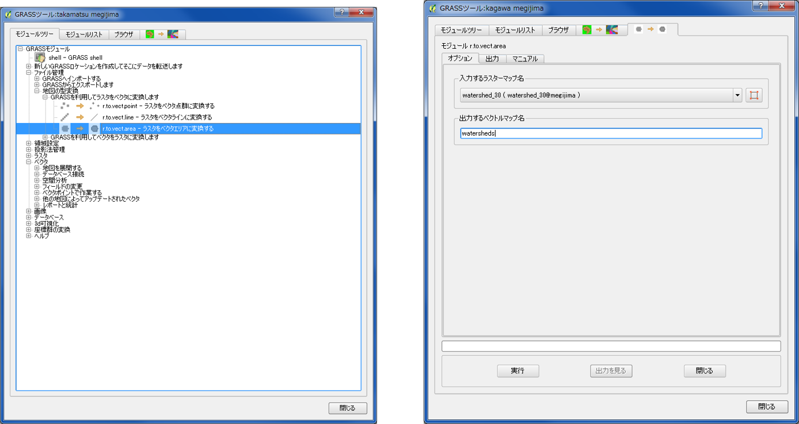
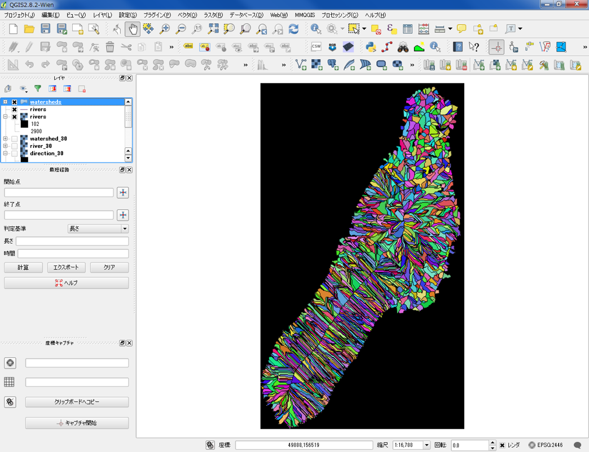
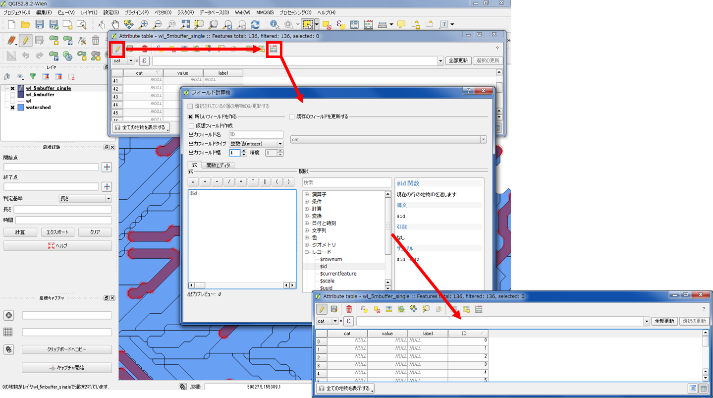
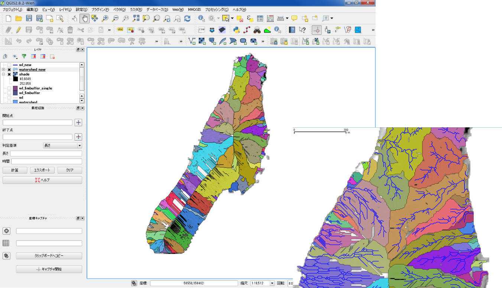

# ラスタデータの分析
　本教材は、「ラスタデータの分析」の実習用教材です。各セルに標高値を保持しているラスタデータを用いて、地形解析の手法について解説しています。本教材では、数値標高モデル(DEM)として整備されたデータを用います。DEMは、Digital Elevation Modelの略であり、地形解析等に用いられるデータです。この教材では、国土地理院が提供する5ｍDEMデータを用いています。ソフトウェアには、無償で利用できるQGISとGRASSを用いています。　講義用教材として、[地理情報科学教育用スライド（GIScスライド）]の4章が参考になります。
　課題形式で使用する場合は、本教材を一読した後、[課題ページ](../課題/課題ページ/ラスタデータの分析.md)へお進みください。GIS初学者は、本教材を進める前に[GISの基本概念]の教材を確認しておいてください。本教材を使用する際は、[利用規約]をご確認いただき、これらの条件に同意された場合にのみご利用下さい。

[地理情報科学教育用スライド（GIScスライド）]:http://curricula.csis.u-tokyo.ac.jp/slide/4.html
[利用規約]:../../../master/利用規約.md
[GISの基本概念]:../01_GISの基本概念/GISの基本概念.md

**Menu**
------
* [数値標高モデルの変換](#数値標高モデルの変換)
* [ラスタデータの加工](#ラスタデータの加工)
* [数値標高モデルの視覚的分析](#数値標高モデルの視覚的分析)
* [基本的な統計量の確認](#基本的な統計量の確認)
* [ベクタの処理とラスタの集計の組み合わせ分析](#ベクタの処理とラスタの集計の組み合わせ分析)
* [フィルタリング](#フィルタリング)
* [ラスタ演算](#ラスタ演算)
* [流域解析](#流域解析)
* [コストパス解析](#コストパス解析)

**使用データ**

* 国土地理院「 基盤地図情報　数値標高モデル　5ｍメッシュ　高松周辺（513440）」
>香川県高松市周辺の5ｍDEMをエコリスのツールを用いて変換し、高松市北部の女木島周辺をトリミングしたものです。この手法については、[ラスタデータの分析]の教材をご参照ください。データの座標系は、世界測地系の平面直角座標Ⅳ系に設定しています。

* 国土交通省国土政策局「[国土数値情報]（香川県　道路データ）」を加工し、利用

[国土数値情報]:http://nlftp.mlit.go.jp/ksj/index.html

**スライド教材**
スライドのダウンロードは[こちら](../../../../raw/master/GISオープン教材/15_ラスタデータの分析/ラスタデータの分析.pptx)

----------

## <a name="数値標高モデルの変換"></a>数値標高モデルの変換
　基盤地図情報からダウンロードした数値標高モデルをGISソフトウェアで処理するためには、ラスタデータへの変換が必要です。以下では、[株式会社エコリスのＨＰ]のコンバーターを用いた変換について解説しています。事前に、[株式会社エコリスのＨＰ]から、「標高DEMデータ変換ツール」をダウンロードしてください。


### 基盤地図情報からダウンロードしたDEMを変換する
標高DEMデータ変換ツールをダウンロードし、基盤地図情報から取得したDEMを変換する。
ダウンロードしたDEMtool.zipを解凍し、変換結合.vbsを実行する。
投影法を選択し、緯度経度を選択する。
陰影図の作成が必要な場合は、「はい」をクリックする。


基盤地図情報からダウンロードしたDEMが入っているフォルダを選択し、海域の標高値を選択する（今回は「はい → 0」を選択した）。
変換作業を開始し、完了のメッセージを待つ。
変換先のフォルダー内に、geotifが出力されているかを確認する。



## <a name="ラスタデータの加工"></a>ラスタデータの加工
以下では、変換したラスタデータを解析用に加工する処理について解説しています。今回の解析データの範囲は、女木島周辺（高松市中心部北）としています。

QGISを起動し、ラスタの読み込みクリックして、ラスタデータを読み込む。


### ラスタを結合する
ラスタ＞その他＞結合をクリックする。
入力ファイルと出力ファイルを選択し「OK」をクリックする。


### ラスタの座標変換
結合したラスタを平面直角座標系（Ⅳ系）に変換して保存する。
ラスタ＞投影法＞ワープをクリックする。
入力ファイル、出力ファイル、ソースEPSG(元データの座標系)、ターゲットEPSG(変換したい座標系)、リサンプリング方法(今回はキュービックを選択した)を設定し、OKをクリックする。


### ラスタの切りぬき
ラスタ＞抽出＞クリッパーを選択する。
入力ラスタと出力ラスタを指定する。
クリッピングモードの「範囲」にチェックをし、地図から切りぬきたい範囲をドラックする。
データがない値に０を指定して、「OK」をクリックする。


※ ここで0を指定すると、標高値0の場所がすべてデータ無しになる。そのため、0m以下の低地部では、この手法が適切でない場合がある。データに合わせて、解析範囲に応じたデータなし値の設定が必要になる。

以下のように、ラスタの切りぬきができた。※陸域に所々ある色が濃い部分はため池。


上記の手法で海域が抜き出せなかった場合は、以下のような設定が必要となる。

#### データなし値の表示方法と設定の比較
プロパティ>透過性から、データなしの値のチェックをはずして、ラスタの値の変更と表示の関係を確認しておく。


**データがない値に、チェックをいれない、0、-9999の場合**
データがない値については、0（特定の値）、-9999、チェックを入れないという3パターンがある。
解析の目的によって、データのない値の扱いが変わる。


[▲メニューへもどる]

## <a name="数値標高モデルの視覚的分析"></a>数値標高モデルの視覚的分析
各セルごとに標高値を保持しているラスタデータを用いることで、傾斜区分図、斜面方位図、陰影図、3D地図、断面図を作成することができます。以下では、その手法について解説しています。

### 傾斜区分図の作成
ラスタ＞地形解析＞傾斜　を実行すると傾斜区分が計算できる。


下の図のように、傾斜区分図が表示された。


### 斜面方位図の作成
ラスタ＞地形解析＞傾斜方位　を実行すると傾斜方位が計算できる。


下の図のように、斜面方位図が表示された。


### 陰影図の作成
ラスタ＞地形解析＞陰影図　を実行すると陰影図が計算できる。


下の図のように、陰影図が表示された。
陰影図の元にしたラスタを重ねて、透過率を設定することで標高の表現ができる。


### 3D地図の作成
プラグイン＞プラグインの管理とインストール　からQgis2threejsをインストールする。


OpenLayers pluginを利用し、OpenStreetMapを読み込んでおく。
※OpenLayers pluginをインストールしていない場合は、「プラグインの管理とインストール」からインストールする。
Web(W)＞OpenLayers plugin＞OpenStreetMap＞OpenStreetMap　からOpenStreetMapを読み込む。


DEM layer にDEMを選択し、Display typeのMap canvas image にチェックをいれ、「Run」をクリックする。


ブラウザが立ち上がり、3D地図図が表示される。


国土地理院の国土情報画像を読み込むこともできる（タイルレイヤプラグインを利用）。


### GRASSで3Dビュー
GRASSでDEMを読み込み表示を3Dにすると立体表現がされる。


### 地形断面図の作成
プラグインの管理とインストールからVoGIS Profile tool をインストールする。
ラスタ>VoGIS ProfileTool > VoGIS Profile Toolから起動する。


断面図を作成するラスタにチェックを入れ、Digitize (new) profile line をクリックし、QGISの地図上でクリックしながらラインを作成する（右クリックで終了）。OKをクリックすると別ウィンドウに断面形が表示される。


[▲メニューへもどる]

## 基本的な統計量の確認
以下では、QGISでラスタデータが保持する情報を確認する手法を解説しています。

ラスタ＞その他＞情報　から最低標高、最高標高、平均標高、標高の標準偏差が確認できる。


プロパティからもデータの情報を確認できる。



[▲メニューへもどる]

## ベクタの処理とラスタの集計の組み合わせ分析
　GISでは、ラスタデータとベクトルデータを用いて、情報を取得することができます。以下では、道路をポリゴン化したデータに、ラスタデータのもつ標高値を付加する手法について解説しています。

道路と周辺の標高値を計算する。
国土数値情報から香川県のデータをダウンロードし、50mのバッファを作成する。


ラスタ＞地域統計（Ｚ）＞地域統計（Ｚ）から地域統計を計算する各ライン周辺の最大標高、最小標高、平均標高などを計算する。


属性テーブルを開き、最大標高、最小標高、平均標高など計算結果を確認する。


属性テーブルから選択し、地図で位置を確認する。


[▲メニューへもどる]

## フィルタリング
フィルタリングは、近傍のセルの値を考慮して、セルの値を変化させる処理のことを指します。以下では、QGISのふるい機能を用いてフィルタリングする手法について解説しています。

ラスタ＞解析＞ふるい　を実行する。
入力ファイルと出力ファイルを指定し、ピクセルの連結値を選択して、「OK」をクリックする。


プロパティから、値が変わっていることを確認する。


ふるいありとなしでは、数値の表示が変化する。
※プロパティの一般情報から、セル数の変化がないことを確認しておく。


[▲メニューへもどる]

## ラスタ演算
　ラスタデータは、データを重ね合わせて演算をすることができます。この処理は、地形の変化を計算する際などに用いられます。例えば、10年前に取得された標高データと現在取得したデータを引き算することで地形の変化量を求めることができます。この処理を行う場合は、同一の範囲で、セルの大きさや数が同じである必要があります。以下では、標高データや傾斜データを用いて、条件指定したエリアを抽出する手法について解説しています。

DEMと傾斜区分したラスタを読み込む。
ラスタ＞ラスタ計算機　から、計算結果を出力するための新規ラスタを作成する。


DEMから標高150ｍ以上の地域を抽出する。


```
 ( "標高ラスタ@1"  >=  150 )
```

DEMから標高150m以上で傾斜が10度以下の地域を抽出する。


```
 ( "標高ラスタ@1"  >=  150 )  AND  ( "傾斜ラスタ@1" <= 10  )
```

[▲メニューへもどる]

## 流域解析
　DEMデータから流域を求める際に、流域解析を行います。以下では、QGISとGRASS GISを用いた流域解析について解説しています。

GRASSのプラグンインを利用して、ラスタ解析を行う。


GRASSで新規マップセットを作成する。
> マップセットの作成は、[GRASSビギナーズマニュアル](../GRASSビギナーズマニュアル/GRASSビギナーズマニュアル.md)を参照


マップセットに標高ラスタデータを読み込む。


モジュールリストタブに切り替え、ラスタの範囲を設定する（フィルターから、g.region.zoomを検索する）。


モジュールツリータブに切り替え、ラスタ＞空間モデル＞水理モデル＞流域解析（r.watershedを検索しても良い）を選択する。
入力ラスタにDEMを指定し、流域の最小サイズを入力する。
出力するファイル名をそれぞれの項目ごとに入力し実行する。
「出力を見る」をクリックする。


下の図のように、河川や流域が抽出できた。


流域と河川のラスタをベクトルに変換する。
ラインに出力できるように河川のラスタを単純化する(r.thinを検索し、実行する)。


ファイル管理＞地図の型変換＞GRASSを利用してラスタをベクタに変換します　からラスタをベクタラインに変換する(r.to.vect.lineを検索し、実行する)を実行する。


下の図のようにベクタが作成できる。


ファイル管理＞地図の型変換＞GRASSを利用してラスタをベクタに変換します、からラスタをベクタエリアに変換する(r.to.vect.areaを検索し、実行する)。


下の図のように流域ポリゴンが作成できる。


拡大し確認すると流域が抽出できていることがわかる。


GRASSで出力したベクトルを、外部に出力する。


[▲メニューへもどる]

## 河川ごとに流域をグルーピング
以下では、河川ごとに流域をグルーピングし、流域ポリゴンを作成する手法について解説しています。

河川の属性で流域を分類できないため、分類できる属性値をつくる。
河川から数mのバッファを引く（今回は5mとした）。


バッファが、マルチパートになっているため（属性テーブルを確認）、シングルパートへ変換する（河川ごとに分割される）。


河川ごとに分割されていることを選択機能で確認する。


フィールドを追加し、河川ごとに固有のIDを振り分ける。
変種モードから、フィールド計算機を起動し、新規にフィールドを作成する。
出力フィールド名を追加し、タイプをintegerにする。
関数→レコード→idで、IDを振り分ける。


ＩＤが振り分けられたことを確認し、余分なフィールドを削除しておく。
編集を保存し、編集モードを終わらせておく。


河川ラインに、bufferに追加した固有値を空間結合する。


流域ポリゴンに、bufferに追加した固有値を空間結合する。
※属性値(流域ごとの固有値)で、ディゾルブしておくと区分しやすい。


河川ごとに流域が表示できた。
流域は表示できたが、拡大するとデータの無いエリアが目立ってしまうため、流域解析のセル値などを工夫する必要がある。


[▲メニューへもどる]

## コストパス解析
　コストパス解析は、DEMデータを用いて、任意の地点間の経路を求める場合等に用いられます。以下では、QGISとGARSS GISを用いて、コストパス解析を行う手法について解説しています。
※　GRASSを立ち上げて、QGISで作成したマップセットを読み込んでおく。

ラスター＞地形解析＞斜面と方位  から斜面方位図と傾斜区分図をマップセット内に作成する。
入力ラスターにDEMを選択し、タブを切り替えて出力ファイルを入力し「実行」をクリックする。


### 傾斜をもとに移動コストを算出する
ラスター＞地形解析＞移動コスト積算　を実行する。
入力ラスタにDEMを選択し、フリクションコストを含むラスタに傾斜ラスタを選択する。出力ラスタ名を入力する。


タブを切り替えスタートと停止の座標を入力する。
カーソルボタン（赤枠）をクリックし、地図から任意の場所をクリックする。


ラスター＞地形解析＞最小コストルートあるいはフロー　を実行する。
移動コストをもとに、任意の2点間の最短経路を検索する。
入力ファイルに移動コストのラスタを選択し、出力ファイルを指定する。
スタートタブに切り替え、　　カーソルボタンを使って、地図から任意の地点を選択し、「実行」をクリックする。


下の図のように、任意の2点間で傾斜に基づく最短経路が検索できる。


[▲メニューへもどる]

**その他のライセンス**
本教材で利用しているキャプチャ画像の出典やクレジットについては、[その他のライセンスについて]よりご確認ください。


[▲メニューへもどる]:ラスタデータの分析.md#menu
[その他のライセンスについて]:../その他のライセンスについて.md
[ラスタデータの分析]:../15_ラスタデータの分析/ラスタデータの分析.md
[株式会社エコリスのＨＰ]:http://www.ecoris.co.jp/contents/demtool.html
