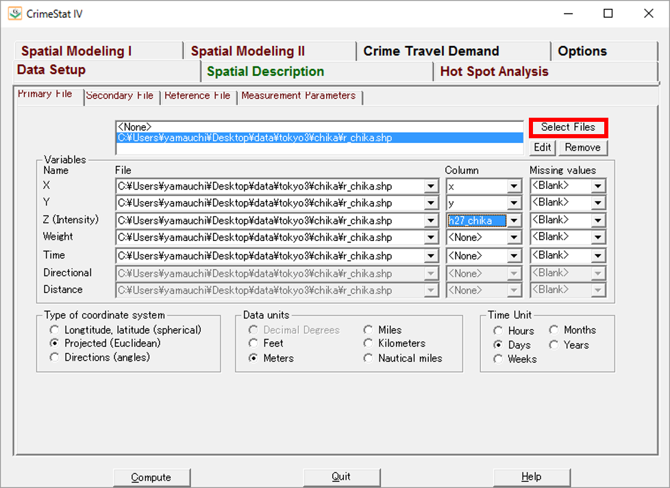
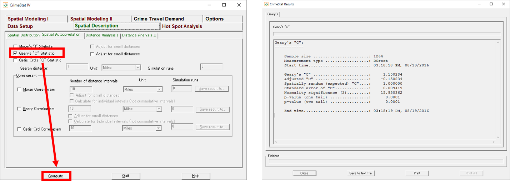

# 空間的自己相関
本教材は、「空間的自己相関」の実習用教材です。GISソフトウェアを用いた、空間的自己相関の分析手法について解説しています。ソフトウェアには、無償で利用できるCrimeStatを用いています。
講義用教材として、[地理情報科学教育用スライド（GIScスライド）]の4章が参考になります。

本教材を使用する際は、[利用規約]をご確認いただき、これらの条件に同意された場合にのみご利用下さい。


[地理情報科学教育用スライド（GIScスライド）]:http://curricula.csis.u-tokyo.ac.jp/slide/4.html
[利用規約]:../../../master/利用規約.md

**Menu**
------
* [CrimeStatのインストール](#CrimeStatのインストール)
* [Moran’s I 統計量](#Moran’s I 統計量)
* [Geary‘s C 統計量](#Geary‘s C 統計量)
* [Join count 統計量](#Join count 統計量)

**使用データ**
* 国土数値情報　平成27年東京都地価公示　を加工し利用

[国土数値情報]:http://nlftp.mlit.go.jp/ksj/index.html

**スライド教材**
スライドのダウンロードは[こちら]
[こちら]:../../../../raw/master/GISオープン教材/17_空間的自己相関/空間的自己相関.pptx

----------
## CrimeStatのインストール<a name="CrimeStatのインストール"></a>
[NIJサイト](https://nij.gov/topics/technology/maps/Pages/crimestat.aspx)にアクセスし、CrimeStat IV をダウンロードし、解凍後に.exeファイルを起動する。


[▲メニューへもどる]

## Moran's I 統計量<a name="Moran's I 統計量"></a>

Select Filesからデータを読み込む。XとYに位置座標を設定し、Zに地価の値を設定する。
Projected, Meters, Days にチェックを入れる。


タブをSpatial Descriptionに切り替え、Moran's I staticにチェックをいれ、「compute」をクリックすると値が算出される。


[▲メニューへもどる]

## Geary's C 統計量<a name="Geary's C 統計量"></a>
Geary's C　にチェックをいれ、「compute」をクリックすると値が算出される。



[▲メニューへもどる]

## Join count 統計量
Join count 統計量はR等で、算出することができる。
下記は計算の例である。

```
#Join count 統計量

chika.hi.low <- cut(chika$h27_chika, breaks=c(0,mean(chika$h27_chika), max(chika$h27_chika)), labels=c("low", "high"))

names(chika.hi.low) <- chika$ID
joincount.multi(chika.hi.low, nb2listw(chika.tri.nb,
style="B"))

 Joincount Expected Variance z-valuelow:
low    2856.000 2542.624  280.119  18.724
high:high   413.000  120.115   90.209  30.837
high:low    502.000 1108.261  445.501 -28.723
Jtot        502.000 1108.261  445.501 -28.723

```

空間的自己相関の分析にRを利用する手法は、古谷知之（2011）
『Ｒによる空間データの統計分析 (統計科学のプラクティス)』が詳しい。

[▲メニューへもどる]
[▲メニューへもどる]:ラスタデータの分析.md#menu

**その他のライセンス**
本教材で利用しているキャプチャ画像の出典やクレジットについては、[その他のライセンスについて]よりご確認ください。
[その他のライセンスについて]:../その他のライセンスについて.md
