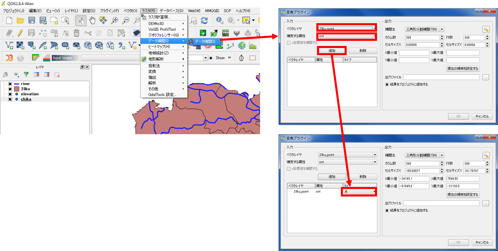
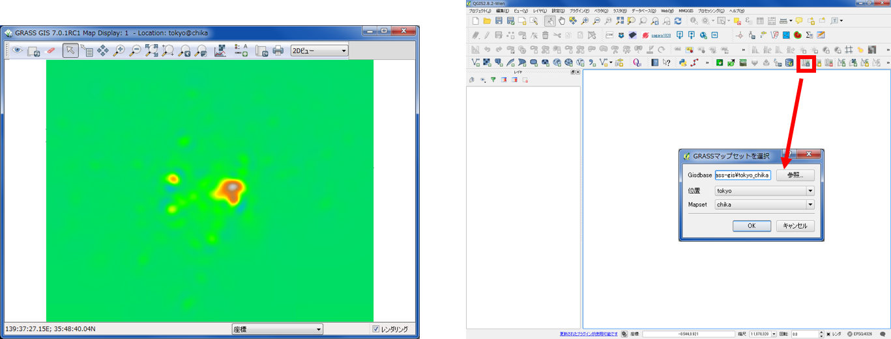
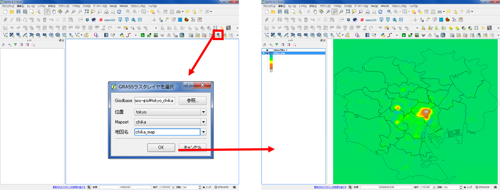
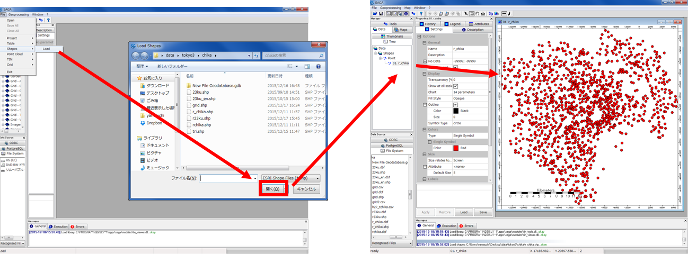
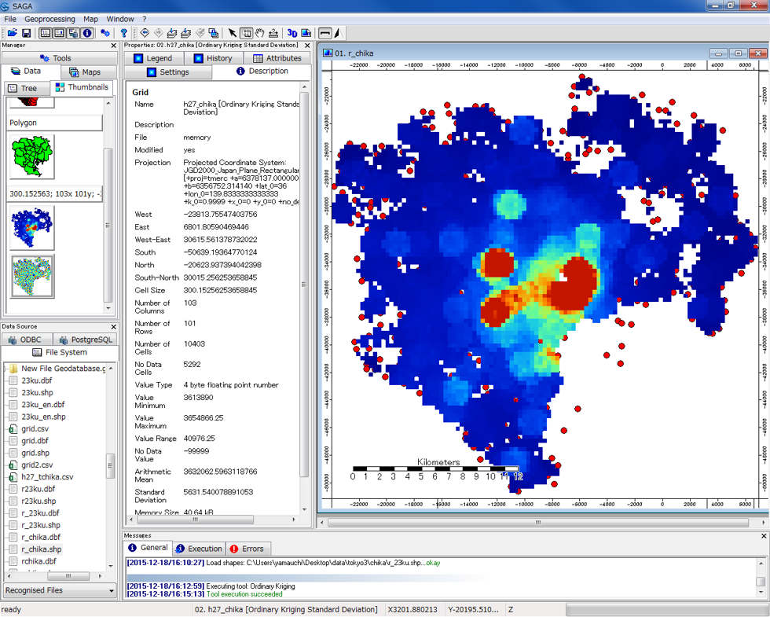

# 空間補間
　本教材は、「空間補間」の実習用教材です。GISソフトウェアを用いた、空間補間の手法について解説しています。空間補間は、観測値などの既知のデータを用いて、周辺のデータを予測する際に用いる手法です。実際に処理をする場合は、値の分布状況や対象となるデータ特性を考慮した空間補間法の選定が重要になります。以下は、TIN,IDW,spline,クリギングによる補間手法の解説をQGIS、GRASS GIS、SAGA GISを用いて行ったものです。空間補間の概念や理論については、[地理情報科学教育用スライド（GIScスライド）]の4章が参考になります。
　課題形式で使用する場合は、本教材を一読した後、[実践ページ](../実習/実習ページ/空間補間.md)へお進みください。本教材を使用する際は、[利用規約]をご確認いただき、これらの条件に同意された場合にのみご利用下さい。

[地理情報科学教育用スライド（GIScスライド）]:http://curricula.csis.u-tokyo.ac.jp/slide/4.html
[利用規約]:../../../master/利用規約.md

**Menu**
------
* [不整三角網](#不整三角網)
* [逆距離加重法](#逆距離加重法)
* [スプライン補間](#スプライン補間)
* [クリギング](#クリギング)

**使用データ**

* [国土数値情報] 平成27年東京都地価公示　を加工（23区のみ利用）
* [国土数値情報] 東京都行政区画　を加工（23区のみ利用）
* [国土数値情報] 東京都河川　を加工（23区のみ利用）
* [基盤地図情報]　東京都　標高点 を加工（23区のみ利用）

>ダウンロード手法は、[既存データの地図データと属性データ]の教材を参考とする。座標系の変換手法は[空間データ]の教材を参考とする。

[国土数値情報]:http://nlftp.mlit.go.jp/ksj/index.html
[基盤地図情報]:http://www.gsi.go.jp/kiban/

**スライド教材**
スライドのダウンロードは[こちら](../../../../raw/master/GISオープン教材/18_空間補間/空間補間.pptx)

----------

## 不整三角網 
#### TIN:Triangulated lrregular Network
　以下では、東京23区の標高点を利用し、TIN（不整三角網）によって未観測の標高地点の値を補間する手法について解説します。ソフトウェアには、QGISを用います。また、補間されたラスタデータをもとに、等高線の作成も行います。
　不整三角網の概念や理論は、[地理情報科学教育用スライド（GIScスライド）]を参照してください。

QGISを起動し、使用データ（河川や標高点など）を読み込む。
ラスタ＞データ補間＞データ補間をクリック。
ベクタレイヤから標高点、補完する属性は、標高データの列を選択し、追加をクリックし、タイプを点に変更する。

ベクタレイヤに河川を選択し、追加をクリックする。
タイプをブレークラインに設定する。
補完法を三角形分割補間（ＴＩＮ）とし、設定ボタンから、補間方法を線形に設定し、ＯＫをクリックする。

出力ファイル先とファイル名を指定し、ＯＫをクリックする。
左の図のように出力されるので、レイヤのプロパティから標高値に応じてスタイルを整える。

空間補間したデータのセル値を利用して、以下のように等高線が抽出できる。
ラスタ＞抽出＞等高線　を選択する。
入力ファイル、出力先、等高線の間隔を指定する。
属性カラムにチェックを入れ、ＯＫをクリックすると等高線が表示される。

[▲メニューへもどる]
[▲メニューへもどる]:空間補間.md#menu

## 逆距離加重法 
#### IDW:Inverse Distance Weighted
以下では、東京23区の地価データを利用し、値のわかっていない地点をIDW（逆距離加重法）で補間する手法について解説しています。ソフトウェアには、QGISを用いています。
　IDWの概念や理論は、[地理情報科学教育用スライド（GIScスライド）]を参照してください。

ラスタ＞データ補間＞データ補間をクリック。
ベクタレイヤを東京都の地価公示にする。
補完する属性を地価データとする（属性テーブルから地価データを数値型に変換しておく）。
タイプから点を選択し、補完法を逆距離加重法（IDW）とする。
出力ファイル先とファイル名を選択し、OKをクリックする。

左の図のように出力されるので、レイヤのプロパティから配色を整える。

[▲メニューへもどる]

## spline補間 
　以下では、東京23区の地価データをspline補間する手法について解説しています。ソフトウェアには、GRASS GISを用います。
　splineの概念や理論は、[地理情報科学教育用スライド（GIScスライド）]を参照してください。

QGISからGrassデータセットを作成し、GRASSを起動する。
GRASSでシェープファイルを読み込む。

コマンドコンソールからv.surf.rstを入力し、Enter キーを押す。
入力するベクトルマップ名（地価データ）を選択する。

パラメーターで地価データの列を選択し、出力から出力データの名称を入力し、実行をクリックする。

左の図のように出力されるので、QGISで読み込み、レイヤのプロパティから配色を整える。
先ほどのマップセットをQGISから読み込む。

先ほど作成したラスタデータを読み込む。

値に応じて配色を整え、QGISで表示する。

## クリギング
　以下では、東京23区の地価データをクリギングする手法について解説しています。ソフトウェアには、SAGA GISを用います。
　クリギングの概念や理論は、[地理情報科学教育用スライド（GIScスライド）]を参照してください。

SAGA GISを利用し、通常クリギングを実行する。
[SAGA GISのダウンロードサイト](https://sourceforge.net/projects/saga-gis/files/)から、ソフトウェアをダウンロードする。

SAGA GISを起動し、File > Shapes > Load からポイントデータ（地価データ）を読み込む。
ManagerからTreeタブをクリックし、入力したデータをダブルクリックするとデータが表示される。

Geoprocessing > Spatial Geostatistics > Ordinary Kriging をクリックする。
pointsで地価データを選択し、Attributeで地価の列を選択し、ＯＫをクリックする。
※今回は、パラメーターをデフォルトとした。

バリオグラムが表示されるので「OK」をクリックし、次のウインドウも「Okay」をクリックする。

下の図のように、クリギングされたデータが表示できた。

以下のように、データをGeoTIFFでエクスポートすることも可能。

[▲メニューへもどる]

**その他のライセンス**
本教材で利用しているキャプチャ画像の出典やクレジットについては、[その他のライセンスについて]よりご確認ください。
[その他のライセンスについて]:../その他のライセンスについて.md
