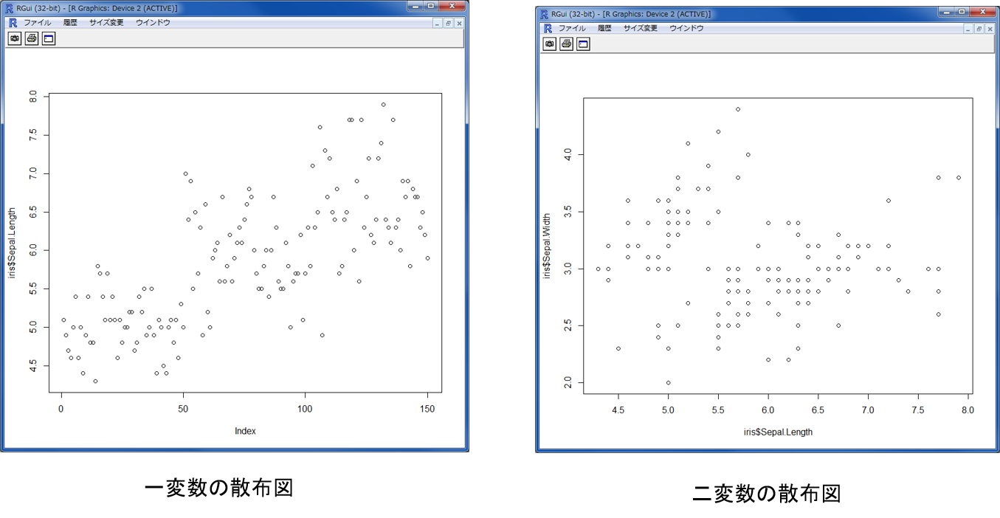
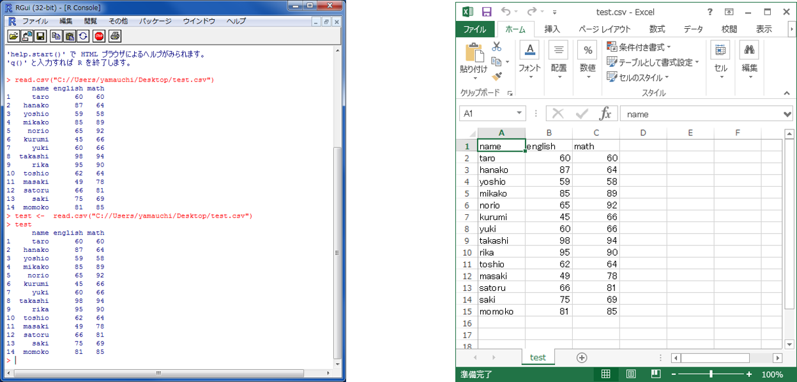
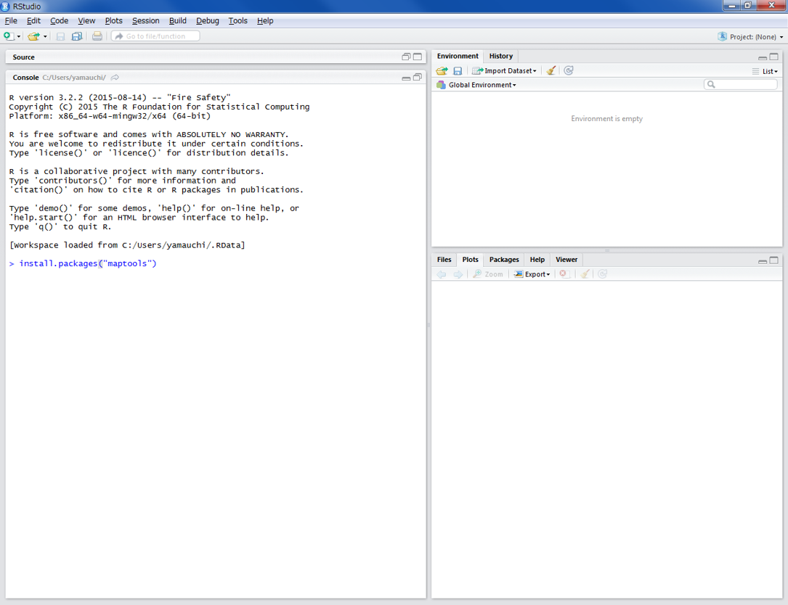
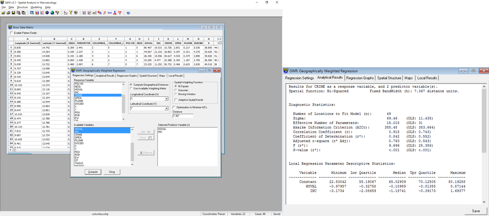

# 空間相関分析
　本教材は、「空間相関分析」の実習用教材です。GISソフトウェアを用いた、空間相関分析の手法について解説しています。ソフトウェアには、無償で利用できるRとSAMを用いています。Rはパソコン初心者が利用するには、敷居が高いため教材の前半で基本的な解説しています。
講義用教材として、[地理情報科学教育用スライド（GIScスライド）]の4章が参考になります。

本教材を使用する際は、[利用規約]をご確認いただき、これらの条件に同意された場合にのみご利用下さい。


[地理情報科学教育用スライド（GIScスライド）] (http://curricula.csis.u-tokyo.ac.jp/slide/4.html)
[利用規約]:../../../master/利用規約.md

**Menu**
------
* [Rのインストールと基礎操作](#Rのインストールと基礎操作)
* [空間的自己回帰モデル](#空間的自己回帰モデル)
* [基本的な統計量の確認](#基本的な統計量の確認)
* [空間的誤差自己回帰モデル](#空間的誤差自己回帰モデル)
* [地理的加重回帰（GWR）](#地理的加重回帰（GWR）)

**使用データ**
* Rサンプルデータ「COL.OLD」を使用
* GeoDa sample data 「clumbs.shp」を利用　シカゴ大学
（https://spatial.uchicago.edu/sample-data）
* [国土数値情報](http://nlftp.mlit.go.jp/ksj/index.html)　東京都行政区　を加工し利用

**スライド教材**
スライドのダウンロードは[こちら](../../../../raw/master/GISオープン教材/19_空間相関分析/19_空間相関分析.pptx)

----------

## Rのインストールと基礎操作
### Rとは？
* オープンソースで開発されているフリーソフト
* 統計処理に優れており、豊富なパッケージが利用できる
* 解説書が多数執筆されている
* シェープファイルを扱うことができる

### Ｒによる地理空間データ分析の参考書
Rによる地理空間データ分析関しては、以下の2冊が参考書としてあげられる
* 古谷知之 著　（2011）　『Ｒによる空間データの統計分析 （統計科学のプラクティス）』 朝倉書店 184p.
* 金明哲 編, 谷村晋 著　（2010） 『地理空間データ分析 （Rで学ぶデータサイエンス 7）』 共立出版 258p.

※本教材は、上記の2冊を参考に作成している。

### Ｒのインストール
[Ｒの公式ページ](https://www.r-project.org/)にアクセスし、Ｒをインストールする。


上記画像を参考に、インストール作業を行う。


### Rの起動
Windowsのメニューから、Rのアイコンをクリックし、Rを起動する。


### Ｒ変数とデータの型
Rでは、変数にデータを代入し処理を行う。上の図の場合mapという変数に100という数値を代入した。
そのため、map+200(100+200)ということになるので、300という値が返される。

※変数・・・・数値、文字列、行列、データフレーム、リストなどが扱える


```R
#以下のように記入し、Enterを押すと処理される
map <- 100
```


### 関数について
Rでは、統計処理に必要な関数が豊富に用意されているため、用途に合わせて関数を利用する。
パッケージをインストールすることで多くの関数を扱うことができる。

data()でRのサンプルデータであるirisを読み込む。
irisのデータフレームを利用し、head()関数で上から6行を表示した。
tail()で下から6行を表示できる。

※　iris は、あやめのがくの長さと幅、花弁の長さと幅を示すデータ


## Ｒで計算
　以下では、Rで関数を用いた計算の練習として、irisのデータセットを利用し、がくの長さの平均値、最小値、最大値、中央値を求めていきます。計算ができたら、長さのヒストグラムや散布図の作成の練習も行います。


```R
#irisのヘッダーを確認する。
head(iris)

#irisのがくの長さの平均値(min()で最小値, max()で最大値, median()で中央値)を求める。
mean(iris$Sepal.Length)

#全ての最小値、第一四分位数、中央値、平均値、第三四分位数、最大値を表示する
summary(iris)

```

### Rでグラフを作成する

```R
#ヒストグラムを作成
hist(iris$Sepal.Length)
```



```R
#一変数の散布図
plot(iris$Sepal.Length)

#二変数の散布図
plot(iris$Sepal.Length,iris$Sepal.Width)
```

### Rでcsvを読み込む
以下では、自作したCSVデータを利用し計算する手法について解説している。
※サンプルデータは用意していないため、適当なCSVを自作すること。

read.csv("C://Users/ユーザー名/Desktop/test.csv")　※（"ディレクトリ名/データ名.csv", sep=",", header=TRUE)とするとより良い。

read.csv（フルパス）でディレクトリにおいたcsvを読み込むことができる。
データセットとして読み込む場合は、データセット名 <- read.csv(フルパス)とする。

x軸とy軸を指定して、plotを実行し、散布図を作成する。


点数の合計と平均を計算する。


minやmaxで、英語の最高点数や合計の最低点数を求めることができる。


[▲メニューへもどる]
[▲メニューへもどる]:空間相関分析.md#menu

## Ｒで空間データを扱う
以下の教材では、RStudioを使用する。Rstudioは、[公式サイト](https://www.rstudio.com/)からダウンロードできる。
※　Ｒそのものでも分析は可能

### パッケージのインストール
空間データを扱うために必要なパッケージを読み込む


```R
#シェープファイルを扱うパッケージをインストールする
install.packages("maptools")
```

※install.packages("maptools" , dependencies =TRUE)を実行すると、maptoolsと関連したパッケージもインストールする


```R
#ライブラリから、パッケージを読み込む
library(maptools)
```

### シェープファイルの情報を確認する

```R
getinfo.shape("C://Users/ファイルの場所/シェープファイル名.shp")
```
### シェープファイルを読み込む
```R
#setwd()で作業ディレクトリを設定する
setwd("C://Users/yamauchi/Desktop/data/hiroshima")

# readShapePoints()でShapeを読み込む
public_facility <- readShapePoints("public_facility.shp")
```
※　getwd()で作業ディレクトリを確認できる

以下で、ポリゴンやラインも読み込むことができる。
Plot()関数で、地図を表示することができる。

```R
#ラインデータ、ポリゴンデータの読み込み
river <- readShapeLines("river.shp")
area <- readShapeLines("admarea.shp")
#地図の表示
plot(area)
```
その他に、Rでは人口密度の計算やカラーマップの作成、シェープファイルの書き出しも可能。


## 空間的自己回帰モデル
RのサンプルデータのOLD.COLを用いて、空間的自己回帰モデルを算出する。

```R
#spdepのパッケージを読み込む※インストールしていない場合は、install.packages(spdep)を実行する。
library(spdep)

#サンプルデータ「OLD.COL」を読み込む。※オハイオ州コロンバス市の犯罪に関するデータセット
data(oldcol)

#データセットの中身を確認する。今回は、従属変数としてCRIME, 説明変数としてHOVAL, INCを用いる。
names(COL.OLD)

#lagsarlm関数を用いて、空間的自己回帰モデルを算出する。空間重み行列には、サンプルデータのCOL.nbを使用している。
col.sar <- lagsarlm(CRIME ~ INC + HOVAL, data = COL.OLD, nb2listw( COL.nb, style = "W"), method = "eigen")

#summary(col.sar)を実行すると結果が算出される。
summary(col.sar)

Call:
lagsarlm(formula = CRIME ~ INC + HOVAL, data = COL.OLD, listw = nb2listw(COL.nb,
    style = "W"), method = "eigen")

Residuals:
      Min        1Q    Median        3Q       Max
-37.68585  -5.35636   0.05421   6.02013  23.20555

Type: lag
Coefficients: (asymptotic standard errors)
             Estimate Std. Error z value  Pr(>|z|)
(Intercept) 45.079251   7.177347  6.2808 3.369e-10
INC         -1.031616   0.305143 -3.3808 0.0007229
HOVAL       -0.265926   0.088499 -3.0049 0.0026570

Rho: 0.43102, LR test value: 9.9736, p-value: 0.001588
Asymptotic standard error: 0.11768
    z-value: 3.6626, p-value: 0.00024962
Wald statistic: 13.415, p-value: 0.00024962

Log likelihood: -182.3904 for lag model
ML residual variance (sigma squared): 95.494, (sigma: 9.7721)
Number of observations: 49
Number of parameters estimated: 5
AIC: 374.78, (AIC for lm: 382.75)
LM test for residual autocorrelation
test value: 0.31955, p-value: 0.57188

```
* CRIME：1000世帯あたりの不法侵入および自動車窃盗
* HOVAL：住宅の評価額（単位は$1000）
* INC: 世帯収入
>金明哲 編, 谷村晋 著　（2010）
『地理空間データ分析 （Rで学ぶデータサイエンス 7）』p141.を参考に作成

[▲メニューへもどる]

## 空間的誤差自己回帰モデル
RのサンプルデータのOLD.COLを用いて、空間的誤差自己回帰モデルを算出する。
```R
#errorsarlm関数を用いて、空間的誤差自己回帰モデルを算出する。
col.err <- errorsarlm(CRIME ~ INC + HOVAL, data = COL.OLD, nb2listw( COL.nb, style = "W"))

#summary(col.err)を実行すると結果が算出される。
summary(col.err)

Call:
errorsarlm(formula = CRIME ~ INC + HOVAL, data = COL.OLD, listw = nb2listw(COL.nb,
    style = "W"))

Residuals:
      Min        1Q    Median        3Q       Max
-34.81174  -6.44031  -0.72142   7.61476  23.33626

Type: error
Coefficients: (asymptotic standard errors)
             Estimate Std. Error z value  Pr(>|z|)
(Intercept) 59.893219   5.366163 11.1613 < 2.2e-16
INC         -0.941312   0.330569 -2.8476 0.0044057
HOVAL       -0.302250   0.090476 -3.3407 0.0008358

Lambda: 0.56179, LR test value: 7.9935, p-value: 0.0046945
Asymptotic standard error: 0.13387
    z-value: 4.1966, p-value: 2.7098e-05
Wald statistic: 17.611, p-value: 2.7098e-05

Log likelihood: -183.3805 for error model
ML residual variance (sigma squared): 95.575, (sigma: 9.7762)
Number of observations: 49
Number of parameters estimated: 5
AIC: 376.76, (AIC for lm: 382.75)

```
[▲メニューへもどる]

## 地理的加重回帰（GWR）
#### GWR：Geographically Weight Regression
SAMで、GeoDaのサンプルデータのcolumbus.shpを用いて、GWRを算出する。

Fileアイコンをクリックし、columbus.shpを読み込む。
Modeling>Geographically Weight Regressionをクリックする。

Response Variableに「CRIME」を指定し、Available Variablesに「HOVAL」,「INC」を選択し、Addをクリックする。
値を設定し、Computeをクリックすると結果が算出される。


※Spatial Weighting Function は、データによって設定が必要となる。今回は、デフォルトの設定で使用している。

[▲メニューへもどる]


**その他のライセンス**
本教材で利用しているキャプチャ画像の出典やクレジットについては、[その他のライセンスについて]よりご確認ください。
[その他のライセンスについて]:../その他のライセンスについて.md
