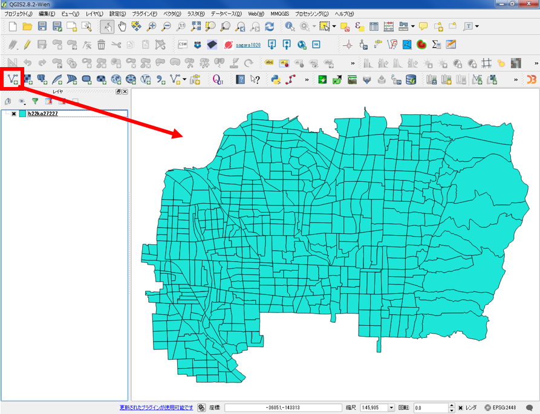
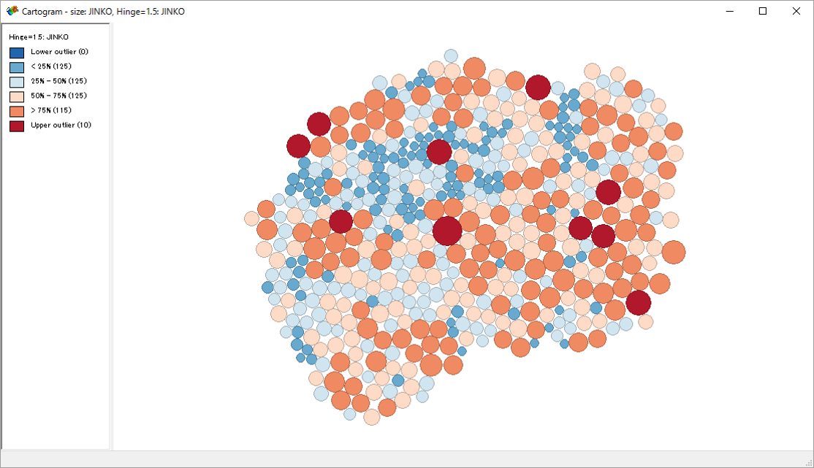

# 視覚的伝達
　本教材は、「視覚的伝達」の実習用教材です。GISでは、空間オブジェクトのもつ値を用いて、地理情報の視覚化を行うことができます。以下では、GISによる地理空間情報の視覚化手法として、値の分類法とカルトグラムについて解説しています。ソフトウェアには、無償で利用できるQGISとGeoDaを用いています。講義用教材として、[地理情報科学教育用スライド（GIScスライド）]の5章が参考になります。

　課題形式で使用する場合は、本教材を一読した後、[課題ページ]へお進みください。GIS初学者は、本教材を進める前に[GISの基本概念]の教材を確認しておいてください。本教材を使用する際は、[利用規約]をご確認いただき、これらの条件に同意された場合にのみご利用下さい。

[地理情報科学教育用スライド（GIScスライド）]:http://curricula.csis.u-tokyo.ac.jp/slide/5.html
[利用規約]:../../../master/利用規約.md
[GISの基本概念]:../01_GISの基本概念/GISの基本概念.md

**Menu**
------
* [属性データの視覚化](#属性データの視覚化)
* [カルトグラムの作成](#カルトグラムの作成)

**使用データ**
実習をはじめる前に、以下のデータをダウンロードしてください。なお、すべてのデータをJGD2000の平面直角座標系に統一して下さい。
* 政府統計の総合窓口([e-Stat])東大阪市行政界シェープファイル

[e-Stat]:http://www.e-stat.go.jp

**スライド教材**
スライドのダウンロードは[こちら](../../../../raw/master/GISオープン教材/21_視覚的伝達/視覚的伝達.pptx)

----------

## 属性データの視覚化
以下では、空間オブジェクトの保有する値を用いて、属性データを視覚化する手法として、等間隔分類、等量分類、自然分類、標準偏差分類について解説しています。また、分類に用いるデータを作成するため、人口密度の計算について先に解説しています。

東大阪市の行政界データをQGISでインポートする。

レイヤのプロパティを開きデータのタイプを確認する。このとき、タイプがString（文字型）だと、計算ができないため注意する。

レイヤから属性テーブルを開き、フィールド計算機をクリックする。
新しいフィールドを作るにチェックを入れ、出力フィールド名を入力する。出力フィールドタイプをrealにし、フィールドの幅と精度を入力する。関数のフィールドと値から、“JINKO”と“AREA”をダブルクリックする。人口/面積で人口密度を計算する（デフォルトの単位は、㎡）。

下の図のように、新しいフィールドに、1㎡あたりの人口密度が計算されたのを確認する。計算結果を保存するため、編集マークをクリックし、属性テーブルを閉じる。

プロパティからスタイルを選択し、「段階に分けられた」に切り替える。カラムからdensityを選択すると、属性テーブルの列名が表示されることが確認できる。

以下では、値の分類法として代表的な等間隔分類、等量分類、自然分類、標準偏差分類について解説する。

### 等間隔分類
等間隔分類・・・最大最小値を除し、属性値の範囲が等間隔になるように階級区分を割り当てる。

### 等量分類
等量分類・・・階級数のデータ数が、等しくなるように階級区分が割り当てられる。

### 自然分類（自然なブレーク）
自然分類・・・頻度分布などにより、グループを形成させ、データの変化量が大きい箇所に各グループの階級区分を割り当てる。

### 標準偏差分類
標準偏差分類・・・平均値から標準偏差を加減した値により、階級区分を割り当てる。

[▲メニューへもどる]:視覚的伝達.md#menu

## カルトグラムの作成
　カルトグラムは、統計データに基づいて面積や距離を変形させた地図です。以下では、QGISとGeoDaを用いたカルトグラムの作成手法について解説しています。

プラグインの管理とインストールから、Cartogramプラグインをインストールする。インストール後に、ベクタ＞Cartogram＞Create Cartogram　人口のテーブルを選択し、カルトグラムを作成する。

※　対象とする属性テーブルに０がある場合、事前に０を含むものを削除または、別の値に書き換える等をする必要がある（０があると表示されないため） 。

下の図のように、東大阪市の町丁目ごとの人口をもとにしたカルトグラムが作成できた。

### GeoDaを用いたCartogramの作成
　以下では、QGISではなく、空間統計の計算に優れたGeoDaというソフトウェアを用いてカルトグラムを作成する手法について解説しています。

GeoDaを起動し、New project アイコンをクリックし、ファイル形式とデータを選択し「Connect」する。

Cartogramのアイコンをクリックし、Circle Sizeのデータを選択し「OK」をクリックする。※Circle color はデフォルトでも表示される。

下の図のように、東大阪市の町丁目ごとの人口を円の大きさで示したカルトグラムが作成できた。

[▲メニューへもどる]

#### この教材の[課題ページ]へ進む

#### ライセンスに関する注意事項
本教材で利用しているキャプチャ画像の出典やクレジットについては、[その他のライセンスについて]よりご確認ください。

[その他のライセンスについて]:../その他のライセンスについて.md
[▲メニューへもどる]:視覚的伝達.md#menu
[課題ページ]:../課題/課題ページ/視覚的伝達.md
