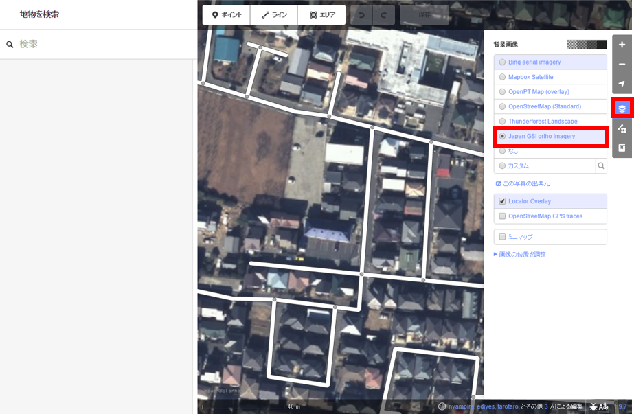
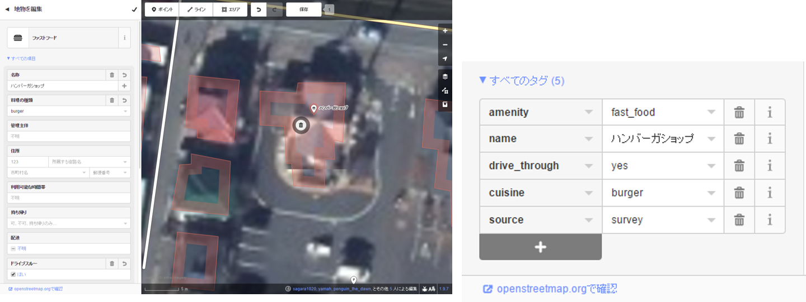

# 参加型GISと社会貢献
　本教材は、「GISと社会貢献」の実習用教材として、OpenStreetMap(OSM)を用いたクライシスマッピングについてまとめたものです。OSMの閲覧方法や地図データの作成とOSMを利用したクライシスマッピングについての解説を行っています。
　課題形式で使用する場合は、本教材を一読した後、[課題ページ](../課題/課題ページ/参加型GISと社会貢献.md)へお進みください。GIS初学者は、本教材を進める前に[GISの基本概念]の教材を確認しておいてください。本教材を使用する際は、[利用規約]をご確認いただき、これらの条件に同意された場合にのみご利用下さい。

※OSMへの地物の追加や編集は、自己責任で行ってください。実習で利用する際は、担当教員の指導に従ってください。

[利用規約]:../../../../master/利用規約.md
[GISの基本概念]:../01_GISの基本概念/GISの基本概念.md

**Menu**
-----
* [OpenStreetMapとは？](#OpenStreetMapとは？)
* [基本操作](#基本操作)
* [編集のルール](#編集のルール)
* [アカウントの取得](#アカウントの取得)
* [OSMの編集](#OSMの編集)
* [ローカル編集](#ローカル編集)
* [データを利用する](#データを利用する)
* [OpenStreetMapと社会貢献](#OpenStreetMapと社会貢献)
* [クライシスマッピングとは？](#クライシスマッピングとは？)
* [クライシスマッピングの歴史](#クライシスマッピングの歴史)
* [OSMを利用したクライシスマッピング](#OSMを利用したクライシスマッピング)

**教材中の画像について**

本教材は、OpenStreetMapのキャプチャー画像を利用しています（ © OpenStreetMap Contributors）。

**スライド教材**
スライドのダウンロードは[こちら]
[こちら]:../../../../../raw/master/GISオープン教材/インターネットの活用に関する教材/OpenStreetMAPとクライシスマッピング/OpenStreetMapとクライシスマッピング.pptx

----------

## OpenStreetMapとは？
　OpenStreetMap（OSM）は、誰もが利用できるフリーの地理情報データを作成するプロジェクトです。OSMの編集者によって、作成された地理情報データは、© OpenStreetMap Contributors CC BY-SAの条件下で自由に利用することができます。OSMの編集は、アカウント登録取得することで、誰もが自由に行うことができます。OSMで作成される地理情報データは、ライセンス上利用可能な画像（地図、空中写真、衛星画像等）からのトレース、現地調査、GPSデータ等によって作成されます。

> OpenStreetMap Japan [https://openstreetmap.jp/](https://openstreetmap.jp/) を参考に作成

[▲メニューへもどる]
[▲メニューへもどる]:参加型GISと社会貢献.md#menu

## 基本操作
　OpenStreetMapで作成された地理情報データは、[OpenStreetMap]のサイトから閲覧できます。以下では、[OpenStreetMap]について解説しています。[OpenStreetMap]にアクセスして機能を確認してください。

(左図)
①　地名や住所による検索ができる
②　データの編集やエクスポートができる
③　現在地の表示、地図の切り替え、凡例の表示、地図の共有、編集やデータに関するメモ、地図データの詳細確認などができる。

(右図)　どのユーザーがどんな情報の地物を入力したかなどを確認することができる。
※　表示範囲が大きいとデータが読み込めない

## 編集のルール
 OSMでの地物の作成や編集には、地物へのタグ付けや参考にできる地図や資料について、以下のようなルールがあります。

* ポイント、ライン、ポリゴンで地物を表現する
  ライセンス上利用可能な地図や空中写真などを背景に地物をトレースすることができる

* 地物の属性をタグとして付与する
  >タグの詳細は、[http://wiki.openstreetmap.org/wiki/JA:Map_Features/](http://wiki.openstreetmap.org/wiki/JA:Map_Features/) を参照

* Google Mapsなどを用いたOSMの編集は、できない（ソースにする媒体の利用規約などを参照して利用）

[▲メニューへもどる]

## アカウントの取得
　OSMで地物の作成や編集をするためには、アカウントが必要です。以下では、アカウントの取得手法について解説しています。

[OpenStreetMap]にアクセスし、ユーザー登録をクリックする。登録が完了したら、メールアドレスにメールが届いているのを確認する。

[▲メニューへもどる]

## OSMの編集
　OpenStreetMapでは、背景地図、現地調査、GPSデータを参考に、エディタを使って点、線、面の地物を作成または編集します。以下は、OpenStreetMapで地物を追加する手法について解説したものです。OSMの地物の編集について詳しくは、[OSM wiki](http://wiki.openstreetmap.org/wiki/JA:%E5%9C%B0%E5%9B%B3%E4%BD%9C%E3%82%8A%E3%81%AE%E6%A6%82%E8%A6%81)を参照してください。
　以下では、OSMの編集について解説しています。

[OpenStreetMap]にアクセスし、任意の地域を拡大する。
編集をクリックし、IDを利用する。

背景にBingマップが表示されている。このまま編集することも可能。
今回は、カスタムから地理院タイルを読み込む。
>地理院タイルのURLやタグについては、　[http://wiki.openstreetmap.org/wiki/JA:GSImaps/](http://wiki.openstreetmap.org/wiki/JA:GSImaps/) を参照する。

### 建物の追加
まず練習として、建物の作成を試していきます。

エリアをクリックし、建物にそってクリックでポリゴンを描画、ダブルクリックでポリゴンを閉じる。
左の画面からポリゴンの情報を選択する（タグ付け）。
すべてのタグから、+マークをクリックし、Sourceを入力する（今回は地理院地図のタグ）。

### その他の地物の追加
ポリゴンと同じ方法でポイントやポリゴンなどの地物を追加することができます。
。

地物を追加し、左のウィンドウから属性を設定すると一番下にタグ(データに記載される情報)が追加される。
タグの入力や選択は、[http://wiki.openstreetmap.org/wiki/JA:Map_Features](http://wiki.openstreetmap.org/wiki/JA:Map_Features) を参考にする。
sourceについて、背景画像から判断できない場合は、現地調査（source = survey）などで取得する。
道路等のラインを作成する場合は、接合をチェックする。

### 編集の保存とアップロード
以下では、OSMに編集結果をアップロードする手法について解説しています。

「保存」をクリックし変更セットのコメントを入力する。（英文が望ましい。）
OSMロゴ画像をクリック or ウインドウを閉じ、編集を終了する。数分後にアップロードが反映される。

[▲メニューへもどる]

## ローカル編集
　OSMでは、ブラウザ（ID エディタなど）せず、ローカルで編集したレイヤをアップロードすることも可能です。以下では、JOSMを利用してローカルで編集したレイヤをアップロードする手法について解説しています。

[JOSMダウンロードサイト](https://josm.openstreetmap.de/wiki/Ja%3AWikiStart)にアクセスしJOSMのインストーラをダウンロードする。
ダウンロードしたzipを解凍し、.exeファイルをインストールする。

### JOSMの設定
JOSMを起動し、編集＞設定をクリックし、地球アイコンから、OSMのアカウント情報を入力する。

### 編集範囲のダウンロード
ファイル＞OSMからのダウンロードをクリックする。
編集したい範囲をドラックし、ダウンロードをクリックする
※地図の移動は右クリックを使用する。

画像から背景地図を追加する。
追加された背景画像は、右上のウインドウに表示される。

地物を追加するアイコンをクリックし、ポリゴンを描画する。
追加ボタンからsourceなどタグを追加し、okをクリックする。
ラインやポイントは描画後にダブルクリック。
ポリゴンはポリゴンを閉じる。
削除は選択アイコンで選択し、Deleteを押す。

編集＞データをアップロードクリックする。
変更セットのコメントや、データソースを入力し、アップロードを行う。

数分後にアップロードした地物が追加される。

編集＞名前をつけて保存　をクリックし作業ファイルを保存する。
再開する場合は編集＞開く　で保存したファイルを選択する。

### GPSデータを読み込む
以下では、フィールド調査等で取得したGPSデータを利用する手法について解説しています

ファイル＞開く　をクリックし.gpxファイルを選択する。
GPSデータが表示されるため、編集などに利用することができる。
ファイル＞新規レイヤーを作成　をクリックするとレイヤの作成ができる。

[▲メニューへもどる]

## データを利用する
　OSMのデータは、© OpenStreetMap Contributors CC BY SAの条件で、自由に利用することができます。以下は、OpenStreetMapからデータをダウンロードする手法について解説しています。

[OpenStreetMap]のページで、データをダウンロードしたい範囲を選択し、Exportをクリックする。
QGISを開き、ベクタ＞OpenStreetMap＞XMLからトポロジをインポートするをクリックする。
出力先のファイル名などを入力し、OKをクリックする。

QGISを開き、ベクタ＞OpenStreetMap＞SpatiaLite形式にトポロジをインポートするをクリックする。
インポートしたいデータを選択し、OKをクリックする。

### 特定の地物のみをダウンロードする
http://overpass-turbo.eu/ にアクセスし、データをダウンロードする。
ウィザードをクリックし、 emergency=defibrillator を入力し、AED情報を抜き出す。
エクスポートをクリックし、KMLをクリックとデータが保存できる。

**※データを利用する際は、Map data © OpenStreetMap contributors　などのクレジットが必要となる。詳細は、[http://wiki.openstreetmap.org/wiki/JA:Legal_FAQ](http://wiki.openstreetmap.org/wiki/JA:Legal_FAQ) を確認する。**

[▲メニューへもどる]

# OpenStreetMapと社会貢献
　OpenStreetMapは、誰もが地図を編集することができ、編集結果はほぼリアルタイムで反映され、その成果は誰もが自由に利用することができます。そのような特性から災害時に利用できる発災後の地図や発災前の地図整備するといったクライシスマッピングに、OpneStreetMapが用いられることがあります。以下は、クライシスマッピングについて簡単に解説したものです。

## クライシスマッピングとは？

* 地震、津波、洪水などの災害、伝染病、政治と関連した暴動や社会問題というような危機に対するマッピング活動

* 地図による救済、復興のための支援活動で、インターネットを利用したリアルタイムかつリモートによる情報の整理と集約を行う

* 地図は世界中のOpenStreetMapの利用者（マッパー）などによるボランティアによって行われる

## クライシスマッピングの歴史

[▲メニューへもどる]

## OSMを利用したクライシスマッピング
　以下は、Humanitarian OSM Team（HOT）のタスキングマネージャーとOSMを利用したクライシスマッピングについて解説しています。

### OSM Tasking Managerの利用
OSM Tasking Managerは、OSM人道支援チーム "Humanitarian OSM Team, HOT"が、クライシスマッピングの支援ツールとして提供しているもの。

[OSM Tasking Manager]にアクセスし、タスクを確認する。
検索や並び替えで、作業するタスクを選択する。
※タスクによっては、初心者の参加が望ましくないものもあるため注意する。

「解説」からマッピングの概要を把握し、「インストラクション」をクリックする。マップする対象と変更セットの内容を確認する。
Project Specific Mapping Notesなどその他の説明も確認し、「参加」をクリックする。
※画面右上をクリックし、OSMにログインしておく。

凡例をもとに編集するエリアを選択し、「マッピング開始」をクリックする。

「エディタ（ID）」をクリックすると、OSM画面が起動する。
>このタスクの詳しい説明については、
https://www.youtube.com/watch?v=WjNawjN53lw&feature=youtu.be/ を参照する。

タスクに従って、建物をトレースし、「保存」をクリックする。
編集セットのコメントにタスクの内容が自動で入力されていることを確認し、「SAVE」をクリックする。

編集が終了したら、「アンロック」をクリックする。
選択した地域内のタスクが完了している場合は、「完了としてマーク」をクリックする。

[▲メニューへもどる]

**その他のライセンス**
本教材で利用しているキャプチャ画像の出典やクレジットについては、[その他のライセンスについて]よりご確認ください。
[その他のライセンスについて]:../../その他のライセンスについて.md

[OpenStreetMap]:http://www.openstreetmap.org
[OSM Tasking Manager]:http://tasks.hotosm.org/
