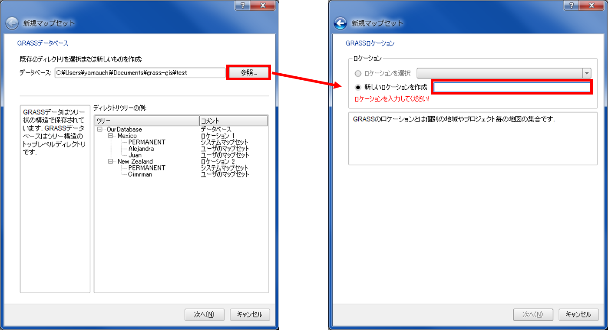
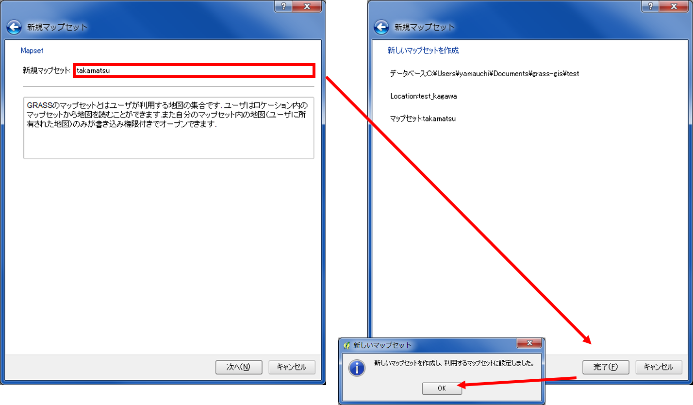
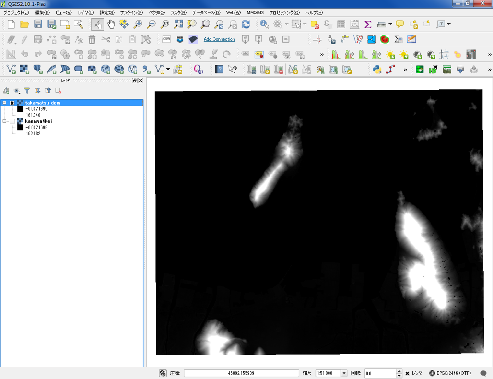
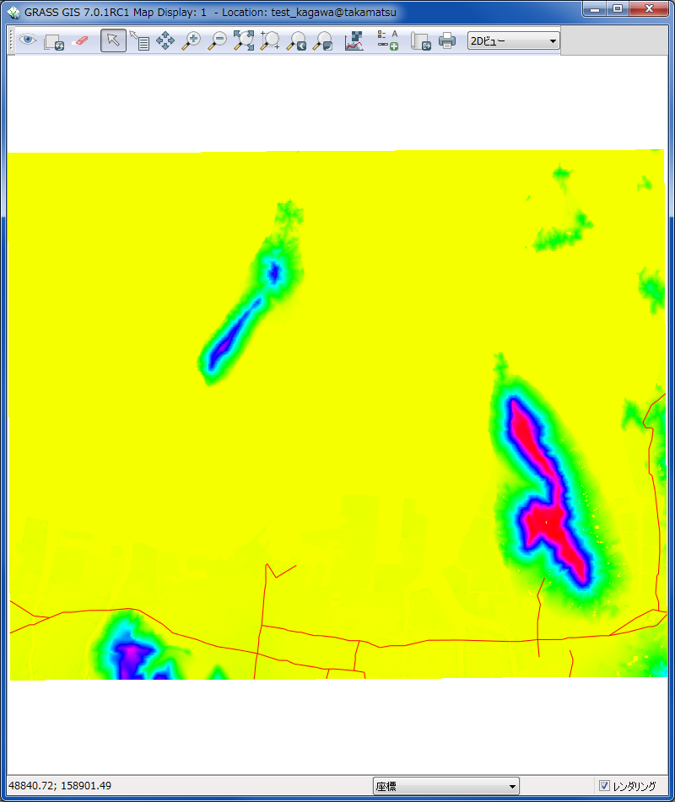
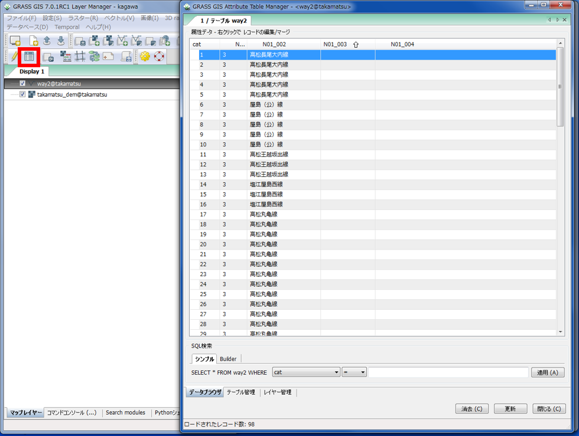
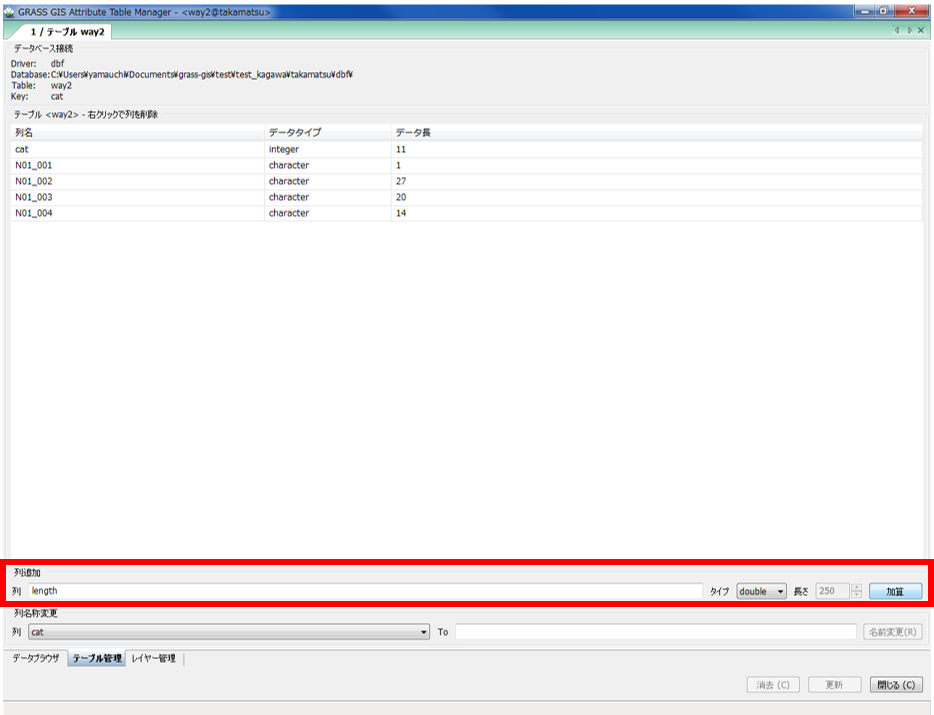
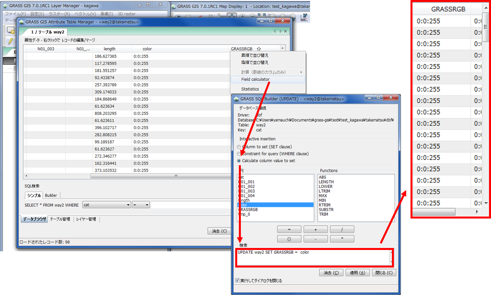

# GRASSビギナーズマニュアル
　本教材は、GRASS GIS入門者向けの実習用教材です。GRASSの機能やデータの読み込みなどについて解説しています。

　課題形式で使用する場合は、本教材を一読した後、[課題ページ]へお進みください。GIS初学者は、本教材を進める前に[GISの基本概念]の教材を確認しておいてください。本教材を使用する際は、[利用規約]をご確認いただき、これらの条件に同意された場合にのみご利用下さい。

**Menu**
----------
* [GRASS GISとは？](#GRASSGIS)
* [インストール](#インストール)
* [ファイル形式について](#ファイル形式について)
* [QGISでマップセットの作成](#QGISでマップセットの作成)
* [データの読み込み](#データの読み込み)
* [マップセットをGRASSで表示する](#マップセットをGRASSで表示する)
* [GRASSにデータを追加する](#GRASSにデータを追加する)
* [機能説明](#機能説明)
* [コマンドコンソールとモジュールツリー](#コマンドコンソールとモジュールツリー)
* [レイヤの色分け](#レイヤの色分け)
* [3Dビュー](#3Dビュー)
* [属性テーブル](#属性テーブル)
* [フィールド演算](#フィールド演算)
* [レイアウト](#レイアウト)
* [参考ページの紹介](#参考ページの紹介)

**使用データ**
 実習をはじめる前に以下のデータをダウンロードしてください。

* 国土地理院「 基盤地図情報　数値標高モデル　5ｍメッシュ　高松周辺（513440）」
>データは、香川県高松市周辺の5ｍDEMをエコリスのツールを用いて変換し、高松市北部周辺をトリミングしたものです。この手法については、[ラスタデータの分析]の教材をご参照ください。データの座標系は、世界測地系の平面直角座標Ⅳ系に設定しています。

* 国土交通省国土政策局「[国土数値情報](http://nlftp.mlit.go.jp/ksj/gmlold/index.html)（香川県　道路データ）」
>データの座標系は、世界測地系の平面直角座標Ⅳ系に設定しています。変換手法は、[空間データ]の教材にまとめています。

**スライド教材**  

スライドのダウンロードは[こちら](../../../../raw/master/GISオープン教材/GRASSビギナーズマニュアル/GRASSビギナーズマニュアル.pptx)

----------

## GRASS GISとは？
　GRASS GISは、無償で利用できるオープンソースGISです。ラスタデータやベクタデータに関連する処理の機能が充実しており、地形解析や画像分類等で活用されています。本教材の中心となっているQGISでは、プラグインからGRASS GISの機能を呼び出すことができます。以下の教材は、GRASS GISの入門教材として、基本機能について解説しています。GRASS GISの実践的な利用法について知りたい方は、[ラスタデータの分析]の教材等を参照してください。  

 [▲メニューへもどる]  

## インストール
　[GRASS GISの公式ページ] にアクセスして、GRASS GIS をダウンロードする。解凍したファイルのガイドに従ってインストールを行う。
※QGISをダウンロードすると一緒にGRASS6.4もダウンロードされるが、この教材ではGRASS7を利用する。

[GRASS GISの公式ページ]:https://grass.osgeo.org/

[▲メニューへもどる]

## ファイル形式について

## QGISでマップセットの作成
　以下では、GRASS GISでデータを扱うために必要なマップセットの作成について解説しています。

QGIS2.8の場合は、デフォルトでGRASSのプラグインが利用できる。一方、QGIS2.10以降の場合は、QGIS Desktop2.10.1 with　GRASSを起動し、プラグイン→プラグインの管理とインストールからGRASS 6を検索し、チェックをする必要がある。そのため、本教材ではQGIS2.10を用いているものが混在している。しかし、起動以外の操作においては、2.8と2.10の間に大きな違いはない。

QGISでラスタを読み込む。右下から座標系を確認し、「オンザフライCRS変換有効にする」のチェックをONにする。

新規マップセットをクリックし、マップセット名など必要項目を入力する。

GRASSデータを保存するフォルダを作成し指定する。新しいロケーション名を任意で入力する。

データ座標系にあわせて、データの範囲を作成し指定する。新しいロケーション名を任意で入力する。

新規マップセットに名前をつけ、マップセットの作成を完了させる。

### マップセットの追加 (新規作成しない場合)

マップセットを保存したフォルダーを参照し、位置とマップセットを追加する。

[▲メニューへもどる]

## データの読み込み
　以下では、QGISからマップセットにデータを読み込む手法について解説しています。

### ラスタデータの読み込み
QGISにロードされているラスタデータをGRASSで読み込む。
GRASS Toolをクリックし、モジュールリストを開き、`r.in gdal.qgis`コマンドを選択する。
※モジュールツリーとモジュールリストは連動しているため、同様の処理を選択することが可能。QGISのバージョンによってモジュールツリー等の配置が異なる点に注意する。

ロードされたレイヤ（QGISで読み込んでいるレイヤ）を選択し、出力ラスタ名を入力する。「実行」をクリックし、処理が成功したら「出力を見る」をクリックする。

下の図のように、GRASSデータセットの中に、QGISで表示しているラスタを読み込むことができた（GRASSで処理できる準備ができた）。

### ベクタデータの読み込み
QGISにロードされているベクタデータをGRASSで読み込む。
ベクタをインポートする場合は、QGISでベクタを読み込んでおき、`v.in ogr.qgis`コマンドを実行する。

※**GRASS6.4でインポートしたベクタは、GRASS7では表示されないことがあるので注意する。**

処理が完了したら、「出力を見る」をクリックするとデータがQGISで表示される。

[▲メニューへもどる]

## マップセットをGRASSで表示する
　QGISで作成したマップセットをGRASS GISで読み込み、表示することができます。以下では、GRASS 7.0.1を利用し、その手法について解説しています。

GRASS GISを起動し、参照からマップセットの保存ディレクトリ（フォルダ）を選択する。今回は、すでにQGISで作成しているため、自動的にロケーションとマップセットが展開する（新規に作成する場合は、Newから作成する）。マップセットを選択し、「 Start GRASS session 」を実行する。

### 画面説明
GRASS GISを起動すると、以下のような画面が表示される。

[▲メニューへもどる]

## GRASSにデータを追加する
　以下では、QGISで作成したマップセットからデータの表示について解説しています。

### マップセットからラスタデータを読み込む
ラスターマップの追加から、作成したマップセットのラスタを選択し、読み込む。

### 外部からデータを読み込む
以下では、外部からマップセットにデータを読み込む手法について解説しています。この処理は、QGISで作成したマップセットからデータが読み込めない場合などに有効です。

ベクトルデータのインポートから、.shpファイルを参照し、インポートする。

以下のようにベクトルレイヤが、マップセットに追加される。

[▲メニューへもどる]

## 機能説明
　GRASS GISには、QGISのように地図の表示、データ作成、分析といった機能が用意されています。以下では、それらの機能について簡単に解説しています。

① 新規マップ表示
② 新規ワークスペース作成
③ ワークスペースの読み込みと書き出し
④ マップセット内のデータ読み込み（④の右側のボタンは読み込むデータの形式によって選択する）
⑤ データの編集
⑥ 属性テーブルの表示
⑦ データのインポート
⑧ ラスタ計算機
⑨ 幾何補正

ファイル：ワークスペース、データのインポートエクスポートなど

設定：ロケーション、作業環境の設定など

ラスター：ラスタ処理（地形解析、水文解析など）

ベクトル：ベクタ処理（バッファ、ネットワーク分析など）

画像：画像の処理（色分けやＲＧＢ合成など）

3D raster：3D表示に関する処理（断面図など）

[▲メニューへもどる]

## コマンドコンソールとモジュールツリー
　GRASS GISで処理では、コマンドコンソールやそれをツリー上にまとめたモジュールツリーが利用できます。データ分析等での使用例については、[ラスタデータの分析]や[ネットワーク分析]の教材で詳しく解説しているため、こちらでは説明していません。

※　レイヤツリー（レイヤが表示されるウインドウの下に切り替えがある）

コマンドコンソール:赤枠内にコマンドを入力すると処理が実行される。入力途中で、該当するコマンドを先読みする。

モジュールツリー：赤枠内のツリーから、処理を選択する。
+ボタンをおすと処理が表示される。

[▲メニューへもどる]

## レイヤの色分け
 GRASS GISでは、QGISと同様にデータの値に合わせた配色が可能です。以下では、その手法について解説しています。

### ベクタデータの色分け
ラインの色を黒から赤へ変更する。

以下のように、ラインの色が黒から赤に変更される。

### ラスタデータの色分け
ラスタの値に応じて色分けを行うため、「Manage color rules Interactively」をクリックする。ラスターマップを選択し、分類数と値を入力する。

左の図のように、用意されている配色を選択することもできる。また、右の図のように、任意で値を入力することもできる。

[▲メニューへもどる]

## 3Dビュー
　GARSSでは、標高値などのデータをもつラスタを立体的に表現することができます。以下では、その手法について解説しています。

※ 使っているPCの実行環境等により、3D表示ができないことがあります。

ラスタデータの保持している値（今回の場合は、標高値）を利用して3D表示を行うため、2Dビューを3Dビューに変更する。

3Dビューでは、値などを変更することや地図の視点を変更することができる。Z鉛直の値を変更すると、地形の誇張の強弱が変更できる。

[▲メニューへもどる]

## 属性テーブル
　GRASS GISでもQGISと同様に属性テーブルの表示や編集ができます。以下では、その手法について解説してます。

レイヤを選択した状態で、属性テーブル表示ボタンをクリックすると、属性テーブルが表示できる。

### フィールドの追加
列名を入力し、データの型を選択し、加算をクリックするとフィールドが追加される。以下では、新規にlength(ラインの長さ)のフィールドを追加している（この時点では、lengthという名前の空のフィールドができている状態）。

[▲メニューへもどる]

## フィールド演算
　以下では、フィールドの追加で作成した新規フィールドに、ラインの長さを計算する手法の解説をしています。

新規に作成したフィールドの上で右クリックし、「計算」から「ライン長」を選択する。

各路線のライン長が計算できた（統合していないため、ぶつ切りの路線になっている）。

### 値を用いた配色
以下では、フィールドの値を用いて色分けをする手法について解説しています。

color フィールド（文字型：varchar） を作成する。

右クリックで、Field calculatorを選択して、国道とそれ以外で色分けを行う。

色分け用に、分類フィールドを作成する。

**UPDATE データ名 SET 計算したいフィールド名
 = 入力したい値 WHERE 分類に用いるフィールド = 分類に基づく値**

ベクトルからカラー調整、「Manage color rules Interactively」を選択する。
 

 属性列をチェックし、カラーテーブルを選択すると、エラーが表示される。

属性テーブルを開くと、GRASSRGBのフィールドができている。
このフィールドにcolorフィールドをコピーする。

GRASSRGBのフィールドを選択し、列を追加をクリックする。
エラーがでるが色分けができているため、OKをクリックする。

[▲メニューへもどる]

## レイアウト
　以下では、GRASS GISでのマップのレイアウトについて解説しています。

ファイルから、カートグラフィックコンポーザーをクリックし実行する。

カートグラフィックコンポーザーを起動し、地図や凡例などを挿入する。

①地図の範囲を選択する（一番最初に設定する）。
②ラスタマップを追加する。
③ベクタマップを追加する。
④凡例、方位、縮尺を追加する。
⑤地図の書き出し（PDF）をする。

地図の範囲をドラッグして設定し、ラスタマップを追加する。

ラスタマップが追加されたので、ベクタラインも追加する。マップセットから、道路ラインを選択し、加算をクリックする。

ラスタマップとベクタマップの凡例を整える。
ベクタマップの凡例の表示名は、ラベルの追加から可能。
追加できたら、追加アイテムを選択し、配置を変更する。

長さを設定し、単位を選択する（今回はデフォルトを使用）。
縮尺バーのデザインを選択し、OKをクリックする。
追加されたら、追加アイテムの配置を変更する。

方位記号を追加する。
デザインを選択し、スタイルでサイズを整える。
追加できたら、追加アイテムを選択し、配置を変更する。

配置が完了したので、PDFで書き出す（プレビューは、表示されない場合がある）。

以下のように、PDFでマップが表示できる。

[▲メニューへもどる]

## 参考ページの紹介

①https://grass.osgeo.org/
②http://foss4g.kii.gscc.osaka-cu.ac.jp/moodle/

[▲メニューへもどる]

#### この教材の[課題ページ]へ進む

#### ライセンスに関する注意事項
本教材で利用しているキャプチャ画像の出典やクレジットについては、[その他のライセンスについて]よりご確認ください。

[▲メニューへもどる]:GRASSビギナーズマニュアル.md#menu
[その他のライセンスについて]:../その他のライセンスについて.md
[空間データ]:../08_空間データ/空間データ.md
[ラスタデータの分析]:../15_ラスタデータの分析/ラスタデータの分析.md
[課題ページ]:../課題/課題ページ/GIS入門.md
[利用規約]:../../../master/利用規約.md
[GISの基本概念]:../01_GISの基本概念/GISの基本概念.md
