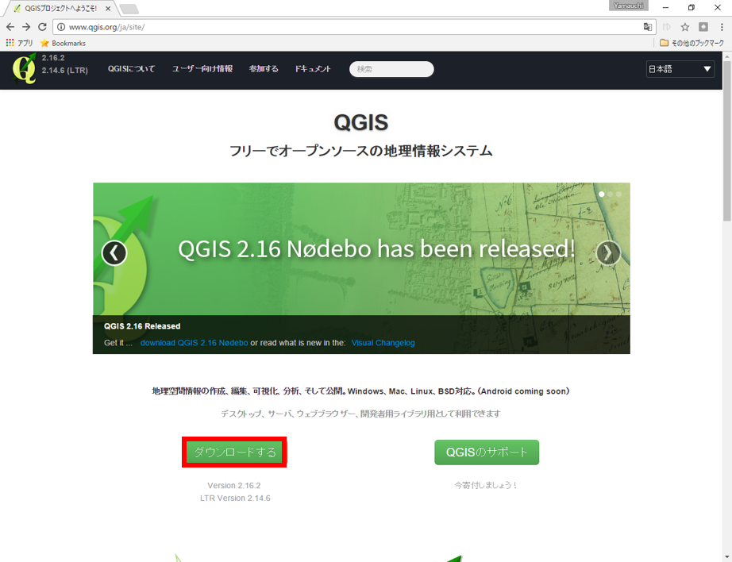
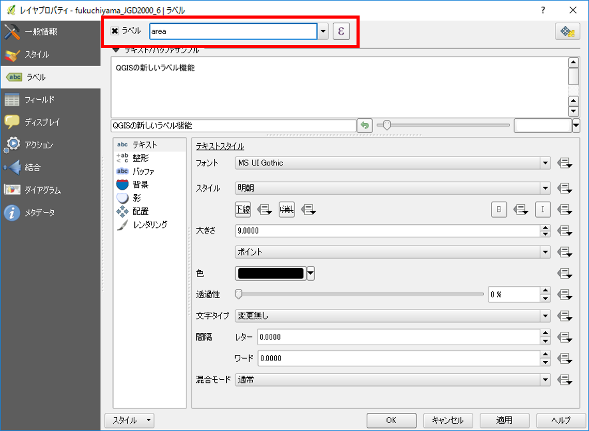
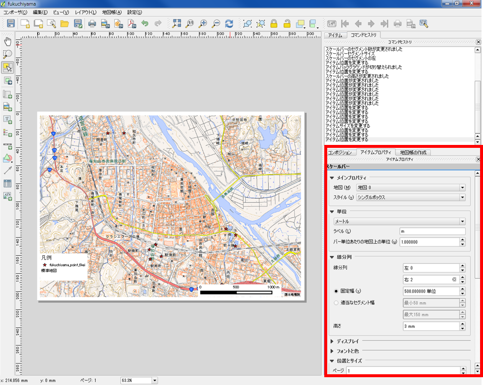
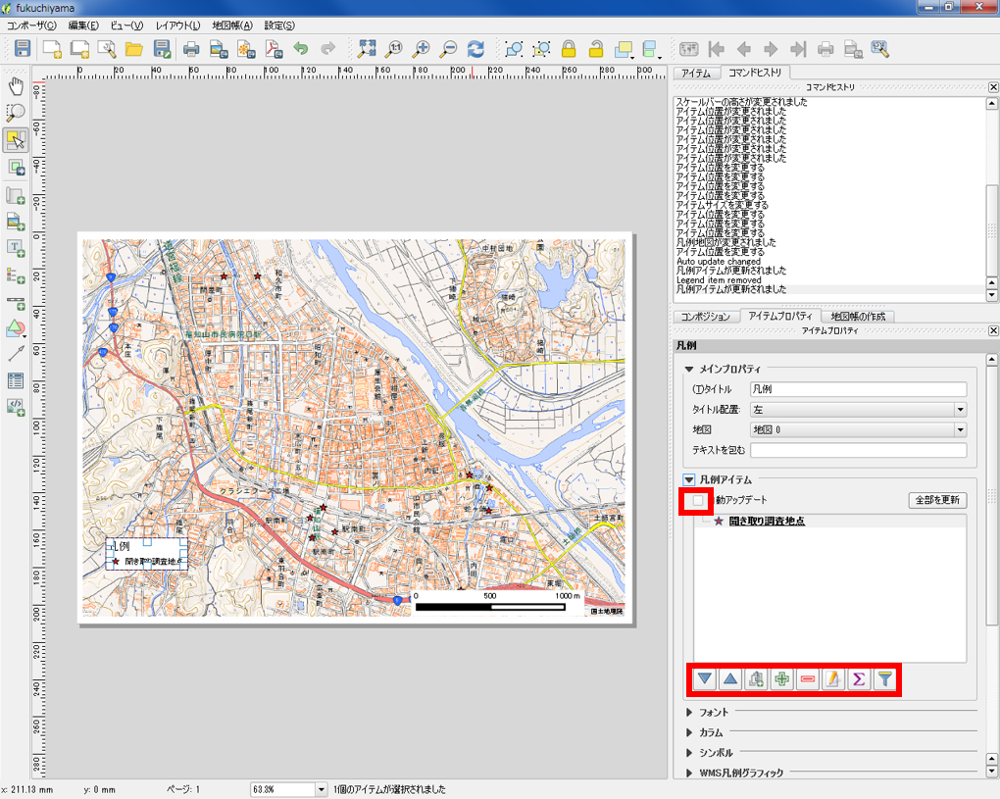
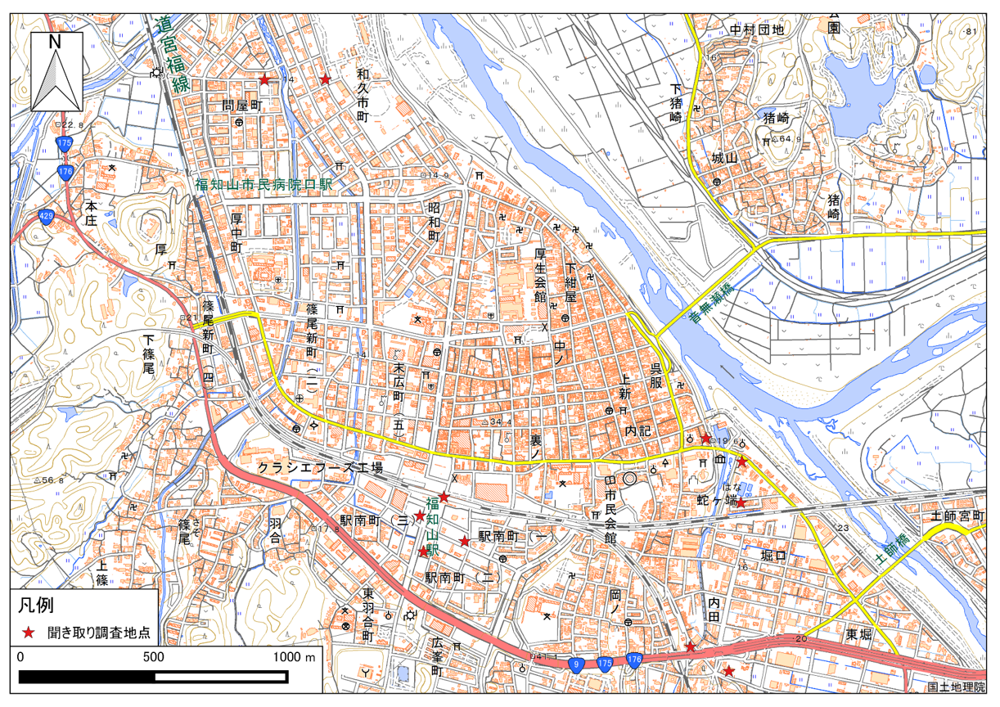

# QGISビギナーズマニュアル
　本教材は、QGIS入門者向けの実習用教材です。教材では、[福知山豪雨災害聞き取り調査データ]を用いた、QGISの操作解説を行っています。QGISの基本操作として、データの読み込み、シンボルの変更、地図のレイアウトなどが学習できます。

　課題形式で利用する場合は、[課題ページ]をご利用ください。GIS初学者は、本教材を進める前に[GISの基本概念]の教材を確認しておいてください。本教材を使用する際は、[利用規約]をご確認いただき、これらの条件に同意された場合にのみご利用下さい。

**Menu**
----------
* [QGISとは？](#QGISとは？)
* [インストールする](#インストールする)
* [起動する](#起動する)
* [ウインドウの確認](#ウインドウの確認)
* [各種ボタンについて](#各種ボタンについて)
* [データの読み込み](#データの読み込み)
* [機能説明](#機能説明)
* [属性テーブル](#属性テーブル)
* [プロパティ](#プロパティ)
* [Python入門](#python入門)
* [データの保存形式](#データの保存形式)
* [プラグイン](#プラグイン)
* [地図のレイアウト](#地図のレイアウト)
* [参考ページの紹介](#参考ページの紹介)

**使用データ**
　実習をはじめる前に、以下のデータをダウンロードしてください。

* [福知山豪雨災害聞き取り調査データ]　([福知山豪雨災害防災マップ](http://opentextmap.org/library/?p=2808)　© 福知山豪雨災害防災マップ を加工し作成）

**スライド教材**
スライドのダウンロードは[こちら](https://raw.githubusercontent.com/yamauchi-inochu/demo/master/GIS%E3%82%AA%E3%83%BC%E3%83%97%E3%83%B3%E6%95%99%E6%9D%90/QGIS%E3%83%93%E3%82%AE%E3%83%8A%E3%83%BC%E3%82%BA%E3%83%9E%E3%83%8B%E3%83%A5%E3%82%A2%E3%83%AB/QGIS%E3%83%93%E3%82%AE%E3%83%8A%E3%83%BC%E3%82%BA%E3%83%9E%E3%83%8B%E3%83%A5%E3%82%A2%E3%83%AB.pptx)

----------

## QGISとは？
　QGISは、無償で利用できるオープンソースのGIS（GNU General Public Licenseで提供）です。Windows,Mac,Linux,Unix, Androidなど様々な環境で動作します。様々なプラグインや、GRASSやPostGISなど他のオープンソースGISと連携して使用することで、多様な分析が可能です。GISの基本操作に必要な機能を網羅しているだけでなく、Web上に多数のマニュアルがアップロードされているため、GIS学習がしやすいソフトウェアです。  

>( http://qgis.org/ja/site/about/index.html を参考に作成 )

[▲メニューへもどる]

## インストールする
　QGISは、最新版と1年間のバグ修正のサポートがあるLTR版があります。本教材では、旧LTR版のQGIS2.8を中心に構成しています。下記に従って、QGISをインストールしてください（LTR版2.8を推奨）。

### 最新版のインストール
QGISをダウンロードするため、[QGIS](http://qgis.org/ja/site/index.html)の公式ホームページにアクセスする。PCの環境にあわせて、32bit版か64bit版を選択してダウンロードする(LTR版を推奨)。ダウンロードが終了したら、.exeファイルを実行しインストールを行う。

### 旧版のインストール
**本教材は、QGIS2.8を基本に構成しています**

[QGIS](http://qgis.org/ja/site/index.html)の公式ホームページを開き、「ダウンロードする」をクリックする。全てのリリースのタブに切り替えて、「古いバージョンのダウンロード」をクリックする。本教材で中心になっているQSIS2.8版（最終リリース版）をダウンロードする。

[▲メニューへもどる]

## 起動する
　以下では、インストールしたQGISの起動手法について解説しています。

デスクトップのQGISアイコンをダブルクリックする。しばらくするとQGISが起動する。

[▲メニューへもどる]

## ウインドウの確認
　QGISを起動すると、下の図のようなウィンドウが表示されます。ウインドウ上のアイコンの配置は自由に変更することができます。アイコンのない箇所（グレーの部分）で右クリックすることにより、別機能のウインドウを呼び出すことができます。アイコンの数は、インストールしているプラグインの数によっても異なります。そのため、インストール直後のQGISと教材の画像が異なっていることを確認してください。

[▲メニューへもどる]

## 各種ボタンについて
　以下では、QGISで主に使用するボタンについて解説しています。

①QGISファイルを保存
②名前をつけてQGISファイルを保存
③地図移動
④地図の拡大と縮小
⑤選択領域にズーム
⑥動作の前後移動
⑦地物情報表示
⑧選択と選択取り消し
⑨長さ、面積計測（手動）
⑩レイヤ編集
⑪ベクタレイヤの読み込み
⑫ラスタレイヤの読み込み
⑬テキストファイルの読み込み

[▲メニューへもどる]

## データの読み込み
　GISで読み込むデータは、大きく分けてベクトルデータとラスタデータがあります。詳しくは[ベクトルデータとラスタデータ](../01_GISの基本概念/GISの基本概念.md)を参照してください。QGISでは、以下のようにデータによって読み込む手法が変わります。以下では、実践として[福知山豪雨災害聞き取り調査データ]を用いた、ベクトルデータの読み込みを行ってください。

### ベクトルデータ読み込み
ベクタデータを読み込むアイコンをクリックするとベクタレイヤ追加ウインドウが表示される。
文字コードにあわせてエンコーディングを設定し、ブラウズからファイルを選択する。

### その他のデータ読み込み
QGISでは、ベクトルデータの他に様々なデータを読み込むことができます。以下は、その手法について簡単にまとめたものです。その他の教材で扱う処理となるので、一読しておくことを推奨します。

#### ラスタデータの読み込み
QGISでは、ラスタデータを読み込むことができます。ラスタデータの利用や分析については、[空間データの結合・修正]や[ラスタデータの分析]の教材で詳しく解説しています。

ラスタデータを読み込むアイコンをクリックし、読み込みたいラスタデータを選択する。

#### テキストデータ読み込み
QGISでは、テキストデータの位置情報を用いてベクトルデータなどに変換することができます。データの利用法についての詳細は、[空間データ]の教材で解説しています。

テキスト読み込みのアイコンから、CSVファイルを読み込む。
参照からファイルを選択し、ファイル形式をCSVにする。X,Yフィールドに対応する緯度経度があれば指定し、緯度経度がなければジオメトリなしにチェックをする。

[▲メニューへもどる]

## 機能説明
　QGISには、地図のレイアウト、データの作成、分析など様々な機能があります。以下では、QGISの機能について説明しています。

プロジェクト：QGIS（.qgs）ファイルの保存や読み込み、地図のレイアウト、エクスポートができる。

編集：ベクターレイヤの編集ができる。編集状態になると、アクティブになる。

ビュー：地図の移動や拡大、縮小など、地図画面の操作ができる。

レイヤ：ベクターやラスタなどのレイヤが追加できる。

ポイント、ライン、ポリゴン新規レイヤの作成もできる。

設定：オプションから、プロジェクトの設定やスナップオプションが設定できる。

プラグイン：プラグインの管理とインストールができる。Python入力画面が開ける。

ベクタ：斜面方位図や陰影図の作成などラスタに関する処理ができる。

ラスタ：バッファやクリップなどベクタに関する処理ができる。

データベース：PostGISなどのデータベースへの接続やeVisプラグインによる外部ファイルとの連携が可能。

Web：背景地図の設定やweb地図の書き出しができる（プラグインによる）。

プロッセッシング：他のGISソフトウェアと連携して操作ができる（R,GRASS,SAGAなどがQGIS内で処理できる）。

ヘルプ：QGISのヘルプが確認できる。

[▲メニューへもどる]

## 属性テーブル
　GISで扱うことのできるほとんどのデータは、位置情報のほかに属性情報というものを保持しています。この２つの情報は、QGISで連動して表示することができます。以下では、QGISによる属性テーブルの表示について解説しています。[福知山豪雨災害聞き取り調査データ]を用いて、属性テーブルの機能を確認してください。

データを読み込み、左の画面からレイヤの上で右クリックし、属性テーブルを開き、属性情報を確認する。

属性テーブルで選択したものは、地図上で黄色で表示される。選択アイコンで地図上のレイヤを選択した場合は、その属性テーブルが選択される。

[▲メニューへもどる]

## プロパティ
　QGISでは、プロパティからデータの情報やスタイルの変更ができます。ポイントでは形や大きさ、ラインでは線の形や太さ、ポリゴンでは塗りつぶし色や透過性を変更することができます。また、属性情報でスタイルを分けることもできます。この処理は、表示のされ方が変化するだけで、データそのものの形状や属性等が改変されるものではありません。以下では、プロパティについて解説しています。

レイヤウインドウからプロパティを表示したいレイヤを選択し、右クリックからプロパティをクリックする。

### 一般情報
一般情報は、座標系を確認したり、文字コード、表示名の変更ができる機能です。

### スタイル
スタイルは、データのスタイルを整えることができる機能です。データの値に応じて配色やスタイルを変えることができます。分類方法は「共通シンボル」、「分類された」、「段階に分けられた」などがあります。

シンボル（今回の場合は、ポイントデータ）の大きさと色を変更するには、「共通シンボル」を選択し、色と大きさを指定する。指定できた状態でOKをクリックすると変更が適用される。

シンボル（今回の場合は、ポイントデータ）の形を変更するには、「共通シンボル」を選択し、形を指定する。指定できた状態でOKをクリックすると変更が適用される。

属性テーブルの値によって、大きさと色を変更するには、「分類された」を選択し、分類したいフィールドを選択する。今回は地域ごとに色を変更するため、「area」を指定する。指定できた状態で、分類をクリックすると値による色分けができる。各色は、シンボルをクリックすることで調整でき、ラベルも変更することができる。最後に、OKをクリックすると変更が適用される。

※事前に属性テーブルから、地域名が入っているフィールドのカラム名を確認しておく。

### ラベル
ラベルは、データを表示する際に属性情報からラベルを作成する機能です。以下では、QGISで地図上にデータの属性値を用いて、ラベルを表示する手法について解説しています。

ラベルを選択し、ラベルの表示にチェックを付け、分類したいフィールドを指定する。以下の設定は、サンプルデータの属性値である「area」を指定し、地域ごとのラベル表示を行うものである。設定完了後にOKをクリックすると変更が適用され、地図上にラベルが表示される。

[▲メニューへもどる]

## プラグイン
　QGISでは、オフィシャルプラグインリポジトリ等から、様々な拡張機能をプラグインとしてインストールできます。プラグインをインストールすることにより、様々な処理が可能になります。

プラグインから、プラグインの管理とインストールを選択する。

検索から、インストールしたいプラグインを検索する。例として、以下のような便利なプラグインがある。
  

※各プラグインの使用法については、対応する教材ごとに解説している。  

### TileLayerPluginのインストール
以下では、プラグインのインストール手法の例として、TileLayerPluginのインストールと、利用法について解説しています。福知山豪雨災害聞き取り調査データをダウンロードし、QGISでシェープファイルを読み込んだ状態にして下さい。

プラグイン＞プラグインの管理とインストールからTileLayerPluginを検索し、プラグインのインストールをクリックする。

インストールが完了したら、地理院タイルをまとめた[gsi-tiles.zip](https://raw.githubusercontent.com/yamauchi-inochu/demo/master/GIS%E3%82%AA%E3%83%BC%E3%83%97%E3%83%B3%E6%95%99%E6%9D%90/%E8%AA%B2%E9%A1%8C/sample/gsi-tiles.zip)をダウンロードし、任意の場所に保存し、.zipを解凍する。  

web>タイルレイヤプラグインから、プラグインを起動する。タイルレイヤプラグインの設定をクリックし、解凍したgsi-tilesフォルダを外部レイヤディレクトリに指定する。OKをクリックすると、地理院タイルの一覧が表示される。地理院タイルを使用する際は、[地理院タイルの利用規約](http://maps.gsi.go.jp/help/use.html)に従ってください。

※本教材で用意したtsvファイルは、Minoru Akagi(minoura)氏 が、[GitHub Gist](https://gist.github.com/minorua/7654132) で公開しているtsvファイルを加工し作成したものです。

一覧から地図を選択し、追加をクリックするとQGISに地図が表示される。ポイントデータが、タイル画像の下に置かれているため、ポイントデータを表示するには、レイヤウィンドウのレイヤを入れ替える必要がある。レイヤの上下の変更方法は、一番上に表示したいレイヤをドラッグし、リスト化されているレイヤウィンドの一番上まで移動する。移動すると、地図上でもレイヤの上下が変更される。

※レイヤ構造については、[こちら](../01_GISの基本概念/GISの基本概念.md#地物とレイヤ構造)を参照してください。

[▲メニューへもどる]

## 地図のレイアウト
　QGISでは、作成したデータに凡例や縮尺を追加した地図がレイアウトできます。以下では、福知山豪雨災害聞き取り調査データと地理院タイルを用いて地図のレイアウトについて解説しています。

プロジェクトから、新規プリントコンポーザを立ち上げ、コンポーザタイトル（地図名など任意）を入力する。データが重ならない場合は、オンザフライCRS投影がうまくいっていない可能性があるので、QGISを再起動する。その後、サンプルデータ、地理院タイルの順で読み込む（これでもうまくいかない場合は、右下のEPSGと書かれたボタンをクリックし、オンザフライにチェックをついているかを確認する）。

※本来は空間座標の変換が必要であるが、この教材は入門編のため、解説していない。空間座標の変換は、[空間データ]の教材を参考にしてください。

### プリントコンポーザ
プリントコンポーザには、以下のような機能がある。

①アイテムの選択と移動
②地図の移動
③地図の追加
④画像の追加
⑤凡例の追加
⑥縮尺バーの追加
⑦地図の更新

※アイテムの削除は編集から行う。

地図をレイアウトするため、地図、縮尺バー、凡例を追加する。地図、縮尺バー、凡例の追加するため、各追加ボタンをクリックし、地図のレイアウト画面で大きさをドラッグして指定する。

地図、縮尺バー、凡例が追加できたら、縮尺バーを選択し、アイテムプロパティで調整する。線分列の大きさの値を任意の値に変更する。

凡例を選択し、アイテムプロパティで調整する。自動アップデートのチェックをはずすと凡例が編集できる。名称の変更、凡例項目の追加と削除ができる。

最後に、画像の追加から方位記号を追加する。アイテムプロパティの検索ディレクトリをクリックすると様々なイメージが参照できる。デフォルトの状態では、図の赤枠部分をクリックしないと検索ディレクトリが開かないため、注意する。

地図のレイアウトを整えた後、画像としてエクスポートする。コンポーザー＞画像としてエクスポートを選択する。

エクスポートした画像ファイルをダブルクリックすると、以下のような地図が表示できる。

### QGISのビュー上に凡例と方位記号を表示する手法

ビューから、地図装飾を選択する。地図装飾からスケールバー、方位記号を追加する。それぞれの形式や配置を決め、「方位or縮尺バーを使用」をチェックする。

以下のように、QGISのビュー上に縮尺と方位記号が表示される。

[▲メニューへもどる]

## Python入門
　QGISでは、Pythonでコードを書いて処理したり、自作したプラグインを使用することができます。以下では、Pythonコンソールを用いてコードによる処理について紹介しています。QGISでのPythonコードの利用について興味のある方は、以下を試してみてください。

プラグインから、Pythonコンソールを開く。
  

Pythonでは、値やオブジェクトを変数へ代入することができる。以下では、tokyo（変数）に‘test’（文字列）を代入した。そのため、testと入力したら’tokyo’が返される。

変数には数値型も代入でき、tokyo=23を代入し、tokyo+1を実行すると24が返される。文字型との違いは、 ’’があるかないかで区別している。この他にリストや辞書が変数に代入できる。

QGISでは、独自のPython関数が用意されており、それを読み込むことができる。拡張モジュールも多くあり、様々な関数による処理が可能である。詳しくは、[QGIS API Documentation]を参照。

下の図は、Python関数を用いて、アクティブになってるポイントレイヤの個数を集計したものである。
  

Python関数を用いることで、複数のレイヤを一括で処理することもできます。
この手法については、[QGIS+Python初級](../Python初級/Python初級.md)で簡単に解説しています。

[▲メニューへもどる]  

## データの保存形式
　GISでは、Shapefile（シェープファイル）形式のベクトルデータを用いることが多いです。しかし、使用するソフトウェアやアプリケーションによっては、別の形式のファイルを使用します。ここでは、QGISによるデータのエクスポートについて解説します。余裕のある方は、[福知山豪雨災害聞き取り調査データ]様々な形式でのデータのエクスポートを試してみてください。

レイヤの上で右クリックし名前をつけて保存をクリックする。QGISでは、シェープファイル以外にも、CSV,KML,GeoJASONなど様々な形式を出力することができる。

KMLは、Google Earthで利用できる形式である。Cesiumなどを利用することで、Web上でも表現しやすいデータである。

上の図は、東京駅から東京タワーまでの道のりを表示したもの。

CSVは、カンマで区切られたデータ形式である。座標値をもっていればCartoなどで簡単にWeb GISとして表現できる。

上の図は、裾野市オープンデータ　広域避難地・市指定避難所データを加工したものを利用し作成したもの

[▲メニューへもどる]

## 参考ページの紹介

- QGISについて詳しく勉強したい方　QGISユーザーガイド
①[http://qgis.org/ja/site/about/index.html](http://qgis.org/ja/site/about/index.html)

- QGISとPythonについて詳しく勉強したい方　 PyQGIS 開発者用 Cookbook
②[http://docs.qgis.org/2.2/ja/docs/pyqgis_developer_cookbook/](http://docs.qgis.org/2.2/ja/docs/pyqgis_developer_cookbook/)

[▲メニューへもどる]

#### この教材の[課題ページ]へ進む

#### ライセンスに関する注意事項
本教材で利用しているキャプチャ画像の出典やクレジットについては、[その他のライセンスについて]よりご確認ください。

[▲メニューへもどる]:QGISビギナーズマニュアル.md#menu
[国土数値情報]:http://nlftp.mlit.go.jp/ksj/
[空間データ]:../08_空間データ/空間データ.md
[基本的な空間解析]:../11_基本的な空間解析/基本的な空間解析.md
[既存データの地図データと属性データ]:../07_既存データの地図データと属性データ/既存データの地図データと属性データ.md
[空間データの結合・修正]:../10_空間データの結合・修正/空間データの結合・修正.md
[ラスタデータの分析]:../15_ラスタデータの分析/ラスタデータの分析.md
[福知山豪雨災害聞き取り調査データ]:https://github.com/yamauchi-inochu/demo/raw/master/GISオープン教材/課題/sample/fkuchiyama_sample.zip
[QGIS API Documentation]:http://www.qgis.org/api/index.html
[その他のライセンスについて]:../その他のライセンスについて.md
[課題ページ]:../課題/課題ページ/GIS入門.md
[利用規約]:../../../master/利用規約.md
[GISの基本概念]:../01_GISの基本概念/GISの基本概念.md
