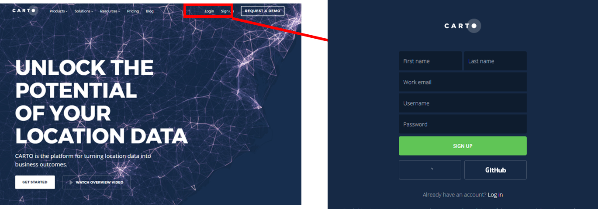
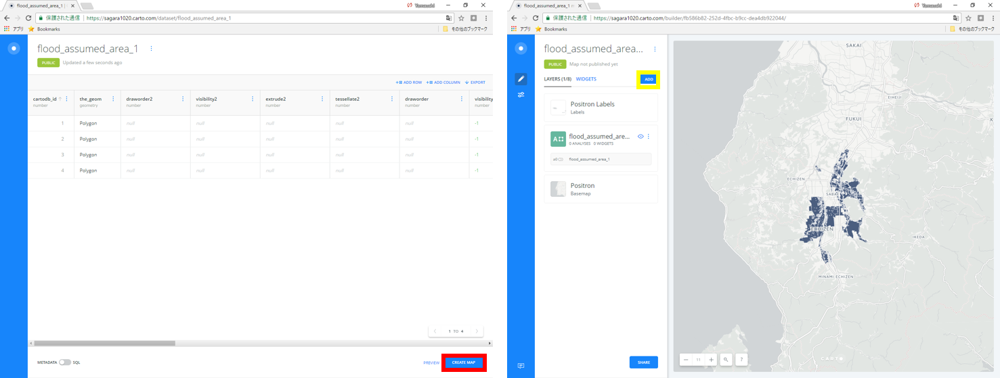
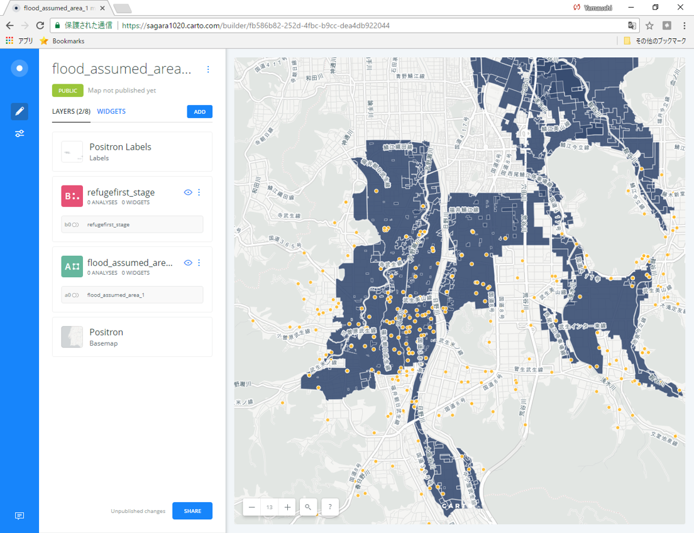
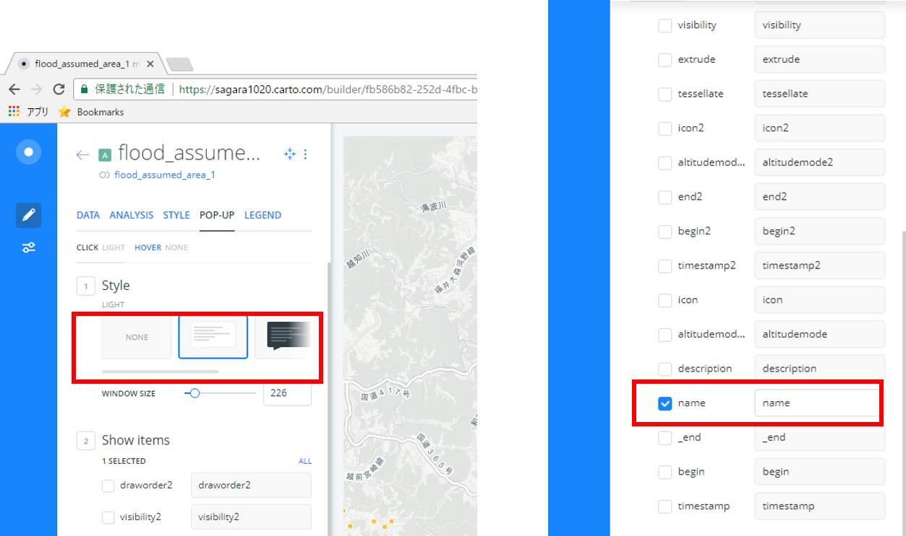
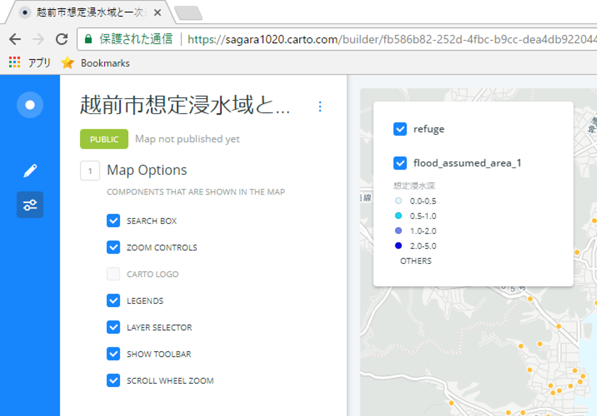
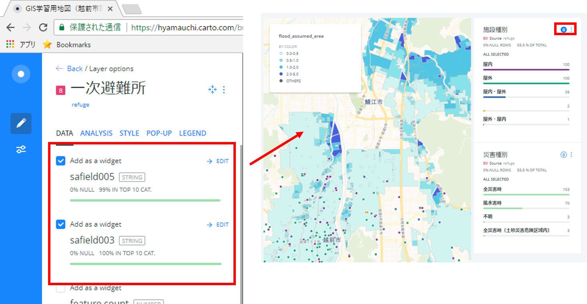
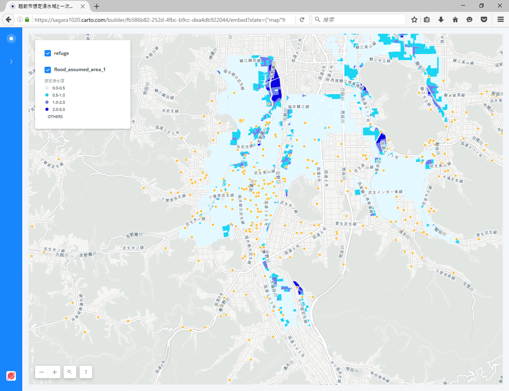

# CARTO入門
本教材は、[CARTO]を用いて空間データを表示する手法について解説しています。以下の教材を参考に[完成例](https://hyamauchi.carto.com/builder/3fceeb57-188b-4e9c-beca-1c05ad67bb71/embed)のような地図が作成できれば実習完了となります。CARTOは無償版のサービスが終了していますが、CartoのTHE MAP ACADEMYという学習向けのサイトが無償で利用できます。以下では、THE MAP ACADEMYの利用しています。

本教材を使用する際は、[利用規約]をご確認いただき、これらの条件に同意された場合にのみご利用下さい。

[利用規約]:../../../../../master/利用規約.md

**Menu**
------
* [CARTOとは？](#CARTOとは？)
* [アカウント取得](#アカウント取得)
* [データを読み込む](#データを読み込む)
* [NEWマップを作成する](#NEWマップを作成する)

**使用データ**

* [KMLサンプル](https://raw.githubusercontent.com/gis-oer/datasets/master/vector/kml/cesium/flood_assumed_area.kml)

* [CSVサンプル](https://raw.githubusercontent.com/gis-oer/datasets/master/text/carto/refuge.csv)

> [越前市オープンデータ] 越前市防災安全課　一次避難場所（風水害）、浸水想定区域（風水害）のデータを加工し、利用。

[越前市オープンデータ]:http://www.city.echizen.lg.jp/office/010/021/open-data-echizen.html

**スライド教材**

スライドのダウンロードは[こちら](../../../../../raw/master/GISオープン教材/インターネットの活用に関する教材/Carto/Carto.pptx)

--------

## CARTOとは？

- 地図データや地図を編集・共有できるWEBサービス
- データのインポートや表示が容易
- データの分析や視認性の高い視覚化がブラウザ上で可能
- 教育向けに、[THE MAP ACADEMY]というサイトが無償で利用できる

[▲メニューへもどる]

## アカウント取得
[THE MAP ACADEMY]にアクセスする、`SIGN UP`をクリックし、アカウント作成を行う。

[▲メニューへもどる]

## データを読み込む
`DATASETS`をクリックして、`dashboard`を開く。

`NEW DATASET`をクリックし、`BROWSE`からKMLファイルを選択し、データを読み込み、`CONNECT DATASET`をクリックする。

`Create MAP`をクリックし、地図を作成する。
`ADD NEW LAYER`のボタンで別のデータも追加できるため、一次避難所(CSV)のデータも表示する。`YOUR DATASETS`からタブを`CONNECT DATASET`に切り替えて、データを読み込む。

[▲メニューへもどる]

## NEWマップを作成する

各レイヤのスタイル、凡例などを調整し、公開用の地図を作成する。レイヤ名をクリックすると、表示設定や分析などの以下のような機能が利用できる。

|メニュー名|機能|
|---|---|
|DATA|属性値のグラフ化、WIDGETSの追加等|
|ANALYSIS|バッファ等のデータ分析|
|STYLE|レイヤスタイルの設定|
|POP-UP|ポップアップの設定|
|LEGEND|凡例の設定|

### 属性値による分類
`STYLE > COLOR > BY VALUE` を選択し、想定浸水深で色分けを行う。

### ポップアップの表示
想定浸水深のフィールドを選択し、ポッポアップで浸水深が表示されるようにする。

### 凡例の設定
`Legend`から、凡例の設定を行う。

### タイトルの変更とその他の設定
地図の名前を変更し、Optionsから地図表示の設定を行う。

### グラフの追加

DATA＞必要なレイヤを選択し、`EDIT`をクリックするとグラフが表示される。`Apply Auto Style`のボタンをクリックすると属性値に基づいてスタイルが切り替わる。

### SHAREリンクの作成
レイヤの設定が完了したら`SHARE`をクリックし、次のページで左上の`PUBLISH`をクリックする。
`Get the link` からURLをコピーし、ブラウザで検索する。

以下のように、ブラウザで地図が表示できる。

[▲メニューへもどる]

#### ライセンスに関する注意事項
本教材で利用しているキャプチャ画像の出典やクレジットについては、[その他のライセンスについて]よりご確認ください。

[その他のライセンスについて]:../../その他のライセンスについて.md
[▲メニューへもどる]:Carto.md#menu
[CARTO]:https://carto.com
[THE MAP ACADEMY]:https://carto.com/academy/
