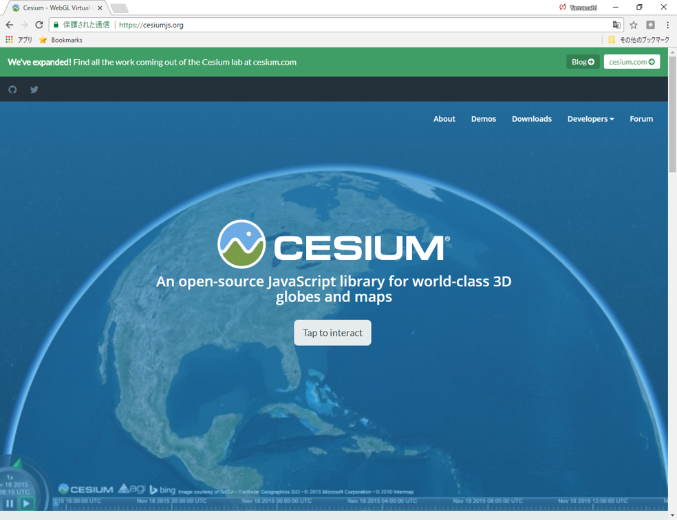
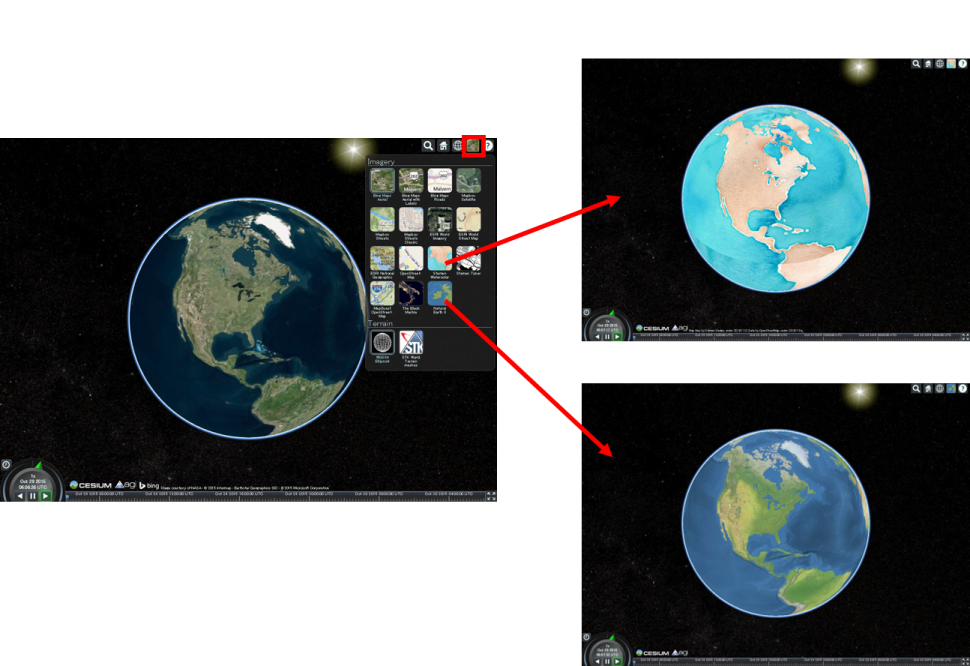
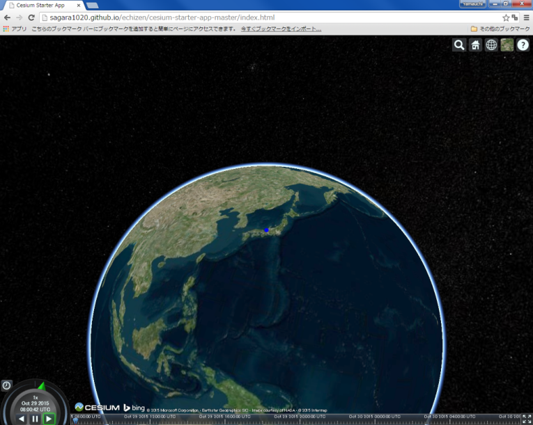
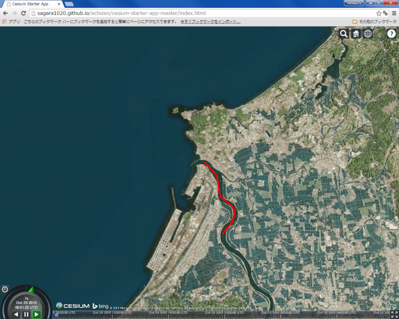
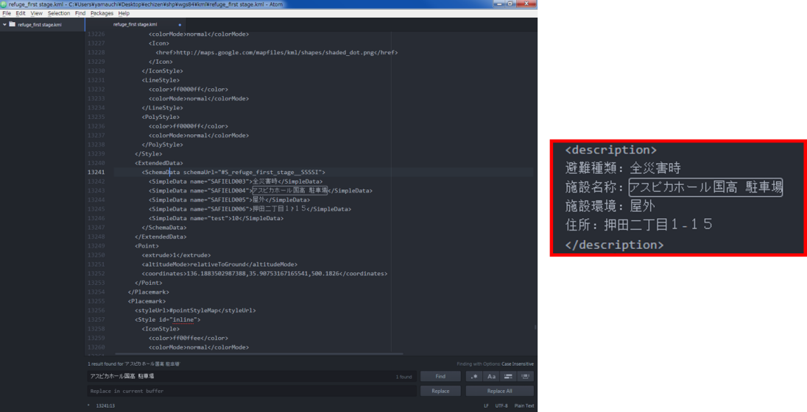
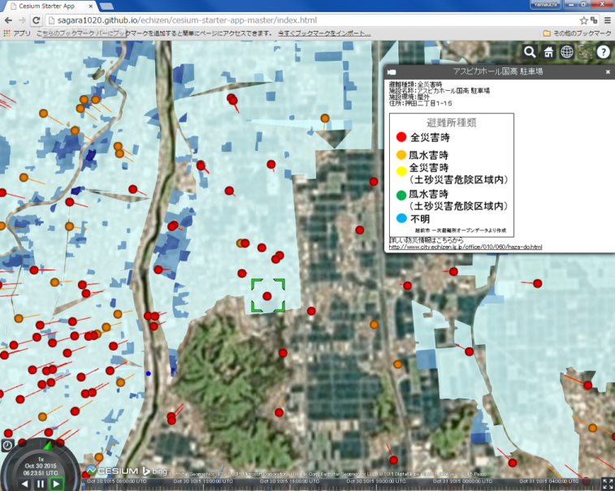

# Cesium入門
　本教材は、Cesiumを用いて空間データを表示する手法について解説しています。以下の教材に従って、[完成例](https://yamauchi-inochu.github.io/cesium-test/Apps/HelloWorld.html)のようなWEB地図が作成できれば実習完了です。Cesiumの表示は、GitHubとクライアントソフトを用いて行っています。GitHub等の操作法や基本的なプログラミングについての解説はしていません。CZMLについての解説は、[CZML]の教材を参照ください。本教材を使用する際は、[利用規約]をご確認いただき、これらの条件に同意された場合にのみご利用下さい。

[利用規約]:../../../../master/利用規約.md
[CZML]:../../インターネットの活用に関する教材/czml/czml.md

**Menu**
------
* [Cesiumとは](#Cesiumとは)
* [Cesiumを体験する](#Cesiumを体験する)
* [ダウンロード](#ダウンロード)
* [地図を表示する](#地図を表示する)
* [レイヤを追加する](#レイヤを追加する)
* [視点を変更する](#視点を変更する)
* [kmlの作成と読み込み](#kmlの作成と読み込み)

**使用データ**

* [KMLサンプル](https://github.com/gis-oer/datasets/blob/master/vector/kml/cesium/echizen_map.kmz?raw=true)

> [越前市オープンデータ] 越前市防災安全課　一次避難場所（風水害）、浸水想定区域（風水害）のデータを加工し、利用。

[越前市オープンデータ]:http://www.city.echizen.lg.jp/office/010/021/open-data-echizen.html

**スライド教材**

スライドのダウンロードは[こちら](../../../../../raw/master/GISオープン教材/インターネットの活用に関する教材/Cesium/Cesium.pptx)

--------

## Cesiumとは
- Cesium(Cesiumjs)はWebGLを用いたライブラリ
- 2Dだけでなく、3D表示ができる
- 球体のため、世界規模のデータの表示に適している
- 時系列データの表現も可能

[▲メニューへもどる]

## Cesiumを体験する
[Cesiumの公式サイト]をブラウザで開き、ページ下段のGet HelloWorld.jsの[PLAY WITH THIS CODE]クリックし、Cesiumを表示する。



右上のボタンから、複数BaseMapを選択することができる。


右上のボタンから、球体、平面、角度つき平面の３つで地球を表現できる。


[▲メニューへもどる]

## ダウンロード
Cesiumのホームページの`Downloads`をクリックし、ダウンロードする。


以下では、GitHubでリポジトリを作成して、ダウンロードしたCesiumをローカルからPushして、webで表示しています。Apps>HellowWord.htmlを参考に必要のないファイルを減らしてから、Pushするとスムーズです。下記のようにNodejsの環境下でローカルから実行することも可能です。外部のデータを読み込まずコードのテストのみ行う場合は、上記したトップページの[PLAY WITH THIS CODE]のページが便利です。

### GitHub
GitHubに新規のリポジトリを作成し、解凍したcesiumのフォルダをアップロードする。リポジトリのgh-pagesを設定し、インターネット上でダウンロードしたCesiumを表示する（下記のアドレスにアクセスする）。

```
http://（ユーザー名）.github.io/gis-oer_cesium/Apps/HelloWorld.html
```


### Nodejs
```
# ダウンロードしたファイルのあるディレクトリへ移動
$ cd ./desktop/downloadfile

# npmから、node_modulesを追加
$ npm install

# ローカルサーバを起動する
$ node server.js
```

[▲メニューへもどる]

## 地図を表示する
以下では、`Apps>HellowWord.html`を編集しながら、Cesiumの基本操作について解説しています。最初にダウンロードしたCesiumのフォルダを開き、Apps>HellowWord.htmlをテキストエディたで開く。以下のように、<body>内にCesiumを読み込むコードである`var viewer = new Cesium.Viewer('cesiumContainer');`があることを確認する。


```html
<body>
  <script>
    var viewer = new Cesium.Viewer('cesiumContainer');
  </script>
</body>
```

※デフォルトではBing Mapsが表示される。デフォルト地図は、しばらくたつと表示されなくなるため、長期で利用する場合は、Bing Maps API keyが必要となる。

### 機能のオン、オフ
Cesiumの基本機能は、以下のようにTrueとFalseで管理する。baseLayerPickerやhomeButtonなどは、デフォルトでオンになっている機能もある。

>詳しくは、Cesiumのドキュメント[(Viewerの項目)](https://cesiumjs.org/Cesium/Build/Documentation/Viewer.html)を参照。

```
var viewer = new Cesium.Viewer('cesiumContainer', {
  baseLayerPicker: true,
  timeline : false,
  animation : false,
  homeButton: false,
  vrButton: true,
  geocoder:false,
  sceneModePicker:false,
  navigationHelpButton:false
});

```

## レイヤを追加する
以下では、Cesiumに空間座標をもつデータを記述する手法について、'Apps>HellowWord.html'を編集しながら解説します。

### ポイントを追加する
以下のようにすると、ポイントの色や位置が設定できる。

```JavaScript
<script>
var viewer = new Cesium.Viewer('cesiumContainer');　

var point = viewer.entities.add({
      name:"福井市", //レイヤ名
      description:"ここは福井市です。",　//レイヤの説明
        position : Cesium.Cartesian3.fromDegrees(136.223554,36.061957,0), //経度,緯度,高さ
        point : {
            pixelSize : 10, //ポイントのサイズ
            color : Cesium.Color.BLUE //ポイントの色
        }
    });

    viewer.zoomTo(viewer.entities);　//レイヤにズーム
</script>
```

青い円形のポイントが、越前市のあたりに追加された。



### ラインを追加する
ポイントの追加を参考に、以下のようにするとラインが作成できる。

```JavaScript
var viewer = new Cesium.Viewer('cesiumContainer');

var redLine = viewer.entities.add({
    name:"九頭竜川",
    description:"ここは九頭竜川です。",　
    polyline : {
        positions : Cesium.Cartesian3.fromDegreesArrayHeights([136.137600,36.218795,0,
          136.146183,36.210070,0,
          136.147385,36.197465,0,
          136.155109,36.191923,0,
          136.157513,36.188183,0,
          136.154938,36.182364,0,
          136.146870,36.175574,0]),
        width : 5,
        material : Cesium.Color.RED,
    }
});

viewer.zoomTo(viewer.entities);

```




### ポリゴンを追加する
ポイントの追加を参考に、以下のようにするとポリゴンが作成できる。

```JavaScript
var polygon = viewer.entities.add({
    name:"福井県庁",
    description:"ここは福井県庁です。",　
    polygon : {
        hierarchy : Cesium.Cartesian3.fromDegreesArrayHeights([
          136.220266, 36.066095,0,
          136.220287, 36.063848,0,
          136.221542, 36.063857,0,
          136.222444, 36.063978,0,
          136.222529, 36.064239,0,
          136.223495, 36.064516,0,
          136.223238, 36.065704,0,
          136.223034, 36.065722,0,
          136.222948, 36.066190,0,
          136.222315, 36.066138,0,
          136.221435,36.066216,0]),
        extrudedHeight: 333.0,
        width : 5,
        material : Cesium.Color.RED.withAlpha(0.5),
        outline : true,
        outlineColor : Cesium.Color.BLACK
    }
});
```


[▲メニューへもどる]


## 視点を変更する
ビューワーの視点を変更するコードを追加（経度、緯度、視点の高さを入力する）し、再読み込みを行うと視点が変更される。

```JavaScript
viewer.camera.flyTo({   
     destination : Cesium.Cartesian3.fromDegrees(136.194763, 36.047711, 45000.0)});
```


[▲メニューへもどる]


## KMLの作成と読み込み
以下では、KML(KMZ)を作成し、Cesiumで表示する手法について解説しています。KMZの作成は、GoogleEarthで行っています。

### Google EarthでKMLを作成
1. Google Earth proでシェープファイルを読み込む。
ファイル＞開く　（想定浸水区域と一次避難所のshape）

2. 取得したアイテムにスタイルテンプレートを適用（スタイルを調整）。
名前を指定する：「名前フィールド」を設定する。
色を指定する：「フィールドから色を設定する」を選択する。
設定ができたらOKをクリックし、テンプレートを保存する。

3. レイヤの上で右クリックし、プロパティから、ポリゴンの透過度を変更する。想定浸水区域のポリゴンと同じく、名前、色、アイコン、高さなどを設定する。

4. レイヤの上で右クリックし、追加→フォルダを選択し、フォルダ名を入力する。
フォルダーを移動して、フォルダの中にポリゴンとポイントのデータをまとめる。

### KML読み込み
作成したKMZファイルをKMLフォルダにまとめ、Cesiumのディレクトリに移動し、下記のように、HellowWord.htmlの一部を編集する。

```JavaScript
viewer.dataSources.add(Cesium.KmlDataSource.load("./KML/echizen_map.kmz"));
```


クライアントソフトを通してアップロードし、Webで確認すると↑のように表示される。しかし、ポイントをクリックしても、KMLの属性情報が反映さない。

### KMLの書き換え
GoogleEarthから、ポイントレイヤの上で右クリックし、名前をつけて場所を保存から新規にKML(KMZとしない)を保存する。

<BalloonStyle></BalloonStyle>を削除する（2箇所）。


<description></description>を右のように書き換える。



5. Google Earthからポイントレイヤの上で右クリックし、名前をつけて場所を保存から新規にKMLを保存する。

6. テキストエディタを開き、KMLを書き換える。

7. KMLをもう一度読み込み、表示を確認する。プロパティを開きその他の情報を追加する。

8. バルーンの設定:リンクを追加をクリックしURLを追加する（越前市の防災課）。
アイコンの設定：ラベルの縮尺を0.0にする。

9. 凡例画像を作成し、GitHubにアップロードし、Google Earthでレイヤのプロパティから、画像を追加する。
アップロードしたURLを指定すると、Cesiumで画像を表示できる。

凡例の画像は[ここをクリック](./pic/cesiumpic_hanrei.png)


Cesiumで表示すると、ポイントの情報が表示できる。


ポイントをクリックすると凡例も表示できるようになっている。


[▲メニューへもどる]


#### ライセンスに関する注意事項
本教材で利用しているキャプチャ画像の出典やクレジットについては、[その他のライセンスについて]よりご確認ください。

[その他のライセンスについて]:../../その他のライセンスについて.md
[▲メニューへもどる]:Cesiumによるデータの可視化.md#menu
[Cesiumの公式サイト]:http://cesiumjs.org
[PLAY WITH THIS CODE]:http://cesiumjs.org/Cesium/Apps/Sandcastle/index.html?src=Hello%20World.html&label=All
