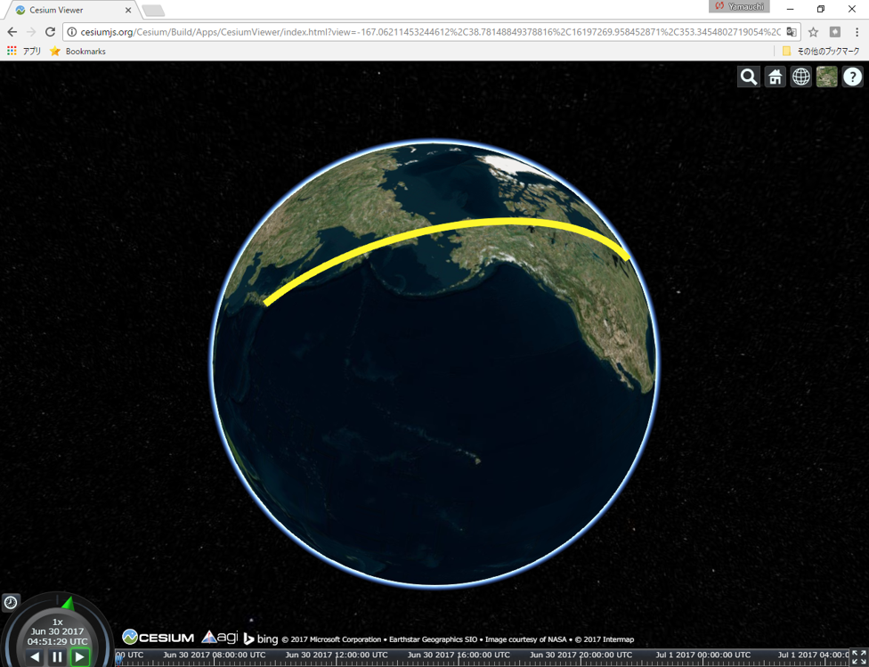
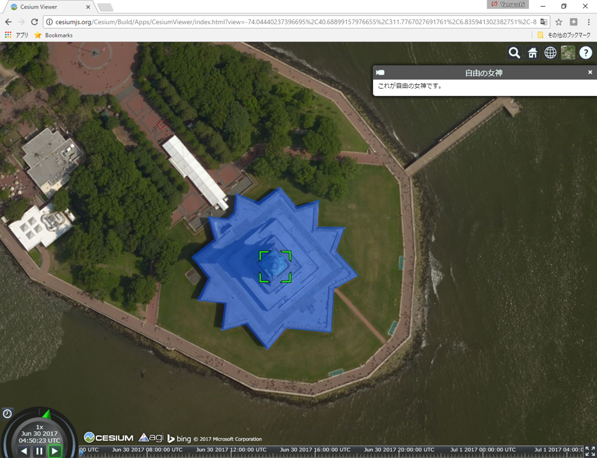

# KML入門
　以下では、主にGoogle EarthやCesiumで利用できるKMLデータ（点、線、面）の作成手法について解説します。GoogleEarhの基本的な操作法について、ある程度の理解のある方が対象になります。

本教材を使用する際は、[利用規約]をご確認いただき、これらの条件に同意された場合にのみご利用下さい。


[利用規約]:(../../../../master/利用規約.md)

**Menu**
------
* [KMLとは](#KMLとは)
* [ポイントの作成](#ポイントの作成)
* [ラインの作成](#ラインの作成)
* [ポリゴンの作成](#ポリゴンの作成)

## KMLとは
 KML(keyhole Markup language)は、3次元の地理空間情報を作成、表示する際に用いられます。Google Earth（旧名 Keyhole）などで、地理空間情報の多彩な表現が可能です。XMLで記述し作成されたファイルの拡張子は、.KMLとなります。また、ZIP形式で圧縮した.kmz(doc.KMLとそのファイルに関連するデータ)というファイルがあります。

[▲メニューへもどる]

## ポイントの作成
以下は、東京スカイツリーと東京タワーのポイント作成したものです。以下のテキストを保存(テキストをコピーし.KMLで保存)しGoogle EarthやCesiumで表示するとデータを見ることができます。以下を参考にオリジナルのポイントデータを作成に挑戦してください。


```XML

<?xml version="1.0" encoding="UTF-8"?>
<kml xmlns="http://www.opengis.net/kml/2.2">

<!--↑の文をコピーして貼り付ける-->

<!--↓KMLを記述していく-->
<Document>
	<name>東京スカイツリーと東京タワー</name> <!--データ名を記入-->
	<open>1</open>
	<StyleMap id="m_ylw-pushpin"><!--スタイルの指定先を記述-->
		<Pair>
			<key>normal</key><!--普段のスタイルの指定先を記述-->
			<styleUrl>#s_ylw-pushpin</styleUrl>
		</Pair>
		<Pair>
			<key>highlight</key><!--マウスオーバーしたときのスタイルの指定先を記述-->
			<styleUrl>#s_ylw-pushpin_hl</styleUrl>
		</Pair>
	</StyleMap>
	<Style id="s_ylw-pushpin_hl"><!--マウスオーバーしたときのアイコンのスタイルを記述-->
		<IconStyle>
			<scale>2</scale><!--アイコンの大きさ-->
			<Icon><!--アイコンURLを指定　以下を変更すれば、オリジナルのアイコンになる-->
				<href>http://maps.google.com/mapfiles/kml/pushpin/ylw-pushpin.png</href>
			</Icon>
			<hotSpot x="20" y="2" xunits="pixels" yunits="pixels"/><!--実際の地点とあうように位置をずらして表示-->
		</IconStyle>
		<LineStyle><!--アイコンにつなぐラインの色を指定-->
			<color>ff7faaff</color><!--オレンジ系の色を指定-->
		</LineStyle>
	</Style>
	<Style id="s_ylw-pushpin"><!--普段のアイコンのスタイルを記述-->
		<IconStyle>
			<scale>1.1</scale>
			<Icon>
				<href>http://maps.google.com/mapfiles/kml/pushpin/ylw-pushpin.png</href>
			</Icon>
			<hotSpot x="20" y="2" xunits="pixels" yunits="pixels"/>
		</IconStyle>
		<LineStyle>
			<color>ff7faaff</color>
		</LineStyle>
	</Style>
	<Placemark>
		<name>東京スカイツリー</name><!--データの名前-->
		<description>これは、東京スカイツリーです。</description><!--説明文(htmlで記述できる)-->
		<LookAt>
			<longitude>139.8105736546319</longitude><!--経度-->
			<latitude>35.70869047827442</latitude><!--緯度-->
			<altitude>0</altitude><!--標高-->
			<heading>0</heading><!--機首方位、北が0°-->
			<tilt>53.37</tilt><!--傾き-->
			<range>2164.7</range><!--範囲-->
			<gx:altitudeMode>relativeToSeaFloor</gx:altitudeMode><!--基準は海面とする-->
		</LookAt>
		<styleUrl>#m_ylw-pushpin</styleUrl>
		<Point>
			<extrude>1</extrude><!--ポイントの経緯度と標高を記述-->
			<altitudeMode>relativeToGround</altitudeMode><!--地面を基準にアイコンを配置-->
			<gx:drawOrder>1</gx:drawOrder>
			<coordinates>139.8107252956902,35.71002945292051,634</coordinates>
		</Point>
	</Placemark>
	<Placemark><!--一つのファイルに複数のPlace Markを作成する場合はこの下に記述-->
		<name>東京タワー</name><!--データの名前-->
		<description>これは、東京タワーです。</description>
		<LookAt>
			<longitude>139.745476</longitude><!--経度-->
			<latitude>35.658537</latitude><!--緯度-->
			<altitude>0</altitude><!--標高-->
			<heading>0</heading><!--機首方位、北が0°-->
			<tilt>53.37</tilt><!--傾き-->
			<range>2164.7</range><!--範囲-->
			<gx:altitudeMode>relativeToSeaFloor</gx:altitudeMode><!--基準は海面とする-->
		</LookAt>
		<styleUrl>#m_ylw-pushpin</styleUrl>
		<Point>
			<extrude>1</extrude><!--ポイントの経緯度と標高を記述-->
			<altitudeMode>relativeToGround</altitudeMode><!--地面を基準にアイコンを配置-->
			<gx:drawOrder>1</gx:drawOrder>
			<coordinates>139.745476,35.658537,333</coordinates>
		</Point>
	</Placemark>
</Document>
</kml>

```

上記で作成したデータは以下のように表示できます。※ [Cesium viewer]にドラッグアンドドロップして表示。


[▲メニューへもどる]

## ラインの作成
以下は、東京とニューヨークを結ぶラインを作成したものです。以下のテキストを保存(テキストをコピーし.KMLで保存)しGoogle EarthやCesiumで表示するとデータを見ることができます。以下を参考にオリジナルのラインデータを作成に挑戦してください。

```XML

<?xml version="1.0" encoding="UTF-8"?>
<kml xmlns="http://www.opengis.net/kml/2.2">
<Document>
	<name>東京-NY</name>
	<open>1</open>
	<Style id="line">
		<LineStyle><!--ラインのスタイルを指定-->
			<color>ff2EF7FE</color><!--最初の2桁80(50%透過)で透過を指定し、後ろの16進数のカラーで2桁ずつでそれぞれRGB(BGRの順)を示す。-->
			<width>10</width><!--ライン幅を指定-->
		</LineStyle>
	</Style>
	<Placemark>
		<name>tokyo-newyork</name>
		<description>東京とニューヨークをつなぐ線です。</description>
		<LookAt>
			<longitude>-152.8348568845707</longitude>
			<latitude>41.8452340473708</latitude>
			<altitude>0</altitude>
			<heading>10.89057864746075</heading>
			<tilt>1.507082189563618</tilt>
			<range>9465727.599999348</range>
			<gx:altitudeMode>relativeToSeaFloor</gx:altitudeMode>
		</LookAt>
		<styleUrl>#line</styleUrl><!--lineのidを使ってスタイリング-->
		<LineString><!--ラインを作成する。-->
			<tessellate>1</tessellate>
			<coordinates><!--ラインの頂点を作成する。-->
				139.7321,35.7085,0<!--経緯度と標高-->
				285.9941,40.7121,0
			</coordinates>
		</LineString>
	</Placemark>
</Document>
</kml>

```

上記で作成したデータは以下のように表示できます。※ [Cesium viewer]にドラッグアンドドロップして表示。



[▲メニューへもどる]

## ポリゴンのデータの作成
以下は、自由の女神周辺をトレースしポリゴンを作成したものです。以下のテキストを保存(テキストをコピーし.KMLで保存)しGoogle EarthやCesiumで表示するとデータを見ることができます。以下を参考にオリジナルのポリゴンデータを作成に挑戦してください。

```XML

<?xml version="1.0" encoding="UTF-8"?>
<kml xmlns="http://www.opengis.net/kml/2.2">
<Document>
	<name>自由の女神</name>
	<open>1</open>
	<Style id="polygon">
		<PolyStyle>
			<color>7fff5500</color>
			<outline>0</outline>
		</PolyStyle>
	</Style>
	<Placemark>
		<name>自由の女神</name>
		<description>これが自由の女神です。</description>
		<styleUrl>#polygon</styleUrl>
		<Polygon><!--ポリゴンを作成-->
			<tessellate>1</tessellate>
			<altitudeMode>relativeToGround</altitudeMode>
			<outerBoundaryIs>
				<LinearRing>
					<coordinates><!--ポリゴンの頂点を作成、経緯度標高の順で指定-->
					-74.04499752154071,40.6892150948117,10 -74.04508902345016,40.68910500277669,10 -74.04490260924321,40.6890712241014,10 -74.0449452584661,40.68893225527901,10 -74.04477238706467,40.68895047011316,10 -74.04464566372177,40.68880536249563,10 -74.04450250063262,40.68890404524074,10 -74.04419793103934,40.68885309495814,10 -74.04413961652038,40.68907601900729,10 -74.04396055940559,40.68913292018742,10 -74.04409031001904,40.68927640684932,10 -74.04400857576606,40.68939908454744,10 -74.04420075240583,40.6894184734436,10 -74.04416169767181,40.68956379739579,10 -74.04432500067969,40.68953810849519,10 -74.0444281044832,40.68966015661734,10 -74.04459322088222,40.68959044901225,10 -74.04474235627428,40.68965401293135,10 -74.04477271590068,40.68955008337813,10 -74.04482177267657,40.68952193819843,10 -74.04495797510631,40.68954520507073,10 -74.0449279538866,40.68941648207719,10 -74.04509679444885,40.68933795131525,10 -74.04499752154071,40.6892150948117,10 <!--始点と同じ経緯度標高-->
					</coordinates>
				</LinearRing>
			</outerBoundaryIs>
		</Polygon>
	</Placemark>
</Document>
</kml>

```

上記で作成したデータは以下のように表示できます。※ [Cesium viewer]にドラッグアンドドロップして表示。



[▲メニューへもどる]

#### ライセンスに関する注意事項
本教材で利用しているキャプチャ画像の出典やクレジットについては、[その他のライセンスについて]よりご確認ください。

[その他のライセンスについて]:../../その他のライセンスについて.md
[▲メニューへもどる]:地理院地図の活用.md#menu
[Cesium viewer]:http://cesiumjs.org/Cesium/Build/Apps/CesiumViewer/index.html
