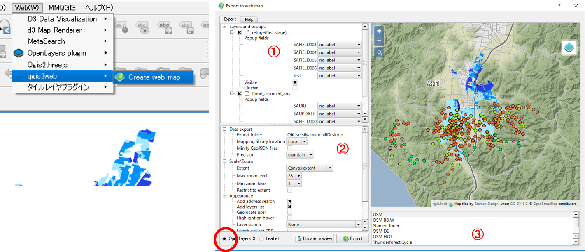

# OpenLayers入門
本教材は、QGISのプラグインであるQGIS2WEBを用いて、OpenLayers3でWEB地図を作成するための実習用教材です。以下の教材に従って、[完成例](https://yamauchi-inochu.github.io/ol3-test/index.html)のようなWEB地図が作成できれば実習完了です。この実習には、Atom等のテキストエディタが必要です。

本教材を使用する際は、[利用規約]をご確認いただき、これらの条件に同意された場合にのみご利用下さい。


[利用規約]:../../../../master/利用規約.md

**Menu**
------
* [OpenLayersとは？](#OpenLayersとは)
* [レイヤのスタイル調整とプラグインのインポート](#レイヤのスタイル調整とプラグインのインポート)
* [qgis2webを起動する](#qgis2leafを起動する)
* [index.htmlを編集する](#index.htmlを編集する)

**使用データ**

* [越前市オープンデータ] 越前市防災安全課　一次避難場所（風水害）、浸水想定区域（風水害）のデータを加工し、利用。

[越前市オープンデータ]:http://www.city.echizen.lg.jp/office/010/021/open-data-echizen.html

**スライド教材**

スライドのダウンロードは[こちら](../../../../../raw/master/GISオープン教材/インターネットの活用に関する教材/Leaflet/eaflet.pptx)

---

## OpenLayersとは？
OpenLayersは、簡単にダイナミックなWEB地図を作ることができるオープンソースのJavaScriptライブラリです。Leafletと同様に、地図操作やベクトルレイヤ、タイルの読み込みなど様々な地図表現が可能です。OpenLayersに関する詳しい解説は、以下のリンクを参照してください。

> [OpenLayers公式](http://openlayers.org/)
> [wikipedia](https://ja.wikipedia.org/wiki/OpenLayers)
> [株式会社エヌ・シーエム OpenLayers](http://www.ncm-git.co.jp/pr/brain/experience/openlayers.html)

## レイヤのスタイル調整とプラグインのインポート
QGISに実習用データを読み込み、スタイルを調整する。次に、プラグインの管理とインストールから、「QGIS2WEB」を検索し、インストールする。


[▲メニューへもどる]

## qgis2webを起動する
`Web(W)>qgis2web`をクリックする。以下のような設定を行い、`Update preview`をした後、`Export`をクリックする。


①　レイヤをクリックしたときのポップアップの設定を行う。②　ズームレベルや計測機能などを設定する。ここで、ファイルの出力先を変更しておくと良い。　③　Basemapを選択する（複数選択は、 Ctrlキーを押しながら行う）

ローカルで、index.htmlファイルを開き中身を確認する。


[▲メニューへもどる]

## index.htmlを編集する
以下では、エクスポートしたindex.htmlを編集し、凡例の日本語化、Basemapの追加、レイヤの透過手法について解説しています。各機能の詳しい解説は、[完成例](https://yamauchi-inochu.github.io/ol3-test/index.html)のコードを参考にしてください。

### 凡例の変更(地図の切り替えウィンドウ)
layer.jsをテキストエディタで開き、//の個所を書き換える

```JavaScript
var lyr_flood_assumed_area = new ol.layer.Vector({
                source:jsonSource_flood_assumed_area,
                style: style_flood_assumed_area,
                title: "想定浸水区域"
            });var format_refugefirststage = new ol.format.GeoJSON();
var features_refugefirststage = format_refugefirststage.readFeatures(geojson_refugefirststage,
            {dataProjection: 'EPSG:4326', featureProjection: 'EPSG:3857'});
var jsonSource_refugefirststage = new ol.source.Vector();
jsonSource_refugefirststage.addFeatures(features_refugefirststage);var lyr_refugefirststage = new ol.layer.Vector({
                source:jsonSource_refugefirststage,
                style: style_refugefirststage,
                title: "一次避難所"
            });
```

### ポップアップの編集
layersフォルダにあるlayers.jsを開き、テキストエディタの置換機能を用いて、フィールド名を日本語にする。`no label`を `inline label`に書き換える。

```JavaScript
lyr_flood_assumed_area.set('fieldLabels', {'SAUID': 'inline label', 'SAUPDATE': 'inline label', 'SAFIELD000': 'inline label', 'SAFIELD001': 'inline label', });
lyr_refugefirststage.set('fieldLabels', {'SAFIELD003': 'inline label', 'SAFIELD004': 'inline label', 'SAFIELD005': 'inline label', 'SAFIELD006': 'inline label', 'test': 'inline label', });
```


### ベースマップの追加
var baseLayerに地理院地図を追加する。

```JavaScript
var baseLayer = new ol.layer.Group({
    'title': 'Base maps',
    layers: [

  new ol.layer.Tile({
      'title': 'OSM',
      'type': 'base',
      source: new ol.source.OSM()
  }),
  new ol.layer.Tile({
      'title': 'Stamen Terrain',
      'type': 'base',
      source: new ol.source.Stamen({
          layer: 'terrain'
      })
  }),//以下を追加

  new ol.layer.Tile({
    'title': '地理院地図',
    'type': 'base',
              source: new ol.source.XYZ({
                attributions: [attribution],
                url: 'http://cyberjapandata.gsi.go.jp/xyz/std/{z}/{x}/{y}.png'
              })
            })
  ]
});
```

### ポリゴンを透過する
stylesフォルダのflood_assumed_area_style.jsを開き、透過‘1.0’を0.7に変更する。

```JavaScript
var size = 0;function categories_flood_assumed_area(feature, value) {
                 switch(value) {case "0.0-0.5":
	return [ new ol.style.Style({
         fill: new ol.style.Fill({color: ‘rgba(161,231,253,0.7)’}) //1.0から0.7にする
    })];  //以下、省略


```

### 表示の確認
index.htmlをブラウザで開き、編集内容を確認する。


[▲メニューへもどる]

#### ライセンスに関する注意事項
本教材で利用しているキャプチャ画像の出典やクレジットについては、[その他のライセンスについて]よりご確認ください。

[その他のライセンスについて]:../../その他のライセンスについて.md
[▲メニューへもどる]:QGISとLeafletの連携.md#menu
