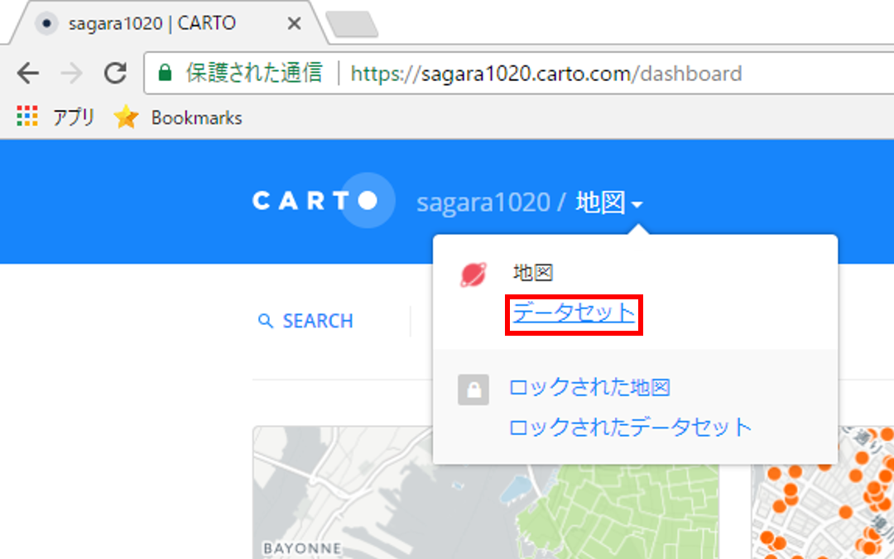
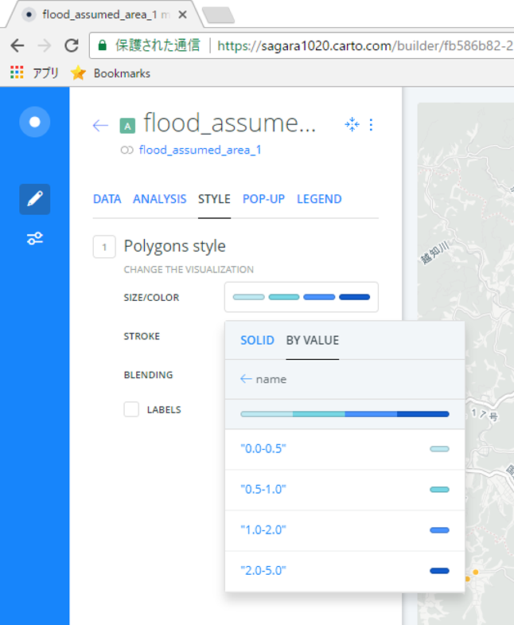

# Carto入門
本教材は、Cartoを用いて空間データを表示する手法について解説しています。Cartoを用いて[完成例](https://sagara1020.carto.com/builder/fb586b82-252d-4fbc-b9cc-dea4db922044/embed)のような地図が表示できれば実習完了となります。

本教材を使用する際は、[利用規約]をご確認いただき、これらの条件に同意された場合にのみご利用下さい。

[利用規約]:../../../../../master/利用規約.md

**Menu**
------
* [CartoDBとは？](#CartoDBとは？)
* [アカウント取得](#アカウント取得)
* [データを読み込む](#データを読み込む)
* [NEWマップを作成する](#NEWマップを作成する)

**使用データ**

* [KMLサンプル](https://github.com/gis-oer/datasets/blob/master/vector/kml/cesium/flood_assumed_area.kml?raw=true)

* [CSVサンプル](https://github.com/gis-oer/datasets/blob/master/text/carto/refuge.csv?raw=true)

> [越前市オープンデータ] 越前市防災安全課　一次避難場所（風水害）、浸水想定区域（風水害）のデータを加工し、利用。

[越前市オープンデータ]:http://www.city.echizen.lg.jp/office/010/021/open-data-echizen.html

**スライド教材**

スライドのダウンロードは[こちら](../../../../../raw/master/GISオープン教材/インターネットの活用に関する教材/Carto/Carto.pptx)

--------

## Cartoとは？

- 地図データや地図を編集・共有できるサービス
- データのインポート・表示が簡単にできる
- SQLによるデータの分析がブラウザ上で可能
- 時系列データのなど表現が多様

[▲メニューへもどる]

## アカウント取得
[CartoDBの公式サイト]にアクセスする、`SIGN UP`をクリックし、アカウント作成を行う。

[▲メニューへもどる]

## データを読み込む
`DATASETS`をクリックして、`dashboard`を開く。

`NEW DATASET`をクリックし、Drag & drop か　`BROWSE`からファイルを選択し、データを読み込む。

`Create MAP`をクリックし、地図を作成する。
黄色枠(Add)のボタンで別のデータを追加できるため、一次避難所のデータも表示する。

[▲メニューへもどる]

## NEWマップを作成する

MAPが表示できたので、各レイヤのスタイル、凡例などを変更する。

### 属性値による分類
`STYLE > SIZE/COLOR > BY VALUE` を選択し、想定浸水深で色分けを行う。

### ポップアップの表示
想定浸水深のフィールドを選択し、ポッポアップで浸水深が表示されるようにする。

### 凡例の設定
`Legend`から、凡例の設定を行う。

### レイヤのフィルター表示
フィルターをかけ、表示するレイヤを設定することができる。

### タイトルの変更とその他の設定
地図の名前を変更し、Optionsから地図表示の設定を行う。

### SHAREリンクの作成

レイヤの設定が完了したら`SHARE`をクリックし、次のページで左上の`PUBLISH`をクリックする。
`Get the link` からURLをコピーし、ブラウザで検索する。

以下のように、ブラウザで地図が表示できる。

[▲メニューへもどる]

#### ライセンスに関する注意事項
本教材で利用しているキャプチャ画像の出典やクレジットについては、[その他のライセンスについて]よりご確認ください。

[その他のライセンスについて]:../../その他のライセンスについて.md
[▲メニューへもどる]:CartoDBでWebMAPを作成.md#menu
[CartoDBの公式サイト]:https://cartodb.com
