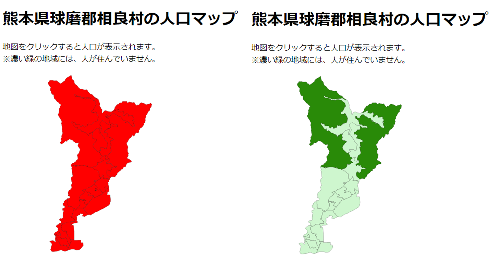
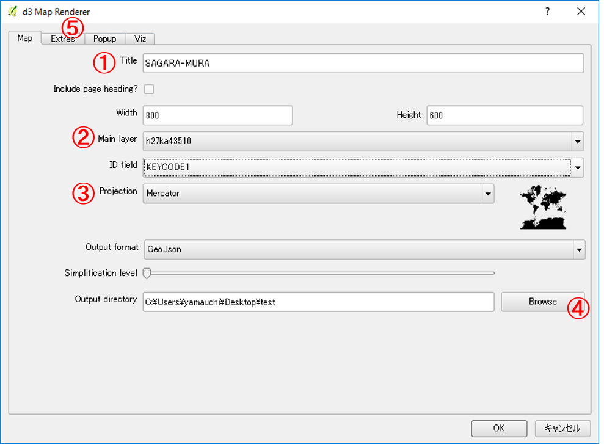

# D3.js入門

この教材は、D3.jsを用いてGISデータをビジュアライズし、WEB上に表示する初歩的な手法について解説しています。QGISと連携してデータを作成するため、QGISの基本操作やJavaScriptについて理解のある方を対象とします。QGISで簡単にファイルを出力したい方は、QGISで作成の項目を読み進めてください。


本教材を使用する際は、[利用規約]をご確認いただき、これらの条件に同意された場合にのみご利用下さい。


[利用規約]:(../../../../master/利用規約.md)


**Menu**
------
* [D3.jsとは](#D3.jsとは)
* [人口表示アプリの作成](#人口表示アプリの作成)
* [GeoJSONの出力](#GeoJSONの出力)
* [D3.jsの機能](#D3.jsの機能)
* [コードの記述](#コードの記述)
* [QGISで作成](#QGISで作成)
* [書籍の紹介](#書籍の紹介)

## D3.jsとは

[▲メニューへもどる]

## 人口表示アプリの作成
以下では、D3.jsの利用例として、地図をクリックすると人口が表示されるアプリケーションを作成する手法について解説しています。

※　解説では[e-stat]からダウンロードした熊本県球磨郡相良村の世界測地系のシェープファイルを使用しています。

[▲メニューへもどる]

## GeoJSONの出力
GeoJSON形式のデータをD3.jsで読み込むため、QGISでデータ変換を行う。データを読み込み名前を付けて保存からGeoJSONを選択し、地理座標系で出力する。

[▲メニューへもどる]

## D3.jsの機能


[▲メニューへもどる]

## コードの記述
testフォルダの中に、index.htmlとGeoJSONを入れたdataファイルを作成する。そのあとで、.geoJSONの拡張子を.JSONに変更しておく。また、index.htmlの表示にはローカルサーバーを立ち上げる必要がある。

### プラグインと地図表示
以下のようにindex.htmlを記述する。

```html
<!DOCTYPE html>
  <head>
    <meta charset="utf8">
    <title>D3.jsの練習</title>
    <script src="http://d3js.org/d3.v3.min.js" charset="utf8"></script> //D3.jsの呼び出し
    <script src="https://d3js.org/d3-geo-projection.v2.min.js"></script> //地図表示のためのプラグインの呼び出し
    <style>
    svg{width:700px; height:700px; border:1px; background-color: white; text-align: left;}
    path{fill:white; stroke:black; stroke-width:0.25;}
    h1,p {text-align: left;}
    </style>
  </head>
  <body>
    <h1>熊本県球磨郡相良村の人口マップ</h1>
      <p>地図をクリックすると人口が表示されます。<br>※濃い緑の地域には、人が住んでいません。</p>
    <svg id ="myGraph"></svg>
    <script>
     var w = 500;
     var l = 500;
     var path = d3.geo.path()
      .projection(d3.geo.mercator()
        .center([131.00,32.26])
        .scale(100000)
    )

    d3.json("./data/s2.json",function(error, pref){
      d3.select("#myGraph")
        .selectAll("path")
        .data(pref.features)
        .enter()
        .append("path")
        .attr("d",path)
    });

    </script>
  </body>
</html>
```
上記のように記述すると以下のようになる。


### 単色塗りと値による塗り分け

```JavaScript
d3.json("./data/s2.json",function(error, pref){
  d3.select("#myGraph")
    .selectAll("path")
    .data(pref.features)
    .enter()
    .append("path")
    .attr("d",path)
    .style("fill","red") //styleの記述を追加し単色で地図を塗りつぶす
});

```

```JavaScript
//.styleの記述を変更し、人口の値によって配色をかえる。ここでは、人口0の場合を緑とし、それ以外を薄い緑とした。
.style("fill",function(d,i){
    if(d.properties.JINKO=="0"){
      return "#298A08";
    }
    return "#CEF6CE";
  })
```

上記のように記述すると以下のようになる。


### 人口を表示する機能を追加
.styleの下に以下を記述し、alertでクリックした地点の大字名と人口を表示する。

```JavaScript
.on('click', function(d){
    alert(d.properties.MOJI+"の人口は"+d.properties.JINKO+"人です。")
})
```

### マウスオーバーとアウトの機能を追加する。

```JavaScript
.on('mouseover', function(){
  d3.select(this)
  .style("fill","yellow")
})
.on("mouseout", function(d,i){
d3.select(this)
  .style("fill",function(d,i){
    if(d.properties.JINKO=="0"){
      return "#298A08";
    }
    return "#CEF6CE";
  })
})
```

### 表示例とサンプルコード
上記のように記述していくと、以下のようにindex.htmlを表示できます。


[コード全体を表示](./sample.html)

[▲メニューへもどる]

## QGISで作成
QGISには、D3.jsを使って簡単に地図アプリケーションを作成できるプラグインがあります。以下では、d3 Map Rendererを用いて、ベースファイルを出力する手法と出力したファイルの編集手法について解説します。

### d3 Map Rendereとベースファイルの作成
ダウンロードしたシェープファイルを読み込んで、QGISで表示する。プラグイン＞プラグインの管理とインストールから、d3 Map Rendererをインストールする（表示されない場合は、設定＞実験的プラグインも表示するにチェックをつける）。


WEB(W)＞d3 Mapをクリックし、パラメータを指定する。


①　任意のタイトルを入力する。
②　入力したレイヤを指定する。
③　ProjectionをMercatorにする。
④　出力するフォルダを指定する。
⑤　次のタブをクリックする。


⑥　Allow zoom and panにチェックをする。
⑦　Include a legendにチェックをする。
⑧　次のタブをクリックする。


⑨　Include information popup にチェックをする。
⑩　ポップアップで表示したい項目（人口、面積、大字名等）にチェックをする。
⑪　OKをクリックする。


ローカルサーバーを立ち上げ、出力したindex.htmlを開くと作成したファイルが表示される。


### ベースファイルの編集
以下では、出力したベースファイルの編集手法について、人口で表示を変える場合を例として、解説しています。

#### 属性値と対応した配色の変更
出力時に凡例を整えて出力している場合は、この項目を読み飛ばしてください。今回は人口ありのエリアとなしのエリアで色を変えて出力します。人口ありとなしのエリアの色をつけるため、css>color.cssを開き.10r1を追加する。

```css

.l0r1 { stroke: #000000; stroke-width: 0.26; stroke-opacity: 1.0; stroke-dasharray: ; fill: #0094f6; fill-opacity: 1.0; }

```

jsonファイルを開き、510001019以外を10r0から10r1にかえる。テキストエディタで、10r0を10r1に置換してから、510001019を検索し10r1から10r0にする。

```json
{ "type": "Feature", "properties": { "KEYCODE1": "510003012", "d3Css": "l0r1" }, "geometry": { "type": "Polygon", "coordinates": [ [ [ 130.8038044790141, 32.233847444567672 ]]]}}

//コードは省略しています。
```


#### 凡例の修正
凡例が表示されない場合は、data>legend.cssを開き以下のよう編集にする。

```csv
Width,Height,Color,Text
20,20,l0r0,相良村人口なしエリア
20,20,l0r1,相良村人口ありエリア
```

#### 属性を日本語にする
属性名が日本語になっていないため、以下のように編集し日本語にする。

```html

<div id="template" style="display: none">
  <!--Tooltip template-->
<table>
<tr><td>面積</td><td>{AREA}</td></tr>
<tr><td>人口</td><td>{JINKO}</td></tr>
<tr><td>市町村</td><td>{CSS_NAME}</td></tr>
<tr><td>大字</td><td>{MOJI}</td></tr>
</table>
</div>

```

#### 編集したファイルの表示
上記の箇所を編集すると下記のように表示できます。


[▲メニューへもどる]

## 書籍の紹介
この教材は、以下の書籍を参考に作成しました。
- 古籏一浩(2014)『データビジュアライゼーションのためのD3.js徹底入門』SBクリエイティブ


[▲メニューへもどる]

[▲メニューへもどる]:地理院地図の活用.md#menu
[e-stat]:https://www.e-stat.go.jp/SG1/estat/eStatTopPortal.do
