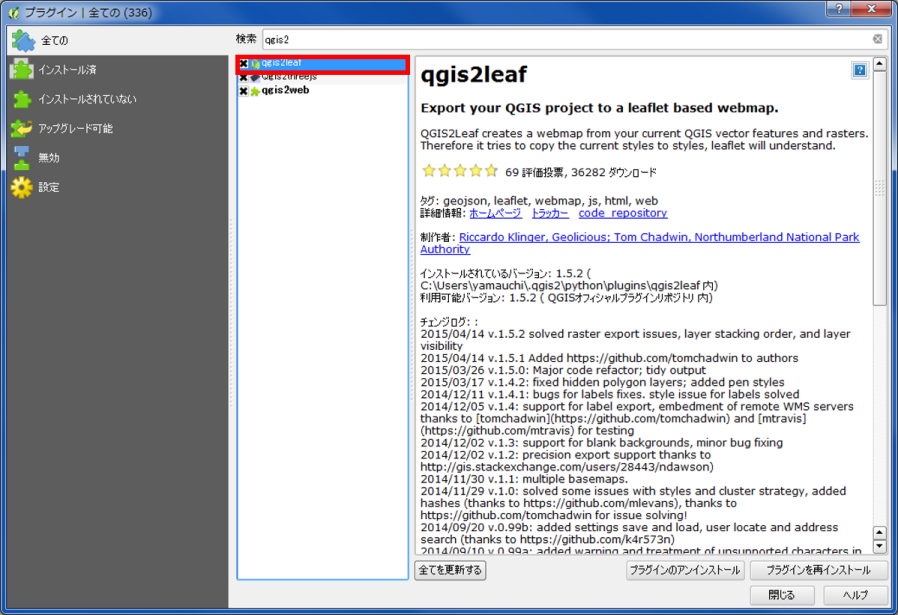
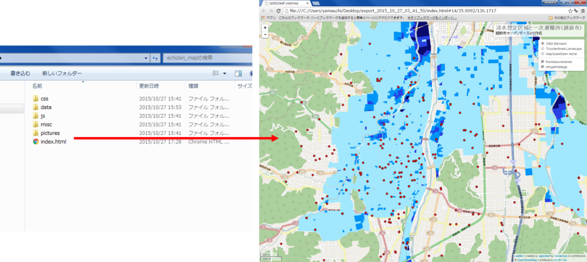

# QGISとLeafletの連携
本教材は、QGISとLeafletを用いてWEB地図を公開するための実習用教材です。QGISでデータを読み込み、プラグインからLeafletを用いてWEB地図を作成します。ローカルでデータを整えた後に、GitHubによるWEB地図の公開を行います。
講義用教材として、[地理情報科学教育用スライド（GIScスライド）]の4章が参考になります。

本教材を使用する際は、[利用規約]をご確認いただき、これらの条件に同意された場合にのみご利用下さい。


[利用規約]:../../../../master/利用規約.md
**Menu**
------
* [利用するデータをダウンロードする](#利用するデータをダウンロードする)
* [QGISでスタイルを調整する](#QGISでスタイルを調整する)
* [プラグインを読み込む](#プラグインを読み込む)
* [qgis2leafを起動する](#qgis2leafを起動する)
* [index.htmlを編集する](#index.htmlを編集する)
* [GitHubでwebにアップロードする](#GitHubでwebにアップロードする)

**使用データ**

* [越前市オープンデータ] 越前市防災安全課　一次避難場所（風水害）、浸水想定区域（風水害）のデータを加工し、利用。

[越前市オープンデータ]:http://www.city.echizen.lg.jp/office/010/021/open-data-echizen.html

**スライド教材**
スライドのダウンロードは[こちら]
[こちら]:../../../../../raw/master/GISオープン教材/インターネットの活用に関する教材/QGISとLeafletの連携/QGISとLeafletの連携.pptx

----------

## 利用するデータをダウンロードする

越前市が公開している浸水想定区域と一次避難所のシェープファイルを[オープンデータ越前！]からダウンロードする。
[オープンデータ越前！]:浸水想定区域と一次避難所のシェープファイルをダウンロードする。

[▲メニューへもどる]
[▲メニューへもどる]:QGISとLeafletの連携.md#menu

## QGISでスタイルを調整する

ダウンロードしたファイルを読み込みスタイルを調整する。
※　想定浸水区域は、3つのファイルをマージ後、想定浸水深（SAFIELD001）でディゾルブしておく

[▲メニューへもどる]

## プラグインを読み込む
プラグインの管理とインストールから、「GQIS2Leaf」を検索し、インストールする。


[▲メニューへもどる]

## QGIS2Leafを起動する

`Web(W)>qgis2leaf>Exports a QGIS Project to a working leaflet webmap`
① Get Layers をクリックしてレイヤを追加する。
② Basemapを選択する（複数選択できる）。
③ htmlを含んだファイルの出力先を指定する。
④ Webページのタイトル、マップのタイトル、マップのサブタイトルを入力する。
⑤ OK をクリックする。
※レイヤ名が日本語だとエラーがでる。


ローカルで、htmlファイルを開き中身を確認する。
Basemapの追加、レイヤの透過、凡例の日本語化など、マップを調整する。

[▲メニューへもどる]

## index.htmlを編集する

#### 凡例の変更

index.htmlをテキストエディタで開き、文を書き換える

#### ベースマップ（地理院地図）の追加

index.htmlを開き文を付け加える。


index.htmlを開き、編集内容を確認する。

#### ポリゴンを透過する

fillOpacity: ‘1.0’を0.7に変更し、weight:を0に変更する。
これにより、ある程度透過性を持っていて、境界線のないポリゴンが表示できる。

[▲メニューへもどる]

## GitHubでwebにアップロードする

リポジトリを作成後、ローカルにcloneする。
ローカルにcloneしたリポジトリ（フォルダ）に、QGIS2Leafで出力したフォルダを移動する。
クライアントソフトを起動し、Webにアップロードする。


アップロードしたファイルをブラウザで開くと、マップが表示される。

```
http://（ユーザー名）.github.io/echizen/echizen_map/index.html
```

[▲メニューへもどる]

**その他のライセンス**
本教材で利用しているキャプチャ画像の出典やクレジットについては、[その他のライセンスについて]よりご確認ください。
[その他のライセンスについて]:../../その他のライセンスについて.md
