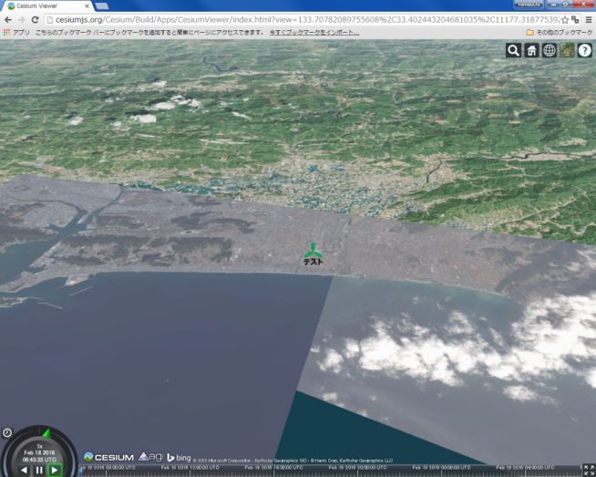

# CZML入門
本教材は、Cesiumで利用できるCZMLファイルの利用手法について解説したものです。Cesium viewerを用いて、データの表示、時間によるアニメーションなどを行います。
コードの解説は[スライド教材]を参照して下さい。

本教材を使用する際は、[利用規約]をご確認いただき、これらの条件に同意された場合にのみご利用下さい。

[スライド教材]:../../../../../raw/master/GISオープン教材/インターネットの活用に関する教材/czml入門/czml入門.pptx
[利用規約]:../../../../master/利用規約.md

**Menu**
-------
* [CZMLとは?](#CZMLとは?)
* [CZMLでポリゴンを表示する](#CZMLでポリゴンを表示する)
* [Cesiumで実装する](#Cesiumで実装する)
* [オリジナルのアイコンによるポイント表示](#オリジナルのアイコンによるポイント表示)
* [時間によるアイコンの移動](#時間によるアイコンの移動)

------
## <a name="CZMLとは?"></a>CZMLとは?

* CZMLは、Cesiumでデータを表現する際に利用できる。
* JSON形式を基本としているため、軽量。
* 時間の経過による地物変化を表現できる。
* 読み書きしやすく、コンパクトに記述できる。
* オープンフォーマット
* CZMLの活用や詳細については、GitHubで公開している。

> https://github.com/AnalyticalGraphicsInc/cesium/wiki/CZML-Guideを参考に作成

## <a name="CZMLでポリゴンを表示する"></a>CZMLでポリゴンを表示する
### 東京駅から半径25ｋｍ圏をCZMLで作成する
以下のコードをコピーし、テキストファイルを作成する。
拡張子を.czmlとして保存する。


```
[{
   "id" : "document",
   "name" : "CZML",
   "version" : "1.0"
 },
 {
   "id" : "shape1",
   "name" : "TOKYO",
   "position" : {
     "cartographicDegrees" : [139.77, 35.68, 20000.0]
   },
   "ellipse" : {
     "semiMinorAxis" : 50000.0,
     "semiMajorAxis" : 50000.0,
     "height" : 20000,
     "material" : {
       "solidColor" : {
         "color" : {
           "rgba" : [0, 255, 0, 100]
         }
       }
     },
     "outline" : true,
     "outlineColor" : {
       "rgba" : [255, 0, 0, 0]
     }
   }
 }]

```


[ビューワー]を開き.czmlをドラックアンドドロップする。
東京駅から25km圏が表示できた（高さを保持していることを確認しておく）。

[ビューワー]:http://cesiumjs.org/Cesium/Build/Apps/CesiumViewer/index.html

### 3Dポリゴンの作成

```
"extrudedHeight" : {
      "number" : 20000.0
    },
    "rotation" : {
      "number" : 0.8
    },
```

"height" : 20000,を削除し上のコードを追加する。


ビューワーを開き.czmlをドラックアンドドロップする。
3Dポリゴンが作図できたことを確認する。

## <a name="Cesiumで実装する"></a>Cesiumで実装する


```
var czml = [{
   "id" : "document",
   "name" : "CZML",
   "version" : "1.0"
 },
 {
   "id" : "shape1",
   "name" : "TOKYO",
   "position" : {
     "cartographicDegrees" : [139.77, 35.68, 20000.0]
   },
   "ellipse" : {
     "semiMinorAxis" : 50000.0,
     "semiMajorAxis" : 50000.0,
     "extrudedHeight" : {
       "number" : 20000.0
     },
     "rotation" : {
       "number" : 0.8
     },
     "material" : {
       "solidColor" : {
         "color" : {
           "rgba" : [0, 255, 0, 100]
         }
       }
     },
     "outline" : true,
     "outlineColor" : {
       "rgba" : [255, 0, 0, 0]
     }
   }
 }];
var viewer = new Cesium.Viewer('cesiumContainer');
viewer.dataSources.add(Cesium.CzmlDataSource.load(czml));
```
## オリジナルのアイコンによるポイント表示
PowerPointやペイントなどを利用し、図を作成する（拡張子は`.png` or `.jpg`）
サイズは200×200ピクセル程度で作成する。

作成した画像をGitHubなどでwebにあげておく。
画像のurlを取得する。
GitHubの場合は、RAWをクリックしURLをコピーする。

```
[{
    "id" : "document",
    "name" : "sample",
    "version" : "1.0"
  }, {
    "id" : "point",
    "name" : "名称を記述する",
    "description" : "ポイントの詳細を記述する。",
    "billboard" : {
      "image" : "コピーしたURLを貼り付ける",
      "scale" : 0.2
    },
    "label" : {
      "fillColor" : {
        "rgba" : [0, 0, 0, 255]
      },
      "font" : "12pt Lucida Console",
      "horizontalOrigin" : "CENTER",
      "outlineColor" : {
        "rgba":[0, 0, 0, 255]
      },
      "outlineWidth" : 1.2,
      "pixelOffset" : {
        "cartesian2" : [0, 25]
      },
      "style" : "FILL_AND_OUTLINE",
      "text" : "テスト"
    },
    "position" : {
      "cartographicDegrees": [
        133.672028,33.544614,200
      ] }}]
```
コードをコピーし必要な箇所(日本語の箇所)
を変更後、.czmlで保存する。


ビューワーを開き.czmlをドラックアンドドロップする。
作成したイメージが位置情報を持って表示されている。

## 時間によるアイコンの移動


.gpxファイルをQGISに、ドラックアンドドロップする。
「ベクタレイヤに名前をつけて保存する」から、CSVファイルで保存する。


.gpxファイルをQGISに、ドラックアンドドロップする。
「ベクタレイヤに名前をつけて保存する」から、CSVファイルで保存する。
A列に秒（何秒で移動するか）をC列に経度、E列に緯度、G列に標高を追加する。全体をコピーする。


ポイントの表示に使用したczmlファイルを開き、赤枠の箇所を追加する。


タイマーの速度を変更すると、アイコンの動く速度が変化する。

[▲メニューへもどる]
[▲メニューへもどる]:czml入門.md#menu

**その他のライセンス**
本教材で利用しているキャプチャ画像の出典やクレジットについては、[その他のライセンスについて]よりご確認ください。
[その他のライセンスについて]:../../その他のライセンスについて.md
