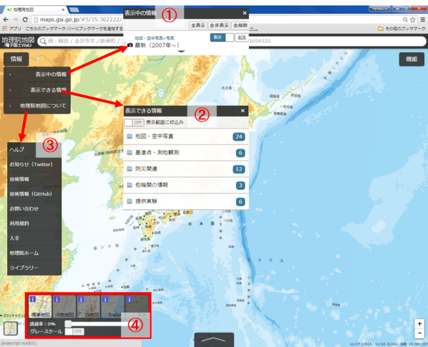

# 地理院地図の活用
本教材は、地理院地図を用いてインターネットによる地図データの作成や公開について解説しています。地理院地図の機能の解説や作図ツールを用いたデータ作成を行います。また、GitHubを用いた地理院地図の活用に関しても解説しています。

本教材を使用する際は、[利用規約]をご確認いただき、これらの条件に同意された場合にのみご利用下さい。

[利用規約]:(../../../../master/利用規約.md)

**Menu**
------
* [地理院地図とは?](#地理院地図とは?)
* [地理院地図の機能](#地理院地図の機能)
* [データを作成する](#データを作成する)

**スライド教材**
スライドのダウンロードは[こちら]
[こちら]:../../../../../raw/master/GISオープン教材/インターネットの活用に関する教材/地理院地図の活用/地理院地図の活用.pptx

--------

## 地理院地図とは?

- 国土地理院の地図、空中写真を閲覧できるサービス
- 基準点や土地条件図などの情報が公開されている
- 災害に関する情報の更新が早い
- 様々な地図、空中写真をタイルで配信している
- GitHubでソースコードが公開されている

[▲メニューへもどる]
[▲メニューへもどる]:地理院地図の活用.md#menu

## 地理院地図の機能
[地理院地図]を開く。
[地理院地図]:http://maps.gsi.go.jp

上の検索から、住所や緯度経度の検索ができる。
下のボックスに中央カーソルの緯度経度や標高が表示される。

① 表示中の情報：
現在表示しているレイヤの詳細などを確認できる。
② 表示できる情報：
空中写真や基準点など表示できるレイヤを選択できる。
③ 地理院地図について：
ヘルプ、利用規約、お知らせなどが確認できる。
④ベースマップの選択や透過率が選択できる。

① 表示：
地図画面に表示されるカーソルなどを設定できる。
② ツール：
ベクトルデータの作成や計測などができる。
③ 3D：
3D表示ができる。データは、3Dプリンター用のファイルでダウンロードできる。

[▲メニューへもどる]

## データを作成する

ポイントの作成ボタンをクリックし、任意の点をクリックする。ポイントの情報を入力し、確定をクリックする。

ラインの作成ボタンをクリックし、任意の点をクリックする。ラインの情報を入力し、確定をクリックする。

ポリゴンの作成ボタンをクリックし、任意の点をクリックする。ポリゴンの情報を入力し、確定をクリックする。

### データを保存する

保存ボタンをクリックし、データ形式を選択しデータをダウンロードする。

### データを表示する
QGISでGeoJSONを表示する。

[▲メニューへもどる]

**その他のライセンス**
本教材で利用しているキャプチャ画像の出典やクレジットについては、[その他のライセンスについて]よりご確認ください。
[その他のライセンスについて]:../../その他のライセンスについて.md
