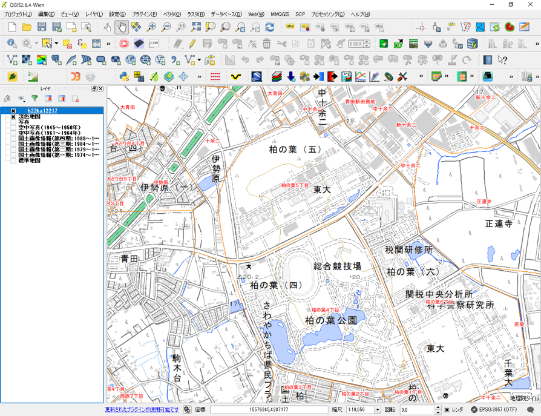
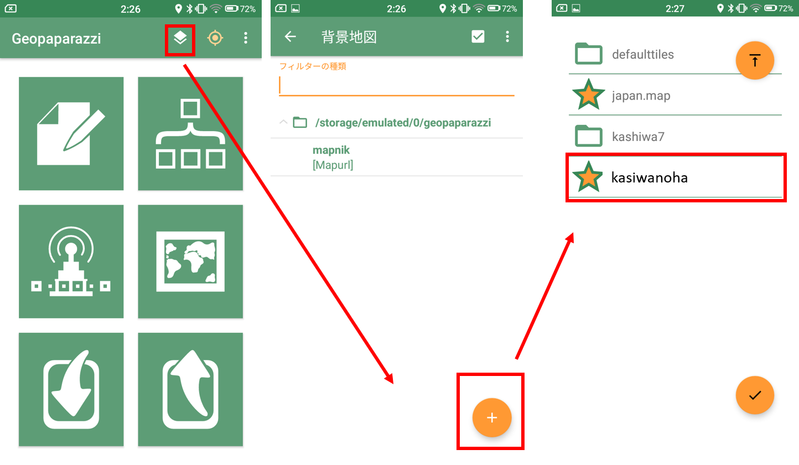
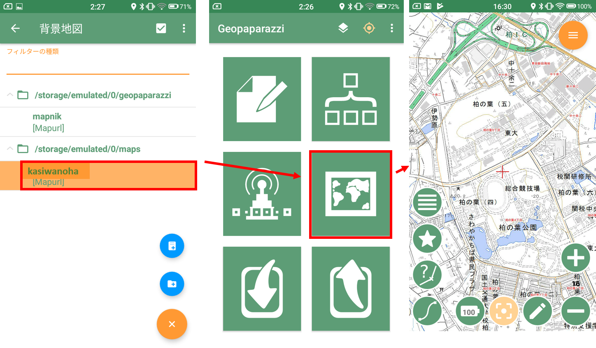
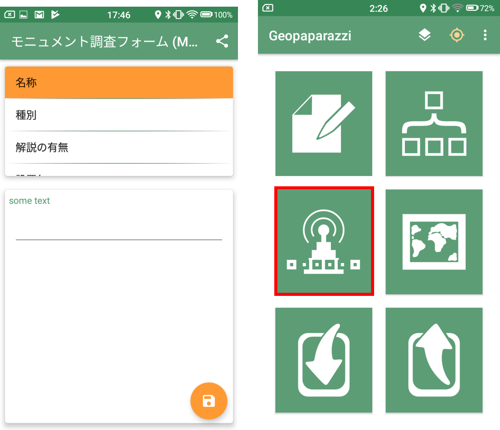
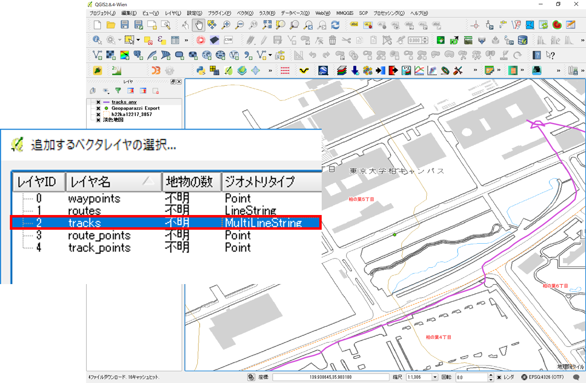

# スマーフォンを用いた野外調査（作成中）
以下では、Android用のスマートフォンアプリであるGeopaparazziを野外調査に活用する手法を解説しています。この教材は、Koichi Kita氏が公開している[Geopaparazziの説明資料（Geopaparazziハンズオン）](https://www.slideshare.net/KouichiKita/2016-07-08)と[Geopaparazziの使い方解説（Ver4）](https://sites.google.com/site/geopapakaisetu/)を参考に作成しました。各機能の詳しい説明は、上記の資料や[Geopaparazzi Reference Manual](https://geopaparazzi.github.io/geopaparazzi/)を参照ください。また、以下ではオフライン環境での調査を想定しています。オンライン環境で調査を行う場合は、デフォルトのmapurlファイルを利用するため、前半部分は読み飛ばしてください。

※iPhone向けの野外調査アプリとして、[iGIS](https://itunes.apple.com/jp/app/igis/id338967404?mt=8)などがあります。iGISによる野外調査法については、農研機構発行の[モバイルGISアプリ「iGIS」とGoogle Earthを用いた荒廃農地の踏査手法マニュアル](http://www.naro.affrc.go.jp/publicity_report/pub2016_or_later/pamphlet/tech-pamph/077715.html)で詳しく解説されています。

**Menu**
- 調査用地図の作成
- 地図タイルとMapurlの作成
- Geopaparazziを起動し、調査用地図を読み込む
- フィールドワークでデータを記録
- データの書き出し
- 取得データの表示

## 調査用地図の作成
[QGISビギナーズマニュアル]と[既存データの地図データと属性データ]の教材を参考に、以下のような地図を作成する。※　ここでは、シェープファイルの座標系は、[空間データ]の教材を参考にEPSG:3857へ変換したものを使用した。



## 地図タイルとMapurlの作成
[地図タイル（ラスタ）]の教材を参考に、ラスタタイルを作成する。このときのラスタタイルを出力するファイルの名称は、任意の名称で良い（以下では、kashiwanoha.zipとした）。


次に、テキストエディタを開き、以下のような.mapurlを作成しkashiwanoha.mapurlとして保存する。url,center,zoomlevelは、利用する地図の状況に応じて変更する。

```text
url=kashiwannoha/ZZZ/XXX/YYY.png
minzoom=14
maxzoom=18
center=139.940 35.903
type=google
format=png
defaultzoom=14
mbtiles=defaulttiles/kashiwannoha.mbtiles
description=地理院地図とe-stat（柏市境界）を利用し作成
```
> 上記は、[Geopaparazziの使い方解説（Ver4）, QGISからタイル地図を作成する](https://sites.google.com/site/geopapakaisetu/tairu-de-tuno-ru-shou-fang-fa/qgistilemap)を参考に作成した。

## Geopaparazziを起動し、調査用地図を読み込む
ラスタタイル（.zip）と.mapurlを作成後、スマートフォンをPCに接続し、スマートフォン内のmapsフォルダに解凍したkashiwanohaのフォルダと.mapurlファイルを移動する。


Geopaparazziを起動し、背景地図を選択するボタンから以下のように、作成したkashiwanoha.mapurlを選択する。


背景地図として、kashiwanoha.mapurlを一度タップし、起動画面の地図表示ボタンをクリックする。上記の操作で地図が表示できる。表示できない場合は、タイルの作成が失敗しているか、.mapurlの記載方法が間違っている。


## フィールドワークでデータを記録

データは、中央の十字の地点に以下のようなデータをnoteとして記録できる。一度作成したnoteを消すには、初期画面から新しいプロジェクトを開始をタップする。


|追加できる項目|詳細|
|---|---|
|image note|写真を追加できる|
|sketch note|スケッチを追加できる|
|map note|地図画像を追加できる|
|text note|テキストを追加できる|
|自作の調査項目|調査項目をまとめたノートが作成できる|


### 調査項目の自作
Geopaparazziでは、`Geopaparazzi>tags.json`に自作の調査項目リストを作成することができる。例えば、文化財の調査をすると仮定した場合、以下のような調査項目を想定し、tags.jsonに追加する。

|調査項目|内容|
|---|---|
|名称|名称を短文で記入|
|種別|種別（像、記念樹、記念碑、その他）を選択し、記入|
|解説|有、無を選択し、記入|
|設置年|日付を選択|
|写真|写真のパスを記載|
|備考|その他必要な情報を記載する。|

```json
},//examplesの}の次に,を付けて以下を記載する
 {
			"sectionname": "モニュメント調査フォーム",
			"sectiondescription": "モニュメント調査フォームです。",
			"forms": [
					{
							"formname": "名称",
							"formitems": [
									{
											"key": "title",
											"value": "",
											"islabel":"true",
											"type": "string",
											"mandatory": "yes"
									}
							]
					},{
							"formname": "種別",
							"formitems": [
									{
											"key": "a single choice combo",
											"values": {
													"items": [
															{"item": ""},
															{"item": "像"},
															{"item": "記念樹"},
															{"item": "記念碑"},
															{"item": "その他"}

													]
											},
											"value": "",
											"type": "stringcombo",
											"mandatory": "yes"
									}
								]
						},{
							"formname": "解説の有無",
							"formitems": [
									{
											"key": "a single choice combo",
											"values": {
													"items": [
															{"item": ""},
															{"item": "有"},
															{"item": "無"}
													]
											},
											"value": "",
											"type": "stringcombo",
											"mandatory": "yes"
									}
								]
							},{
							"formname": "設置年",
							"formitems": [
									{
											"key": "a date",
											"value": "",
											"type": "date"
									}
							]
					},{
							"formname": "写真",
							"formitems": [
									{
											"key": "a picture archive",
											"value": "",
											"type": "pictures"
									}
							]
					},{
							"formname": "備考",
							"formitems": [
									{
											"key": "some text",
											"value": "",
											"type": "string"
									}
							]
					}

			]
 }
]　//JSONの閉じタグとして]を記載する


```
上記のように記載することで、下の左図のようにリストが追加される。


GPSをキャッチできる環境で、上の右図のGPSログを開始するボタンをクリックすると、調査経路の記録ができる。

## データの書き出し
ノートとして作成した情報は、`エクスポート>KMZ`から、調査記録がまとめられたKMZファイルを出力できる。GPSのログデータは、`エクスポート>GPX`を選択する。


## 取得データの表示

### Google Earthに読み込む
出力したKMZファイルを開き、Google Earthで表示する。Google Earthがインストールされた環境で、KMZファイルをダブルクリックし、実行する。または、Google Earthにドラッグ&ドロップする。

### Cesiumで表示する
KMZファイルを[Cesium viewer](https://cesiumjs.org/Cesium/Build/Apps/CesiumViewer/)にドラッグ&ドロップし、表示する。

### GPX
GPSのデータは、GPXファイルとして出力される。出力したデータを、QGISへドラッグ&ドロップするとラインデータとして表示することができる（Multi line stringsを選択する）。



#### QGISで表示する
KMZは、拡張子を.zipに変更して、.zipを解凍する。そうするとkmlと撮影したが表示できる。

KMLファイルをQGISへドラッグ&ドロップし、データを表示する。ただし、属性情報は、一つのフィールド内に連続して記録されるため、分析等で使えるように加工する必要がある。


[GISオープン教材について]:../../../README.md
[GIS実習用基礎教材一覧]:../../README.md
[GISの基本概念]:../../01_GISの基本概念/GISの基本概念.md
[QGISビギナーズマニュアル]:../../QGISビギナーズマニュアル/QGISビギナーズマニュアル.md
[GRASSビギナーズマニュアル]:../../GRASSビギナーズマニュアル/GRASSビギナーズマニュアル.md
[リモートセンシングとその解析]:../../06_リモートセンシングとその解析/リモートセンシングとその解析.md
[既存データの地図データと属性データ]:../../07_既存データの地図データと属性データ/既存データの地図データと属性データ.md
[空間データ]:../../08_空間データ/空間データ.md
[空間データベース]:../../09_空間データベース/空間データベース.md
[空間データの統合・修正]:../../10_空間データの統合・修正/空間データの統合・修正.md
[基本的な空間解析]:../../11_基本的な空間解析/基本的な空間解析.md
[ネットワーク分析]:../../12_ネットワーク分析/ネットワーク分析.md
[領域分析]:../../13_領域分析/領域分析.md
[点データの分析]:../../14_点データの分析/点データの分析.md
[ラスタデータの分析]:../../15_ラスタデータの分析/ラスタデータの分析.md
[傾向面分析]:../../16_傾向面分析/傾向面分析.md
[空間的自己相関]:../../17_空間的自己相関/空間的自己相関.md
[空間補間]:../../18_空間補間/空間補間.md
[空間相関分析]:../../19_空間相関分析/空間相関分析.md
[空間分析におけるスケール]:../../20_空間分析におけるスケール/空間分析におけるスケール.md
[視覚的伝達]:../../21_視覚的伝達/視覚的伝達.md
[参加型GISと社会貢献]:../../26_参加型GISと社会貢献/参加型GISと社会貢献.md
[python初級]:../../python初級/python初級.md
[インターネットの活用に関する教材]:../../インターネットの活用/README.md
[Carto]:../../インターネットの活用/Carto/Carto.md
[Cesium]:../../インターネットの活用/Cesium/Cesium.md
[Googleマイマップ]:../../インターネットの活用/Googleマイマップ/Googleマイマップ.md
[Leaflet]:../../インターネットの活用/Leaflet/Leaflet.md
[ArcGIS API for JavaScript]:../../インターネットの活用/arcgisapi4js/arcgisapi4js.md
[OpenLayers]:../../インターネットの活用/OpenLayers/OpenLayers.md
[地理院地図]:../../インターネットの活用/地理院地図/地理院地図.md
[D3.js]:../../インターネットの活用/D3.js/D3.js.md
[GitHubビギナーズマニュアル]:../../インターネットの活用/GitHubビギナーズマニュアル/GitHubビギナーズマニュアル.md
[CZML]:../../インターネットの活用/CZML/CZML.md
[KML]:../../インターネットの活用/KML/KML.md
[GeoJSON]:../../インターネットの活用/GeoJSON/GeoJSON.md
[地図タイル（ラスタ）]:../../インターネットの活用/rastertile/rastertile.md
[GISと関連した機材の活用]:../../機材の活用/README.md
[UAV]:../../機材の活用/UAV/uav.md
[3Dプリンタ]:../../機材の活用/3Dプリンタ/3Dプリンタ.md
[スマートフォン]:../../機材の活用/スマートフォン/スマートフォン.md
[タブレット]:../../機材の活用/タブレット/タブレット.md
[課題ページ（全14回）]:../../課題/README.md
[地形環境分析のためのQGIS入門]:../../課題/1day実習コース/1day実習コース.md
[第1回・GIS入門]:../../課題/課題_GIS入門.md
[第2回・既存データの地図データと属性データ]:../../課題/課題_既存データの地図データと属性データ.md
[第3回・空間データ]:../../課題/課題_空間データ.md
[第4回・空間データの統合・修正]:../../課題/課題_空間データの統合・修正.md
[第5回・視覚的伝達]:../../課題/課題_視覚的伝達.md
[第6回・基本的な空間解析]:../../課題/課題_基本的な空間解析.md
[第7回・ネットワーク分析]:../../課題/課題_ネットワーク分析.md
[第8回・領域分析]:../../課題/課題_領域分析.md
[第9回・点データの分析]:../../課題/課題_点データの分析.md
[第10回・空間データベース]:../../課題/課題_空間データベース.md
[第11回・ラスタデータの分析]:../../課題/課題_ラスタデータの分析.md
[第12回・空間補間]:../../課題/課題_空間補間.md
[第13回・リモートセンシングとその解析]:../../課題/課題_リモートセンシングとその解析.md
[第14回・参加型GISと社会貢献]:../../課題/課題_参加型GISと社会貢献.md
[高校教員向け教材]:../../高校教員向け教材/README.md
[日本と世界の統計情報の可視化]:../../高校教員向け教材/日本と世界の統計情報の可視化.md
[地形と土地利用のオーバーレイ分析]:../../高校教員向け教材/地形と土地利用のオーバーレイ分析.md
[衛星画像を用いた環境変化地図の作成]:../../高校教員向け教材/衛星画像を用いた環境変化地図の作成.md
[身近な地域の調査のためのフィールドワーク]:../../高校教員向け教材/fieldwork.md
[防災教育で利活用可能な簡易Web地図の作成]:../../高校教員向け教材/webmap.md
[講義用教材]:../../既存資料/README.md
[本プロジェクトについて]:../../本プロジェクトについて.md
[利用規約]:../../利用規約.md
[教材編集について]:../../教材編集について.md
[その他のライセンスについて]:../../その他のライセンスについて.md
[よくある質問とエラー]:../../よくある質問とエラー/よくある質問とエラー.md
[用語集]:../../用語集/用語集.md
