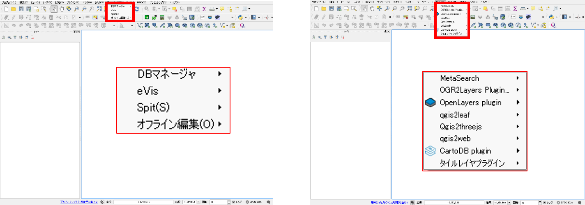
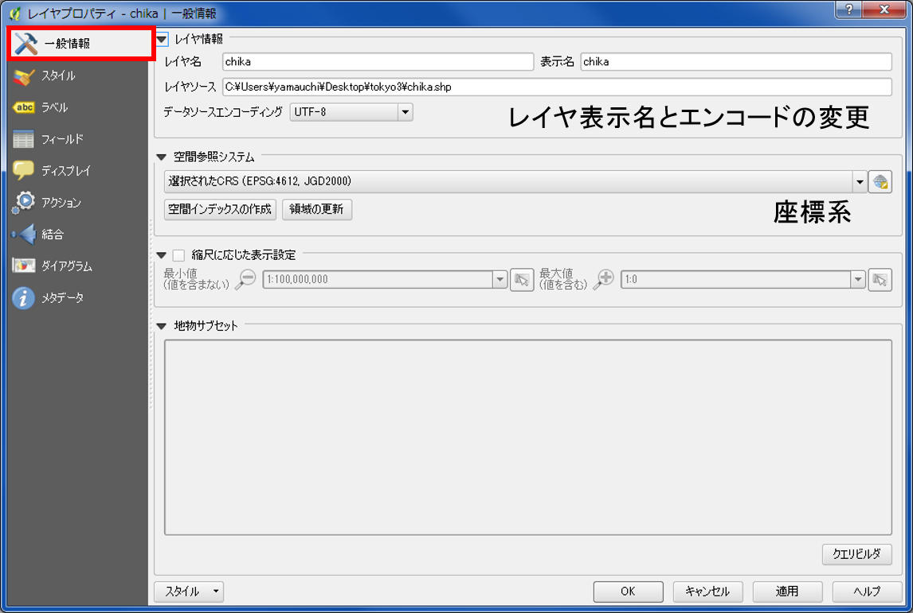
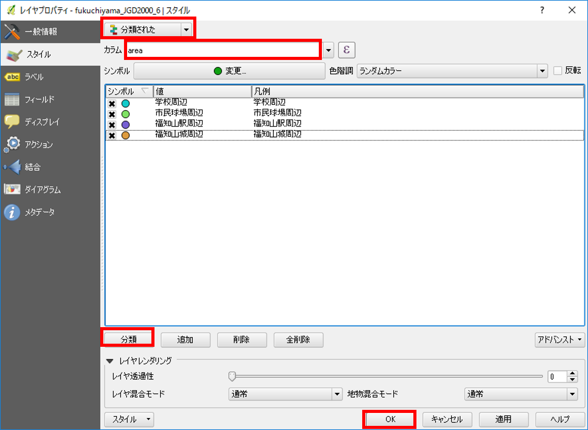
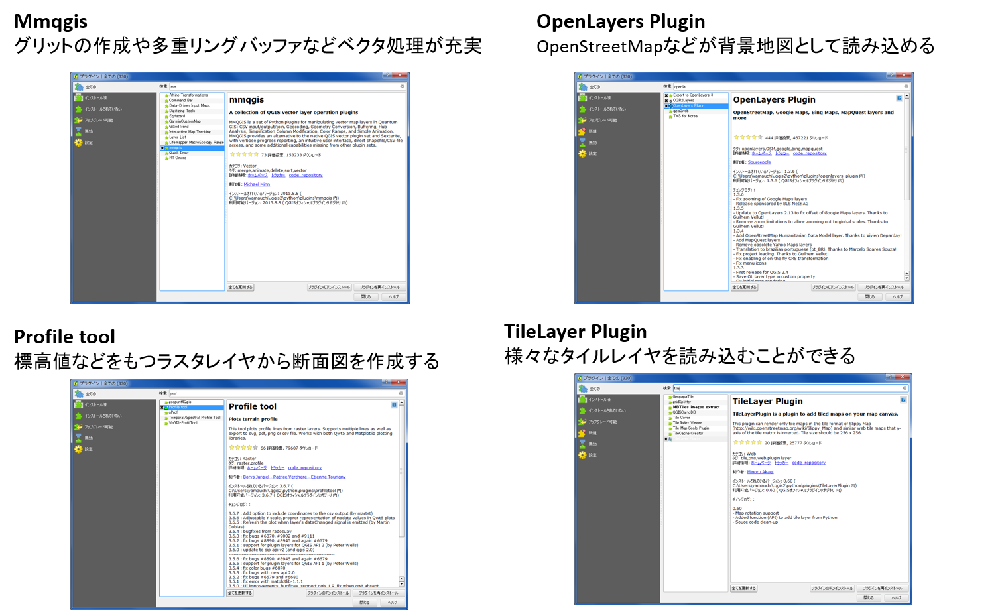
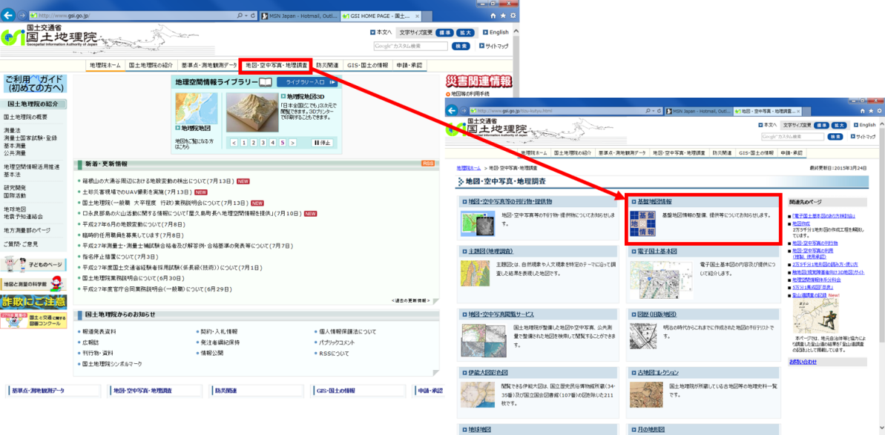
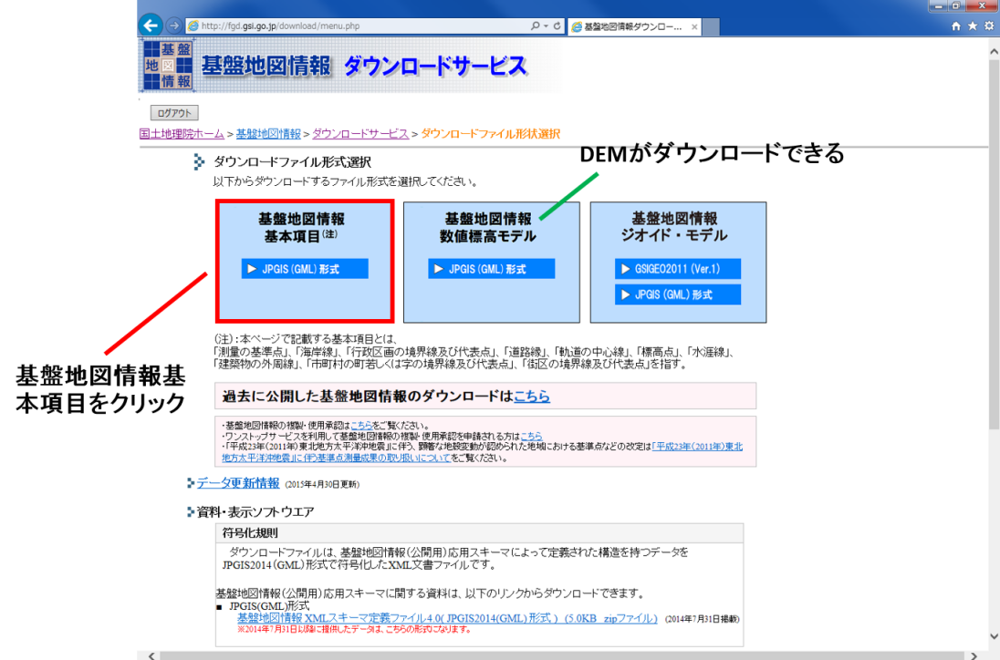
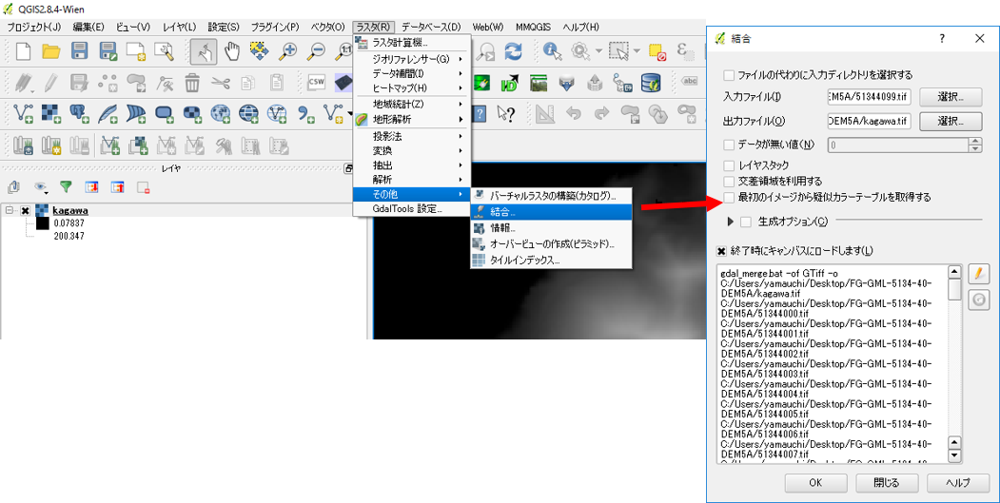
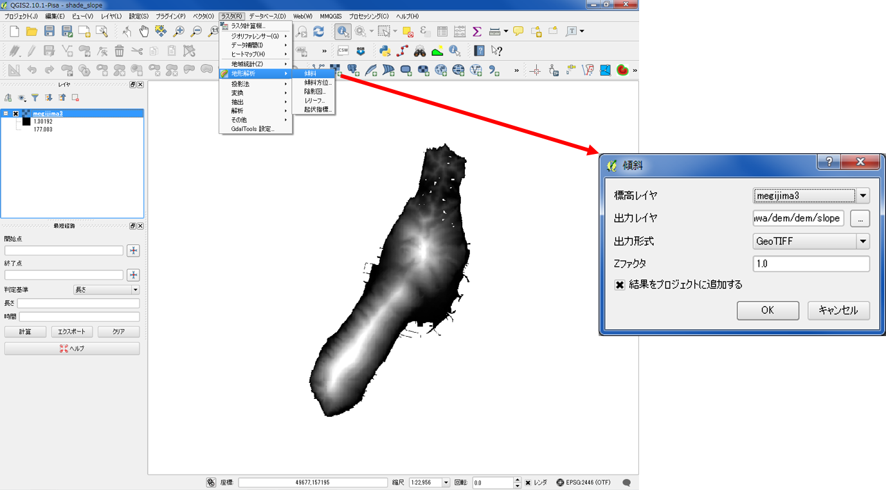
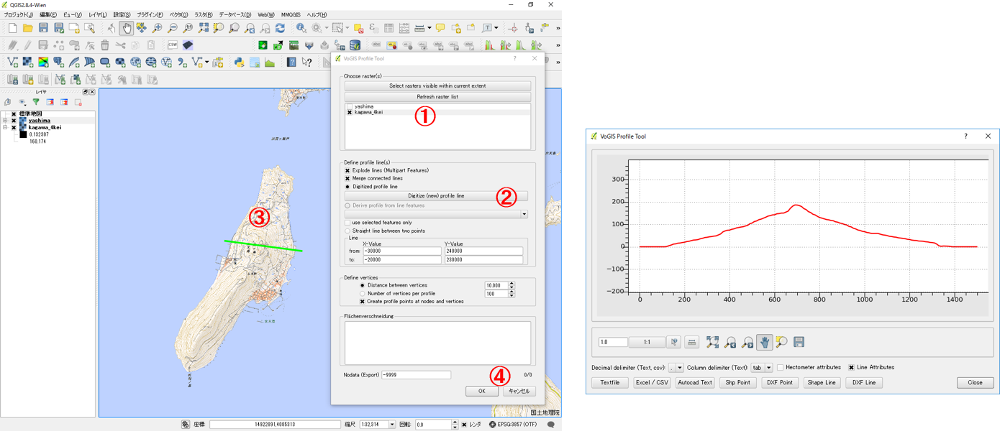

# 地形環境分析のためのQGIS入門
　このコースでは、QGISの操作手法の解説と視覚的な地形表現を行います。前半部では、[QGISビギナーズマニュアル]の内容を中心にQGISの基本操作の解説を行います。後半部では、[ラスタデータの分析]の教材の内容を用いて、地形を視覚的に表現します。この実習を最後まで進め、設定している課題の地図を作成することができれば、受講完了になります。

　GIS初学者は、本教材を進める前に[GISの基本概念]の教材を確認しておいてください。本教材を使用する際は、[利用規約]をご確認いただき、これらの条件に同意された場合にのみご利用下さい。

**Menu**
----------
**[前半：QGIS入門](#前半：QGIS入門)** 
* [QGISとは？](#QGISとは？)
* [インストールする](#インストールする)
* [起動する](#起動する)
* [ウインドウの確認](#ウインドウの確認)
* [各種ボタンについて](#各種ボタンについて)
* [データの読み込み](#データの読み込み)
* [機能説明](#機能説明)
* [属性テーブル](#属性テーブル)
* [プロパティ](#プロパティ)
* [プラグイン](#プラグイン)
* [地図のレイアウト](#地図のレイアウト)
* [前半の課題](#前半の課題)

**[後半：視覚的な地形表現](#後半：視覚的な地形表現)** 
* [数値標高モデルの変換](#数値標高モデルの変換)
* [ラスタデータの加工](#ラスタデータの加工)
* [数値標高モデルの視覚的分析](#数値標高モデルの視覚的分析)
* [後半の課題](#後半の課題)

## 前半:QGIS入門
　実習をはじめる前に、以下のデータをダウンロードしてください。

* [福知山豪雨災害聞き取り調査データ]　([福知山豪雨災害防災マップ](http://opentextmap.org/library/?p=2808)　© 福知山豪雨災害防災マップ を加工し作成）

## QGISとは？
　QGISは、無償で利用できるオープンソースのGIS（GNU General Public Licenseで提供）です。Windows,Mac,Linux,Unix, Androidなど様々な環境で動作します。様々なプラグインや、GRASSやPostGISなど他のオープンソースGISと連携して使用することで、多様な分析が可能です。GISの基本操作に必要な機能を網羅しているだけでなく、Web上に多数のマニュアルがアップロードされているため、GIS学習がしやすいソフトウェアです。  

>( http://qgis.org/ja/site/about/index.html を参考に作成 )

[▲メニューへもどる]

## インストールする
　QGISは、最新版と1年間のバグ修正のサポートがあるLTR版があります。本教材では、旧LTR版のQGIS2.8を中心に構成しています。下記に従って、QGISをインストールしてください（LTR版2.8を推奨）。

### 最新版のインストール
QGISをダウンロードするため、[QGIS](http://qgis.org/ja/site/index.html)の公式ホームページにアクセスする。PCの環境にあわせて、32bit版か64bit版を選択してダウンロードする(LTR版を推奨)。ダウンロードが終了したら、.exeファイルを実行しインストールを行う。

### 旧版のインストール
**本教材は、QGIS2.8を基本に構成しています**

[QGIS](http://qgis.org/ja/site/index.html)の公式ホームページを開き、「ダウンロードする」をクリックする。全てのリリースのタブに切り替えて、「古いバージョンのダウンロード」をクリックする。本教材で中心になっているQSIS2.8版（最終リリース版）をダウンロードする。

[▲メニューへもどる]

## 起動する
　以下では、インストールしたQGISの起動手法について解説しています。

デスクトップのQGISアイコンをダブルクリックする。しばらくするとQGISが起動する。

[▲メニューへもどる]

## ウインドウの確認
　QGISを起動すると、下の図のようなウィンドウが表示されます。ウインドウ上のアイコンの配置は自由に変更することができます。アイコンのない箇所（グレーの部分）で右クリックすることにより、別機能のウインドウを呼び出すことができます。アイコンの数は、インストールしているプラグインの数によっても異なります。そのため、インストール直後のQGISと教材の画像が異なっていることを確認してください。

[▲メニューへもどる]

## 各種ボタンについて
　以下では、QGISで主に使用するボタンについて解説しています。

1. QGISファイルを保存
2. 名前をつけてQGISファイルを保存
3. 地図移動
4. 地図の拡大と縮小
5. 選択領域にズーム
6. 動作の前後移動
7. 地物情報表示
8. 選択と選択取り消し
9. 長さ、面積計測（手動）
10. レイヤ編集
11. ベクタレイヤの読み込み
12. ラスタレイヤの読み込み
13. テキストファイルの読み込み

[▲メニューへもどる]

## データの読み込み
　GISで読み込むデータは、大きく分けてベクトルデータとラスタデータがあります。詳しくは[ベクトルデータとラスタデータ](../01_GISの基本概念/GISの基本概念.md)を参照してください。QGISでは、以下のようにデータによって読み込む手法が変わります。以下では、実践として[福知山豪雨災害聞き取り調査データ]を用いた、ベクトルデータの読み込みを行ってください。

### ベクトルデータ読み込み
[福知山豪雨災害聞き取り調査データ]をダウンロードし、fkuchiyama_sample.zipを解凍する。ファイルを解凍した後に、ベクタデータの読み込みを開始する。QGISのベクタデータを読み込むアイコンをクリックし、ベクタレイヤ追加ウインドウを表示する。文字コードにあわせてエンコーディングを設定し、ブラウズからファイルを選択する。以下では、ベクトル形式の[シェープファイル](../01_GISの基本概念/GISの基本概念.md#シェープファイルとは)を読み込むため、.shpの拡張子がついたものを指定する。

### その他のデータ読み込み
QGISでは、ベクトルデータの他に様々なデータを読み込むことができます。以下は、その手法について簡単にまとめたものです。その他の教材で扱う処理となるので、一読しておくことを推奨します。

#### ラスタデータの読み込み
QGISでは、ラスタデータを読み込むことができます。ラスタデータの利用や分析については、[空間データの結合・修正]や[ラスタデータの分析]の教材で詳しく解説しています。

ラスタデータを読み込むアイコンをクリックし、読み込みたいラスタデータを選択する。

#### テキストデータ読み込み
QGISでは、テキストデータの位置情報を用いてベクトルデータなどに変換することができます。データの利用法についての詳細は、[空間データ]の教材で解説しています。

テキスト読み込みのアイコンから、CSVファイルを読み込む。
参照からファイルを選択し、ファイル形式をCSVにする。X,Yフィールドに対応する緯度経度があれば指定し、緯度経度がなければジオメトリなしにチェックをする。

[▲メニューへもどる]

## 機能説明
　QGISには、地図のレイアウト、データの作成、分析など様々な機能があります。以下では、QGISの機能について説明しています。

プロジェクト：QGIS（.qgs）ファイルの保存や読み込み、地図のレイアウト、エクスポートができる。

編集：ベクターレイヤの編集ができる。編集状態になると、アクティブになる。

ビュー：地図の移動や拡大、縮小など、地図画面の操作ができる。

レイヤ：ベクターやラスタなどのレイヤが追加できる。

ポイント、ライン、ポリゴン新規レイヤの作成もできる。

設定：オプションから、プロジェクトの設定やスナップオプションが設定できる。

プラグイン：プラグインの管理とインストールができる。Python入力画面が開ける。

ベクタ：斜面方位図や陰影図の作成などラスタに関する処理ができる。

ラスタ：バッファやクリップなどベクタに関する処理ができる。

データベース：PostGISなどのデータベースへの接続やeVisプラグインによる外部ファイルとの連携が可能。

Web：背景地図の設定やweb地図の書き出しができる（プラグインによる）。

プロッセッシング：他のGISソフトウェアと連携して操作ができる（R,GRASS,SAGAなどがQGIS内で処理できる）。

ヘルプ：QGISのヘルプが確認できる。

[▲メニューへもどる]

## 属性テーブル
　GISで扱うことのできるほとんどのデータは、位置情報のほかに属性情報というものを保持しています。この２つの情報は、QGISで連動して表示することができます。以下では、QGISによる属性テーブルの表示について解説しています。[福知山豪雨災害聞き取り調査データ]を用いて、属性テーブルの機能を確認してください。

データを読み込み、左の画面からレイヤの上で右クリックし、属性テーブルを開き、属性情報を確認する。

属性テーブルで選択したものは、地図上で黄色で表示される。選択アイコンで地図上のレイヤを選択した場合は、その属性テーブルが選択される。

[▲メニューへもどる]

## プロパティ
　QGISでは、プロパティからデータの情報やスタイルの変更ができます。ポイントでは形や大きさ、ラインでは線の形や太さ、ポリゴンでは塗りつぶし色や透過性を変更することができます。また、属性情報でスタイルを分けることもできます。この処理は、表示のされ方が変化するだけで、データそのものの形状や属性等が改変されるものではありません。以下では、プロパティについて解説しています。

レイヤウインドウからプロパティを表示したいレイヤを選択し、右クリックからプロパティをクリックする。

### 一般情報
一般情報は、座標系を確認したり、文字コード、表示名の変更ができる機能です。

### スタイル
スタイルは、データのスタイルを整えることができる機能です。データの値に応じて配色やスタイルを変えることができます。分類方法は「共通シンボル」、「分類された」、「段階に分けられた」などがあります。

シンボル（今回の場合は、ポイントデータ）の大きさと色を変更するには、「共通シンボル」を選択し、色と大きさを指定する。指定できた状態でOKをクリックすると変更が適用される。

シンボル（今回の場合は、ポイントデータ）の形を変更するには、「共通シンボル」を選択し、形を指定する。指定できた状態でOKをクリックすると変更が適用される。

属性テーブルの値によって、大きさと色を変更するには、「分類された」を選択し、分類したいフィールドを選択する。今回は地域ごとに色を変更するため、「area」を指定する。指定できた状態で、分類をクリックすると値による色分けができる。各色は、シンボルをクリックすることで調整でき、ラベルも変更することができる。最後に、OKをクリックすると変更が適用される。

※事前に属性テーブルから、地域名が入っているフィールドのカラム名を確認しておく。

### ラベル
ラベルは、データを表示する際に属性情報からラベルを作成する機能です。以下では、QGISで地図上にデータの属性値を用いて、ラベルを表示する手法について解説しています。

ラベルを選択し、ラベルの表示にチェックを付け、分類したいフィールドを指定する。以下の設定は、サンプルデータの属性値である「area」を指定し、地域ごとのラベル表示を行うものである。設定完了後にOKをクリックすると変更が適用され、地図上にラベルが表示される。

[▲メニューへもどる]

## プラグイン
　QGISでは、オフィシャルプラグインリポジトリ等から、様々な拡張機能をプラグインとしてインストールできます。プラグインをインストールすることにより、様々な処理が可能になります。

プラグインから、プラグインの管理とインストールを選択する。

検索から、インストールしたいプラグインを検索する。例として、以下のような便利なプラグインがある。
  

※各プラグインの使用法については、対応する教材ごとに解説している。  

### TileLayerPluginのインストール
以下では、プラグインのインストール手法の例として、TileLayerPluginのインストールと、利用法について解説しています。福知山豪雨災害聞き取り調査データをダウンロードし、QGISでシェープファイルを読み込んだ状態にして下さい。

プラグイン＞プラグインの管理とインストールからTileLayerPluginを検索し、プラグインのインストールをクリックする。

インストールが完了したら、地理院タイルをまとめた[gsi-tiles.zip](https://raw.githubusercontent.com/gis-oer/gis-oer/master/GIS%E3%82%AA%E3%83%BC%E3%83%97%E3%83%B3%E6%95%99%E6%9D%90/%E8%AA%B2%E9%A1%8C/sample/gsi-tiles.zip)をダウンロードし、任意の場所に保存し、.zipを解凍する。  

web>タイルレイヤプラグインから、プラグインを起動する。タイルレイヤプラグインの設定をクリックし、解凍したgsi-tilesフォルダを外部レイヤディレクトリに指定する。OKをクリックすると、地理院タイルの一覧が表示される。地理院タイルを使用する際は、[地理院タイルの利用規約](http://maps.gsi.go.jp/help/use.html)に従ってください。

※本教材で用意したtsvファイルは、Minoru Akagi(minoura)氏 が、[GitHub Gist](https://gist.github.com/minorua/7654132) で公開しているtsvファイルを加工し作成したものです。

一覧から地図を選択し、追加をクリックするとQGISに地図が表示される。ポイントデータが、タイル画像の下に置かれているため、ポイントデータを表示するには、レイヤウィンドウのレイヤを入れ替える必要がある。レイヤの上下の変更方法は、一番上に表示したいレイヤをドラッグし、リスト化されているレイヤウィンドの一番上まで移動する。移動すると、地図上でもレイヤの上下が変更される。

※レイヤ構造については、[こちら](../01_GISの基本概念/GISの基本概念.md#地物とレイヤ構造)を参照してください。

[▲メニューへもどる]

## 地図のレイアウト
　QGISでは、作成したデータに凡例や縮尺を追加した地図がレイアウトできます。以下では、福知山豪雨災害聞き取り調査データと地理院タイルを用いて地図のレイアウトについて解説しています。

プロジェクトから、新規プリントコンポーザを立ち上げ、コンポーザタイトル（地図名など任意）を入力する。データが重ならない場合は、オンザフライCRS投影がうまくいっていない可能性があるので、QGISを再起動する。その後、サンプルデータ、地理院タイルの順で読み込む（これでもうまくいかない場合は、右下のEPSGと書かれたボタンをクリックし、オンザフライにチェックをついているかを確認する）。

※本来は空間座標の変換が必要であるが、この教材は入門編のため、解説していない。空間座標の変換は、[空間データ]の教材を参考にしてください。

### プリントコンポーザ
プリントコンポーザには、以下のような機能がある。

1. アイテムの選択と移動
2. 地図の移動
3. 地図の追加
4. 画像の追加
5. 凡例の追加
6. 縮尺バーの追加
7. 地図の更新

※アイテムの削除は編集から行う。

地図をレイアウトするため、地図、縮尺バー、凡例を追加する。地図、縮尺バー、凡例の追加するため、各追加ボタンをクリックし、地図のレイアウト画面で大きさをドラッグして指定する。

地図、縮尺バー、凡例が追加できたら、縮尺バーを選択し、アイテムプロパティで調整する。線分列の大きさの値を任意の値に変更する。

凡例を選択し、アイテムプロパティで調整する。自動アップデートのチェックをはずすと凡例が編集できる。名称の変更、凡例項目の追加と削除ができる。

最後に、画像の追加から方位記号を追加する。アイテムプロパティの検索ディレクトリをクリックすると様々なイメージが参照できる。デフォルトの状態では、図の赤枠部分をクリックしないと検索ディレクトリが開かないため、注意する。

地図のレイアウトを整えた後、画像としてエクスポートする。コンポーザー＞画像としてエクスポートを選択する。

エクスポートした画像ファイルをダブルクリックすると、以下のような地図が表示できる。

### 作業ファイルの保存
QGISには、作業状況をファイルとして出力する機能がある。これにより、一度QGISを閉じた後でも、前回の状態から作業を再開することができる。

QGISで作業ファイルを作成するためには、プリントコンポーザーを閉じて、QGISの作業画面（デフォルトの画面）を開く。その後、`プロジェクト＞名前を付けて保存`をクリックし、任意の名称で出力する。次回開くときは、出力した.qgsファイルをダブルクリックするとQGISが立ち上がる。

### QGISのビュー上に凡例と方位記号を表示する手法
ビューから、地図装飾を選択する。地図装飾からスケールバー、方位記号を追加する。それぞれの形式や配置を決め、「方位or縮尺バーを使用」をチェックする。

以下のように、QGISのビュー上に縮尺と方位記号が表示される。

[▲メニューへもどる]

## 前半の課題
　下の図と同じように空中写真を背景にした地図を作成してください（どの年代でも可）。作成する地図の縮尺、方位記号、ポイントのデザインは、下の図と異なったものを選択してください。

[完成例](https://gis-oer.github.io/gitbook/book/GISオープン教材/課題/課題ページ/1day実習コース/pic/Q1.png)

[▲メニューへもどる]

## 後半：視覚的な地形表現
　本実習では、以下のデータを使用します。

* 国土地理院「 基盤地図情報　数値標高モデル　5ｍメッシュ　高松周辺（513440）」

**データが配布されない場合は以下に従ってダウンロードしてください。**

## 基盤地図情報とデータのダウンロード
　基盤地図情報は、国土交通省国土地理院が整備しているデータです。市町村や2次メッシュ単位で、測量の基準点のほか、行政区画の境界（2500レベル以上）や道路縁（2500レベル以上）等がダウンロードできます。また、地形表現や解析等で用いることのできるDEM（Digital Elevation Model）もダウンロードすることができます。基盤地図情報として提供されているデータは、ダウンロード後に変換が必要です。以下では、基盤地図情報からデータをダウンロードする手法について解説しています。教材に従って任意のファイルを選択し、ダウンロードを試してください。

※基盤地図情報の利用については、測量法に従ってください。また、DEMデータの変換手法は、[ラスタデータの分析]教材で解説しています。

基盤地図情報をダウンロードするため、[国土地理院]のサイトにアクセスする。地図・空中写真・地理調査をクリックし、基盤地図情報をクリックする。

基盤地図情報のダウンロードをクリックし、ログインを行う。登録をしていない場合は、新規登録を行う。

ログインIDとパスワードを入力する。ログインが完了したら、アンケートを入力し、次へをクリックする。

基盤地図情報基本項目をクリックし、基盤地図情報のダウンロード画面へ進む。

ダウンロードしたい項目にチェックをいれ場所を選択し 次へ をクリックする。全ての項目をチェックし、まとめてダウンロードをクリックする。ダウンロード後、Zipファイルを解凍する。

## 数値標高モデルの変換
　基盤地図情報からダウンロードした数値標高モデルをGISソフトウェアで処理するためには、ラスタデータへの変換が必要です。以下では、[株式会社エコリスのＨＰ]のコンバーターを用いた変換について解説しています。事前に、[株式会社エコリスのＨＰ]から、「標高DEMデータ変換ツール」をダウンロードしてください。

### 基盤地図情報からダウンロードしたDEMを変換する
標高DEMデータ変換ツールをダウンロードし、基盤地図情報から取得したDEMを変換する。
ダウンロードしたDEMtool.zipを解凍し、変換結合.vbsを実行する。
投影法を選択し、緯度経度を選択する。
陰影図の作成が必要な場合は、「はい」をクリックする。

基盤地図情報からダウンロードしたDEMが入っているフォルダを選択し、海域の標高値を選択する（今回は「はい → 0」を選択した）。
変換作業を開始し、完了のメッセージを待つ。
変換先のフォルダー内に、geotifが出力されているかを確認する。

## ラスタデータの加工
以下では、変換したラスタデータを解析用に加工する処理について解説しています。今回の解析データの範囲は、女木島周辺（高松市中心部北）としています。

QGISを起動し、ラスタの読み込みクリックして、ラスタデータを読み込む。

### ラスタを結合する
ラスタ＞その他＞結合をクリックする。
入力ファイルと出力ファイルを選択し「OK」をクリックする。

### ラスタの座標変換
結合したラスタを平面直角座標系（Ⅳ系）に変換して保存する。
ラスタ＞投影法＞ワープをクリックする。
入力ファイル、出力ファイル、ソースEPSG(元データの座標系)、ターゲットEPSG(変換したい座標系)、リサンプリング方法(今回はキュービックを選択した)を設定し、OKをクリックする。

### ラスタの切りぬき
ラスタ＞抽出＞クリッパーを選択する。
入力ラスタと出力ラスタを指定する。
クリッピングモードの「範囲」にチェックをし、地図から切りぬきたい範囲をドラックする。
データがない値に０を指定して、「OK」をクリックする。

※ ここで0を指定すると、標高値0の場所がすべてデータ無しになる。そのため、0m以下の低地部では、この手法が適切でない場合がある。データに合わせて、解析範囲に応じたデータなし値の設定が必要になる。

以下のように、ラスタの切りぬきができた。※陸域に所々ある色が濃い部分はため池。

上記の手法で海域が抜き出せなかった場合は、以下のような設定が必要となる。

### ラスタの配色
以下では、ラスタの値による配色手法について解説しています。今回の場合は、ラスタの標高値によって色分けを行います。

1. プロパティ ＞ スタイルから、レイヤタイプを単バンド疑似カラーにする。
2. 新規カラーマップを作成から等間隔モードにし、分類数と配色を設定し、「分類」をクリックする。
3. 各値上でクリックを行い分類数に応じて値を書き換える（ラベルも書き換える）。
4. 適用をクリックし、配色を確認後OKをクリックする。

[▲メニューへもどる]

## 数値標高モデルの視覚的分析
各セルごとに標高値を保持しているラスタデータを用いることで、傾斜区分図、斜面方位図、陰影図、3D地図、断面図を作成することができます。以下では、その手法について解説しています。

### 傾斜区分図の作成
ラスタ＞地形解析＞傾斜　を実行すると傾斜区分が計算できる。

下の図のように、傾斜区分図が表示された。

### 斜面方位図の作成
ラスタ＞地形解析＞傾斜方位　を実行すると傾斜方位が計算できる。

下の図のように、斜面方位図が表示された。

### 陰影図の作成
ラスタ＞地形解析＞陰影図　を実行すると陰影図が計算できる。

下の図のように、陰影図が表示された。
陰影図の元にしたラスタを重ねて、透過率を設定することで立体的な地形表現ができる。

※透過率は、プロパティ＞透過性から設定する。

### 3D地図の作成
プラグイン＞プラグインの管理とインストール　からQgis2threejsをインストールする。

OpenLayers pluginを利用し、OpenStreetMapを読み込んでおく。
※OpenLayers pluginをインストールしていない場合は、「プラグインの管理とインストール」からインストールする。
Web(W)＞OpenLayers plugin＞OpenStreetMap＞OpenStreetMap　からOpenStreetMapを読み込む。

DEM layer にDEMを選択し、Display typeのMap canvas image にチェックをいれ、「Run」をクリックする。

ブラウザが立ち上がり、3D地図図が表示される。

国土地理院の国土情報画像を読み込むこともできる（タイルレイヤプラグインを利用）。

### 地形断面図の作成
プラグインの管理とインストールからVoGIS Profile tool をインストールする。
ラスタ>VoGIS ProfileTool > VoGIS Profile Toolから起動する。

断面図を作成するラスタにチェックを入れ、Digitize (new) profile line をクリックし、QGISの地図上でクリックしながらラインを作成する（右クリックで終了）。OKをクリックすると別ウィンドウに断面形が表示される。

[▲メニューへもどる]

## 後半の課題
　任意の地域のデータ（もしくは、課題用に用意されたデータ）を用いて、段彩図、傾斜区分図、斜面方位図のいずれかを作成してください。画像の配色を調整した後、縮尺、方位記号、凡例を入れた地図をレイアウトしてください。

[完成例](https://gis-oer.github.io/gitbook/book/GISオープン教材/課題/課題ページ/1day実習コース/pic/yashima.png)

※完成例のようにタイトルを挿入する場合：新規ラベルを追加ボタンをクリックし、アイテムプロパティのメインプロパティにテキストを入力する。ウィンドウを広げると、入力したテキスト全体を表示することができる。文字の大きさは、フォントから調整できる。

#### ライセンスに関する注意事項
本教材で利用しているキャプチャ画像の出典やクレジットについては、[その他のライセンスについて]よりご確認ください。

[▲メニューへもどる]:1day実習コース.md#menu
[国土数値情報]:http://nlftp.mlit.go.jp/ksj/
[空間データ]:../08_空間データ/空間データ.md
[基本的な空間解析]:../11_基本的な空間解析/基本的な空間解析.md
[既存データの地図データと属性データ]:../07_既存データの地図データと属性データ/既存データの地図データと属性データ.md
[空間データの結合・修正]:../10_空間データの結合・修正/空間データの結合・修正.md
[ラスタデータの分析]:../15_ラスタデータの分析/ラスタデータの分析.md
[福知山豪雨災害聞き取り調査データ]:https://github.com/yamauchi-inochu/demo/raw/master/GISオープン教材/課題/sample/fkuchiyama_sample.zip
[課題ページ]:../課題/課題ページ/GIS入門.md
[利用規約]:../../../master/利用規約.md
[GISの基本概念]:../01_GISの基本概念/GISの基本概念.md
[その他のライセンスについて]:../その他のライセンスについて.md
[ラスタデータの分析]:../15_ラスタデータの分析/ラスタデータの分析.md
[株式会社エコリスのＨＰ]:http://www.ecoris.co.jp/contents/demtool.html
[QGISビギナーズマニュアル]:../QGISビギナーズマニュアル/QGISビギナーズマニュアル.md
