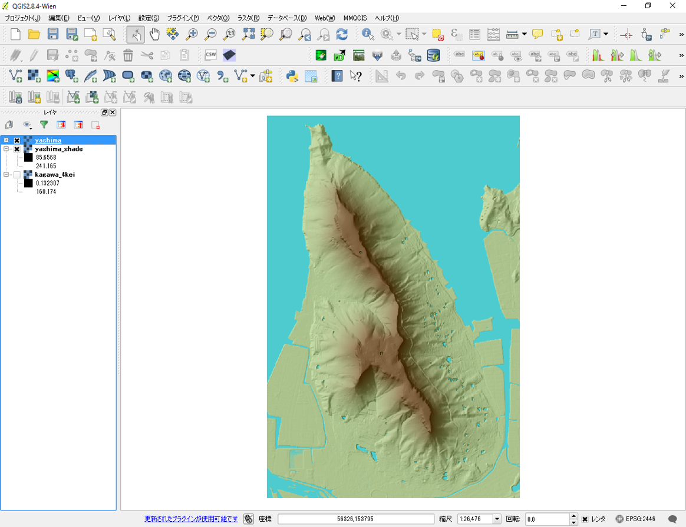

# 課題：ラスタデータの分析
　この実習では、ラスタデータを用いた地形情報の可視化や分析を行います。ラスターデータはベクトルデータと異なり、ピクセルごとに入力された値が分析に用いられます。
実習で使われる用語や概念は、[地理情報科学教育用スライド（GIScスライド）]の4章を参照してください。
　手順とGISオープン教材の[ラスタデータの分析]の教材を参考に、完成例のような地図が作成できれば、完了となります。実習で利用するデータの一部は、[既存データの地図データと属性データ]の教材を参考にダウンロードしてください。GIS初学者は、本教材を進める前に[GISの基本概念]の教材を確認しておいてください。

**実習用データ**

* 国土地理院「 基盤地図情報　数値標高モデル　5ｍメッシュ　高松周辺（513440）」
データの座標系は、世界測地系の平面直角座標Ⅳ系に設定しています。

**Menu**
--------
- [数値標高モデルの視覚的分析](#数値標高モデルの視覚的分析)
- [地形断面図](#地形断面図)
- [ラスタ演算](#ラスタ演算)
- [流域解析](#流域解析)

-----------------

## 数値標高モデルの視覚的分析
　屋島周辺のDEMデータを用いて、標高区分図、傾斜区分図、傾斜方位図、陰影図、3D地図を作成し、レイアウトを行い。屋島の地形的な特徴を整理し、400字程度でまとめてください。

**完成例**

**手順**
1. 実習ページからダウンロードしたラスターデータをQGISで読み、屋島の範囲をクリッパーで切り抜く。
2. ラスタ＞地形解析から傾斜、傾斜方位、陰影図を作成する。
3. 標高値、傾斜角、斜面方位（0°-360°）など、それぞれのラスターデータの値に応じて色分けを行い、標高区分図、傾斜区分図、傾斜方位図を作成する。
4. 陰影図をレイヤ順序の最下層とし、各ラスタデータの透過性を30％ほどにし、地形情報を視覚化する。
5. 平面では、確認しにくい箇所もあるため、3D地図を作成する。プラグインの管理とインストールから、Qgis2threejsをインストールし、3Dモデルを作成する。
6. 作成した標高区分図、傾斜区分図、傾斜方位図、陰影図、3D地図を視覚的に分析し、屋島の地形的な特徴を簡単にまとめる。

[△メニューへもどる]

--------

## 地形断面図
　DEMデータは、各セルに標高値を含んでいるため、複数のセルの標高値を利用し、断面図を作成することができます。この課題では、完成例のようにa-a'（屋島南部（南嶺）の標高292.0mを示す三角点付近をとおる西－東線）の地形断面図を作成します。断面図を作成後、作成した地形断面図から読み取れる地形情報について、400字程度でまとめてください。

**完成例**

**手順**
1. プラグインの管理とインストールから、VoGIS Profile toolを検索し、インストールする。
2. QGISで読み込んだDEMデータを用いて、VoGIS Profile toolで断面系を作成する。
3. 地形断面図から読み取れる地形情報について、400字程度でまとめる。

※傾斜を比較する際は、ウィンドウの縦横比率や、取得した断面の長さに注意してください。

[△メニューへもどる]

--------

## ラスタ演算
　この課題では、複数のラスタデータの範囲と値を組み合わせて、ラスタ演算をします。屋島周辺の標高データと数値標高モデルの視覚的分析の課題で作成した傾斜のラスタデータを用いて、ラスタ計算機で標高150m以上かつ傾斜10°以下のエリアを抽出してください。

**手順**
1. 標高と傾斜のデータをQGISで読み込みラスタからラスタ計算機を起動する。
2. 出力ファイルを設定し、[ラスタデータの分析]教材を参考に式を入力する。
3. プロパティ＞スタイル＞単バンド疑似カラーを選択し、モードを等間隔、分類数を2とし、最小を0、最大を1とし分類をクリックする。0の値の色の不透明度を0％にするとみやすい。

[△メニューへもどる]

--------

## 流域解析
　この課題ではDEMデータを用いた、流域解析を行います。GRASS GISのプラグインを用いて、流域ポリゴンを作成し、流域とするセルの数を100として処理を行い、河川ごとに流域を抽出した地図を作成してください。
※今回は、河川ごとの細かい流域をグルーピングせず、支流、本流ごとの流域のものを作成する。

**完成例**

この課題では、上の図のところまでできれば完了とします。河川ごとに流域をグルーピングし、下のような地図を作成することもできます。

**手順**
1. [ラスタデータの分析]教材と[GRASSビギナーズマニュアル]を参考に、QGISのGRASSプラグインを利用し、マップセットを作成する。マップセットの作成については、[GRASSビギナーズマニュアル]のQGISでのマップセット作成の項目を参照してください。
2. マップセットに標高ラスタを読み込み、ラスタの範囲を設定する。
3. 流域解析を選択し、流域の最小セルサイズ100とする。
4. 流域と河川のラスタをベクトルに変換する。
5. 名前を付けて保存でベクトルレイヤしたのちに、地図をレイアウトする。

※ 地図が完成できなかった場合は、作業途中でレイアウトを行い、提出する地図中にできなかった理由を記載し（プリントコンポーザーのテキスト挿入機能）、提出すること。

[△メニューへもどる]

--------

#### 完成例で使用したデータ
本ページで使用しているデータの出典については、該当する教材よりご確認ください。

[△メニューへもどる]:空間データ.md#menu
[作業メモ]:https://github.com/yamauchi-inochu/demo/blob/master/GISオープン教材/実習課題/作業メモ.md
[QGISビギナーズマニュアル]:../../QGISビギナーズマニュアル/QGISビギナーズマニュアル.md
[GRASSビギナーズマニュアル]:../../GRASSビギナーズマニュアル/GRASSビギナーズマニュアル.md
[GISの基本概念]:../../01_GISの基本概念/GISの基本概念.md
[既存データの地図データと属性データ]:../../07_既存データの地図データと属性データ/既存データの地図データと属性データ.md
[空間データ]:../../08_空間データ/空間データ.md
[空間データの結合・修正]:../../10_空間データの統合・修正/空間データの統合・修正.md
[視覚的伝達]:../../21_視覚的伝達/視覚的伝達.md
[政府統計局e-stat]:https://www.e-stat.go.jp/SG1/estat/eStatTopPortal.do
[国土数値情報]:http://nlftp.mlit.go.jp/ksj/
[基本的な空間解析]:../../11_基本的な空間解析/基本的な空間解析.md
[ネットワーク解析]:../../12_ネットワーク解析/ネットワーク解析.md
[領域解析]:../../13_領域解析/領域解析.md
[点データの解析]:../../14_点データの解析/点データの解析.md
[ラスタデータの解析]:../../15_ラスタデータの分析/ラスタデータの分析.md
[空間補間]:../../18_空間補間/空間補間.md
