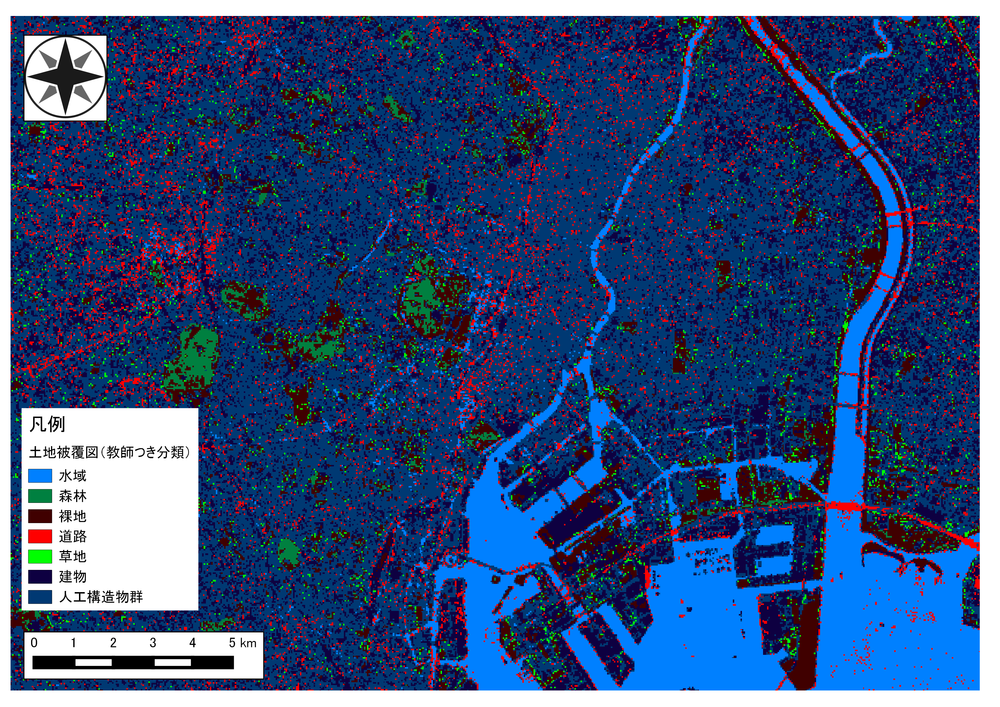

# 課題：リモートセンシングとその解析
　この実習では、リモートセンシングとその解析入門としてLANDSATの衛星画像を用いて、衛星画像データのダウンロードとRGB合成や土地被服図の作成を行います。実習で使われる用語や概念は、[地理情報科学教育用スライド（GIScスライド）]の2章を参照してください。
　手順とGISオープン教材の[リモートセンシングとその解析]の教材を参考に、完成例のような地図が作成できれば実習完了となります。

**実習用データ**

LANDSAT-8（2014-12-09T17:19:28Z）

**Menu**
---
- [衛星画像データのダウンロードとRGB合成](#衛星画像データのダウンロードとRGB合成)
- [土地被覆図](#土地被覆図)

---

## 衛星画像データのダウンロードとRGB合成
　以下の手順と[リモートセンシングとその解析]教材を参考に、衛星画像データ（LANDSAT-8）のダウンロードとRGB合成を行いフォールスカラー、ナチュラルカラー、トゥルースカラー図を作成してください。また、「それぞれの図が何を示すものか」について400字程度でまとめて下さい（光学センサ、波長帯、反射特性などの語句を用いることが望ましい）。

**手順**
1. [LandBrowser]を利用して、LANDSAT-8の衛星画像をダウンロードする（場所や時期は任意で選択する）
2. MultiSpecをインストールする
3. MultiSpecで画像を読み込み、フォールスカラー、ナチュラルカラー、トゥルースカラーのカラーコンポジットを作成する
4. 各図が何を示す図であるかをまとめる

[△メニューへもどる]

---

## 土地被覆図
　以下の手順と[リモートセンシングとその解析]教材を参考に、ダウンロードした衛星画像データ（LANDSAT-8）をもちいて教師つき分類を行い、土地被服図を作成してください。土地被服図のレイアウトには、QGISを用いてください。

**完成例**

**手順**
1. MultiSpecで衛星画像データを読み込む
2. 教師つき分類の項目を参考にトレーニングエリアを作成する
3. 教師つき分類を行い、ラスタデータを出力する
4. QGISで土地被覆図をレイアウトする

[△メニューへもどる]

---

#### 完成例で使用したデータ
本ページで使用しているデータの出典については、該当する教材よりご確認ください。

[△メニューへもどる]:空間データ.md#menu
[作業メモ]:https://github.com/yamauchi-inochu/demo/blob/master/GISオープン教材/実習課題/作業メモ.md
[QGISビギナーズマニュアル]:../../QGISビギナーズマニュアル/QGISビギナーズマニュアル.md
[GRASSビギナーズマニュアル]:../../GRASSビギナーズマニュアル/GRASSビギナーズマニュアル.md
[GISの基本概念]:../../01_GISの基本概念/GISの基本概念.md
[既存データの地図データと属性データ]:../../07_既存データの地図データと属性データ/既存データの地図データと属性データ.md
[空間データ]:../../08_空間データ/空間データ.md
[空間データの結合・修正]:../../10_空間データの統合・修正/空間データの統合・修正.md
[視覚的伝達]:../../21_視覚的伝達/視覚的伝達.md
[政府統計局e-stat]:https://www.e-stat.go.jp/SG1/estat/eStatTopPortal.do
[国土数値情報]:http://nlftp.mlit.go.jp/ksj/
[基本的な空間解析]:../../11_基本的な空間解析/基本的な空間解析.md
[ネットワーク解析]:../../12_ネットワーク解析/ネットワーク解析.md
[領域解析]:../../13_領域解析/領域解析.md
[点データの解析]:../../14_点データの解析/点データの解析.md
[ラスタデータの解析]:../../15_ラスタデータの分析/ラスタデータの分析.md
[空間補間]:../../18_空間補間/空間補間.md
[リモートセンシングとその解析]:../../06_リモートセンシングとその解析/リモートセンシングとその解析.md
[LandBrowser]:http://landbrowser.geogrid.org/landbrowser/
