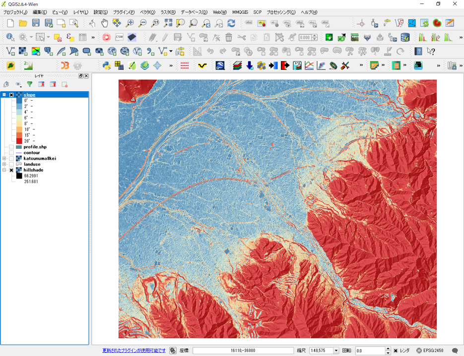

# 地形と土地利用のオーバーレイ分析（第5回～第7回）
　この教材では、地形情報と土地利用情報を重ね合わせて、視覚的に重ね合わせ分析する手法について紹介します。以下に示す手順を参考に学習例と同じ図を作成してください。GIS入門者は、この学習を始める前に、[GISの基本概念]と[QGISビギナーズマニュアル]を利用し、GISの基礎をマスターしておくことを推奨します。この教材は、主に実習を対象としているため、用語や理論に関する解説を省略している箇所があります。各実習にあたっては、参照教材の上段にある講義用教材（GIScスライド）を一読してから学習することを推奨します。

## 学習目標
- GISデータのダウンロード手法を理解する
- 地形情報の可視化手法を理解する
- 空間座標系について理解する

## 実習1：土地利用データのダウンロードと空間座標の変換（第5回）

### 手順
1.[既存の地図データと属性データ]の教材を参考に、国土数値情報から土地利用データをダウンロードする。
2.[空間データ]の教材を参考に、平面直角座標系に変換する
3.[QGISビギナーズマニュアル]を参考に、属性テーブルに基づいた土地利用の色分けを行う。

## 実習2:標高データのダウンロード、空間座標の変換、地形情報の可視化（第6回）

### 完成例

1. [既存の地図データと属性データ]の教材を参考に、標高データ(DEM)をダウンロードする。
2. [ラスタデータの分析]教材を参考に、標高データ（xml）をGeotiffに変換する。
3. [ラスタデータの分析]教材を参考に、空間座標の変換を行う。
4. [ラスタデータの分析]教材を参考に、地形データの可視化（段彩図、陰影図、傾斜区分図)を作成する。

## 実習3:作成データと地理院タイル等を用いた視覚的分析（第7回）

### 完成例

1. 実習1と2で作成したデータをQGISに読み込む。
2. [QGISビギナーズマニュアル]を参考に、タイルレイヤプラグインを利用して、地理院タイルを読み込む（右図）。[ラスタデータの分析]を参考に、鳥瞰図を作成する（左図）。
3. [ラスタデータの分析]を参考に、地形断面を作成するなど、実習1、2を踏まえて様々な情報を比較しながら、土地利用の特性について分析を行う。

### 動画で学ぶ
　上記の手順を動画にまとめています。GISの操作に自信がない方におすすめの学習法です。動画はYoutubeで公開しているため、画面の大きさや再生速度等を調節して、ご利用ください。

[動画が再生されない場合はこちら]()
> この動画は、GIS実習オープン教材の内容を援用して作成したものです。教材の更新が動画内容の更新よりも優先されるため、紹介するサイトのレイアウト等が異なる箇所は、適宜GIS実習オープン教材を参照してください。動画内では第3者の著作物を特別な許可なく、引用という形で使用しています。著作者からの異議申し立てがあった場合は、速やかに当該部分を削除します。

[GISオープン教材について]:../README.md
[GIS実習用基礎教材一覧]:../README.md
[GISの基本概念]:../01_GISの基本概念/GISの基本概念.md
[QGISビギナーズマニュアル]:../QGISビギナーズマニュアル/QGISビギナーズマニュアル.md
[GRASSビギナーズマニュアル]:../GRASSビギナーズマニュアル/GRASSビギナーズマニュアル.md
[リモートセンシングとその解析]:../06_リモートセンシングとその解析/リモートセンシングとその解析.md
[既存データの地図データと属性データ]:../07_既存データの地図データと属性データ/既存データの地図データと属性データ.md
[空間データ]:../08_空間データ/空間データ.md
[空間データベース]:../09_空間データベース/空間データベース.md
[空間データの統合・修正]:../10_空間データの統合・修正/空間データの統合・修正.md
[基本的な空間解析]:../11_基本的な空間解析/基本的な空間解析.md
[ネットワーク分析]:../12_ネットワーク分析/ネットワーク分析.md
[領域分析]:../13_領域分析/領域分析.md
[点データの分析]:../14_点データの分析/点データの分析.md
[ラスタデータの分析]:../15_ラスタデータの分析/ラスタデータの分析.md
[傾向面分析]:../16_傾向面分析/傾向面分析.md
[空間的自己相関]:../17_空間的自己相関/空間的自己相関.md
[空間補間]:../18_空間補間/空間補間.md
[空間相関分析]:../19_空間相関分析/空間相関分析.md
[空間分析におけるスケール]:../20_空間分析におけるスケール/空間分析におけるスケール.md
[視覚的伝達]:../21_視覚的伝達/視覚的伝達.md
[参加型GISと社会貢献]:../26_参加型GISと社会貢献/参加型GISと社会貢献.md
[python初級]:../python初級/python初級.md
[インターネットの活用に関する教材]:../インターネットの活用/README.md
[Carto]:../インターネットの活用/Carto/Carto.md
[Cesium]:../インターネットの活用/Cesium/Cesium.md
[Googleマイマップ]:../インターネットの活用/Googleマイマップ/Googleマイマップ.md
[Leaflet]:../インターネットの活用/Leaflet/Leaflet.md
[ArcGIS API for JavaScript]:../インターネットの活用/arcgisapi4js/arcgisapi4js.md
[OpenLayers]:../インターネットの活用/OpenLayers/OpenLayers.md
[地理院地図]:../インターネットの活用/地理院地図/地理院地図.md
[D3.js]:../インターネットの活用/D3.js/D3.js.md
[GitHubビギナーズマニュアル]:../インターネットの活用/GitHubビギナーズマニュアル/GitHubビギナーズマニュアル.md
[CZML]:../インターネットの活用/CZML/CZML.md
[KML]:../インターネットの活用/KML/KML.md
[GeoJSON]:../インターネットの活用/GeoJSON/GeoJSON.md
[地図タイル（ラスタ）]:../インターネットの活用/rastertile/rastertile.md
[GISと関連した機材の活用]:../機材の活用/README.md
[UAV]:../機材の活用/UAV/uav.md
[3Dプリンタ]:../機材の活用/3Dプリンタ/3Dプリンタ.md
[スマートフォン]:../機材の活用/スマートフォン/スマートフォン.md
[タブレット]:../機材の活用/タブレット/タブレット.md
[課題ページ（全14回）]:../課題/README.md
[地形環境分析のためのQGIS入門]:../課題/1day実習コース/1day実習コース.md
[第1回・GIS入門]:../課題/課題_GIS入門.md
[第2回・既存データの地図データと属性データ]:../課題/課題_既存データの地図データと属性データ.md
[第3回・空間データ]:../課題/課題_空間データ.md
[第4回・空間データの統合・修正]:../課題/課題_空間データの統合・修正.md
[第5回・視覚的伝達]:../課題/課題_視覚的伝達.md
[第6回・基本的な空間解析]:../課題/課題_基本的な空間解析.md
[第7回・ネットワーク分析]:../課題/課題_ネットワーク分析.md
[第8回・領域分析]:../課題/課題_領域分析.md
[第9回・点データの分析]:../課題/課題_点データの分析.md
[第10回・空間データベース]:../課題/課題_空間データベース.md
[第11回・ラスタデータの分析]:../課題/課題_ラスタデータの分析.md
[第12回・空間補間]:../課題/課題_空間補間.md
[第13回・リモートセンシングとその解析]:../課題/課題_リモートセンシングとその解析.md
[第14回・参加型GISと社会貢献]:../課題/課題_参加型GISと社会貢献.md
[高校教員向け教材]:../高校教員向け教材/README.md
[日本と世界の統計情報の可視化]:../高校教員向け教材/日本と世界の統計情報の可視化.md
[地形と土地利用のオーバーレイ分析]:../高校教員向け教材/地形と土地利用のオーバーレイ分析.md
[衛星画像を用いた環境変化地図の作成]:../高校教員向け教材/衛星画像を用いた環境変化地図の作成.md
[身近な地域の調査のためのフィールドワーク]:../高校教員向け教材/fieldwork.md
[防災教育で利活用可能な簡易Web地図の作成]:../高校教員向け教材/webmap.md
[講義用教材]:../既存資料/README.md
[本プロジェクトについて]:../本プロジェクトについて.md
[利用規約]:../利用規約.md
[教材編集について]:../教材編集について.md
[その他のライセンスについて]:../その他のライセンスについて.md
[よくある質問とエラー]:../よくある質問とエラー/よくある質問とエラー.md
[用語集]:../用語集/用語集.md
