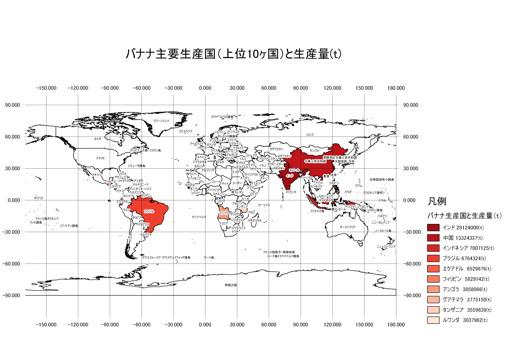
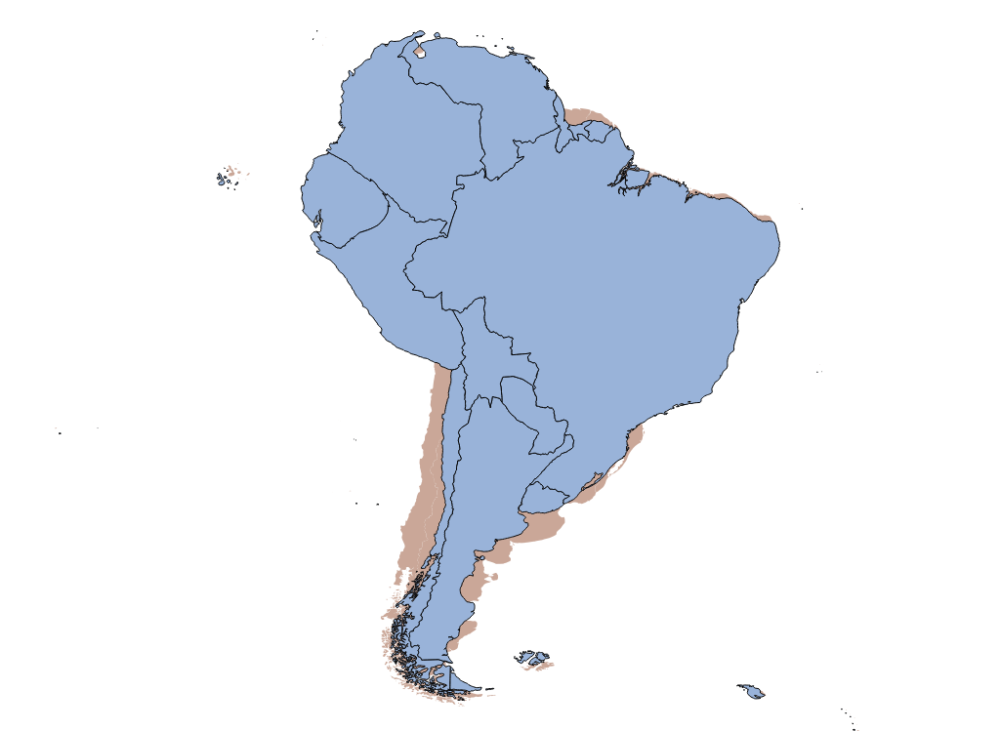

# 日本と世界の統計情報の可視化（第2回～4回）
　この教材では、統計情報を地図と組み合わせて可視化する手法について紹介します。以下に示す手順を参考に学習例と同じ図を作成してください。GIS入門者は、この学習を始める前に、[GISの基本概念]と[QGISビギナーズマニュアル]を利用し、GISの基礎をマスターしておくことを推奨します。この教材は、主に実習を対象としているため、用語や理論に関する解説を省略している箇所があります。各実習にあたっては、参照教材の上段にある講義用教材（GIScスライド）を一読してから学習することを推奨します。

## 学習目標
- GISデータのダウンロード手法を理解する
- 統計情報を境界データを結合して表示す手法を理解する
- 階級区分図やカルトグラムのような地図表現の技法を理解する

## 実習1 : 静岡県牧之原市の町丁目ごとの高齢者の人口密度を算出する(第2回)
　この実習では、以下の図を作成する手法について、GIS実習オープン教材を援用して解説します。学習例のデータは、任意の地域に置き換えて学習しても構いません。

### 手順
1. [既存データの地図データと属性データ]の教材を参考に、ベースとなる境界データを[e-stat]から入手する。ここでは牧之原市（世界測地系平面直角座標系　シェープファイル ）をダウンロードする。
2. [視覚的伝達]の教材を参考に、ダウンロードしたデータの人口と面積をもとに人口密度（1㎢あたり）を計算する。
3. 算出した人口密度をもとに、階級区分を行い、それに応じて視覚化する。
4. [QGISビギナーズマニュアル]を参考に、地図をレイアウトする。

### 動画で学ぶ
　上記の手順を動画にまとめています。GISの操作に自信がない方におすすめの学習法です。動画はYoutubeで公開しているため、画面の大きさや再生速度等を調節して、ご利用ください。

<iframe width="560" height="315" src="https://www.youtube.com/embed/ACRC1SkGNSI" frameborder="0" allow="autoplay; encrypted-media" allowfullscreen></iframe>

[動画が再生されない場合はこちら](https://www.youtube.com/watch?v=ACRC1SkGNSI)

> この動画は、GIS実習オープン教材の内容を援用して作成したものです。教材の更新が動画内容の更新よりも優先されるため、紹介するサイトのレイアウト等が異なる箇所は、適宜GIS実習オープン教材を参照してください。動画内では、第3者の著作物を引用という形で使用しています。著作者からの異議申し立てがあった場合は、速やかに当該部分を削除します。

## 実習2:世界の境界データを用いた統計情報の可視化(第3回)
　この実習では、以下の図を作成する手法について、GIS実習オープン教材を援用して解説します。学習例のデータは、任意の地域に置き換えて学習しても構いません。

### 手順
1. [実習データ](https://github.com/gis-oer/datasets/blob/master/vector/world_ja.zip)をダウンロードする。
2. 属性―テーブルを開き、編集モード＞新規にフィールドを作成する。
3. [外務省のホームページ:バナナの生産量の多い国](https://www.mofa.go.jp/mofaj/kids/ranking/banana.html)を参考に、属性情報を入力する(生産量は(t)とする)。ランキングに該当しない国は0とする。
4. [QGISビギナーズマニュアル]を参考に、地図をレイアウトする。緯線と経線を表示したい場合は、[よくある質問とエラー：緯線と経線の作成](../よくある質問とエラー/よくある質問とエラー.md)を参照。

### 動画で学ぶ
　上記の手順を動画にまとめています。GISの操作に自信がない方におすすめの学習法です。動画はYoutubeで公開しているため、画面の大きさや再生速度等を調節して、ご利用ください。

<iframe width="560" height="315" src="https://www.youtube.com/embed/ljT_Cxy56pg" frameborder="0" allow="autoplay; encrypted-media"
 allowfullscreen></iframe>

[動画が再生されない場合はこちら](https://www.youtube.com/watch?v=ljT_Cxy56pg)
> この動画は、GIS実習オープン教材の内容を援用して作成したものです。教材の更新が動画内容の更新よりも優先されるため、紹介するサイトのレイアウト等が異なる箇所は、適宜GIS実習オープン教材を参照してください。動画内では、第3者の著作物を引用という形で使用しています。著作者からの異議申し立てがあった場合は、速やかに当該部分を削除します。

## 実習3 : カルトグラムの作成（第4回)
　この実習では属性値を用いて、面積を変形させた以下のようなカルトグラムを作成する手法について、GIS実習オープン教材を援用して解説します。学習例のデータは、任意の地域に置き換えて学習しても構いません。

 ### 完成例

 

 ### 手順
 1. 実習2の課題データを用いて南米大陸を選択して書き出す
 2. 実習2を参考に、[外務省　中南米の国々](https://www.mofa.go.jp/mofaj/kids/ichiran/i_latinamerica.html)を参考に各国の人口を調べ、属性値を入力する。
 3. [視覚的伝達]の教材を参考に、カルトグラム（面積変形地図）を作成する。

[GISオープン教材について]:../README.md
[GIS実習用基礎教材一覧]:../README.md
[GISの基本概念]:../01_GISの基本概念/GISの基本概念.md
[QGISビギナーズマニュアル]:../QGISビギナーズマニュアル/QGISビギナーズマニュアル.md
[GRASSビギナーズマニュアル]:../GRASSビギナーズマニュアル/GRASSビギナーズマニュアル.md
[リモートセンシングとその解析]:../06_リモートセンシングとその解析/リモートセンシングとその解析.md
[既存データの地図データと属性データ]:../07_既存データの地図データと属性データ/既存データの地図データと属性データ.md
[空間データ]:../08_空間データ/空間データ.md
[空間データベース]:../09_空間データベース/空間データベース.md
[空間データの統合・修正]:../10_空間データの統合・修正/空間データの統合・修正.md
[基本的な空間解析]:../11_基本的な空間解析/基本的な空間解析.md
[ネットワーク分析]:../12_ネットワーク分析/ネットワーク分析.md
[領域分析]:../13_領域分析/領域分析.md
[点データの分析]:../14_点データの分析/点データの分析.md
[ラスタデータの分析]:../15_ラスタデータの分析/ラスタデータの分析.md
[傾向面分析]:../16_傾向面分析/傾向面分析.md
[空間的自己相関]:../17_空間的自己相関/空間的自己相関.md
[空間補間]:../18_空間補間/空間補間.md
[空間相関分析]:../19_空間相関分析/空間相関分析.md
[空間分析におけるスケール]:../20_空間分析におけるスケール/空間分析におけるスケール.md
[視覚的伝達]:../21_視覚的伝達/視覚的伝達.md
[参加型GISと社会貢献]:../26_参加型GISと社会貢献/参加型GISと社会貢献.md
[python初級]:../python初級/python初級.md
[インターネットの活用に関する教材]:../インターネットの活用/README.md
[Carto]:../インターネットの活用/Carto/Carto.md
[Cesium]:../インターネットの活用/Cesium/Cesium.md
[Googleマイマップ]:../インターネットの活用/Googleマイマップ/Googleマイマップ.md
[Leaflet]:../インターネットの活用/Leaflet/Leaflet.md
[ArcGIS API for JavaScript]:../インターネットの活用/arcgisapi4js/arcgisapi4js.md
[OpenLayers]:../インターネットの活用/OpenLayers/OpenLayers.md
[地理院地図]:../インターネットの活用/地理院地図/地理院地図.md
[D3.js]:../インターネットの活用/D3.js/D3.js.md
[GitHubビギナーズマニュアル]:../インターネットの活用/GitHubビギナーズマニュアル/GitHubビギナーズマニュアル.md
[CZML]:../インターネットの活用/CZML/CZML.md
[KML]:../インターネットの活用/KML/KML.md
[GeoJSON]:../インターネットの活用/GeoJSON/GeoJSON.md
[地図タイル（ラスタ）]:../インターネットの活用/rastertile/rastertile.md
[GISと関連した機材の活用]:../機材の活用/README.md
[UAV]:../機材の活用/UAV/uav.md
[3Dプリンタ]:../機材の活用/3Dプリンタ/3Dプリンタ.md
[スマートフォン]:../機材の活用/スマートフォン/スマートフォン.md
[タブレット]:../機材の活用/タブレット/タブレット.md
[課題ページ（全14回）]:../課題/README.md
[地形環境分析のためのQGIS入門]:../課題/1day実習コース/1day実習コース.md
[第1回・GIS入門]:../課題/課題_GIS入門.md
[第2回・既存データの地図データと属性データ]:../課題/課題_既存データの地図データと属性データ.md
[第3回・空間データ]:../課題/課題_空間データ.md
[第4回・空間データの統合・修正]:../課題/課題_空間データの統合・修正.md
[第5回・視覚的伝達]:../課題/課題_視覚的伝達.md
[第6回・基本的な空間解析]:../課題/課題_基本的な空間解析.md
[第7回・ネットワーク分析]:../課題/課題_ネットワーク分析.md
[第8回・領域分析]:../課題/課題_領域分析.md
[第9回・点データの分析]:../課題/課題_点データの分析.md
[第10回・空間データベース]:../課題/課題_空間データベース.md
[第11回・ラスタデータの分析]:../課題/課題_ラスタデータの分析.md
[第12回・空間補間]:../課題/課題_空間補間.md
[第13回・リモートセンシングとその解析]:../課題/課題_リモートセンシングとその解析.md
[第14回・参加型GISと社会貢献]:../課題/課題_参加型GISと社会貢献.md
[高校教員向け教材]:../高校教員向け教材/README.md
[日本と世界の統計情報の可視化]:../高校教員向け教材/日本と世界の統計情報の可視化.md
[地形と土地利用のオーバーレイ分析]:../高校教員向け教材/地形と土地利用のオーバーレイ分析.md
[衛星画像を用いた環境変化地図の作成]:../高校教員向け教材/衛星画像を用いた環境変化地図の作成.md
[身近な地域の調査のためのフィールドワーク]:../高校教員向け教材/fieldwork.md
[防災教育で利活用可能な簡易Web地図の作成]:../高校教員向け教材/webmap.md
[講義用教材]:../既存資料/README.md
[本プロジェクトについて]:../本プロジェクトについて.md
[利用規約]:../利用規約.md
[教材編集について]:../教材編集について.md
[その他のライセンスについて]:../その他のライセンスについて.md
[よくある質問とエラー]:../よくある質問とエラー/よくある質問とエラー.md
[用語集]:../用語集/用語集.md
