# リモートセンシングとその解析
　本教材は、「リモートセンシングとその解析」の実習用教材です。リモートセンシングは、対象物に触れずに離れた地点から対象を計測する技術を指します。リモートセンシングは、地表の高さの計測、植物活性度の調査、天候予測など様々な分野で利用されています。リモートセンシングに関する詳しい説明は、[地理情報科学教育用スライド（GIScスライド）]の2章を参照してください。以下では、リモートセンシングの入門として、衛星画像をダウンロードし、ソフトウェアを用いて画像分類をする手法等について解説します。

　課題形式で使用する場合は、本教材を一読した後、課題ページへお進みください。GIS初学者は、本教材を進める前に[GISの基本概念]の教材を確認しておいてください。本教材を使用する際は、[利用規約]をご確認いただき、これらの条件に同意された場合にのみご利用下さい。

[地理情報科学教育用スライド（GIScスライド）]:http://curricula.csis.u-tokyo.ac.jp/slide/2.html

**Menu**
------
- [衛星画像の取得](#衛星画像の取得)
- [SAC_Pluginの取得](#sac_pluginの取得)
- [RGB合成](#rgb合成)
- [NDVI](#ndvi)
- [教師つき分類](#教師つき分類)
- [教師なし分類](#教師なし分類)
- [MultiSpecによる分析](#multispecによる分析)

**スライド教材**

　本教材は、スライド形式[スライド_リモートセンシングとその解析_q3.4](https://github.com/gis-oer/new_version/raw/master/materials/06/06.pptx)としても、ご利用いただけます。

**データの出典**
本教材では、産総研LandBrowserをスクリーンショットとして利用しています。
"Image produced and distributed by AIST,  Source of Landsat 8 data: U.S. Geological Survey."

本教材では、産総研LandBrowserからダウンローしたLandsat8のデータを使用しています。
"The source data were downloaded from AIST's LandBrowser,
 (`https://landbrowser.airc.aist.go.jp/landbrowser/index.html`). Landsat 8 data courtesy of the U.S. Geological Survey."

----------

## 衛星画像のダウンロード
以下は、産業総合研究所の[LandBrowser]を用いて、衛星画像をダウンロードする手法について解説しています。産業総合研究所の[LandBrowser]にアクセスし、右上の「Display Menu」を確認する。「Display Menu」では、ダウンロードする画像の絞り込みができる。
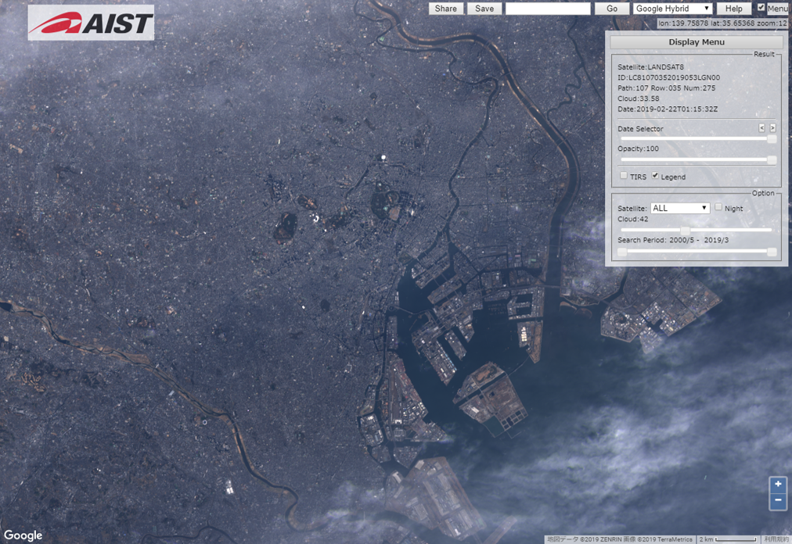

以下のでは、土地利用の分類を解説するため、雲の多い画像は使用しない。雲の量をcloud:5～10（雲の量）程度に設定し、画像を検索する。
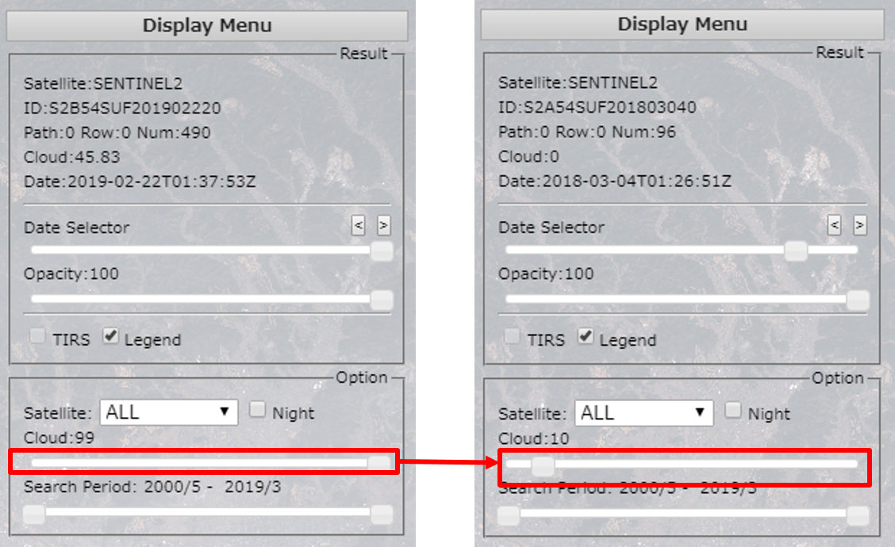

ダウンロードする画像の範囲を拡大する。ここでは、東京都のお台場周辺とする。
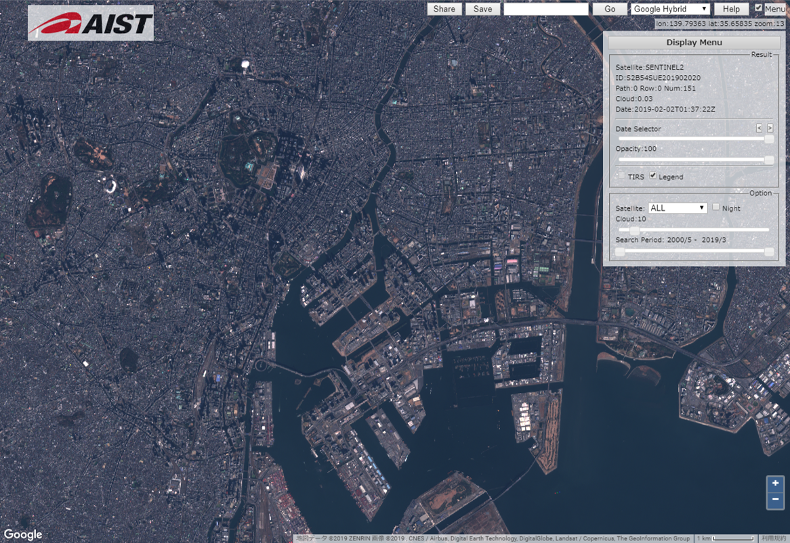

今回は、Landsat8の衛星画像をダウンロードするため、`Satellite＞LANDSAT8`を選択し、Date Selectorから画像を探す。
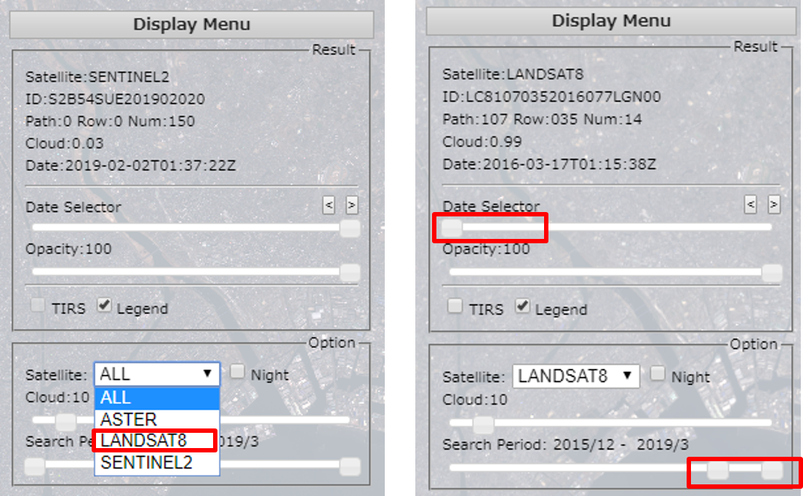

`Save`をクリックし画像をダウンロードする。
今回は、`Get Data Product`から、`Band1～Band7`をそれぞれクリックしダウンロードする。ここでダウンロードしたファイルは、一つのフォルダにまとめておく。Landsatのバンド構成については、[一般財団法人　リモートセンシング技術センター　衛星総覧](https://www.restec.or.jp/satellite/landsat-8)等を参照すると良い。
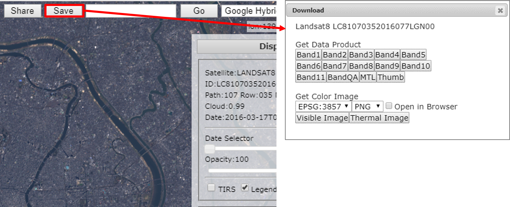

[▲メニューへもどる]

## SAC_Pluginの取得
以下では、QGISのSAC_Pluginを用いて、衛星画像の解析を行う。QGISを立ち上げ、`プラグイン＞プラグインの管理とインストール`から、Semi-Automatic Classification Pluginを検索し、インストールする。
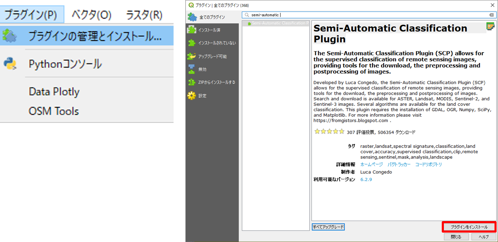

インストールが完了すると、以下のようなメニューが追加される。
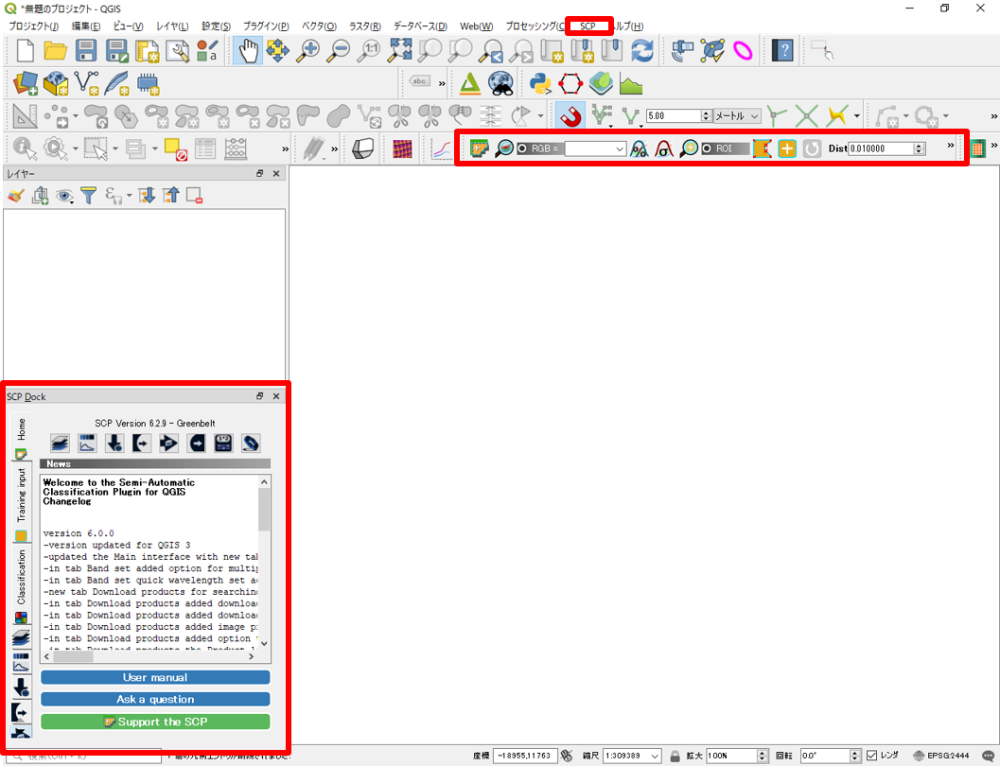

[▲メニューへもどる]

## RGB合成
 異なるバンドを用いて、カラーコンポジットを作成し、画像を視覚的に表現することができます。ここでは、トゥルースカラー、フォールスカラー、ナチュラルカラーのカラーコンポジットを作成する手法を解説します。

SCP Dock内の以下のアイコンをクリックし、ダウンロードしたLandsat8のデータをQGISにインポートする。
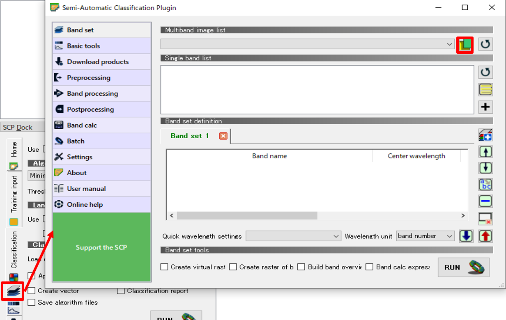

Band1~Band7のインポートが完了したら、`Create raster of band set`にチェックをつけ、`RUN`をクリックし、出力先フォルダを指定する。
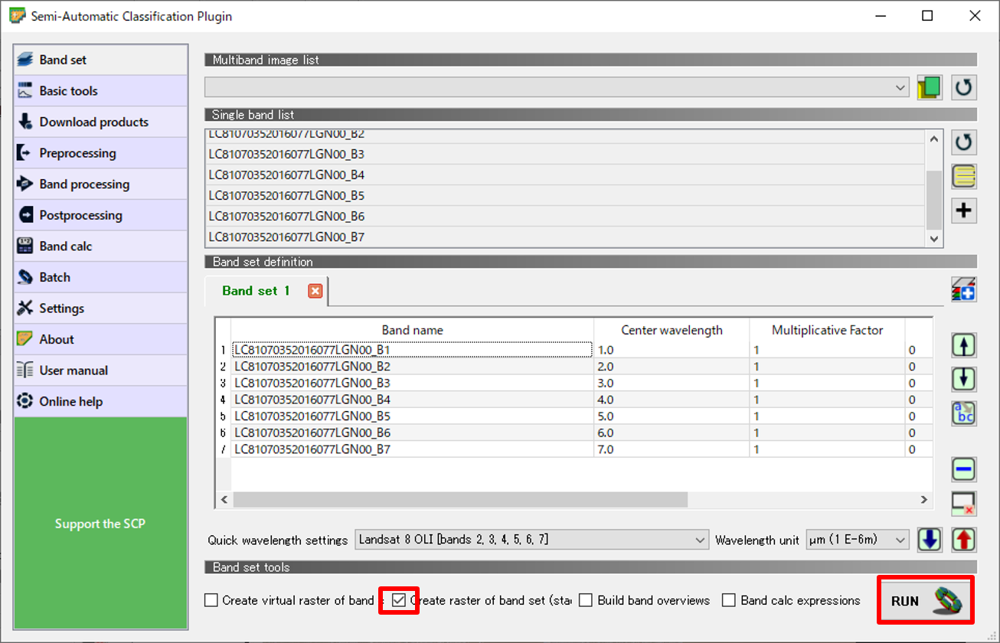

作成されたカラーコンポジットの`プロパティ＞シンボル体系`を開く。
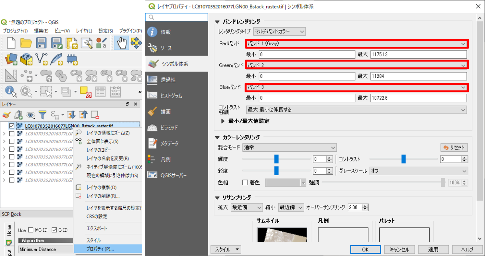

レンダリングタイプをマルチバンドカラーに設定し、`Redバンドにバンド4`、`Greenバンドにバンド3`、`Blueバンドにバンド2`をそれぞれ選択し、`OK`をクリックする。以下のようにトゥルーカラーが表示される。
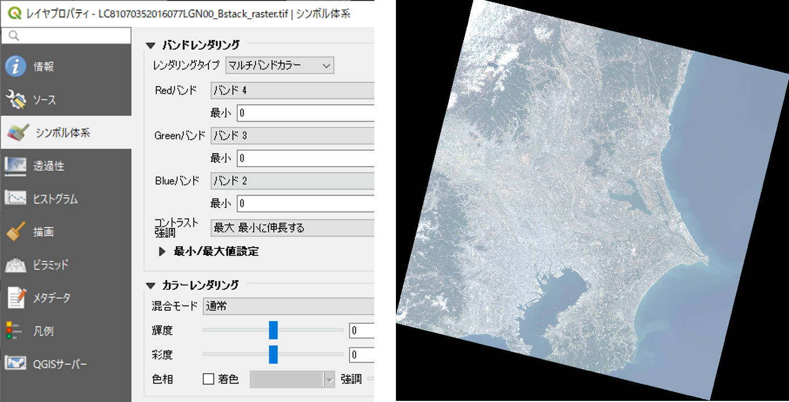

他のバンドを組み合わせることで、フォールスカラーやナチュラルカラーを表示させることができる。

フォールスカラーは、`Redバンドにバンド5`、`Greenバンドにバンド4`、`Blueバンドにバンド3`を選択する。　　　　　

ナチュラルカラーは、`Redバンドにバンド4`、`Greenバンドにバンド5`、`Blueバンドにバンド3`を選択する。
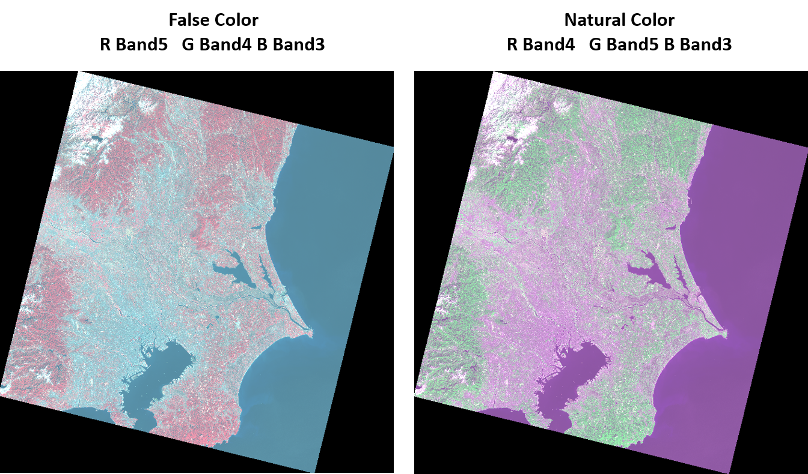

輝度を調整することで、より鮮明な画像を表示することができる。
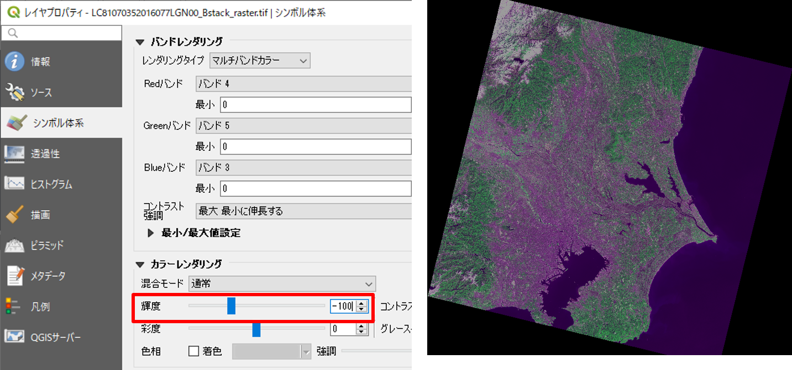

[▲メニューへもどる]

## NDVI
　以下では、Landsatの衛星画像からNDVI（Normalized Difference Vegetation Index）を算出する手法について解説しています。NDVIを算出することで、植物の分布量や活性量を知ることができます。NDVIをSemi-Automatic Classification Pluginで出力するには、まず、ウィンドから`Band calc`をクリックする。Expressionに、`( “raster5” - “raster4” ) / ( “raster5” + “raster4” ) @NDVI` を入力し、`Index calculation`が`NDVI`であることを確認する。最後に、`RUN`をクリックする。出力フォルダとファイル名を指定すると結果が保存される。
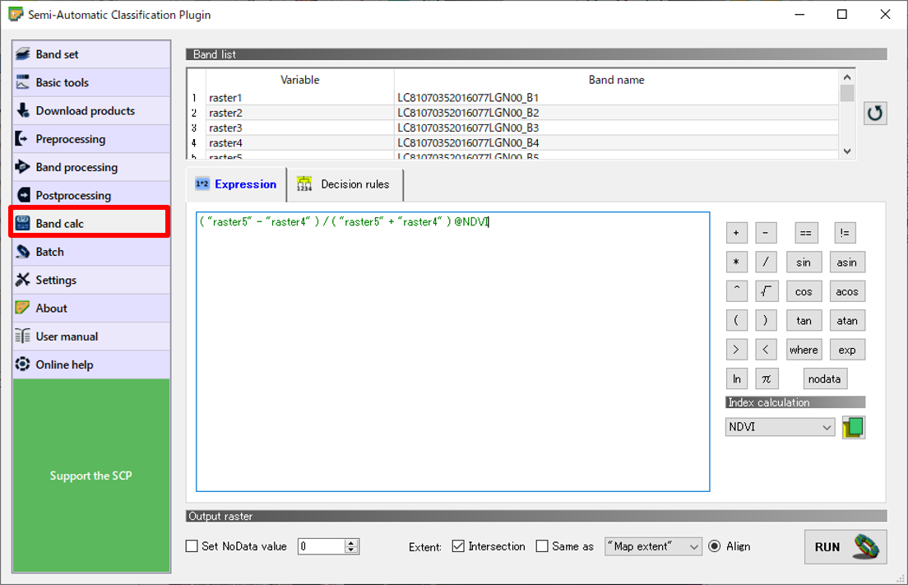

以下のように、NDVIが表示できた。植生活性度高い地域が赤系の色、低い地域が青系の色となるように`プロパティ＞シンボロジー`からスタイリングする。
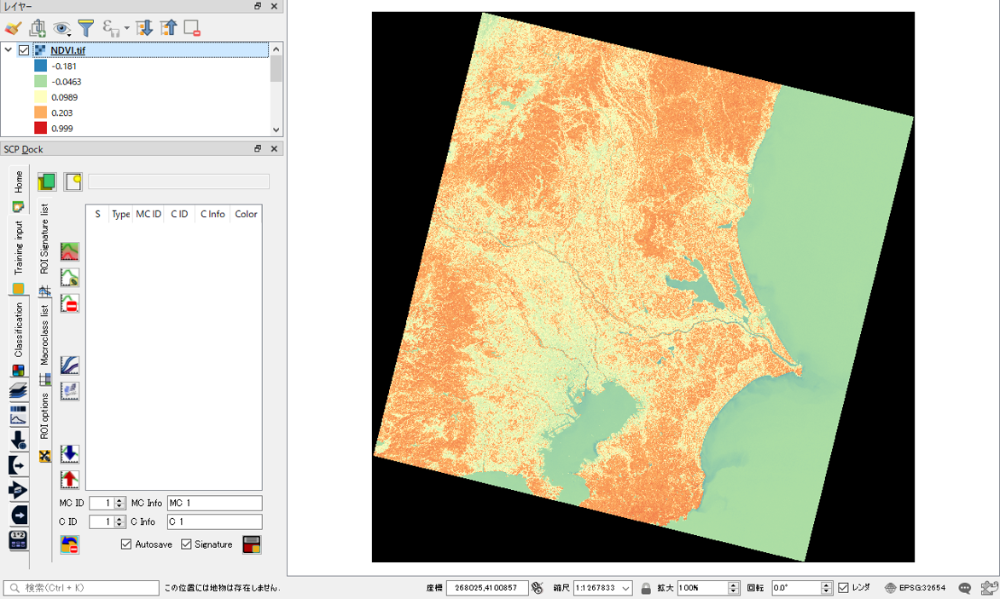

[▲メニューへもどる]

　
## 教師つき分類
　衛星画像をピクセル値に基づいて分類することで、土地被覆図が作成できます。以下では、教師つき分類を行い土地被覆図を作成する手法について解説しています。教師つき分類用のデータとして、`ラスタ＞抽出＞範囲を指定して切り抜き`を実行し、クリップされた領域のアイコンをクリックし、`キャンパス上で領域を指定する`をクリックし、抽出する範囲を選択した後、出力フォルダとファイル名を指定し、`実行`をクリックする。
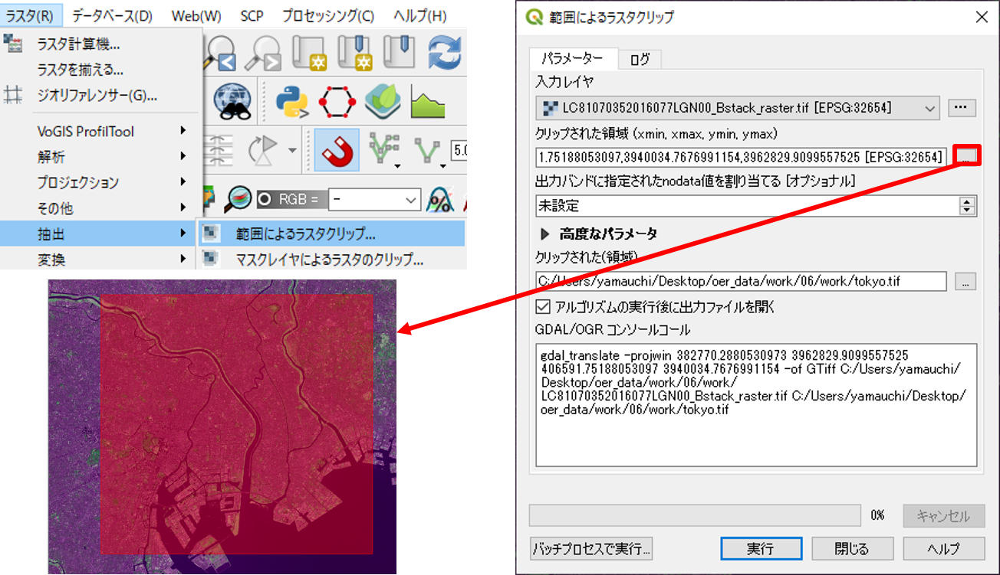

抽出した画像は、土地利用の状況が分かりやすいようにレイヤプロパティでトゥルーカラーに設定しておく。
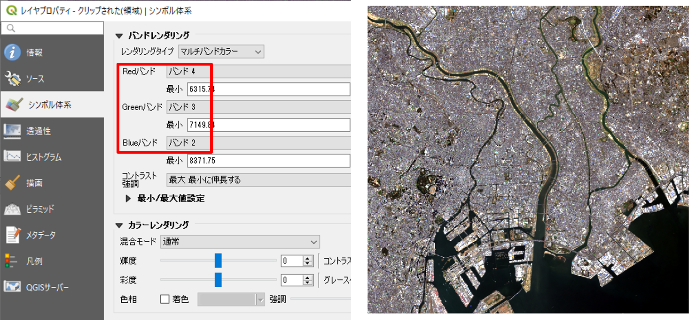

次に、以下の手順で、任意の範囲を抽出した衛星画像のデータを選択する。
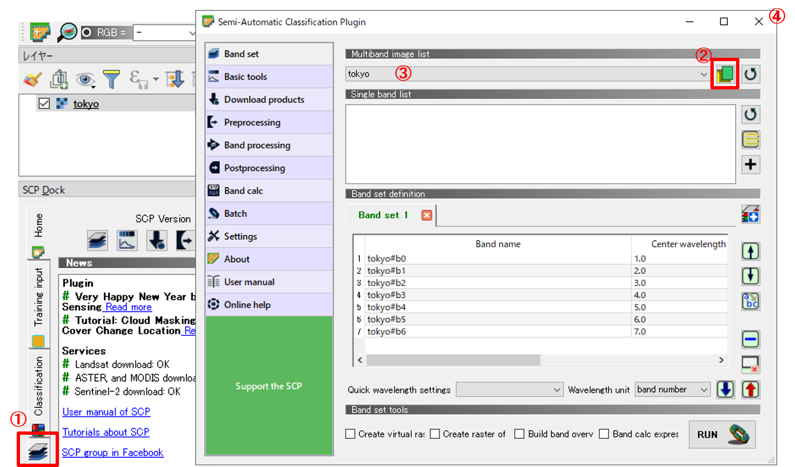

1. アイコンをクリックし、Semi-Automatic Classification Pluginを開く。
2. アイコンをクリックし、任意の範囲を抽出した衛星画像のデータを選択する。
3. 衛星画像データが表示される。
4. ウインドを閉じる。

以下の手順で、分類の基準となるトレーニングデータを作成する。
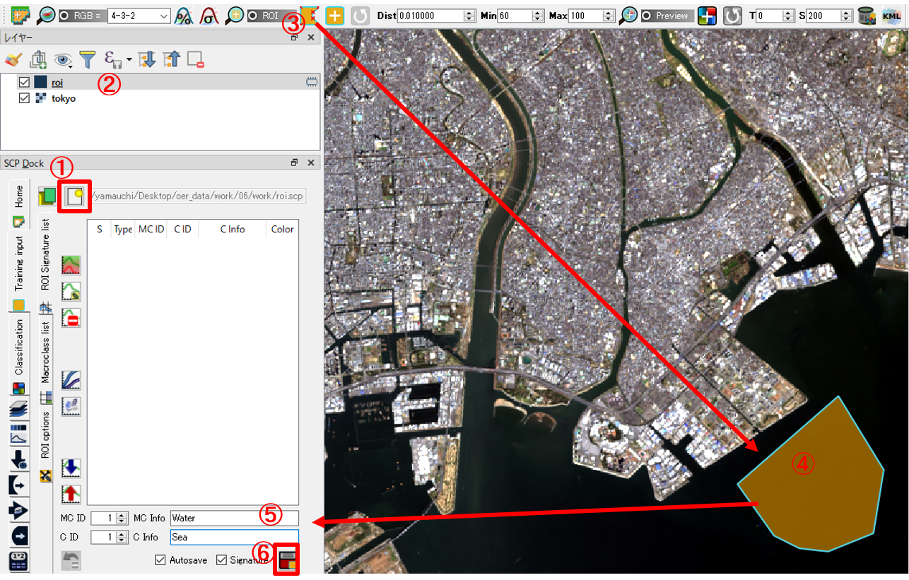

1. 「Training input」のタブのアイコンをクリックし、教師つき分類に必要なトレーニングデータ(サンプルデータ)を保存するファイルを指定する。
2. ファイルが表示されたところを確認する。
3. `roi`にチェックを入れる。
4. トレーニングデータとなる範囲をポリゴンで囲む。上図では水域（海）の範囲をポリゴンで囲んでいる。(ポリゴンを閉じるときは右クリック)
5. トレーニングデータの名称などの情報を入力する。
6. アイコンをクリックし、トレーニングデータを保存する。

上記の4〜6の手順を繰り返し、水域以外のトレーニングデータをポリゴンで抽出し、追加していく。色も調節できるため、土地被覆と対応した色を指定する。
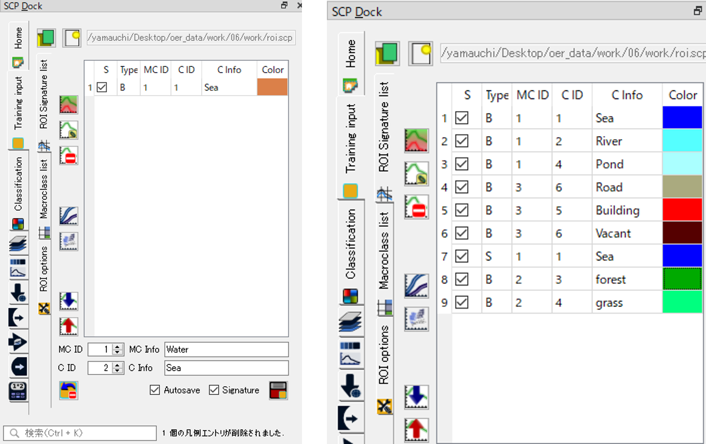

`Classification`タブを開き、Algorithmに`Spectral Angle Mapping`を選択し、Useの`Algorithm`にチェックを入れ、`RUN`をクリックし実行する。以下のように画像が分類できたことを確認する。
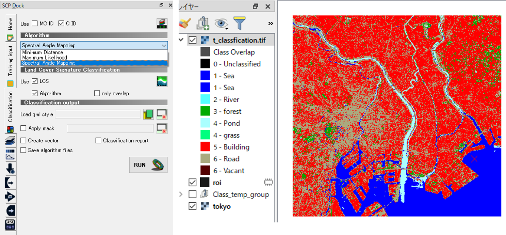

[▲メニューへもどる]

## 教師なし分類
以下では、トレーニングデータを利用しない教師なし分類の手法について解説します。あらかじめダウンロードした衛星画像（Band1～7）をQGISに読み込み、`プロセッシング> ツールボックス`から `i.cluster`を選択し、以下のようにパラメータを設定する。
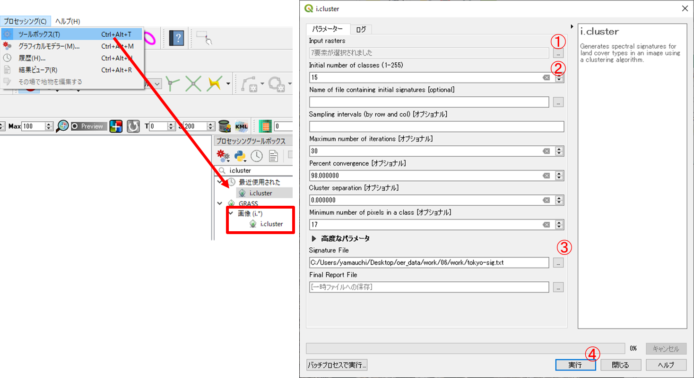

1. ダウンロードした衛星画像（Band1～7）を指定する。
2. クラスの初期数を指定する（今回は15とした）。
3. Signature File で保存先のファイルを指定する。
4. `実行`をクリックする。

`プロセッシング＞ツールボックス`から`i.maxlik`を選択し、以下のようにパラメータを設定する。
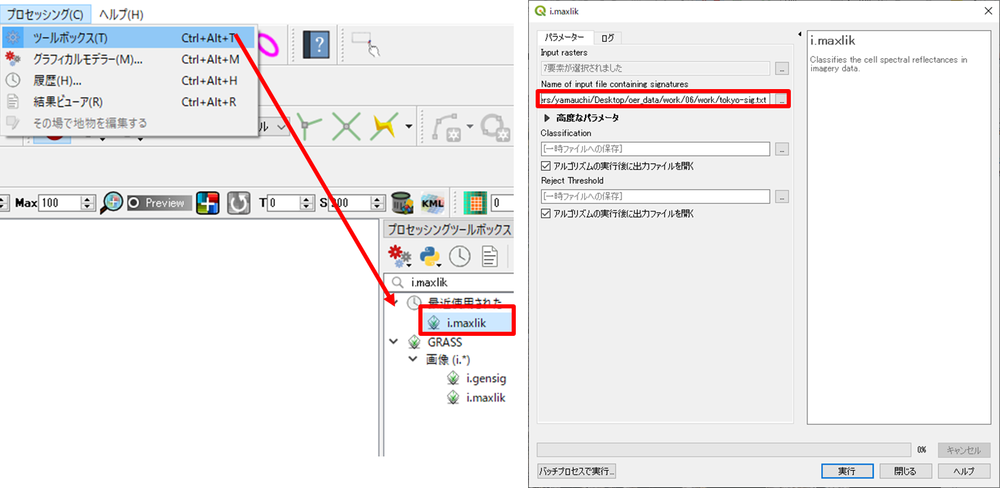

1. 先ほど出力したSignature File を指定し、（このとき、ファイル検索がTXTファイルとなっているため、すべてのファイルとして検索するか、フルパスを入力する）。
2. `実行`をクリックする。

以下のように画像が分類されたことを確認する。
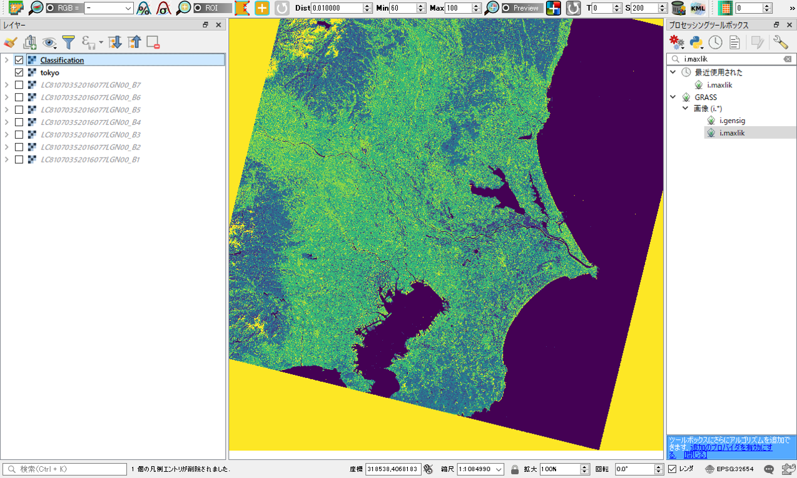

## MultiSpecによる分析
　以下では、MultiSpecを用いた、衛星画像の解析を解説します。以下は、前記のQGISによる内容をMultiSpecで実施したものです。衛星画像を取得した後、以下の実習を行ってください。MultiSpecは、Purdue Universityで開発されているソフトウェアです。まず、[MultiSpecの公式サイト]にアクセスし、ソフトウェアをダウンロードし、インストールします。

### MultiSpecの起動
MultiSpecW32.exeをダブルクリックし、 MultiSpecを起動する。`File>Open Image`から画像を読み込む。

### RGB合成
以下では、LANDSATの異なるバンドの画像を用いて、カラーコンポジットを作成し、画像を視覚的に表現する手法について解説しています。バンドを組み合わせることで、フォールスカラー、トゥルースカラー、ナチュラルカラーのカラーコンポジットを作成する手法の解説をしています。

`Processor>Display image…`からR5,G4,B3を入力し、フォールスカラーを表示する。

同じ方法で、左：トゥルースカラー(R4,G3,B2)と右：ナチュラルカラー(R4,G5,B3)を設定する。

### NDVI
以下では、LANDSATの衛星画像からNDVI（Normalized Difference Vegetation Index）を算出する手法について解説しています。NDVIを算出することで、植物の分布量や活性量を知ることができます。

ProcesorからReformatを選択し、`Open Image File Format`をクリックする。`Transform Data`にチェックを入れ、`New Channel from General algebraic Transformation`をチェックする。NDVIを求める式を入力し、OKをクリックし、保存する。

※NDVI として計算される値は0 から200 の間の値になる。

先ほど計算したファイルを開き、Typeを選択し、分類数を設定し、OKをクリックする。
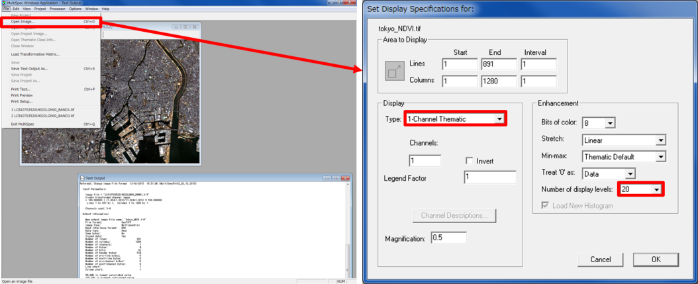

左下のカラーパレットより、MODIS NDVI を選択する。
ＮＤＶＩが表示できた。緑の濃い部分が植生活性度高い地域となる。

## 教示つき分類と教師なし分類
LANDSATの画像を画像分類することによって、土地被覆図の作成ができます。以下では、教師つき分類と教師なし分類を行い土地被覆図を作成する手法について解説しています。

### 教師つき分類
ProcessorからStatisticsを選択する。Channels to UseをAllにして、OKをクリックする。右端のようなウインドウが表示されるので、Polygon Enterにチェックを入れる。
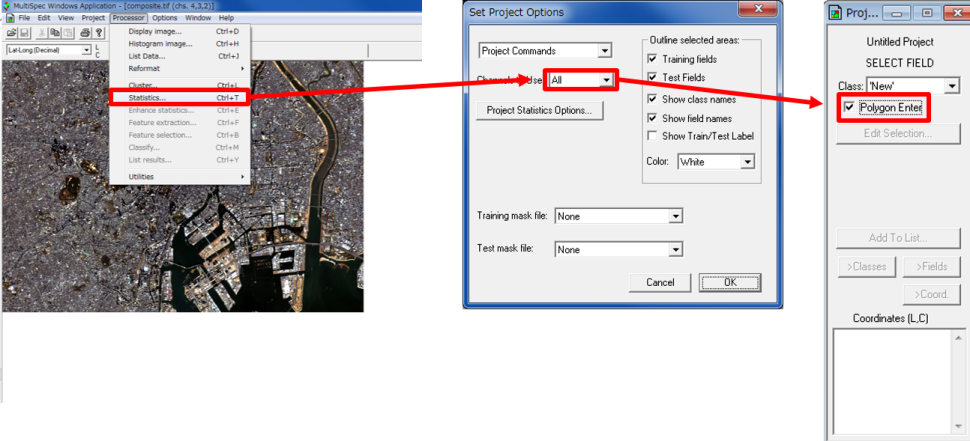

次に、画像からトレーニングエリアを抽出する。抽出ができたら、Add to Listをクリックし、Class名などを入力する。同じ要領で複数のトレーニングエリアを作成後、Update Project Statsをクリックする。

ProcessorからClassifyを選択し、最尤法（Maximum Likelihood）で分類を行う。右上のように設定し、OKをクリックし、保存先を指定する。

画像をFileから読み込みなおすと、右のように分類つきで表示される。凡例の色をクリックすると、色が変更でき、名前をクリックすると名前が変更できる。色の指定ができたら、FileからSave image To GeoTIFF　Asをクリックする。

### 教師なし分類
`Processor > Open Image File Format`を選択する。ChannelsをAllにして、OKをクリックする（コンポジットバンドの作成）。
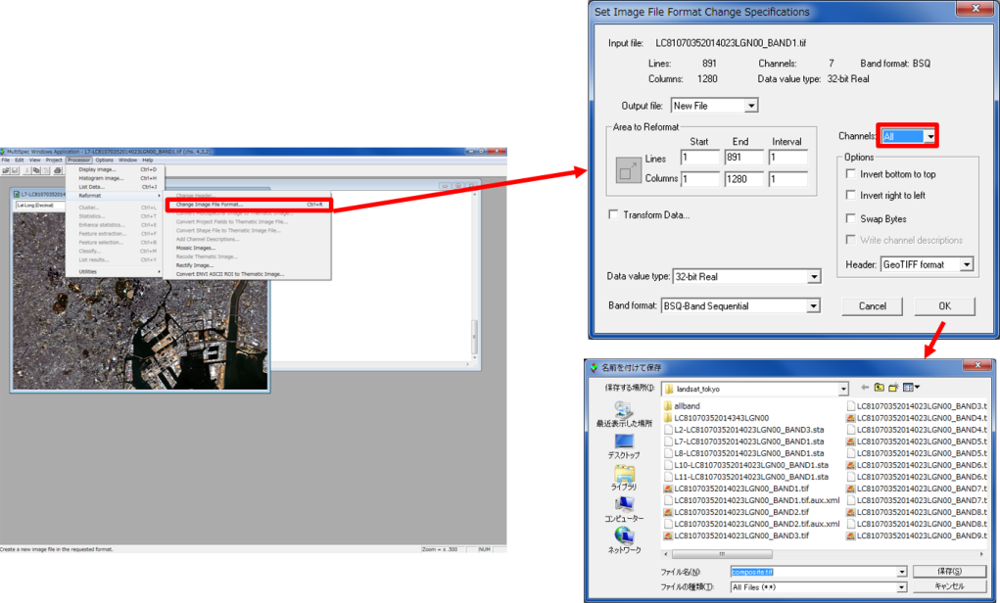

出力したデータを読み込み、`Processor > Cluster`を選択する。ISODATAにチェックを入れ、分類数（任意で指定する）を10にして、OKをクリックする。必要項目にチェックをいれ、OKをクリックすると分類が開始する。

画像をFileから読み込みなおすと、右のように分類つきで表示される。凡例の色をクリックすると、色が変更でき、名前をクリックすると名前が変更できる。

空中写真や現地調査をもとに土地利用の分類を行う。shiftキーをおしながら、凡例の色をクリックすると選択した色が消える。今回は、水域、道路、森林、草地、裸地、人工構造物地域などに分類する。色の指定ができたら、`File > Save image To GeoTIFF　As`をクリックする。

QGISで画像を読み込み、[QGISビギナーズマニュアル]を参考に凡例などを設定し、地図のレイアウトを行う。

ファイルから新規プリントコンポーザを開き、レイアウトを整える。コンポーザー名は任意で入力する。
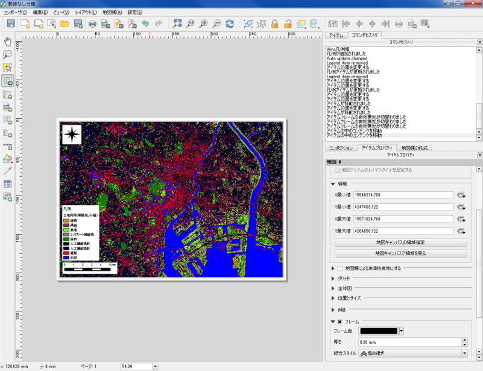

[▲メニューへもどる]

#### この教材の[課題ページ_リモートセンシングとその解析]へ進む

#### ライセンスに関する注意事項
本教材で利用しているキャプチャ画像の出典やクレジットについては、[その他のライセンスについて]よりご確認ください。

[▲メニューへもどる]:./06.md#Menu
[MultiSpecの公式サイト]:https://engineering.purdue.edu/~biehl/MultiSpec/
[LandBrowser]:http://landbrowser.geogrid.org/landbrowser/
[利用規約]:../../policy.md
[その他のライセンスについて]:../license.md
[よくある質問とエラー]:../questions/questions.md

[GISの基本概念]:../00/00.md
[QGISビギナーズマニュアル]:../QGIS/QGIS.md
[GRASSビギナーズマニュアル]:../GRASS/GRASS.md
[リモートセンシングとその解析]:../06/06.md
[既存データの地図データと属性データ]:../07/07.md
[空間データ]:../08/08.md
[空間データベース]:../09/09.md
[空間データの統合・修正]:../10/10.md
[基本的な空間解析]:../11/11.md
[ネットワーク分析]:../12/12.md
[領域分析]:../13/13.md
[点データの分析]:../14/14.md
[ラスタデータの分析]:../15/15.md
[傾向面分析]:../16/16.md
[空間的自己相関]:../17/17.md
[空間補間]:../18/18.md
[空間相関分析]:../19/19.md
[空間分析におけるスケール]:../20/20.md
[視覚的伝達]:../21/21.md
[参加型GISと社会貢献]:../26/26.md

[地理院地図]:https://maps.gsi.go.jp
[e-Stat]:https://www.e-stat.go.jp/
[国土数値情報]:http://nlftp.mlit.go.jp/ksj/
[基盤地図情報]:http://www.gsi.go.jp/kiban/
[地理院タイル]:http://maps.gsi.go.jp/development/ichiran.html

[スライド_GISの基本概念]:https://github.com/gis-oer/gis-oer/raw/master/materials/00/00.pptx
[スライド_QGISビギナーズマニュアル]:https://github.com/gis-oer/gis-oer/raw/master/materials/QGIS/QGIS.pptx
[スライド_GRASSビギナーズマニュアル]:https://github.com/gis-oer/gis-oer/raw/master/materials/GRASS/GRASS.pptx
[スライド_リモートセンシングとその解析]:https://github.com/gis-oer/gis-oer/raw/master/materials/06/06.pptx
[スライド_既存データの地図データと属性データ]:https://github.com/gis-oer/gis-oer/raw/master/materials/07/07.pptx
[スライド_空間データ]:https://github.com/gis-oer/gis-oer/raw/master/materials/08/08.pptx
[スライド_空間データベース]:https://github.com/gis-oer/gis-oer/raw/master/materials/09/09.pptx
[スライド_空間データの統合・修正]:https://github.com/gis-oer/gis-oer/raw/master/materials/10/10.pptx
[スライド_基本的な空間解析]:https://github.com/gis-oer/gis-oer/raw/master/materials/11/11.pptx
[スライド_ネットワーク分析]:https://github.com/gis-oer/gis-oer/raw/master/materials/12/12.pptx
[スライド_領域分析]:https://github.com/gis-oer/gis-oer/raw/master/materials/13/13.pptx
[スライド_点データの分析]:https://github.com/gis-oer/gis-oer/raw/master/materials/14/14.pptx
[スライド_ラスタデータの分析]:https://github.com/gis-oer/gis-oer/raw/master/materials/15/15.pptx
[スライド_空間補間]:https://github.com/gis-oer/gis-oer/raw/master/materials/18/18.pptx
[スライド_視覚的伝達]:https://github.com/gis-oer/gis-oer/raw/master/materials/21/21.pptx
[スライド_参加型GISと社会貢献]:https://github.com/gis-oer/gis-oer/raw/master/materials/26/26.pptx

[課題ページ_QGISビギナーズマニュアル]:../tasks/t_qgis_entry.md
[課題ページ_GRASSビギナーズマニュアル]:../tasks/t_grass_entry.md
[課題ページ_リモートセンシングとその解析]:../tasks/t_06.md
[課題ページ_既存データの地図データと属性データ]:../tasks/t_07.md
[課題ページ_空間データ]:../tasks/t_08.md
[課題ページ_空間データベース]:../tasks/t_09.md
[課題ページ_空間データの統合・修正]:../tasks/t_10.md
[課題ページ_基本的な空間解析]:../tasks/t_11.md
[課題ページ_ネットワーク分析]:../tasks/t_12.md
[課題ページ_領域分析]:../tasks/t_13.md
[課題ページ_点データの分析]:../tasks/t_14.md
[課題ページ_ラスタデータの分析]:../tasks/t_15.md
[課題ページ_空間補間]:../tasks/t_18.md
[課題ページ_視覚的伝達]:../tasks/t_21.md
[課題ページ_参加型GISと社会貢献]:../tasks/t_26.md
<h2 style="background-color:#F8F5FD;text-align:center;">教材の利用に関するアンケート</h2>　本プロジェクトでは、教材の改良を目的とした任意アンケートを実施しています。ご協力いただける方は、<a href="https://customform.jp/form/input/14328/">アンケート</a>にお進みください。ご協力のほどよろしくお願いいたします。  ※ 本アンケートの成果は、教材の改良のほか、学会での発表等の研究目的でも利用します。また、本アンケートでは、個人が特定できるような質問は設けておりません。
