# 空間データ
　本教材は、「空間データ」の実習用教材です。GISソフトウェア（QGIS）を用いて、空間座標の変換、ジオリファレンス、ジオコーディングについて解説しています。講義用教材として、[地理情報科学教育用スライド（GIScスライド）]の3章が参考になります。

　課題形式で使用する場合は、本教材を一読した後、課題ページへお進みください。GIS初学者は、本教材を進める前に[GISの基本概念]の教材を確認しておいてください。本教材を使用する際は、[利用規約]をご確認いただき、これらの条件に同意された場合にのみご利用下さい。

**Menu**
-------
- [空間座標の変換](#空間座標の変換)
- [ジオリファレンス](#ジオリファレンス)
- [ジオコーディング](#ジオコーディング)

**実習用データ**

実習をはじめる前に、[Sabae]をダウンロードしてください。

**スライド教材**

本教材は、[スライド_空間データ]としても、ご利用いただけます。

[Sabae]:https://github.com/gis-oer/datasets/raw/master/sabae.zip
[スライド_空間データ]:https://github.com/gis-oer/gis-oer/raw/master/materials/08/08.pptx

-------
## 空間座標の変換
　地理空間情報データ（GISで扱うことのできるデータ）は、測地系と座標系に基づいた位置情報を保持しています。測地系や座標系は様々なものがあります。そのため、複数のデータを扱う場合や地図上の単位に合わせて変換が必要になります。以下では、QGISでの変換手法を解説しています。空間座標系についての解説は、[地理情報科学教育用スライド（GIScスライド）]の3章や[GISの基本概念]の教材を参照してください。この実習を始める前に、[動画：座標変換の正誤事例]を参照し、以下の作業で誤った座標変換を行わないように注意してください。

[動画：座標変換の正誤事例]:https://youtu.be/jAHJNI5CiKw

※以下の教材で使用しているQGIS3.4では、JGD2011の変換のエラーがあるため、JGD2011のデータに対してJGD2000を割り当てている点に注意してください。

### 測地系変換
[Sabae]のデータを用いて、日本測地系から世界測地系へ変換する手法について解説しています。以下では、sabae_aed_tokyo（日本測地系 緯度経度）とsabae_aed_jgd2000（世界測地系　緯度経度）を使用します。

QGISを起動し、異なる測地系のデータを読み込む。
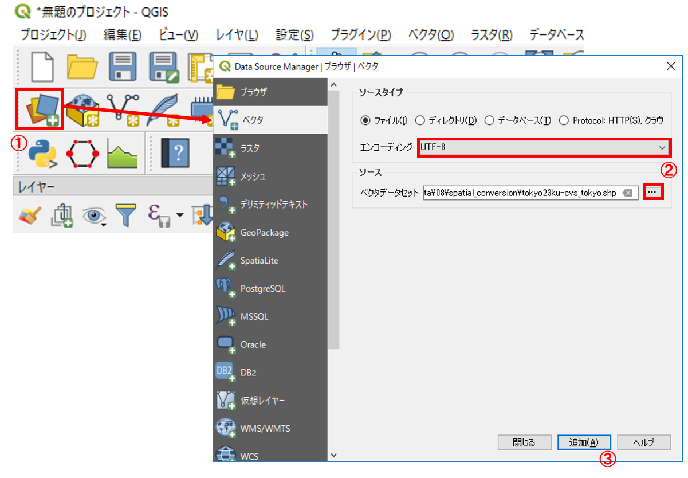

1. データソースマネージャを開く。
2. エンコーディングをUTF-8に設定し、ソースから、ダウンロードした日本測地系と世界測地系のshape（sabae_aed_jgd2000とsabae_aed_tokyo）を指定する。
3. 「追加」 をクリックする。

QGISが自動で、擬似的な位置あわせをしてしまうため、オンザフライ投影機能をオフにする。

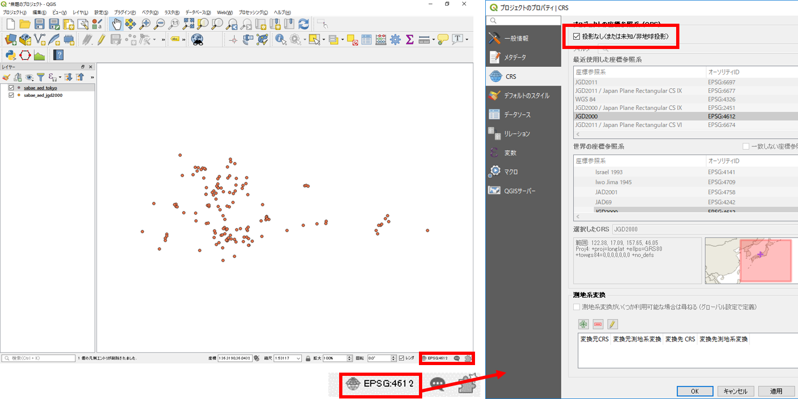
1. 右下のEPSGのボタンをクリックする。
2. 投影なしにチェックをつけ、オンザフライ投影を無効にする。

データは同じ場所のものにもかかわらず、測地系が異なるためずれて表示されてしまう。
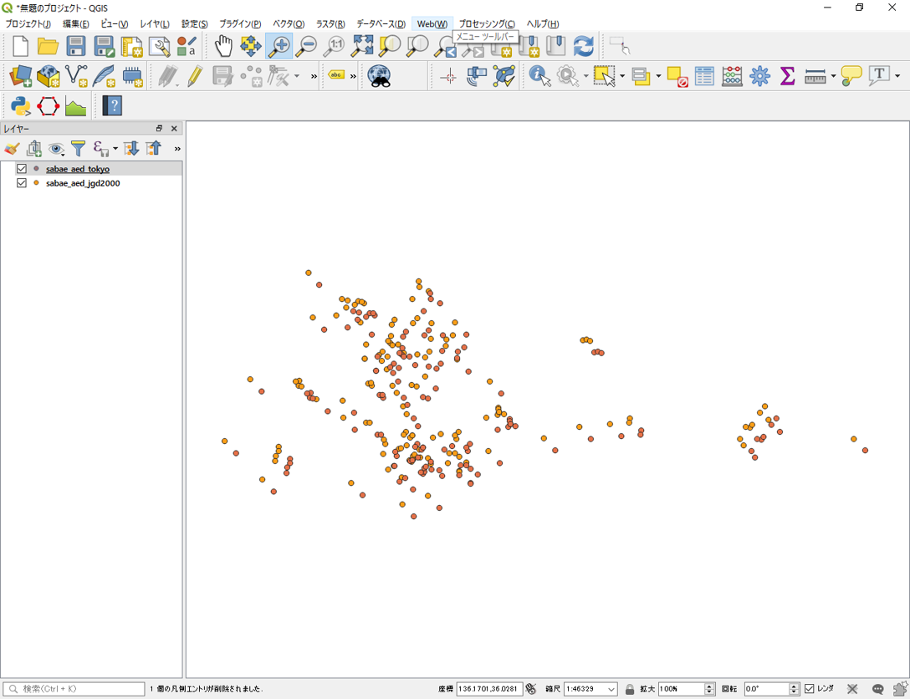

それぞれのレイヤの上で右クリックして、プロパティ（ソースのタブ）から座標系を確認する。
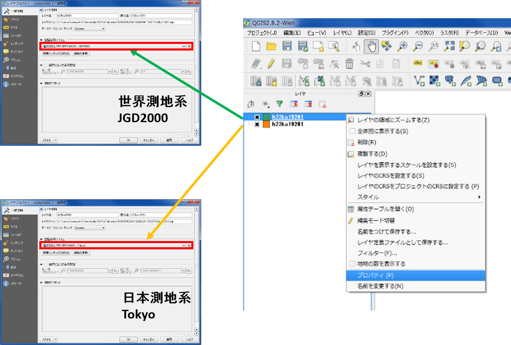

日本測地系を世界測地系へ変換する。
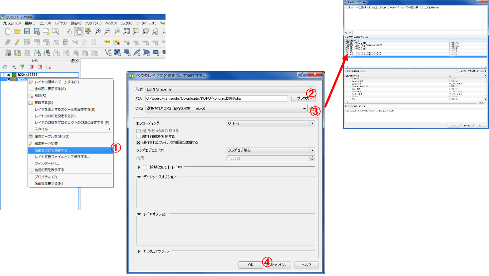

1. プロパティ＞エクスポート＞地物の保存をクリックする 。

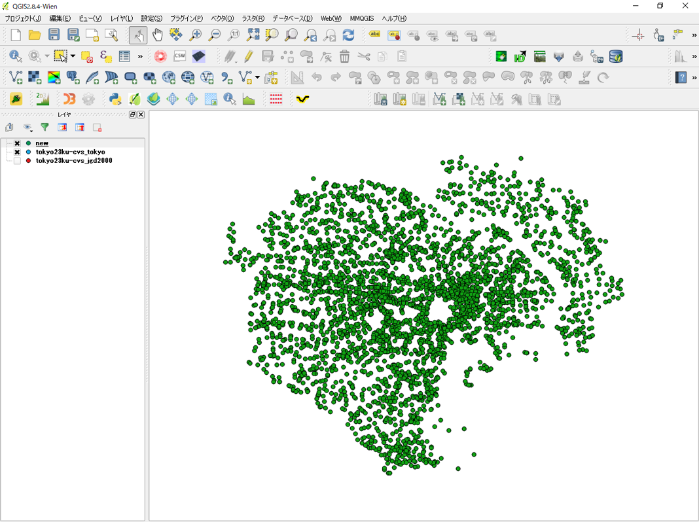

2. 新規レイヤの出力先と名前を選択する。
3. CRSを選択するために、図中の③をクリックし、フィルターからJGD2000を検索し、OKをクリックする。
4. OKをクリックする。

以下のように、測地系がJGD2000に変換された。
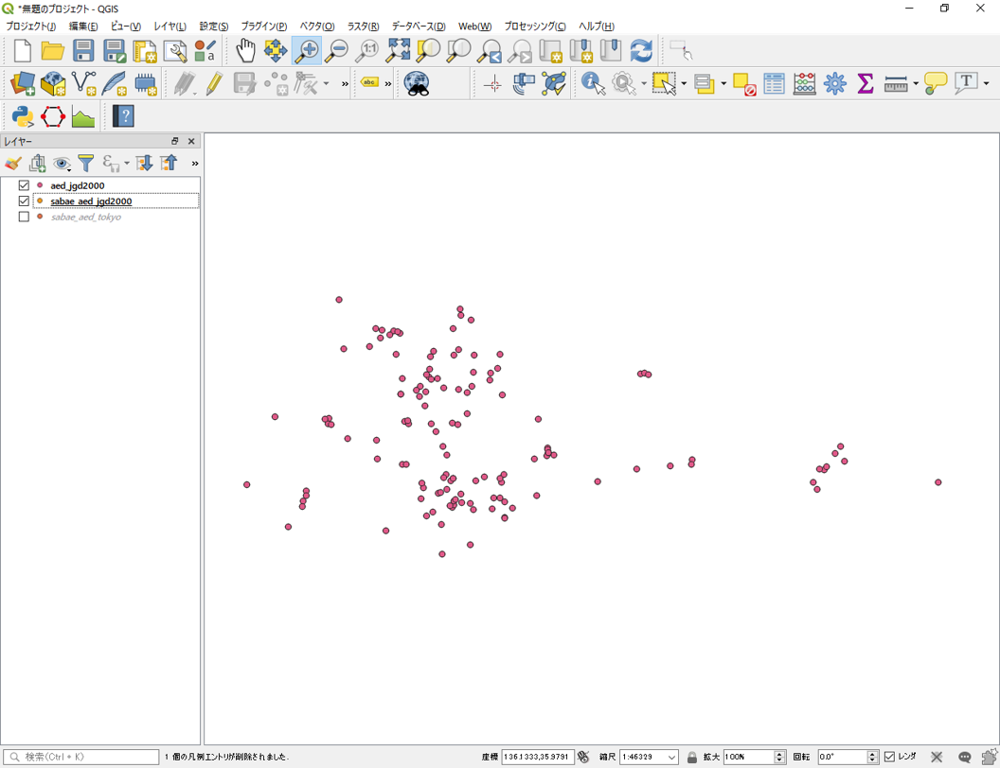

### 投影変換
以下では、地理座標系のデータを投影座標系の平面直角座標系へ変換するについて解説しています。世界測地系緯度経度のデータを用いて、以下の処理を試してください。

投影座標系の平面直角座標系へ変換する。
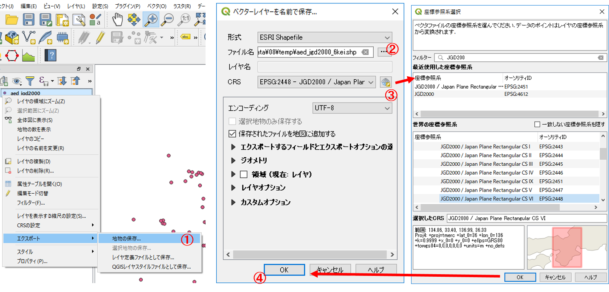
1. プロパティ＞エクスポート＞地物の保存をクリックする。
2. 新規レイヤの出力先と名前を選択する。
3. CRSのボタンをクリックし、変更したいCRSを選択（JGD2000 / Japan Plane Rectangular CS Ⅵ）してOKをクリックする。
4. OKをクリックする。

以下のように、座標系が（JGD2000 / Japan Plane Rectangular CS Ⅵ）に変換された。座標系が変換したため、レイヤが重なって表示されない。
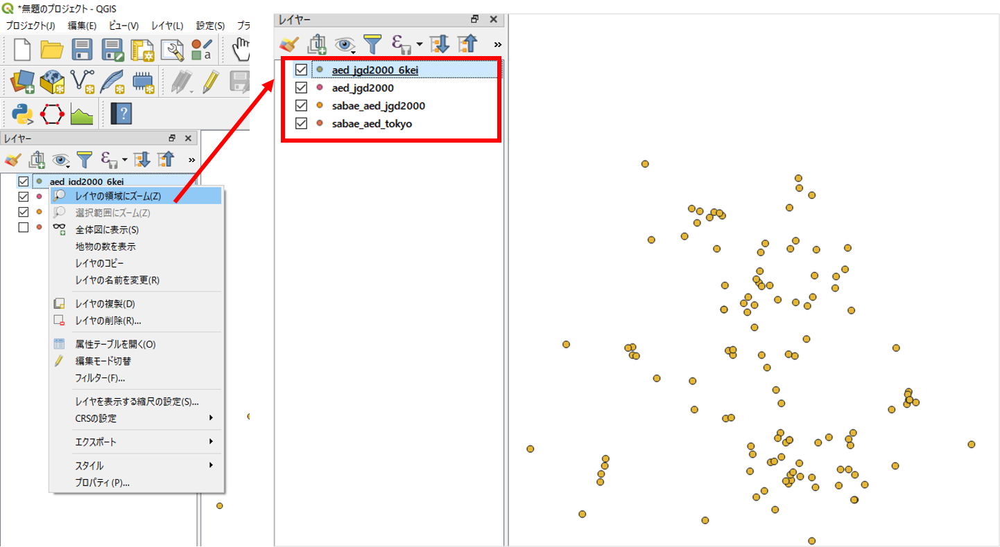

※世界測地系の平面直角座標系へ変換する場合に、地域によって○○系と指定する必要がある。詳しくは、国土地理院の[平面直角座標系の対応表]を参考にする。

※空間座標の変換のよくある間違いとして、新規にデータを作成せず、プロパティ（一般情報）の空間参照システムからCRSを選択するというものがある。

[▲メニューへもどる]

## ジオリファレンス
　ジオリファレンスは、位置情報をもたない画像などのデータに位置情報を持たせる際に用いる手法です。以下では、実習用データの鯖江市の007.jpgを用いて、QGISのジオリファレンサーで、位置合わせを行う手法について解説します。

QGISを起動し、実習を始める前にあらかじめダウンロードしておいた[Sabae]から、sabae_light_railとsabae_rail、sabae_wayを読み込む。ジオリファレンス用のGCP(Ground Control Point)を作成するため、ラスタからジオリファレンサーを起動する。
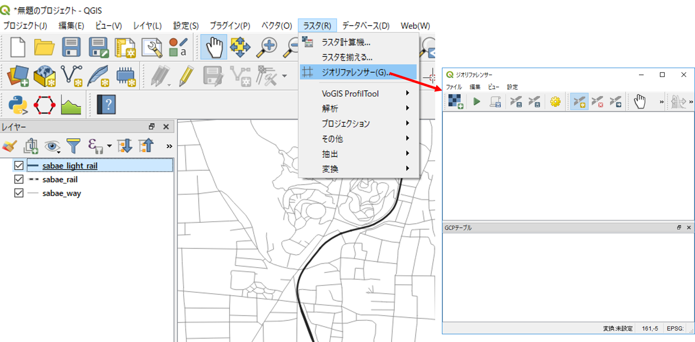

ジオリファレンサーで、位置合わせしたいラスタを読み込む。今回は、実習007.jpgを選択する。

**「ラスタ」のタブを開いても「ジオリファレンサー」の項目がない場合は、`プラグイン＞プラグインの管理とインストール＞インストール済`から、`GDALジオリファレンサー`にチェックをつける**

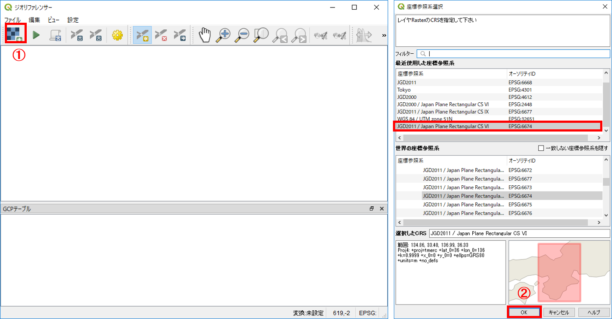
1. ラスタの読み込みボタンをクリックし、ラスタを選択する。
2. 座標系を選択し、OKをクリックする。

※座標系はEPSG6674に設定する。

以下のように、ジオリファレンサーにラスタの読み込みができた。
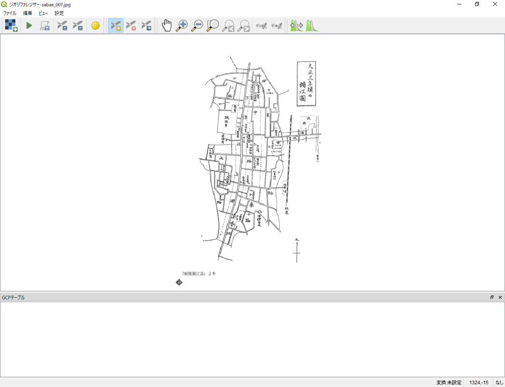

### GCPの作成
QGISでジオリファレンスをする場合、位置情報を示すGCP(Ground Control Point)を作成します。GCPは画像の端あたりをあわせて、おおまかな位置合わせをした後、偏りがでないように細部に作成していきます。以下では、その手法について解説しています。

画像データに位置情報を付加するために、GCPの作成を行う。
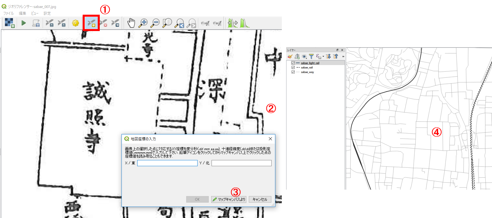

1. ポイントの追加をクリックする（削除する際は、右隣のボタン、地図の移動は手のボタンを用いる）。
2. ジオリファレンサーで入力したラスタ（古地図）の代表点（地理院地図と古地図で類似する地点や曲がり角など）をクリックする。
3. 「マップキャンバスより」をクリックする。(※座標が分かっている場合は座標値を入力)
4. QGISに入力した基盤地図情報をベースに、ジオリファレンサーのラスタと同じ位置の代表点をクリックする。

ジオリファレンサーで表示されたラスタの上にGCP（座標値をもった点）が表示され、GCPテーブルに詳細が表示される。
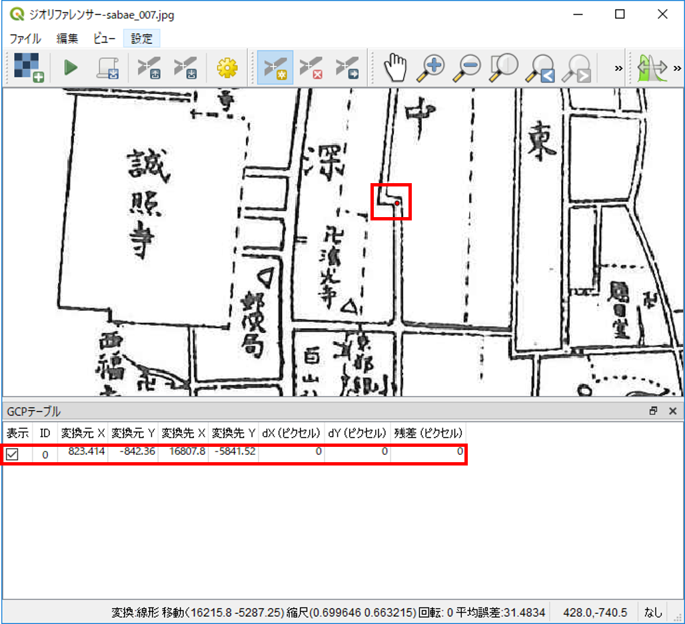

同じ作業を行いGCPを増やしていく。

※ある部分のみGCPが集中しすぎるということが、起きないように注意しながら作業を進めていく。また、GCPテーブルのresidualの値の大きいものを削除すると上手く合う場合がある。
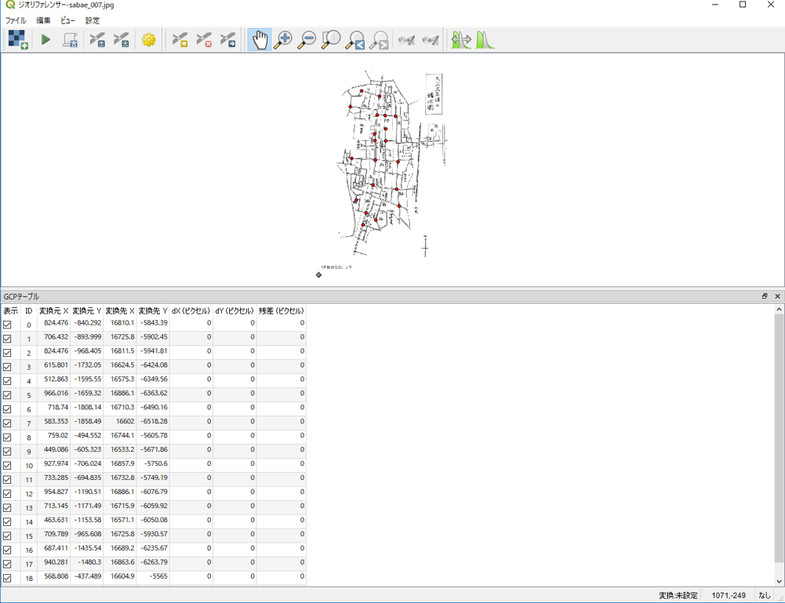

### ラスタの出力

複数点のGCPの取得ができたら、以下のように位置情報をもった古地図の出力を実行する。
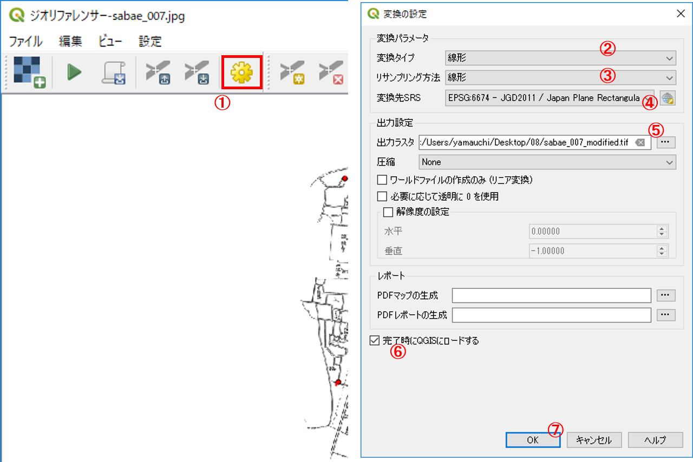
1. 変換の設定をクリックする。
2. 変換タイプは線形を選択する。
3. リサンプイングは線形を選択する。
4. 変換先SRSを選択する。
5. 新規レイヤの出力先と名前を出力する。
6. 「完了時にQGISにロードする」にチェックを入れる。
7. OKをクリックする。

右向きの三角ボタンをクリックすると、QGISに画像が表示される。
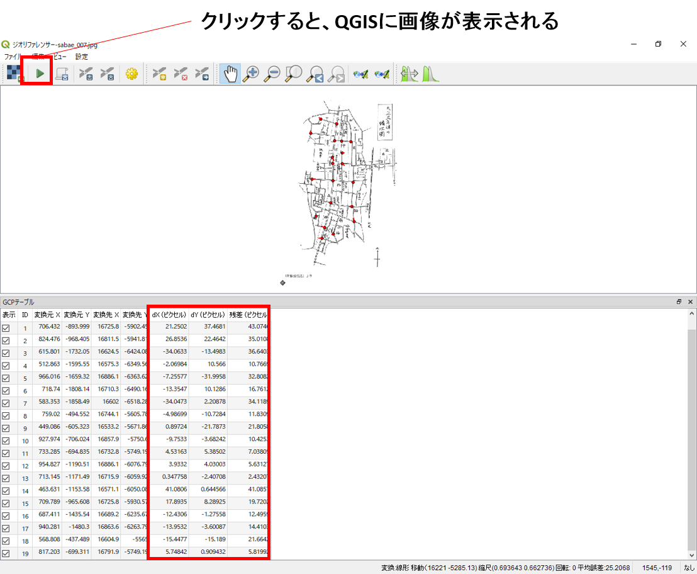

下の図のように、古地図に位置情報を付加した後に、画像とベクトルデータを重ね合わせ、精度を確認する。

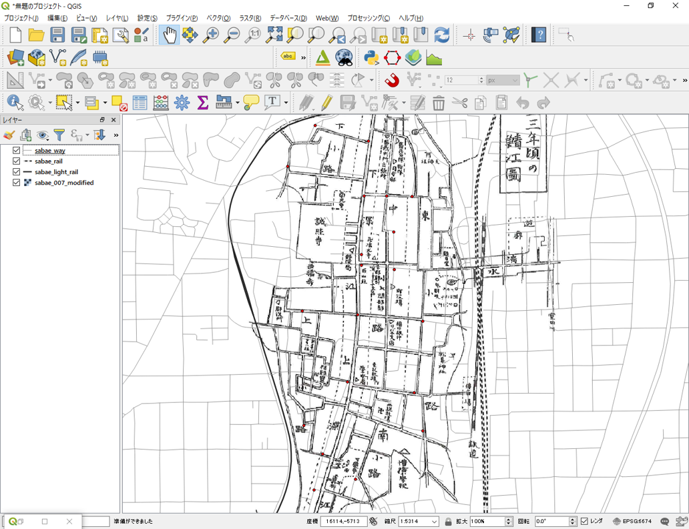

精度が十分でない場合は、残差の値を参考に、ポイントの削除や追加を行い、再度画像を出力する。
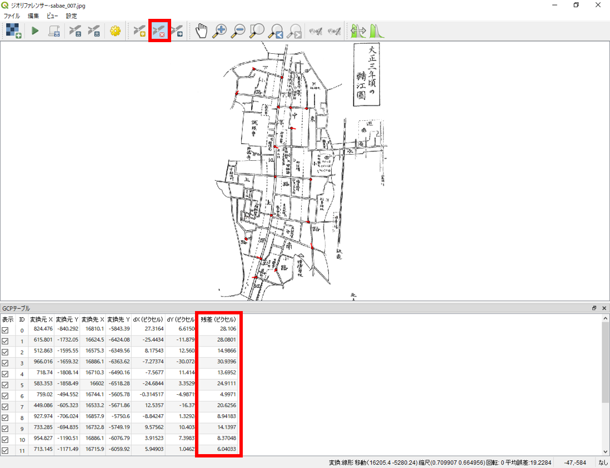

[▲メニューへもどる]

## ジオコーディング
　ジオコーディングは、住所や緯度経度などの情報から、GISで扱えるデータ等を作成する手法です。以下では、鯖江市内の店舗のデータ(sabae_store.csv)を用いて、住所と経緯度の情報からジオコーディングする手法について、2つのWEBサイトを利用して解説しています。

### Google Maps Geocoding APIを利用する
#### 住所からジオコーディングする
Google Maps Geocoding APIを利用したサイトにアクセスし、鯖江市内の店舗の住所を用いてマッピングを行う。

[Google Maps Geocoding API]を利用した、位置情報取得サイトはいくつかありる。以下は、埼玉大学の谷謙二先生が提供している[KTGIS.net]のジオコーディングサービスの利用法について解説している。
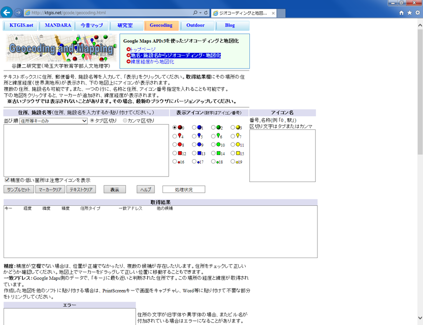

[KTGIS.net]にアクセスし、上のタブから「Geocoding」をクリックし、「地名・施設名からジオコーディング・地図化」をクリックする。

住所情報をもとにジオコーディングをする。
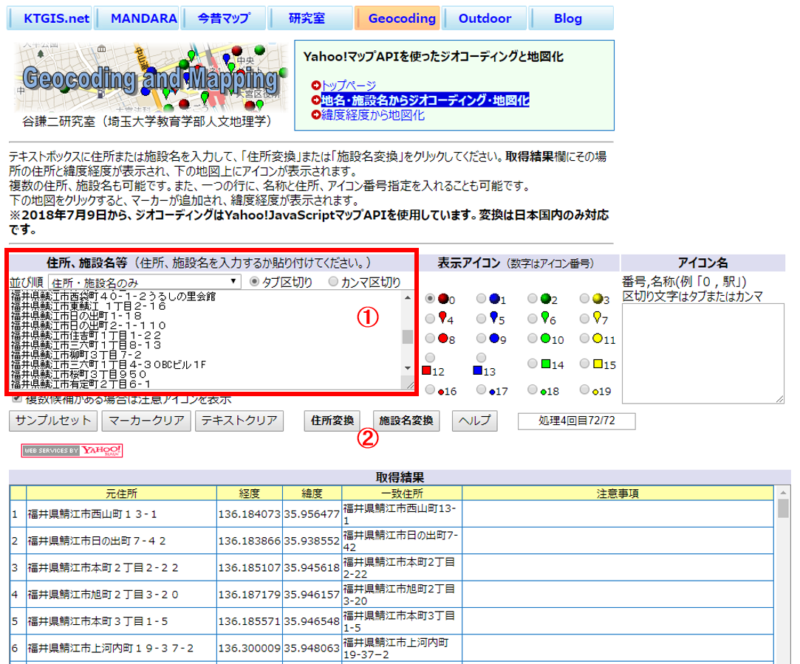
1. 避難所をまとめたCSVをExcelで開き、コピーした住所を上の図の①の個所に張り付ける。
2. 「住所変換」をクリックする。

下の図のように、サイトの下段にある地図の上にポイントが表示される。このサイトでは、情報出力テキストボックスから、マーカーの緯度経度、KMLデータ、最近隣距離などの出力もできる。
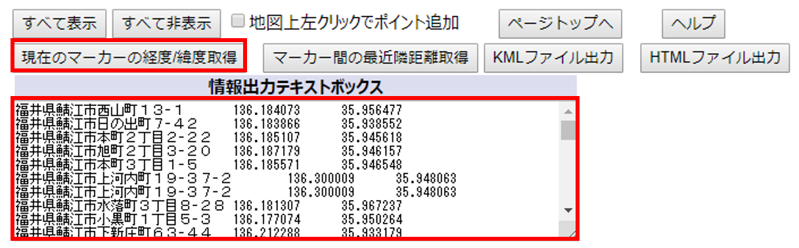

### CSVアドレスマッチングサービスを利用する
#### 経緯度からジオコーディングする
東京大学空間情報科学研究センターが提供する[CSVアドレスマッチングサービス]を利用して、住所から緯度経度を求めることができる。以下では、その手法について解説している。

[susono_emergency_shelter.csv]の住所情報をもとにジオコーディングをしていく。
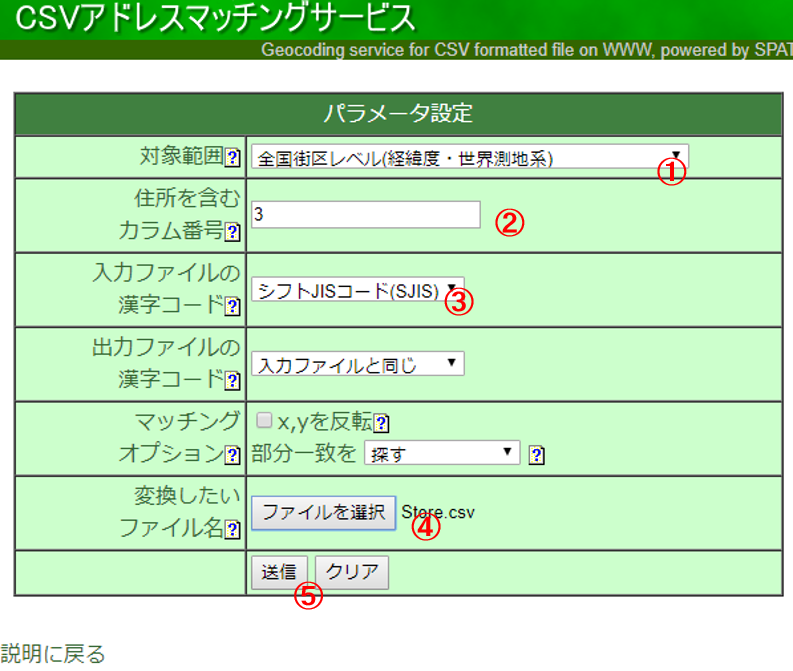
1. 全国街区レベル（緯経度・世界測地系）を選択する。
2. 住所を含むカラムに 3 を入力（エクセルでみたときの住所が入っている箇所に相当する）する。
3. シフトJISコード（SJIS）を選択する。
4. 避難所をまとめたCSVを選択する。
5. 送信をクリックする。その後、保存のウインドウが表示されるため、データを保存する。

#### QGISで緯度経度つきのCSVデータを表示する
以下では、アドレスマッチングで取得したデータをQGISで表示する手法について解説しています。[CSVアドレスマッチングサービス]で取得したCSVを利用し、以下の処理を試してください。

QGISでテキストファイル（CSVファイル）を読み込む。
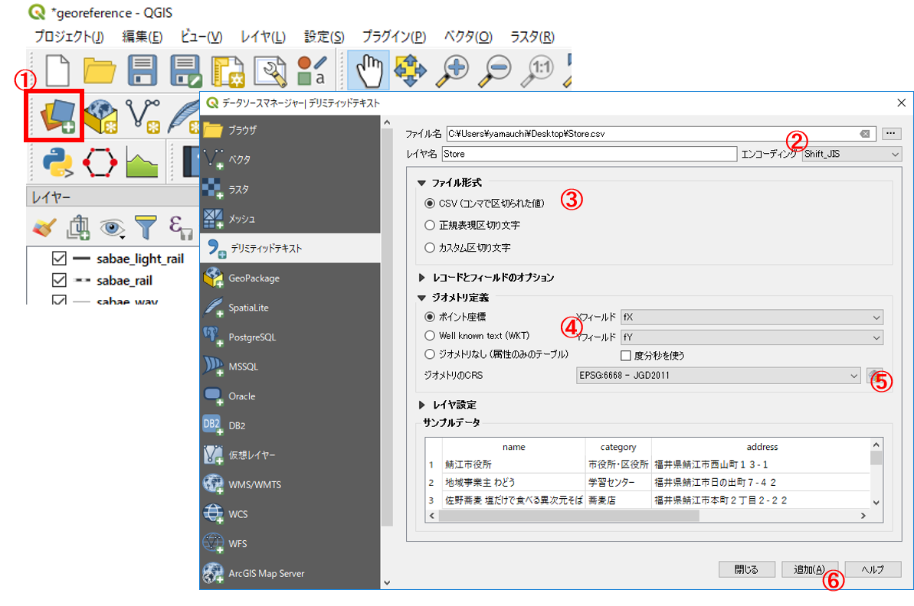
1. データソースマネージャー＞デリミティッドテキストを選択する。
2. 緯度経度を出力したcsvを指定し、エンコーディングをShift-JISにする。
3. CSVにチェックを入れる。
4. X,Yフィールドを指定する。
5. JGD2011を選択する。
6. 追加をクリックする。

座標系を変換する。
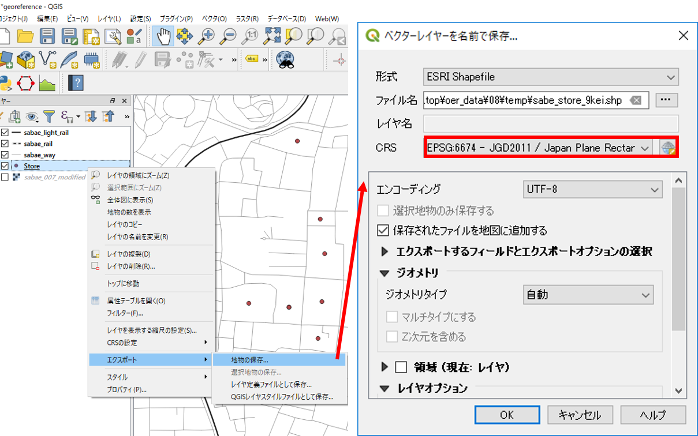
1. プロパティ＞エクスポート＞地物の保存をクリックする。
2. 形式をESRI Shapefileとし、出力先とファイル名を指定する。
3. 世界測地系平面直角6系を指定し、OKをクリックする。

以下のように、鯖江市内の店舗が地図上に表示できた。
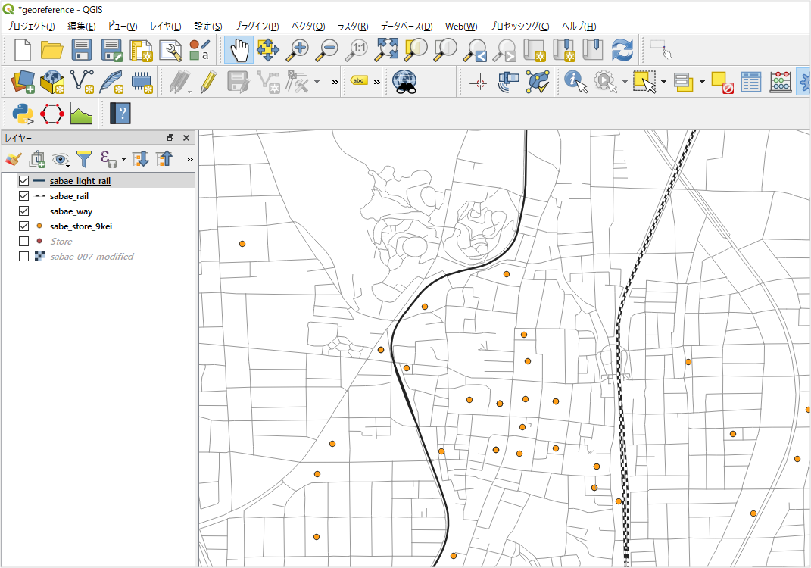

[▲メニューへもどる]

#### この教材の[課題ページ_空間データ]へ進む

#### ライセンスに関する注意事項
本教材で利用しているキャプチャ画像の出典やクレジットについては、[その他のライセンスについて]よりご確認ください。

[▲メニューへもどる]:./08.md#Menu
[地理院タイル]:http://maps.gsi.go.jp/development/ichiran.html
[Google Maps Geocoding API]:https://developers.google.com/maps/documentation/geocoding/intro?hl=ja
[KTGIS.net]:http://ktgis.net/gcode/geocoding.html
[データシティ鯖江ポータルサイト]:http://data.city.sabae.lg.jp/
[CSVアドレスマッチングサービス]:http://newspat.csis.u-tokyo.ac.jp/geocode-cgi/geocode.cgi?action=start
[susono_emergency_shelter.csv]:https://github.com/gis-oer/datasets/raw/master/vector/susono_sample.zip
[平面直角座標系の対象表]:http://www.gsi.go.jp/LAW/heimencho.html
[地理情報科学教育用スライド（GIScスライド）]:http://curricula.csis.u-tokyo.ac.jp/slide/3.html
[利用規約]:../../policy.md
[その他のライセンスについて]:../license.md
[よくある質問とエラー]:../questions/questions.md

[GISの基本概念]:../00/00.md
[QGISビギナーズマニュアル]:../QGIS/QGIS.md
[GRASSビギナーズマニュアル]:../GRASS/GRASS.md
[リモートセンシングとその解析]:../06/06.md
[既存データの地図データと属性データ]:../07/07.md
[空間データ]:../08/08.md
[空間データベース]:../09/09.md
[空間データの統合・修正]:../10/10.md
[基本的な空間解析]:../11/11.md
[ネットワーク分析]:../12/12.md
[領域分析]:../13/13.md
[点データの分析]:../14/14.md
[ラスタデータの分析]:../15/15.md
[傾向面分析]:../16/16.md
[空間的自己相関]:../17/17.md
[空間補間]:../18/18.md
[空間相関分析]:../19/19.md
[空間分析におけるスケール]:../20/20.md
[視覚的伝達]:../21/21.md
[参加型GISと社会貢献]:../26/26.md

[地理院地図]:https://maps.gsi.go.jp
[e-Stat]:https://www.e-stat.go.jp/
[国土数値情報]:http://nlftp.mlit.go.jp/ksj/
[基盤地図情報]:http://www.gsi.go.jp/kiban/
[地理院タイル]:http://maps.gsi.go.jp/development/ichiran.html

[スライド_GISの基本概念]:https://github.com/gis-oer/gis-oer/raw/master/materials/00/00.pptx
[スライド_QGISビギナーズマニュアル]:https://github.com/gis-oer/gis-oer/raw/master/materials/QGIS/QGIS.pptx
[スライド_GRASSビギナーズマニュアル]:https://github.com/gis-oer/gis-oer/raw/master/materials/GRASS/GRASS.pptx
[スライド_リモートセンシングとその解析]:https://github.com/gis-oer/gis-oer/raw/master/materials/06/06.pptx
[スライド_既存データの地図データと属性データ]:https://github.com/gis-oer/gis-oer/raw/master/materials/07/07.pptx
[スライド_空間データ]:https://github.com/gis-oer/gis-oer/raw/master/materials/08/08.pptx
[スライド_空間データベース]:https://github.com/gis-oer/gis-oer/raw/master/materials/09/09.pptx
[スライド_空間データの統合・修正]:https://github.com/gis-oer/gis-oer/raw/master/materials/10/10.pptx
[スライド_基本的な空間解析]:https://github.com/gis-oer/gis-oer/raw/master/materials/11/11.pptx
[スライド_ネットワーク分析]:https://github.com/gis-oer/gis-oer/raw/master/materials/12/12.pptx
[スライド_領域分析]:https://github.com/gis-oer/gis-oer/raw/master/materials/13/13.pptx
[スライド_点データの分析]:https://github.com/gis-oer/gis-oer/raw/master/materials/14/14.pptx
[スライド_ラスタデータの分析]:https://github.com/gis-oer/gis-oer/raw/master/materials/15/15.pptx
[スライド_空間補間]:https://github.com/gis-oer/gis-oer/raw/master/materials/18/18.pptx
[スライド_視覚的伝達]:https://github.com/gis-oer/gis-oer/raw/master/materials/21/21.pptx
[スライド_参加型GISと社会貢献]:https://github.com/gis-oer/gis-oer/raw/master/materials/26/26.pptx

[課題ページ_QGISビギナーズマニュアル]:../tasks/t_qgis_entry.md
[課題ページ_GRASSビギナーズマニュアル]:../tasks/t_grass_entry.md
[課題ページ_リモートセンシングとその解析]:../tasks/t_06.md
[課題ページ_既存データの地図データと属性データ]:../tasks/t_07.md
[課題ページ_空間データ]:../tasks/t_08.md
[課題ページ_空間データベース]:../tasks/t_09.md
[課題ページ_空間データの統合・修正]:../tasks/t_10.md
[課題ページ_基本的な空間解析]:../tasks/t_11.md
[課題ページ_ネットワーク分析]:../tasks/t_12.md
[課題ページ_領域分析]:../tasks/t_13.md
[課題ページ_点データの分析]:../tasks/t_14.md
[課題ページ_ラスタデータの分析]:../tasks/t_15.md
[課題ページ_空間補間]:../tasks/t_18.md
[課題ページ_視覚的伝達]:../tasks/t_21.md
[課題ページ_参加型GISと社会貢献]:../tasks/t_26.md
<h2 style="background-color:#F8F5FD;text-align:center;">教材の利用に関するアンケート</h2>　本プロジェクトでは、教材の改良を目的とした任意アンケートを実施しています。ご協力いただける方は、<a href="https://customform.jp/form/input/14328/">アンケート</a>にお進みください。ご協力のほどよろしくお願いいたします。  ※ 本アンケートの成果は、教材の改良のほか、学会での発表等の研究目的でも利用します。また、本アンケートでは、個人が特定できるような質問は設けておりません。
