# 空間データベース
　本教材は、「空間データベース」の実習用教材です。PostGISを用いた属性検索や空間検索の手法について解説しています。

　課題形式で使用する場合は、本教材を一読した後、課題ページへお進みください。GIS初学者は、本教材を進める前に[GISの基本概念]の教材を確認しておいてください。本教材を使用する際は、[利用規約]をご確認いただき、これらの条件に同意された場合にのみご利用下さい。

[地理情報科学教育用スライド（GIScスライド）]:http://curricula.csis.u-tokyo.ac.jp/slide/3.html

**Menu**
----------
* [PostGISとは？](#postgisとは？)
* [PostgreSQLのインストール](#postgresqlのインストール)
* [空間データベースの作成](#空間データベースの作成)
* [よく使うSQL文](#よく使うsql文)
* [属性検索](#属性検索)
* [空間検索](#空間検索)
* [空間結合](#空間結合)
* [QGISでのデータベース接続](#QGISでのデータベース接続)

**実習用データ**

実習をはじめる前に、[database]をダウンロードしてください。

**スライド教材**

本教材は、[スライド_空間データベース]としても、ご利用いただけます。

[database]:https://github.com/gis-oer/datasets/raw/master/database.zip

-------

## PostGISとは？
* PostGISは、PostgreSQLというデータベース管理システムの拡張パックであり、 GISオブジェクトを格納できる。
* PostgreSQLとPostGISは、オープンソースであり、無料で利用できる。
* ライセンスはGNU General Public License (GPL)。

>[PostGIS Project]による[PostGIS 2.0.0マニュアル日本語訳]を参考に作成

[▲メニューへもどる]

## PostgreSQLのインストール

[PostgreSQL](https://www.postgresql.org/download/windows/)のダウンロードページから、PostgreSQL Version11.2のインストーラを取得する。インストーラーに従い、PostgreSQLのインストールを行う。インストールが終了したら、スタックビルダが起動するため、ガイドに従って設定を進め、`Spatial Extensions`から`PostGIS`をインストールする。
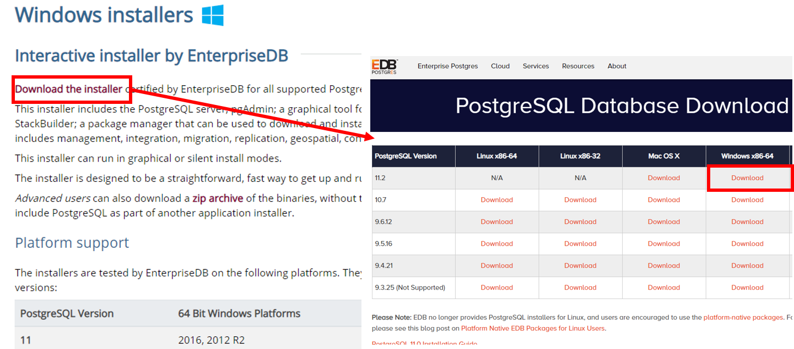

## 空間データベースの作成
以下では、pgAdmin4を用いて、新規のデータベースを作成する手法について解説しています。

### pgAdmin4の起動
pgAdmin4をエクスプローラーで検索し、起動する。
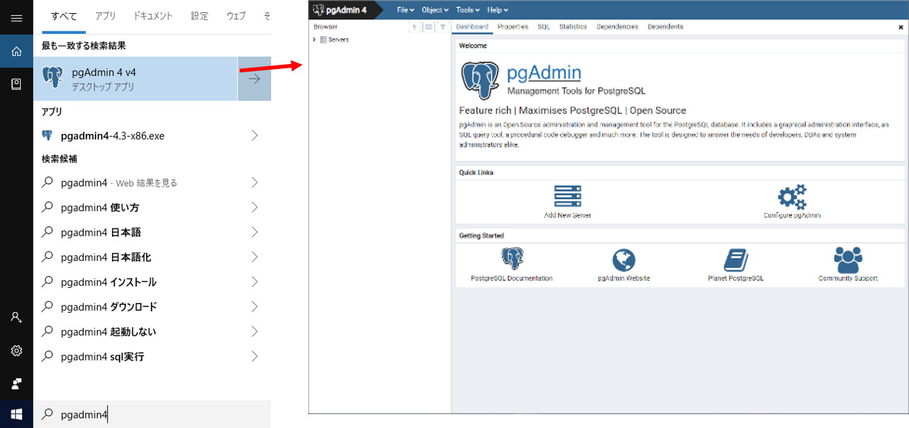

実習用のデータベースを作成するため、1. Seversの＞をクリックする。2. インストール時に設定したパスワードを入力し、OKをクリックする。
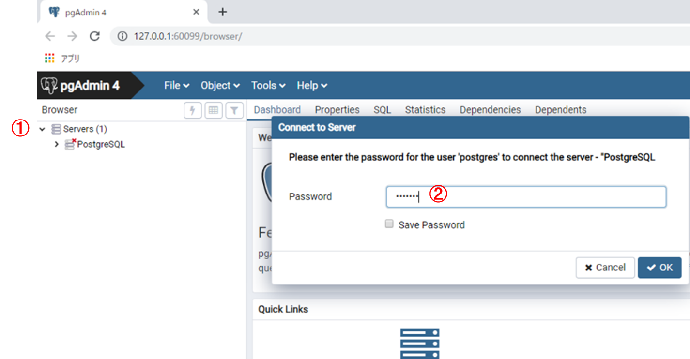

以下に従って、新規のデータベース（ここではTokyoとした）の作成を行う。
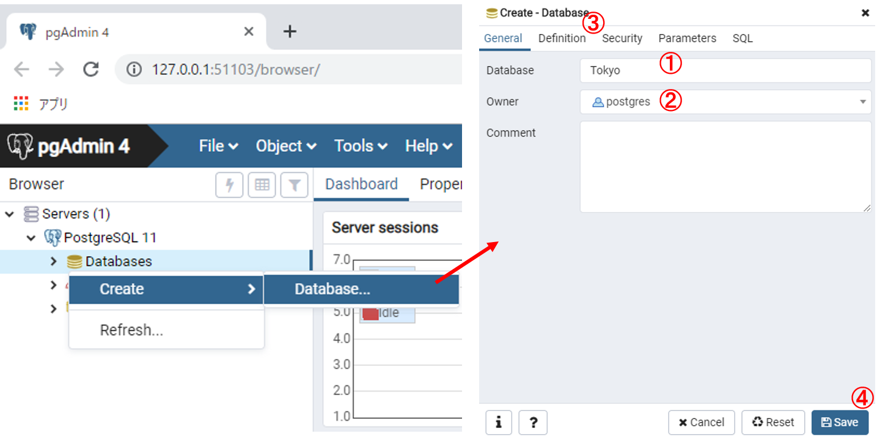
1. `Databases`の上にカーソルをあわせて右クリックし、`Create > Database`を選択する。
2. Databeseをtokyo オーナーをpostgresとする。
3. `Definition`から、エンコードutf-8とする。
4. `Save`をクリックするとTokyoのデータベースが作成される

[▲メニューへもどる]

### 空間解析機能の追加
次のパートで空間データを読み込むため、pgAdmin4に空間データを扱うための拡張機能であるPostGISを追加する。以下のように、`Extensions`の上にカーソルをあわせて右クリックし、`Create > Extension`を選択する。ウィンドウが表示されたら、Nameをクリックし、`postgis`と入力し、`Save`をクリックする。Extensionsに`postgis`が追加されたことを確認する。
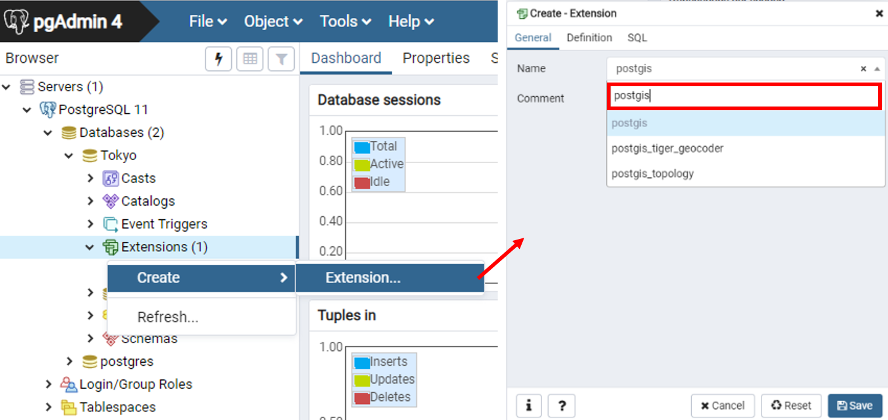


### 空間データのインポート
PostGISを用いてデータベースにシェープファイルを読み込む。`PostGIS x.x Shapefile and DBF Loader Exporter`をエクスプローラーから起動し、`View connection details`をクリックし、接続するデータベースの情報を図のように設定する。
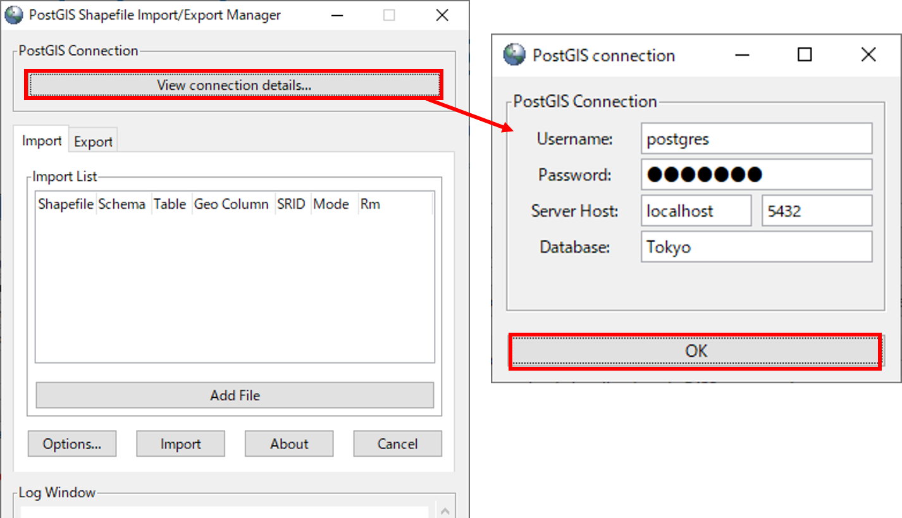

```
Username : postgres
Password : ● ● ● ●
Server Host : localhost  5432（※環境によって異なる）
Database : Tokyo
```

データベースへの接続が完了したら、以下のようにインポートするシェープファイルを設定する。
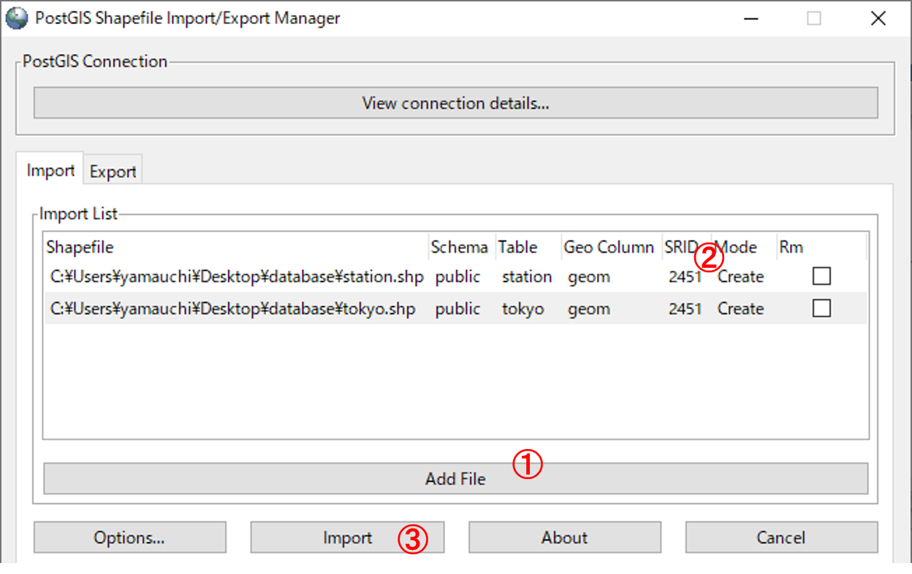
1. `Add File`から東京都の境界ポリゴンと駅のポイントを追加する（ファイルパス日本語を含まれるとエラーが生じる）。
2. 世界測地系平面直角9系のSRIDを入力する。
3. `Import`をクリックする。

以下のように、シェープファイルがTokyoデータベースに追加される。インポートしたファイルは、`Schemas>public>tables`に追加される。テーブルを選択し、`View Data`クリックすると属性情報が確認できる。
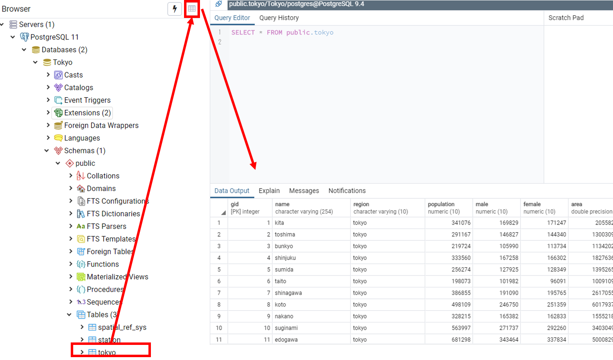

`Geometry Viewer`のタブに切り替えると、地図が表示される(地理座標系であれば背景地図と重ねて表示ができる)。次のパートで、属性検索と空間検索を行うため、駅のデータの列名を確認しておく。列名は、Browserウィンドウの`Tables>Columns`からも確認できる。
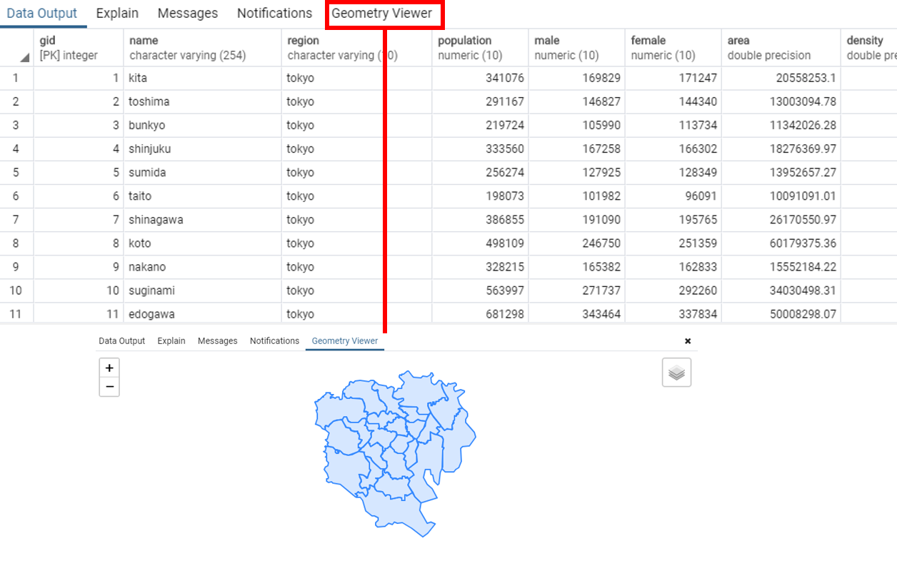

## よく使うSQL文
次のパートでは、SQLでデータベースの検索や空間分析を行います。下記は、よく使うSQL文についてまとめたものです。初学者は、次のパートを始める前に一読してください。

```
SELECT文・・・・・DBのテーブルからデータを検索し、取得する文
SLECT ・・・・・ 列名
FROM　・・・・・テーブル名
WHERE　・・・・条件の指定（表示するデータの選択)列＝値など

列 = 値　・・・　　列が値と一致するものを抽出
列 >= 値　・・・　列が値（数値）より大きいものを抽出
列 <= 値　・・・　列が値（数値）より小さいものを抽出

※ 他に良く使うもの　AND a=b and c>=d aがbと一致していてcがd(数値)以上のもの
    OR a=b and c>=d aがbと一致しているかcがd(数値)以上のもの
    LIKE a＝ LIKE '新％' a列に含まれる新○○を抽出する　あいまい検索
    (　チェック　　　GROUP BY　・・・・ グループ化する集約関数）

```

[▲メニューへもどる]

## 属性検索
以下では、属性検索の手法について解説しています。以下のように、`Tool > Query tool`を開き、SQLの入力ウィンドウを表示してください。入力したSQL文を実行する際は、緑枠の実行ボタンをクリックします。
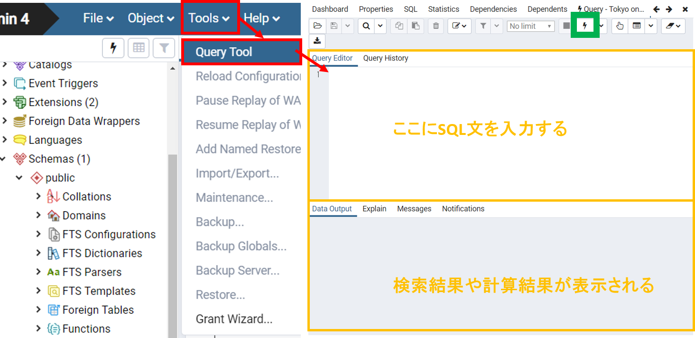

### 属性情報の表示
まず、東京23区の行政区域の情報を表示する。`SELECT name FROM tokyo;`を実行し、tokyoテーブルのname列を表示する。ここで、`SELECT name,male FROM tokyo;`のようにすると複数の属性情報が表示できる。
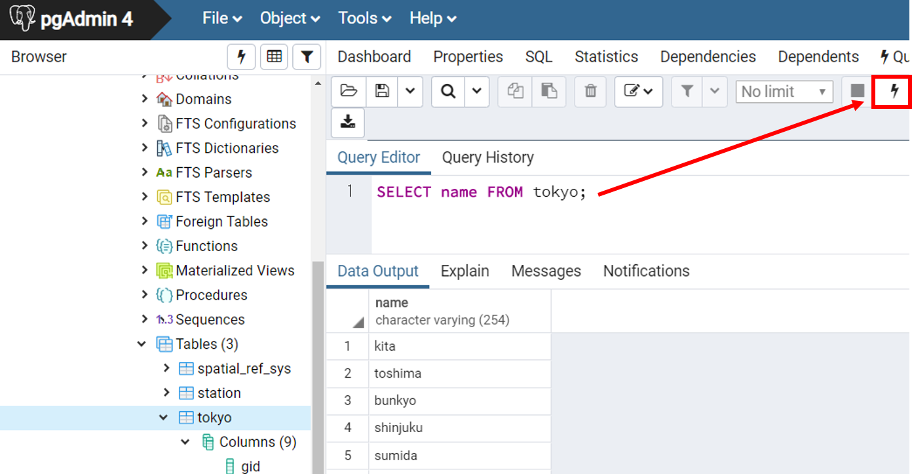

### 属性情報の計算
属性情報には、区ごとの人口数が入力されているため、その合計を求める。`SELECT sum(population) FROM tokyo;`を実行すると、23区内の人口が計算できる。
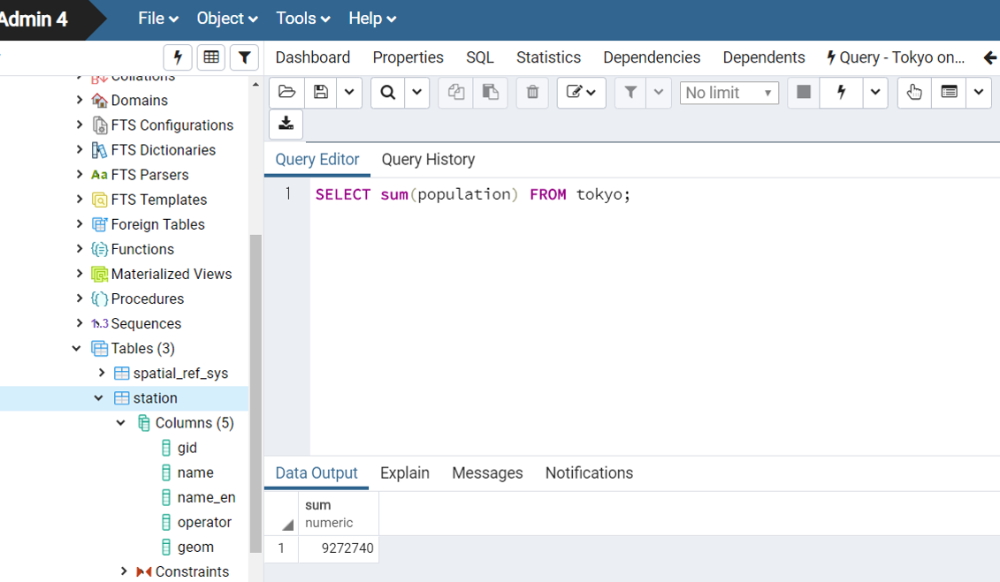

> Sum()・・・合計を計算する関数

### 属性値に基づく抽出
ここでは、属性値に基づく抽出として東日本旅客鉄道に所属する駅名を抽出する。`SELECT name FROM station WHERE operator ‘東日本旅客鉄道’;`とし、実行する。


> name・・・stationテーブルの駅名が含まれる列名
> operator・・・stationテーブルの鉄道会社名が含まれる列名

### 属性情報に基づく集計
鉄道会社ごとに駅の数を計算する。`SELECT operator,count(name) FROM station GROUP BY operator;`を実行する。
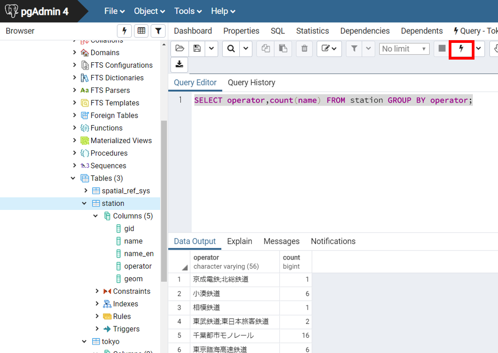

> count()　データを数える関数

`SELECT operator,count(name) AS “n” FROM station GROUP BY operator;`を実行すると、鉄道会社ごとのデータをテーブルnとして表示できる。
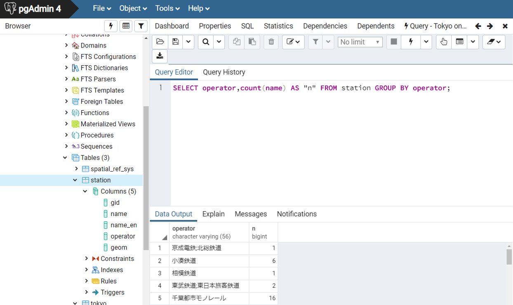

> AS　別の列名として表示する

## 空間検索
以下では、ジオメトリーの情報を用いて、指定した領域や、複数の複数の空間データと重なる情報を検索する手法について解説します。

### 勝どき駅のジオメトリを表示する
`SELECT name,geom FROM station WHERE name = ‘勝どき’;` 勝どき駅のジオメトリを検索する。
ジオメトリの上でCntr+Cでジオメトリをコピーする。

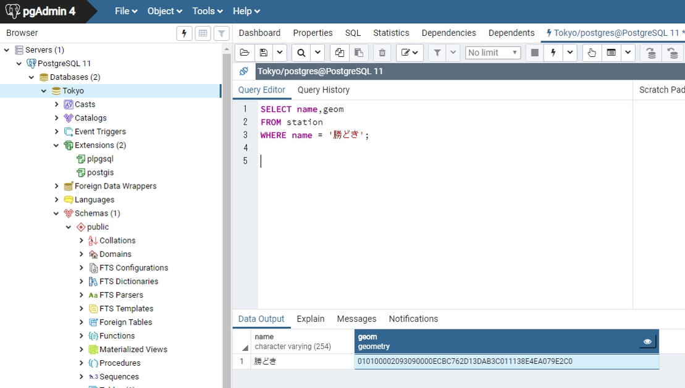

### 指定した領域に基づく検索
以下のように、勝どき駅から半径1000m以内の駅を表示する。
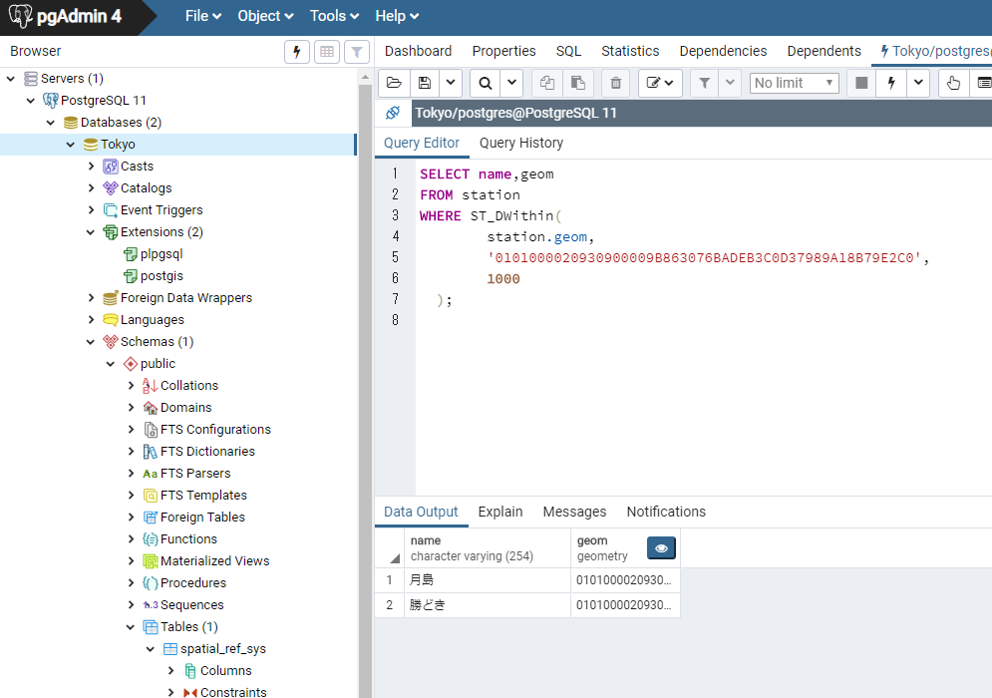

```SQL
SELECT name,geom
FROM station
WHERE ST_DWithin(station.geom,	'010100002093090000ECBC762D13DAB3C011138E4EA079E2C0',1000);

```
> ST_DWithin(geometry.列名,値 ,○○ｍ) ジオメトリと範囲を指定して、それに該当するレコードを抽出する関数

### データの領域による検索
以下のようにすると、tokyoテーブルのgeom(ジオメトリー)に含まれる勝どき駅を抽出できる。
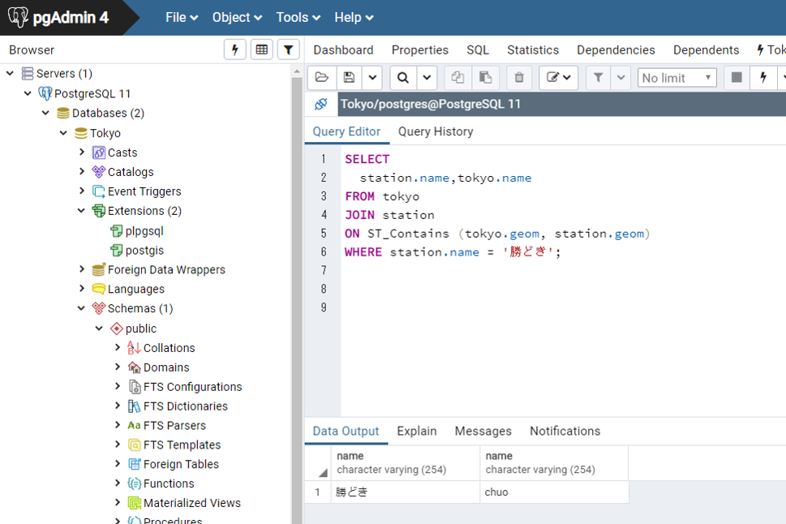

```SQL
SELECT
  station.name,tokyo.name
FROM tokyo
JOIN station
ON ST_Contains (tokyo.geom, station.geom)
WHERE station.name = '勝どき';
```
> JOIN　テーブル名　ON　条件式 テーブルを結合する式
> ST_Contains(a,b) a（ジオメトリー）に含まれるb（ジオメトリーを）抽出する関数

[▲メニューへもどる]

## 空間結合
以下では、空間結合として、東京23区のテーブルに新規に区ごとの駅数を計算したテーブルを作成する手法について解説しています。

`CREATE INDEX new_geom ON station USING GiST(new_geom);`を実行し、空間インデックスを作成する。
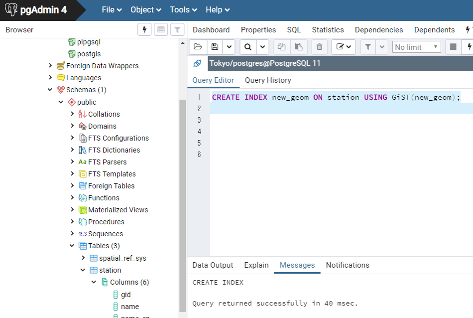

> CREATE INDEX ・・・インデックスを作成する
> USING GiST・・・インデックスを空間インデックスとする

`UPDATE station SET new_geom = ST_Centroid(geom);`を実行し、列に駅のジオメトリーを追加する。
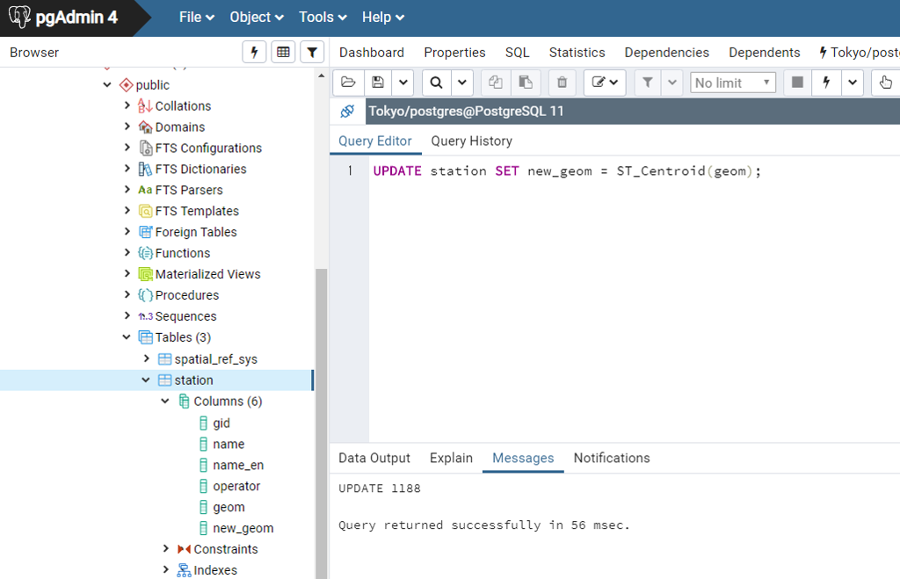

以下のように、23区ごとに駅数を計算する。
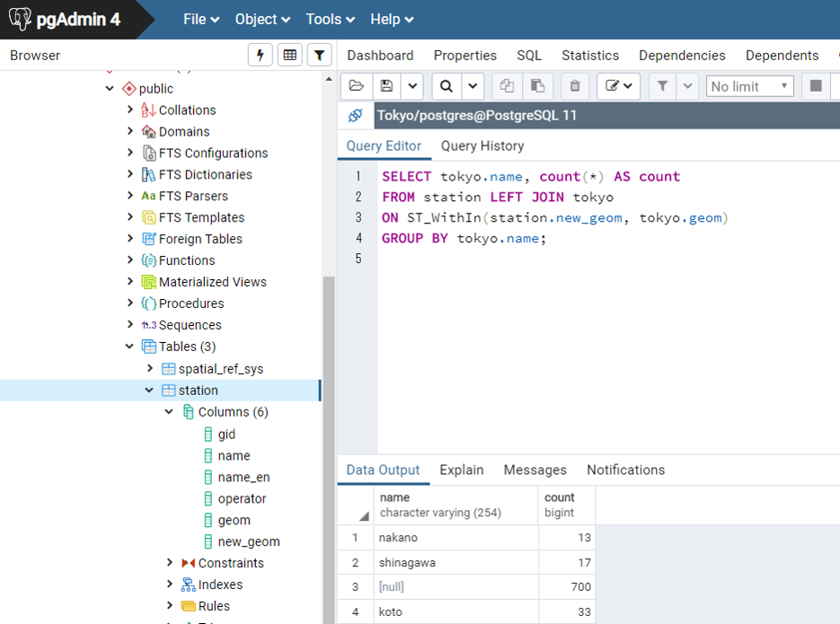

```SQL
SELECT tokyo.name, count(*) AS count
FROM station LEFT JOIN tokyo
ON ST_WithIn(station.new_geom, tokyo.geom)
GROUP BY tokyo.name;
```
> a LEFT JOIN b　aが結合条件に一致しなくてもレコードを表示する。

## QGISでのデータベース接続
以下では、上記で作成したデータベースに、QGISで接続し、データを表示する手法について解説します。

QGISを起動し、`データソースマネージャ＞PostgreSQL>新規`を選択する。
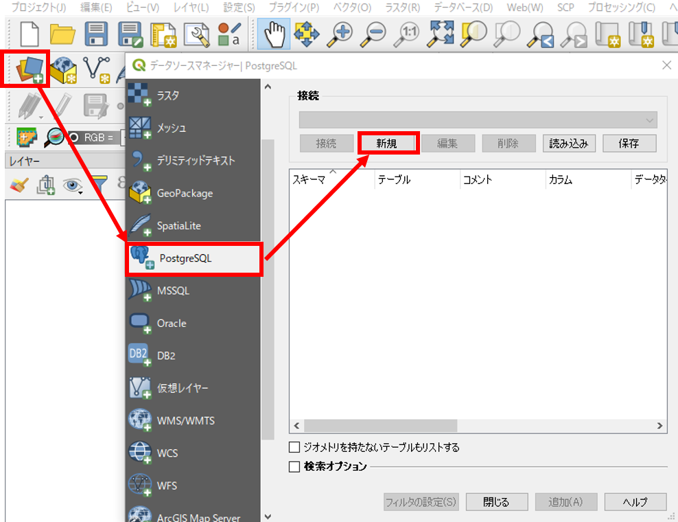

以下のように、名称を23ku、ホストをlocalhost、ポートを5432（※環境によって異なる）とし、接続テストをクリックする。ユーザー名　postgres、パスワード　● ● ● ●を入力しOKをクリックする。接続が完了できたら、「新しいPostGIS接続を作成する」のウィンドウのOKをクリックする。
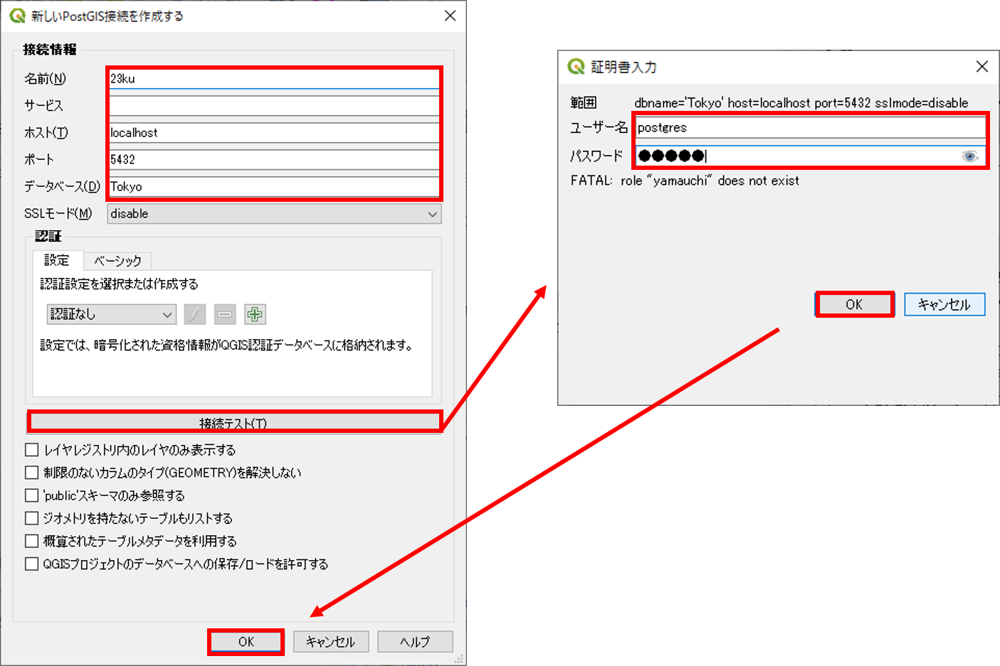

新規をクリックし、tokyoのデータを選択して、追加をクリックすると地図が表示される。
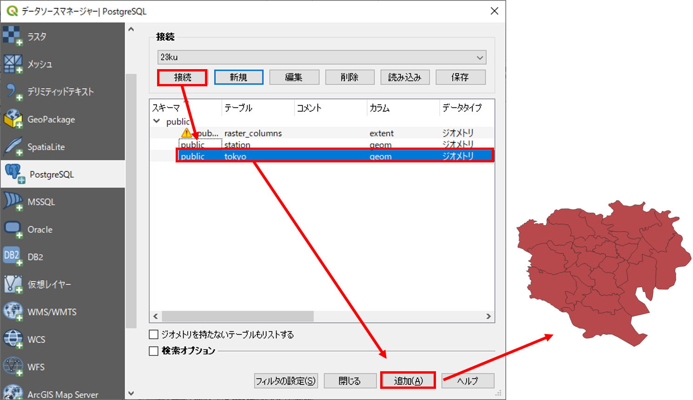

## 参考サイト

- [PostgreSQL公式ページ]
- [PostGIS公式マニュアル]

[PostgreSQL公式ページ]:https://www.postgresql.org/
[PostGIS公式マニュアル]:http://postgis.net/docs/index.html

[▲メニューへもどる]

#### この教材の[課題ページ_空間データベース]へ進む

#### ライセンスに関する注意事項
本教材で利用しているキャプチャ画像の出典やクレジットについては、[その他のライセンスについて]よりご確認ください。

[▲メニューへもどる]:./09.md#Menu
[東京都オープンデータ]:http://www.metro.tokyo.jp/SUB/OPENDATA/
[PostGIS Project]: http://www.postgis.org
[PostGIS 2.0.0マニュアル日本語訳]:http://www.finds.jp/docs/pgisman/2.0.0/postgis.html
[利用規約]:../../policy.md
[その他のライセンスについて]:../license.md
[よくある質問とエラー]:../questions/questions.md

[GISの基本概念]:../00/00.md
[QGISビギナーズマニュアル]:../QGIS/QGIS.md
[GRASSビギナーズマニュアル]:../GRASS/GRASS.md
[リモートセンシングとその解析]:../06/06.md
[既存データの地図データと属性データ]:../07/07.md
[空間データ]:../08/08.md
[空間データベース]:../09/09.md
[空間データの統合・修正]:../10/10.md
[基本的な空間解析]:../11/11.md
[ネットワーク分析]:../12/12.md
[領域分析]:../13/13.md
[点データの分析]:../14/14.md
[ラスタデータの分析]:../15/15.md
[傾向面分析]:../16/16.md
[空間的自己相関]:../17/17.md
[空間補間]:../18/18.md
[空間相関分析]:../19/19.md
[空間分析におけるスケール]:../20/20.md
[視覚的伝達]:../21/21.md
[参加型GISと社会貢献]:../26/26.md

[地理院地図]:https://maps.gsi.go.jp
[e-Stat]:https://www.e-stat.go.jp/
[国土数値情報]:http://nlftp.mlit.go.jp/ksj/
[基盤地図情報]:http://www.gsi.go.jp/kiban/
[地理院タイル]:http://maps.gsi.go.jp/development/ichiran.html


[スライド_GISの基本概念]:https://github.com/gis-oer/gis-oer/raw/master/materials/00/00.pptx
[スライド_QGISビギナーズマニュアル]:https://github.com/gis-oer/gis-oer/raw/master/materials/QGIS/QGIS.pptx
[スライド_GRASSビギナーズマニュアル]:https://github.com/gis-oer/gis-oer/raw/master/materials/GRASS/GRASS.pptx
[スライド_リモートセンシングとその解析]:https://github.com/gis-oer/gis-oer/raw/master/materials/06/06.pptx
[スライド_既存データの地図データと属性データ]:https://github.com/gis-oer/gis-oer/raw/master/materials/07/07.pptx
[スライド_空間データ]:https://github.com/gis-oer/gis-oer/raw/master/materials/08/08.pptx
[スライド_空間データベース]:https://github.com/gis-oer/gis-oer/raw/master/materials/09/09.pptx
[スライド_空間データの統合・修正]:https://github.com/gis-oer/gis-oer/raw/master/materials/10/10.pptx
[スライド_基本的な空間解析]:https://github.com/gis-oer/gis-oer/raw/master/materials/11/11.pptx
[スライド_ネットワーク分析]:https://github.com/gis-oer/gis-oer/raw/master/materials/12/12.pptx
[スライド_領域分析]:https://github.com/gis-oer/gis-oer/raw/master/materials/13/13.pptx
[スライド_点データの分析]:https://github.com/gis-oer/gis-oer/raw/master/materials/14/14.pptx
[スライド_ラスタデータの分析]:https://github.com/gis-oer/gis-oer/raw/master/materials/15/15.pptx
[スライド_空間補間]:https://github.com/gis-oer/gis-oer/raw/master/materials/18/18.pptx
[スライド_視覚的伝達]:https://github.com/gis-oer/gis-oer/raw/master/materials/21/21.pptx
[スライド_参加型GISと社会貢献]:https://github.com/gis-oer/gis-oer/raw/master/materials/26/26.pptx

[課題ページ_QGISビギナーズマニュアル]:../tasks/t_qgis_entry.md
[課題ページ_GRASSビギナーズマニュアル]:../tasks/t_grass_entry.md
[課題ページ_リモートセンシングとその解析]:../tasks/t_06.md
[課題ページ_既存データの地図データと属性データ]:../tasks/t_07.md
[課題ページ_空間データ]:../tasks/t_08.md
[課題ページ_空間データベース]:../tasks/t_09.md
[課題ページ_空間データの統合・修正]:../tasks/t_10.md
[課題ページ_基本的な空間解析]:../tasks/t_11.md
[課題ページ_ネットワーク分析]:../tasks/t_12.md
[課題ページ_領域分析]:../tasks/t_13.md
[課題ページ_点データの分析]:../tasks/t_14.md
[課題ページ_ラスタデータの分析]:../tasks/t_15.md
[課題ページ_空間補間]:../tasks/t_18.md
[課題ページ_視覚的伝達]:../tasks/t_21.md
[課題ページ_参加型GISと社会貢献]:../tasks/t_26.md
<h2 style="background-color:#F8F5FD;text-align:center;">教材の利用に関するアンケート</h2>　本プロジェクトでは、教材の改良を目的とした任意アンケートを実施しています。ご協力いただける方は、<a href="https://customform.jp/form/input/14328/">アンケート</a>にお進みください。ご協力のほどよろしくお願いいたします。<br><br>※ 本アンケートの成果は、教材の改良のほか、学会での発表等の研究目的でも利用します。また、本アンケートでは、個人が特定できるような質問は設けておりません。
