# 基本的な空間解析
　本教材は、「基本的な空間解析」の実習用教材です。GISソフトウェア（QGIS）を用いた、地物の計測、ディゾルブ、クリップなどの空間解析手法について解説しています。講義用教材として、[地理情報科学教育用スライド（GIScスライド）]の4章が参考になります。

　課題形式で使用する場合は、本教材を一読した後、課題ページへお進みください。GIS初学者は、本教材を進める前に[GISの基本概念]の教材を確認しておいてください。本教材を使用する際は、[利用規約]をご確認いただき、これらの条件に同意された場合にのみご利用下さい。

[地理情報科学教育用スライド（GIScスライド）]:http://curricula.csis.u-tokyo.ac.jp/slide/4.html

**Menu**
------
* [基本量の測定と空間オブジェクトの選択](#基本量の測定と空間オブジェクトの選択)
* [その他の空間データの操作](#その他の空間データの操作)
* [オーバーレイ分析](#オーバーレイ分析)

**実習用データ**

実習をはじめる前に、[tokyo]をダウンロードしてください。

**スライド教材**

本教材は、[スライド_基本的な空間解析]としても、ご利用いただけます。

[tokyo]:https://github.com/gis-oer/datasets/raw/master/tokyo.zip

--------

## 基本量の測定と空間オブジェクトの選択
　GISでは、データの形状や属性を用いて、地物の長さや面積を計測することができます。ここでは、東京都23区の行政区域と地理院タイル（空中写真・衛星画像）を用いて、不忍池の周長と面積の計測を行います。QGISでの計測には、手動のものと自動のものがあり、以下ではその手法を解説します。
　東京都23区の境界データを先に読み込んだ後に、XYZタイルの追加から、地理院タイル（空中写真・衛星画像）を読み込んで下さい。
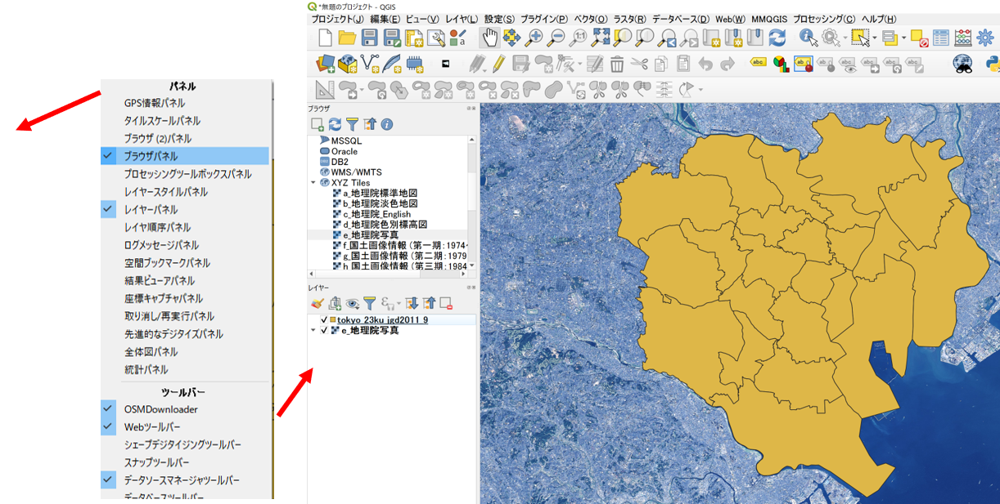

### 手動で、長さor面積を計測する方法
[QGISビギナーズマニュアル]を参考に、XYZタイルの追加から、地理院タイル（空中写真・衛星画像）を読み込む。背景地図が表示できたら、計測ツールをクリックし、`線の長さを測る`を選択する。
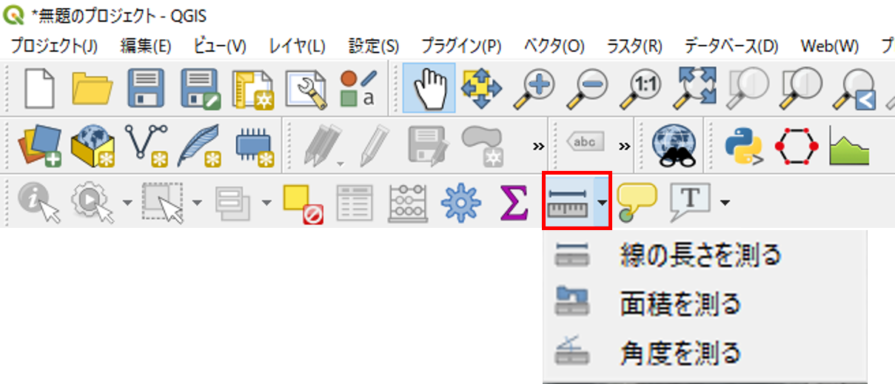

#### 不忍池の周長を測定
池の外周を縁取るように、点を打ち、最初の点と重なったところで右クリックすると周長が計算できる。
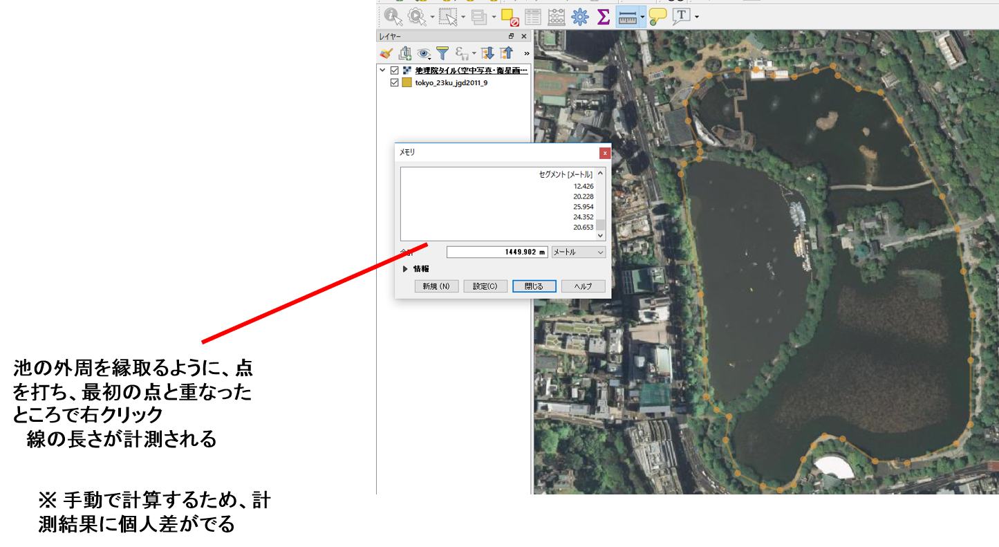

#### 不忍池の面積を測定
池の外周を縁取るように、点を打ち、最初の点と重なったところで右クリックすると面積が計算できる。
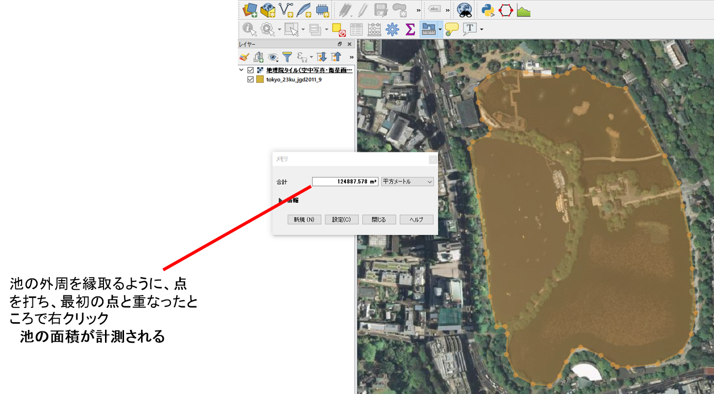

### フィールド演算から、長さor面積を計算する方法
shinobazu_pondのポリゴンを読み込み、周長と面積を計算する。
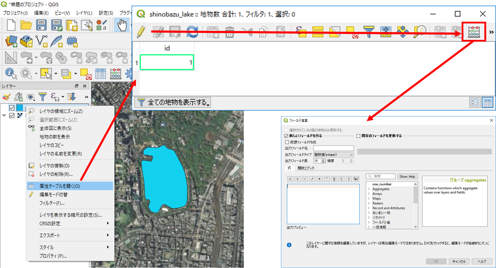
1. 属性テーブルを開き、編集モードに切り替える。
2. フィールド計算機を開く。

新規フィールドを作成し、フィールド演算を行う。
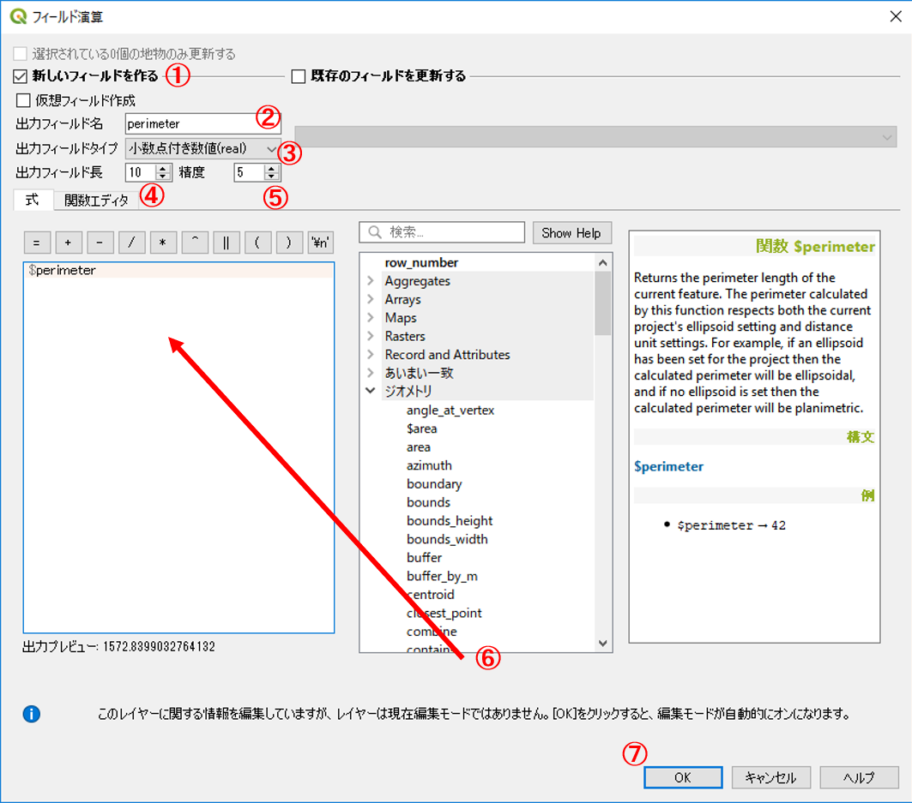

1. 「新しいフィールドを作る」にチェックする。
2. フィールド名：　perimeter
3. 出力フィールドタイプ：　real
4. 出力フィールド幅：　10 ※任意で変更可
5. 精度：　5 ※任意で変更可
6. 関数：　ジオメトリから$perimeterをダブルクリックする。※式に$perimeterが表示される。
※今回は周長なので$perimeterを選択する。
※線長を計測する場合には、$lengthを使用する。
7. OKをクリックする。　※面積の計測には、同じ手順で、$areaを使用する。

周長(length)と面積(area)のフィールドがつくられる。
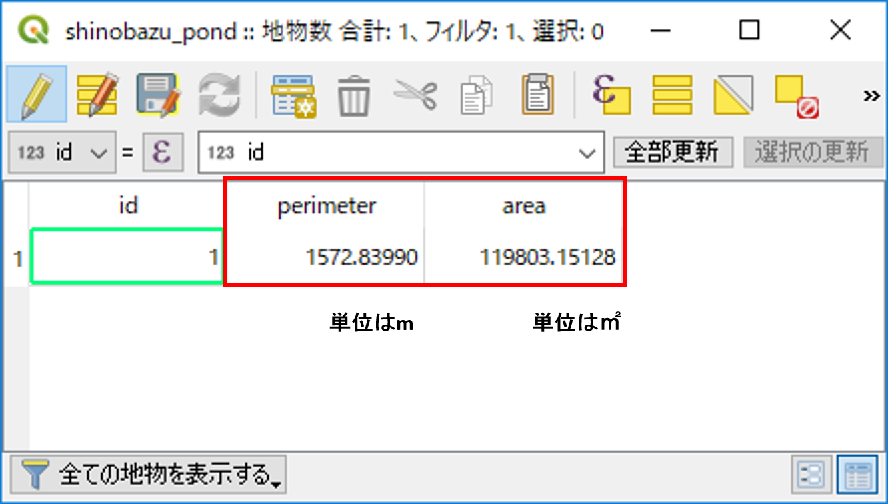

### フィールド計算を用いた計算
フィールド計算機では、様々な関数による計算を行うことができる。以下では、よく利用される関数を紹介したものである。

|関数名|処理内容|
|---|---|
|$length|線長|
|$area|面積|
|$geometry|ジオメトリ|
|$x|x座標|
|$y|y座標|
|$id|連番|

### 空間オブジェクトの選択
空間選択（地図の選択機能）から、台東区を検索する。

地図から選択する場合、選択ボタンを利用する。
レイヤウィンドウで対象レイヤをクリックし、青色になっているのを確認したのち、地物選択をクリックする。
台東区をクリックすると、色が黄色（選択色）になる。※以下の地図は、市町村名が分かりやすいように、属性情報をラベリングしています([QGISビギナーズマニュアル]のラベルの項目で解説)。

属性テーブルから、選択したエリアの情報を表示することができる。
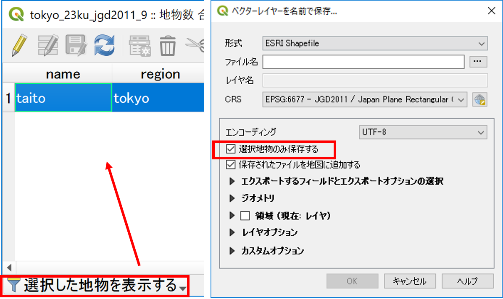
1. 属性テーブルを開き選択した地物を表示する。
2. 地図で選択した地物のみ表示される。

[▲メニューへもどる]

## その他の空間データの操作
　GISでは、データの位置、形状、属性を用いて新たにデータを作成することができます。以下では、マージ（複数のデータを1つに結合）、ディゾルブ（属性を用いてデータを融合する）、クリップ（重なっているデータを指定し、特定の範囲を切り取る）する手法について解説します。マージ、ディゾルブ、クリップの詳しい説明は、[地理情報科学教育用スライド（GIScスライド）]の4章を参照してください。

※あらかじめ、新規にフォルダを作成し、台東区と墨田区のシェープファイルを移動して下さい。シェープファイルは複数のデータで一つのファイルであるため、移動の際はすべてを動かすようにして下さい。

### 台東区と墨田区のポリゴンをマージ(Merge)する

空間選択から作成した台東区と墨田区のポリゴンデータをQGISで読み込む。`ベクタ＞データマネージメントツール＞複数のシェープファイルを一つに結合する`からマージを行う。
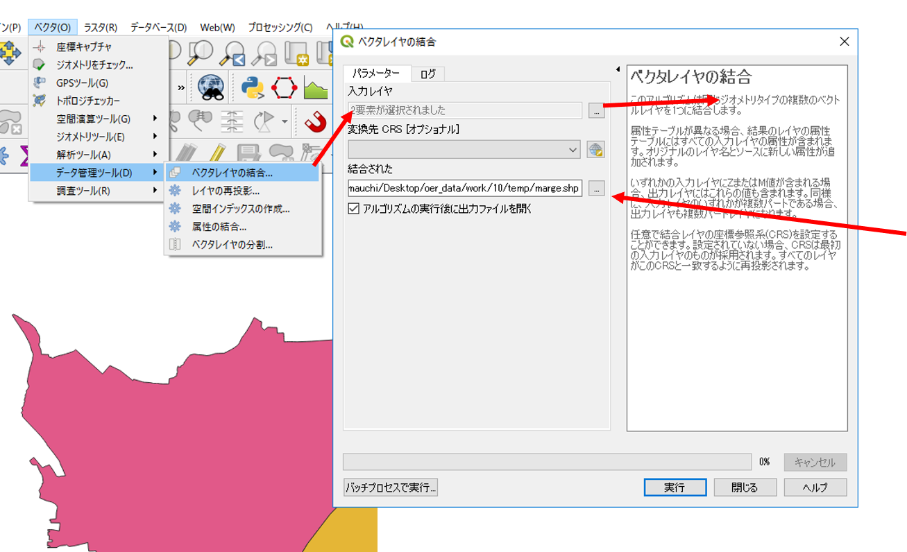
1. ポリゴンを選択する。
2. ブラウズから入力ディレクトリを選択する。
3. ブラウズから出力するシェープファイルの保存する場所と名前を入力する。
4. OKをクリックする。

台東区と墨田区がマージされ、一つのポリゴンになった。
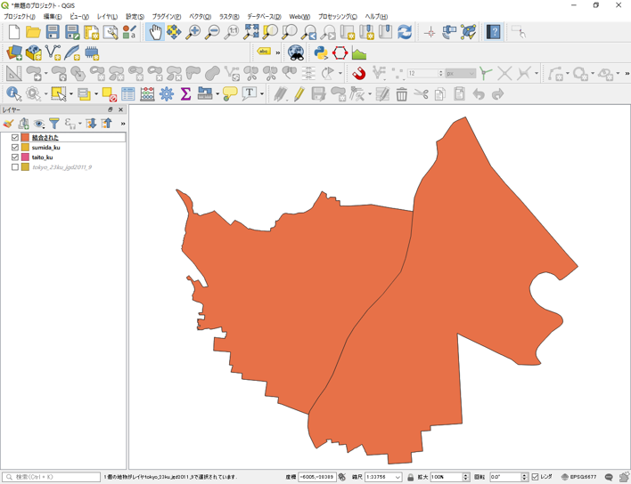

### マージしたポリゴンをデイゾルブ(Dissolve)する
`ベクタ＞空間演算ツール＞融合`からディゾルブを行う(町丁目界のないポリゴンの作成)。
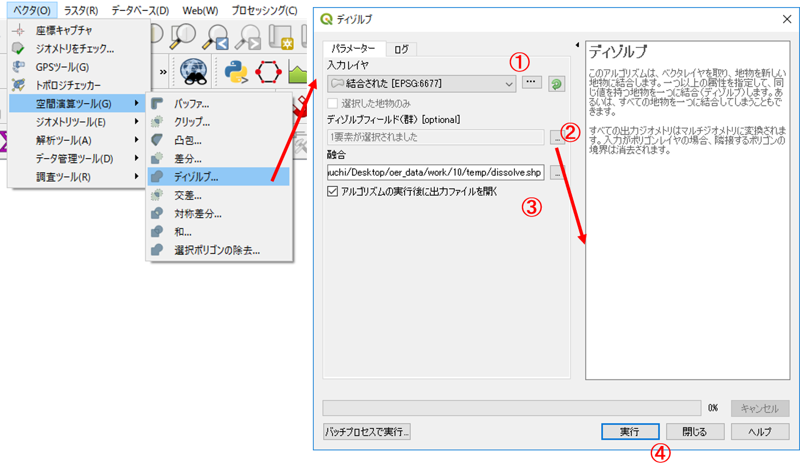
1. 入力レイヤを選択する。
2. ディゾルブフィールドを指定する（融合フィールドは、属性が統一されている行を選択する）
3. ブラウズから、出力場所と名前を入力する。
4. 実行をクリックする。

町丁目界がなくなり、単純なポリゴンが作成できた。
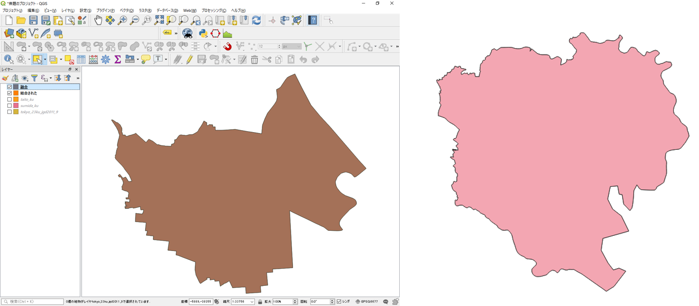

### 点データポリゴンでクリップ(Clip)する
`ベクタ＞空間演算ツール＞クリップ` からクリップを行う（対象エリアにあるレイヤの切り取り）。
23区のコンビニデータを読み込む。
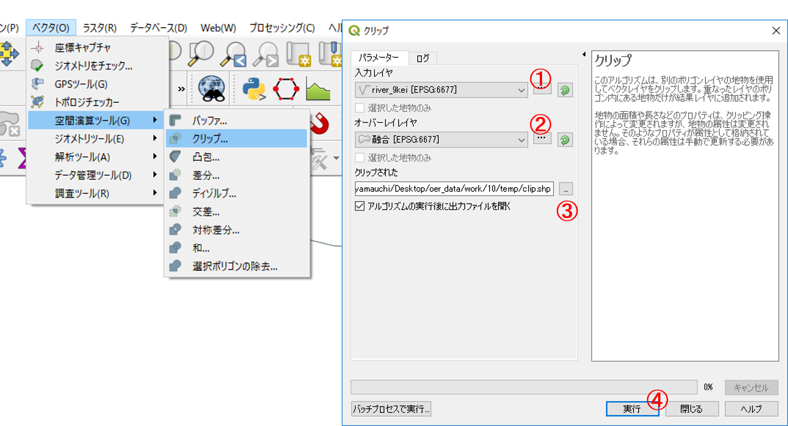
1. 入力レイヤをポイントにする。
2. オーバーレイヤを融合にする。
3. ブラウズから、出力場所と名前を入力する。
4. 実行をクリックする。　※入力レイヤ：　切り取りたいレイヤ。 クリップレイヤ：　クリップに使うレイヤ。

台東区と墨田区にあるコンビニが抽出できた。

[▲メニューへもどる]

## オーバーレイ分析
　オーバーレイ分析は、空間データを重ね合わせブール演算をもとに領域を抽出する手法である。以下では、インターセクトとユニオンの手法について解説している。インターセクトとユニオンの詳しい説明は、[地理情報科学教育用スライド（GIScスライド）]の4章を参照してください。

### インターセクト(Intersect)
国土数値情報の河川レイヤを用いて、東京の河川データを読み込み、インターセクトし(Intersect)別のポリゴンを作成する。
`ベクター＞空間演算ツール＞交差`からインターセクトを行う。
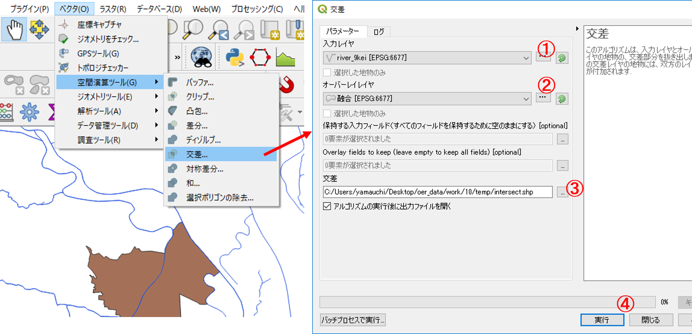
1. 入力ベクタレイヤを河川にする。
2. 交差レイヤを融合にする。
3. ブラウズから、出力場所と名前を入力する。
4. 実行をクリックする。

江東区と墨田区に交差する河川レイヤが新規に作成できた。

※属性情報をチェックしクリップとの違いを確認する。ポリゴンやラインは、長さや面積の再計算が必要な場合がある。

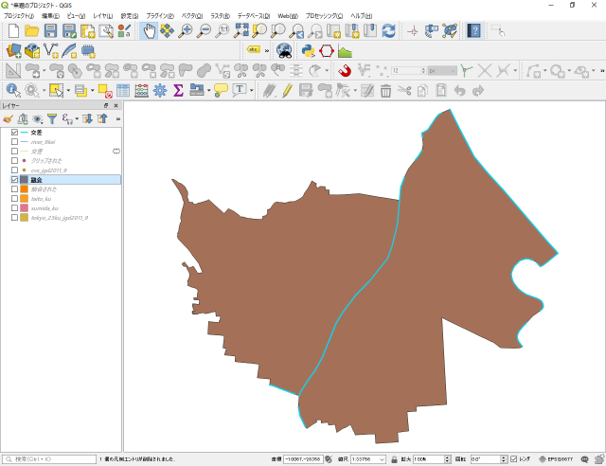

### ユニオン (Union)
台東区と墨田区のポリゴンを一つのポリゴンに統合する。　　　　　　　　　　　　　　　
`ベクター＞空間演算ツール＞統合`からユニオンを行う。
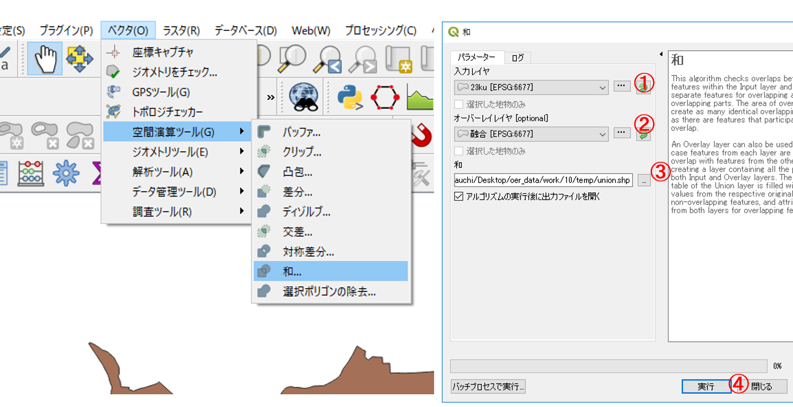
1. 入力レイヤをディゾルブした23区のポリゴンにする 。
2. オーバーレイヤを台東区と墨田区のポリゴンにする。
3. ブラウズから、出力場所と名前を入力する。
4. 実行をクリックする。

台東区と墨田区のポリゴンを一つのポリゴンに統合できた。
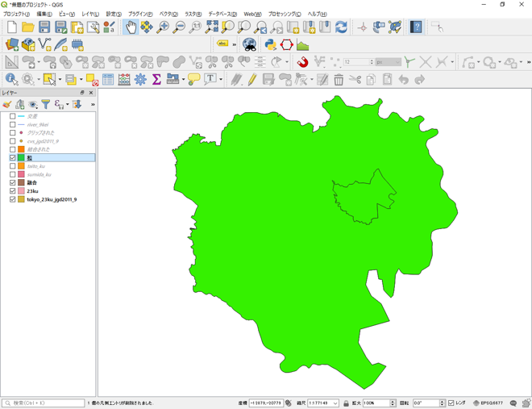

[▲メニューへもどる]

#### この教材の[課題ページ_基本的な空間解析]へ進む

#### ライセンスに関する注意事項
本教材で利用しているキャプチャ画像の出典やクレジットについては、[その他のライセンスについて]よりご確認ください。

[▲メニューへもどる]:./11.md#Menu
[利用規約]:../../policy.md
[その他のライセンスについて]:../license.md
[よくある質問とエラー]:../questions/questions.md

[GISの基本概念]:../00/00.md
[QGISビギナーズマニュアル]:../QGIS/QGIS_3.4.md
[GRASSビギナーズマニュアル]:../GRASS/GRASS.md
[リモートセンシングとその解析]:../06/06.md
[既存データの地図データと属性データ]:../07/07.md
[空間データ]:../08/08.md
[空間データベース]:../09/09.md
[空間データの統合・修正]:../10/10.md
[基本的な空間解析]:../11/11.md
[ネットワーク分析]:../12/12.md
[領域分析]:../13/13.md
[点データの分析]:../14/14.md
[ラスタデータの分析]:../15/15.md
[傾向面分析]:../16/16.md
[空間的自己相関]:../17/17.md
[空間補間]:../18/18.md
[空間相関分析]:../19/19.md
[空間分析におけるスケール]:../20/20.md
[視覚的伝達]:../21/21.md
[参加型GISと社会貢献]:../26/26.md

[地理院地図]:https://maps.gsi.go.jp
[e-Stat]:https://www.e-stat.go.jp/
[国土数値情報]:http://nlftp.mlit.go.jp/ksj/
[基盤地図情報]:http://www.gsi.go.jp/kiban/
[地理院タイル]:http://maps.gsi.go.jp/development/ichiran.html

[スライド_GISの基本概念]:https://github.com/gis-oer/gis-oer/raw/master/materials/00/00.pptx
[スライド_QGISビギナーズマニュアル]:https://github.com/gis-oer/gis-oer/raw/master/materials/QGIS/QGIS_3.4.pptx
[スライド_GRASSビギナーズマニュアル]:https://github.com/gis-oer/gis-oer/raw/master/materials/GRASS/GRASS.pptx
[スライド_リモートセンシングとその解析]:https://github.com/gis-oer/gis-oer/raw/master/materials/06/06.pptx
[スライド_既存データの地図データと属性データ]:https://github.com/gis-oer/gis-oer/raw/master/materials/07/07.pptx
[スライド_空間データ]:https://github.com/gis-oer/gis-oer/raw/master/materials/08/08.pptx
[スライド_空間データベース]:https://github.com/gis-oer/gis-oer/raw/master/materials/09/09.pptx
[スライド_空間データの統合・修正]:https://github.com/gis-oer/gis-oer/raw/master/materials/10/10.pptx
[スライド_基本的な空間解析]:https://github.com/gis-oer/gis-oer/raw/master/materials/11/11.pptx
[スライド_ネットワーク分析]:https://github.com/gis-oer/gis-oer/raw/master/materials/12/12.pptx
[スライド_領域分析]:https://github.com/gis-oer/gis-oer/raw/master/materials/13/13.pptx
[スライド_点データの分析]:https://github.com/gis-oer/gis-oer/raw/master/materials/14/14.pptx
[スライド_ラスタデータの分析]:https://github.com/gis-oer/gis-oer/raw/master/materials/15/15.pptx
[スライド_空間補間]:https://github.com/gis-oer/gis-oer/raw/master/materials/18/18.pptx
[スライド_視覚的伝達]:https://github.com/gis-oer/gis-oer/raw/master/materials/21/21.pptx
[スライド_参加型GISと社会貢献]:https://github.com/gis-oer/gis-oer/raw/master/materials/26/26.pptx

[課題ページ_QGISビギナーズマニュアル]:../tasks/t_qgis_entry.md
[課題ページ_GRASSビギナーズマニュアル]:../tasks/t_grass_entry.md
[課題ページ_リモートセンシングとその解析]:../tasks/t_06.md
[課題ページ_既存データの地図データと属性データ]:../tasks/t_07.md
[課題ページ_空間データ]:../tasks/t_08.md
[課題ページ_空間データベース]:../tasks/t_09.md
[課題ページ_空間データの統合・修正]:../tasks/t_10.md
[課題ページ_基本的な空間解析]:../tasks/t_11.md
[課題ページ_ネットワーク分析]:../tasks/t_12.md
[課題ページ_基本的な空間解析]:../tasks/t_13.md
[課題ページ_点データの分析]:../tasks/t_14.md
[課題ページ_ラスタデータの分析]:../tasks/t_15.md
[課題ページ_空間補間]:../tasks/t_18.md
[課題ページ_視覚的伝達]:../tasks/t_21.md
[課題ページ_参加型GISと社会貢献]:../tasks/t_26.md
<h2 style="background-color:#F8F5FD;text-align:center;">教材の利用に関するアンケート</h2>　本プロジェクトでは、教材の改良を目的とした任意アンケートを実施しています。ご協力いただける方は、<a href="https://customform.jp/form/input/14328/">アンケート</a>にお進みください。ご協力のほどよろしくお願いいたします。  ※ 本アンケートの成果は、教材の改良のほか、学会での発表等の研究目的でも利用します。また、本アンケートでは、個人が特定できるような質問は設けておりません。
