# 領域分析
　本教材は、「領域分析」の実習用教材です。GISソフトウェア（QGIS）を用いた、バッファなどの領域分析の手法について解説しています。
講義用教材として、[地理情報科学教育用スライド（GIScスライド）]の4章が参考になります。

　課題形式で使用する場合は、本教材を一読した後、課題ページへお進みください。GIS初学者は、本教材を進める前に[GISの基本概念]の教材を確認しておいてください。本教材を使用する際は、[利用規約]をご確認いただき、これらの条件に同意された場合にのみご利用下さい。

[地理情報科学教育用スライド（GIScスライド）]:http://curricula.csis.u-tokyo.ac.jp/slide/4.html

**Menu**
------
* [バッファによる領域分析](#バッファによる領域分析)
* [ボロノイ分割による領域分析](#ボロノイ分割による領域分析)
* [ドローネ三角形](#ドローネ三角形)

**使用データ**

　実習をはじめる前に、以下のデータをダウンロードしてください。なお、すべてのデータをJGD2000の平面直角座標系に統一して下さい国土数値情報のデータはダウンロード後に「JGD2000の平面直角座標系」へ座標変換する。国土数値情報データの読み込み時に空間参照設定のウィンドウが表示されたら、JGD2000を選択した後（QGIS2.8.4の場合）に変換の処理を行ってください。

* 国土交通省国土政策局「[国土数値情報]（愛知県　行政区域、郵便局、小学校、小学校区データ　全国　鉄道線、鉄道駅、空港データ）

>ダウンロード手法は、[既存データの地図データと属性データ]の教材を参考とする。座標系の変換手法は[空間データ]の教材を参考とする。名古屋市内のポリゴンは、愛知県のポリゴンから名古屋市を選択した状態（選択ツール）で、名前を付けて保存を実行する（この際に選択地物のみ...にチェックをつける）。その他のレイヤは、[基本的な空間解析]の教材を参考に用意する。

>国土数値情報の座標変換が上手くいかない場合は、[よくある質問とエラー]を参照

**スライド教材**

　本教材は、スライド形式([スライド_領域分析])としても、ご利用いただけます。

---

## バッファによる領域分析
　GISでは、地物からの距離に応じて一定の領域を作成する手法としてバッファがあります。バッファで抽出された領域は、例えば、コンビニエンスストアの新規出店者が、出店するコンビニから1000m以内の地物を検索したい場合等に使われます。以下では、QGISと国土数値情報よりダウンロードしたデータを利用し、ポイントからバッファを作成する手法や一定の距離に区切った多重リングバッファの作成手法について解説しています。また、バッファで作成した領域を用いた、空間検索についての解説も行っています。

### 点バッファの作成
愛知県の鉄道駅データを利用し、駅から500mのバッファを表示し、空間検索でバッファと重なる郵便局を抽出する。
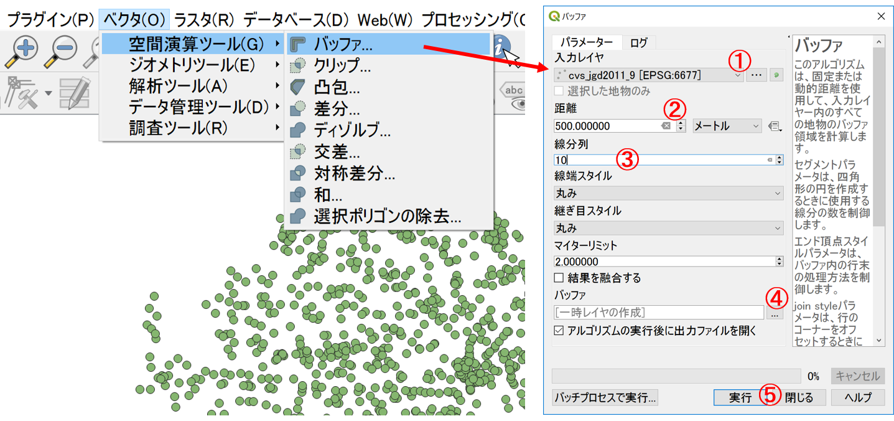
ベクタ＞空間演算ツール＞バッファ
1. 駅を選択する。
2. 円を近似させる線分の数10を入力する。（数が多いほどきれいな円になる）
3. 平面直角座標系であることを確認したのちに500を入力する。
4. 出力先と名称を指定する。
5. OKをクリックする。

(左)駅から500mのエリアが表示できた。
(右)バッファの結果を融合にチェックをいれた場合の例。
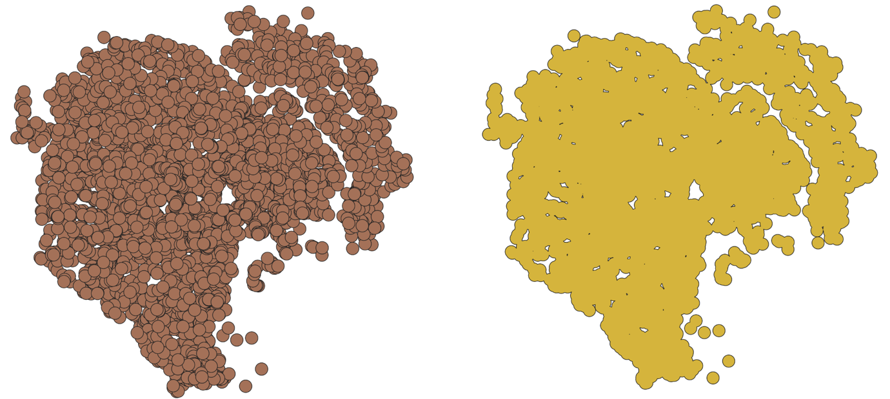

### 空間検索を利用した抽出
以下では、空間検索を利用して、バッファと重なる地物を選択する手法について解説しています。

プラグイン＞プラグインの管理とインストール　を実行し、空間クエリプラグインにチェックを付ける。

ベクタ＞空間検索（S）＞空間検索（S）から空間検索を実行する。
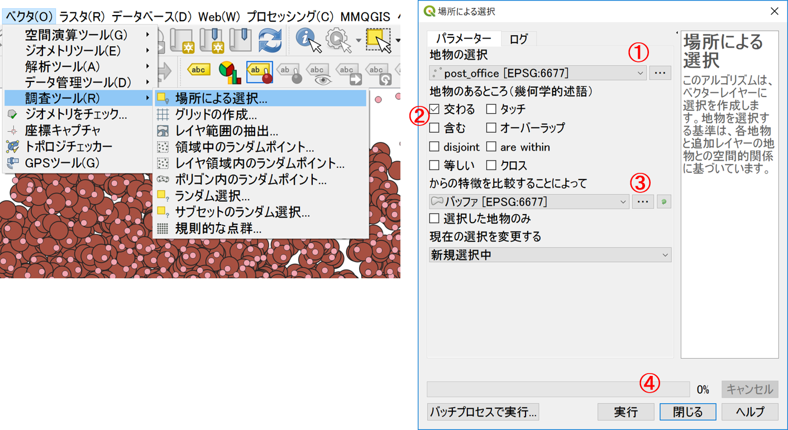
1. ソース地物の選択、郵便局を選択する。
2. 範囲内を選択する。
3. buffer500mを選択する。
4. 適用をクリックする。

下の図のように、駅から500m圏内の郵便局が選択された。
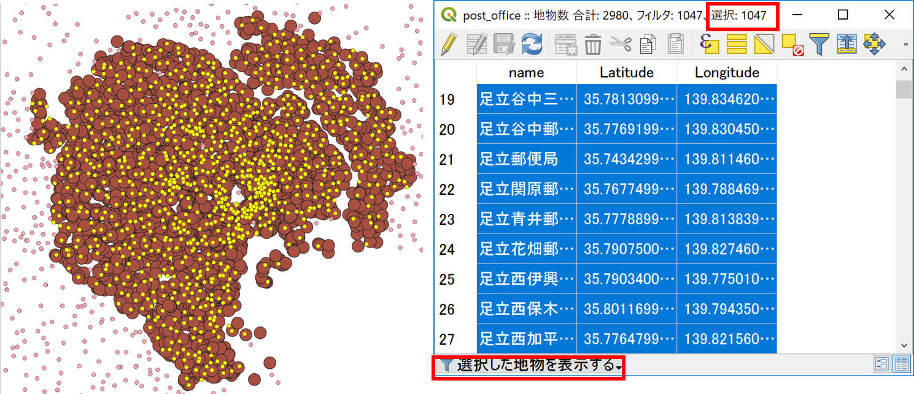

### 選択した地物の保存
QGISでは、選択した郵便局のみ保存することができる。  
レイヤの上で右クリックし、「名前をつけて保存する」から「選択地物のみ保存する」にチェックを入れて保存する。

### 多重リングバッファ
多重リングバッファを実行するため、プラグイン＞プラグインの管理とインストール　からMulti-distance bufferをインストールする。
「プラグインをインストール」をクリックする。
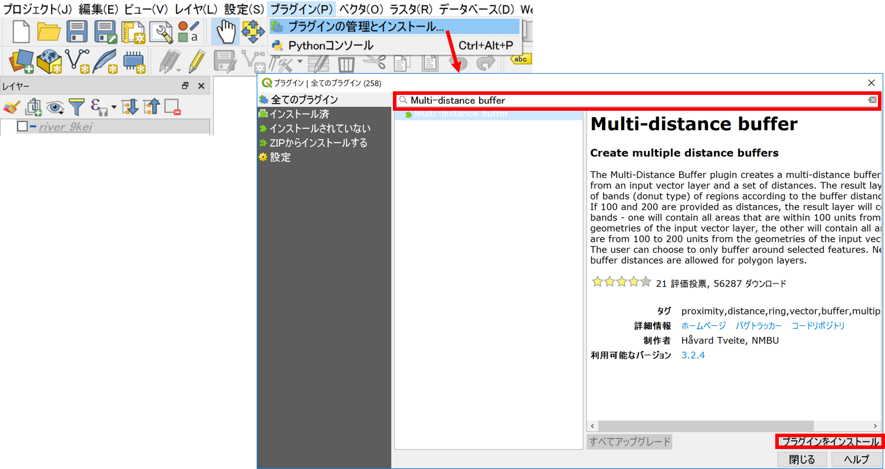

ベクタ＞Multi-distance buffer＞Multi-distance buffer　から多重リングバッファを作成する。
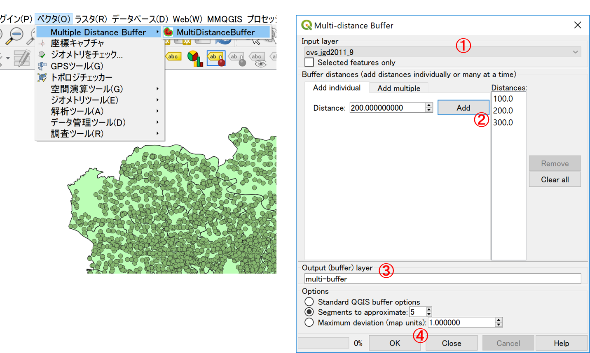
1. 駅を選択する。
2. Addで距離を追加する。
3. 出力レイヤ名を入力する。
4. OKをクリックする。

200mごとの多重リングバッファができた。
「名前をつけて保存」から新規レイヤとして出力する。
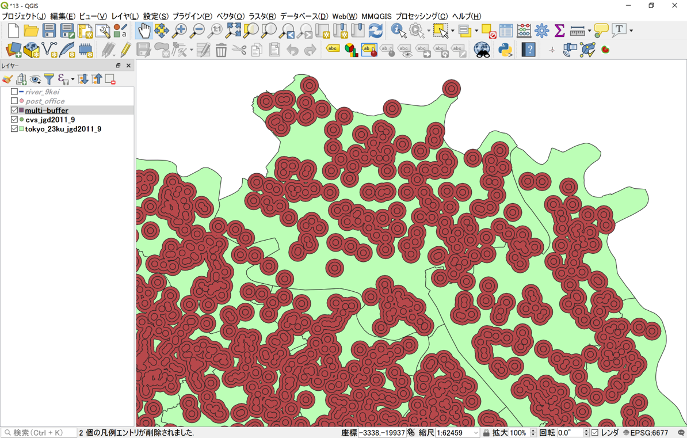

属性データを用いて、200mごとの色分けを行う。
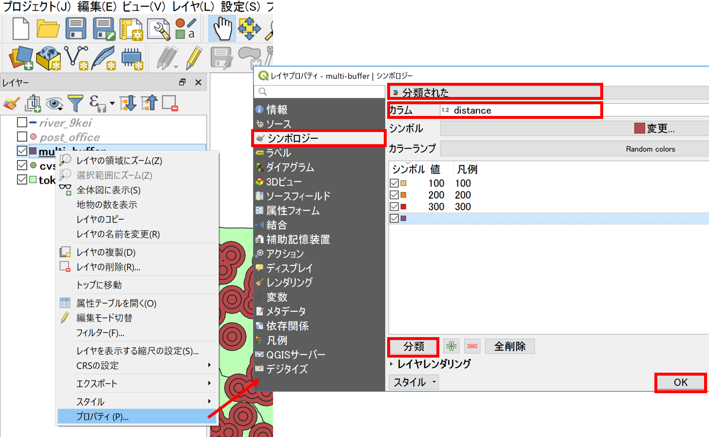

下の図のように、200mごとの多重リングバッファの表示が変更された。  
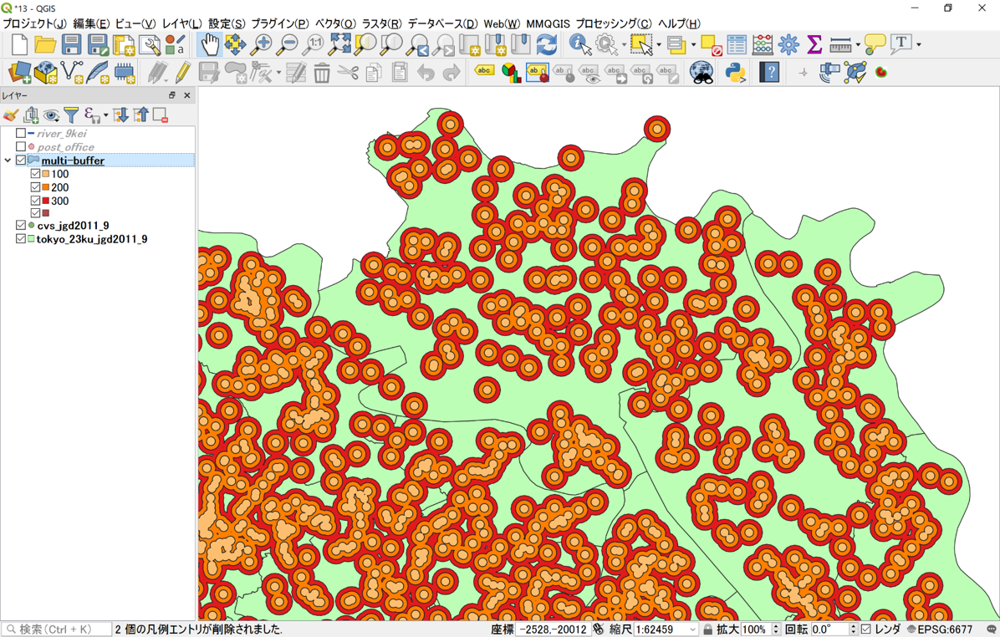

### 線バッファと面バッファ
同じ方法で、ラインやポリゴンからのバッファも作成できる。
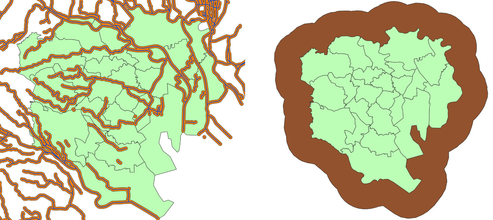

[▲メニューへもどる]

## ボロノイ分割による領域分析
　GISでは、複数ある地物の位置関係に応じて領域を作成する手法としてボロノイ分割があります。ボロノイ分割は、複数ある地物間の最近隣勢力圏に応じて、地域を分割するものです。ボロノイ図を作成することで、最近隣勢力圏を求めることができます。以下では、QGISと国土数値情報の郵便局データを用いて、ボロノイ分割について解説しています。

ベクタ＞ジオメトリーツール＞ボロノイポリゴン　からボロノイ分割を実行する。
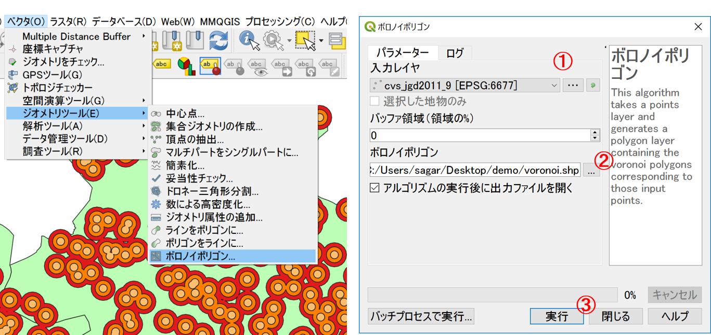
1. 郵便局を選択する。  
2. 出力場所と名称を入力する。
3. OKをクリックする。
※バッファ領域の値が大きいほど、ボロノイポリゴンの一番外側の領域が大きくなる。

ボロノイ領域に分割された。
属性テーブルとして、ポイントの情報を保持していることを確認する。
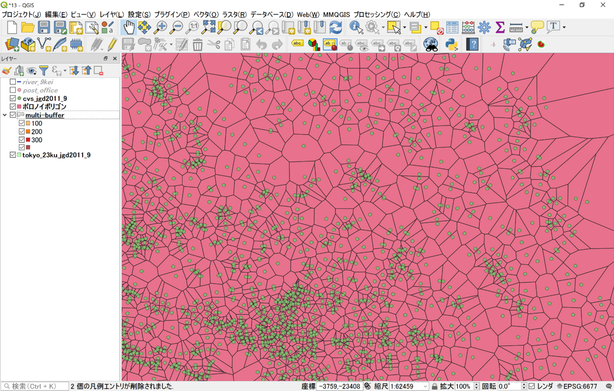

[▲メニューへもどる]

## ドローネ三角形
　複数の地物から最も近い点を結び合わせ隣接関係を定義する手法としてドローネ三角形がある。以下では、QGISを用いてドローネ三角形図を作成する手法について解説している。

ベクタ＞ジオメトリーツール＞ドローネ三角形分割から、ドローネ三角形分割を実行する。
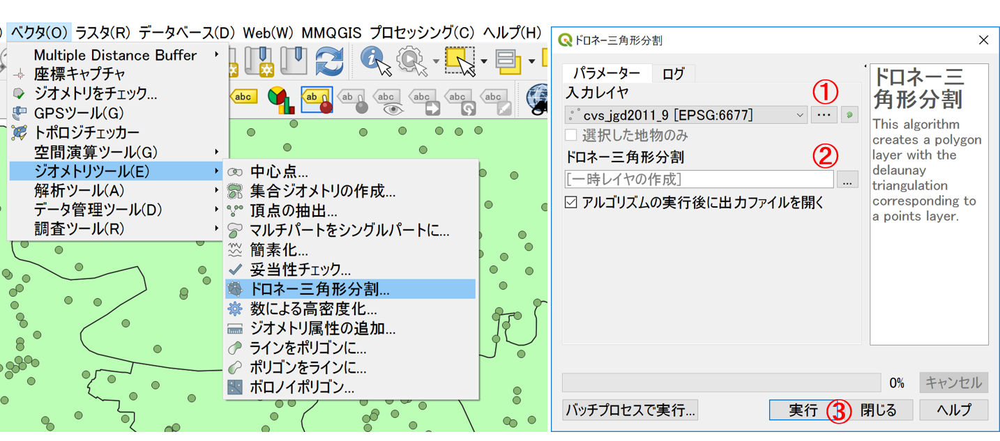
1. 小学校を選択する。
2. 出力場所と名称を入力する。
3. OKをクリックする。

以下のように、ドローネ三角形による領域分割ができた。
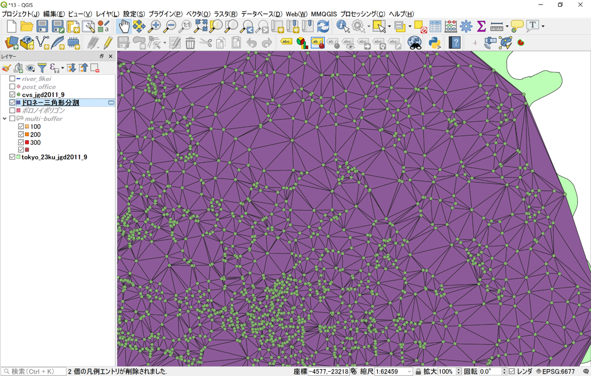

[▲メニューへもどる]

#### この教材の[課題ページ_領域分析]へ進む

#### ライセンスに関する注意事項
本教材で利用しているキャプチャ画像の出典やクレジットについては、[その他のライセンスについて]よりご確認ください。

[▲メニューへもどる]:./13.md#Menu
[利用規約]:../../policy.md
[その他のライセンスについて]:../license.md
[よくある質問とエラー]:../questions/questions.md

[GISの基本概念]:../00/00.md
[QGISビギナーズマニュアル]:../QGIS/QGIS.md
[GRASSビギナーズマニュアル]:../GRASS/GRASS.md
[リモートセンシングとその解析]:../06/06.md
[既存データの地図データと属性データ]:../07/07.md
[空間データ]:../08/08.md
[空間データベース]:../09/09.md
[空間データの統合・修正]:../10/10.md
[基本的な空間解析]:../11/11.md
[ネットワーク分析]:../12/12.md
[領域分析]:../13/13.md
[点データの分析]:../14/14.md
[ラスタデータの分析]:../15/15.md
[傾向面分析]:../16/16.md
[空間的自己相関]:../17/17.md
[空間補間]:../18/18.md
[空間相関分析]:../19/19.md
[空間分析におけるスケール]:../20/20.md
[視覚的伝達]:../21/21.md
[参加型GISと社会貢献]:../26/26.md

[地理院地図]:https://maps.gsi.go.jp
[e-Stat]:https://www.e-stat.go.jp/
[国土数値情報]:http://nlftp.mlit.go.jp/ksj/
[基盤地図情報]:http://www.gsi.go.jp/kiban/
[地理院タイル]:http://maps.gsi.go.jp/development/ichiran.html

[スライド_GISの基本概念]:https://github.com/gis-oer/gis-oer/raw/master/materials/00/00.pptx
[スライド_QGISビギナーズマニュアル]:https://github.com/gis-oer/gis-oer/raw/master/materials/QGIS/QGIS.pptx
[スライド_GRASSビギナーズマニュアル]:https://github.com/gis-oer/gis-oer/raw/master/materials/GRASS/GRASS.pptx
[スライド_リモートセンシングとその解析]:https://github.com/gis-oer/gis-oer/raw/master/materials/06/06.pptx
[スライド_既存データの地図データと属性データ]:https://github.com/gis-oer/gis-oer/raw/master/materials/07/07.pptx
[スライド_空間データ]:https://github.com/gis-oer/gis-oer/raw/master/materials/08/08.pptx
[スライド_空間データベース]:https://github.com/gis-oer/gis-oer/raw/master/materials/09/09.pptx
[スライド_空間データの統合・修正]:https://github.com/gis-oer/gis-oer/raw/master/materials/10/10.pptx
[スライド_基本的な空間解析]:https://github.com/gis-oer/gis-oer/raw/master/materials/11/11.pptx
[スライド_ネットワーク分析]:https://github.com/gis-oer/gis-oer/raw/master/materials/12/12.pptx
[スライド_領域分析]:https://github.com/gis-oer/gis-oer/raw/master/materials/13/13.pptx
[スライド_点データの分析]:https://github.com/gis-oer/gis-oer/raw/master/materials/14/14.pptx
[スライド_ラスタデータの分析]:https://github.com/gis-oer/gis-oer/raw/master/materials/15/15.pptx
[スライド_空間補間]:https://github.com/gis-oer/gis-oer/raw/master/materials/18/18.pptx
[スライド_視覚的伝達]:https://github.com/gis-oer/gis-oer/raw/master/materials/21/21.pptx
[スライド_参加型GISと社会貢献]:https://github.com/gis-oer/gis-oer/raw/master/materials/26/26.pptx

[課題ページ_QGISビギナーズマニュアル]:../tasks/t_qgis_entry.md
[課題ページ_GRASSビギナーズマニュアル]:../tasks/t_grass_entry.md
[課題ページ_リモートセンシングとその解析]:../tasks/t_06.md
[課題ページ_既存データの地図データと属性データ]:../tasks/t_07.md
[課題ページ_空間データ]:../tasks/t_08.md
[課題ページ_空間データベース]:../tasks/t_09.md
[課題ページ_空間データの統合・修正]:../tasks/t_10.md
[課題ページ_基本的な空間解析]:../tasks/t_11.md
[課題ページ_ネットワーク分析]:../tasks/t_12.md
[課題ページ_領域分析]:../tasks/t_13.md
[課題ページ_点データの分析]:../tasks/t_14.md
[課題ページ_ラスタデータの分析]:../tasks/t_15.md
[課題ページ_空間補間]:../tasks/t_18.md
[課題ページ_視覚的伝達]:../tasks/t_21.md
[課題ページ_参加型GISと社会貢献]:../tasks/t_26.md
<h2 style="background-color:#F8F5FD;text-align:center;">教材の利用に関するアンケート</h2>　本プロジェクトでは、教材の改良を目的とした任意アンケートを実施しています。ご協力いただける方は、<a href="https://customform.jp/form/input/14328/">アンケート</a>にお進みください。ご協力のほどよろしくお願いいたします。  ※ 本アンケートの成果は、教材の改良のほか、学会での発表等の研究目的でも利用します。また、本アンケートでは、個人が特定できるような質問は設けておりません。
