# ラスタデータの分析
　本教材は、「ラスタデータの分析」の実習用教材です。各セルに標高値を保持しているラスタデータを用いて、地形解析の手法について解説しています。本教材では、数値標高モデル(DEM)として整備されたデータを用います。DEMは、Digital Elevation Modelの略であり、地形解析等に用いられるデータです。本教材の内容と対応する講義用教材の[地理情報科学教育用スライド（GIScスライド）]の4章を一読すると理解が深まります。

　課題形式で使用する場合は、本教材を一読した後、課題ページへお進みください。GIS初学者は、本教材を進める前に[GISの基本概念]の教材を確認しておいてください。本教材を使用する際は、[利用規約]をご確認いただき、これらの条件に同意された場合にのみご利用下さい。

[地理情報科学教育用スライド（GIScスライド）]:http://curricula.csis.u-tokyo.ac.jp/slide/4.html

**Menu**
------
* [数値標高モデルの視覚的分析](#数値標高モデルの視覚的分析)
* [基本的な統計量の確認](#基本的な統計量の確認)
* [ベクタの処理とラスタの集計の組み合わせ分析](#ベクタの処理とラスタの集計の組み合わせ分析)
* [フィルタリング](#フィルタリング)
* [ラスタ演算](#ラスタ演算)
* [流域解析](#流域解析)
* [コストパス解析](#コストパス解析)

**実習用データ**

実習をはじめる前に、[aso]をダウンロードしてください。

**スライド教材**

本教材は、[スライド_ラスタデータの分析]としても、ご利用いただけます。

[aso]:https://github.com/gis-oer/datasets/raw/master/aso.zip

----------

## 数値標高モデルの視覚的分析
各セルごとに標高値を保持しているラスタデータを用いることで、傾斜区分図、斜面方位図、陰影図、3D地図、断面図を作成することができます。以下では、その手法について解説しています。QGISを起動し、`データソースマネージャ>ラスタ`からラスタデータを表示してください。

### 標高段彩図の作成
`プロパティ＞シンボル体系`を選択し、レンダリングタイプを`単バンド疑似カラー`を選択し`OK`をクリック押すとラスターの配色が変更できる。

下の図のように、ラスターの配色が変更された。
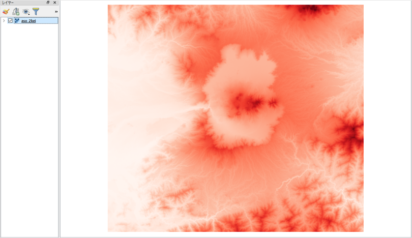

シンボル体系では、最小、最大値、分類モード、分類数等を指定できる。各項目を設定後、分類をクリックすると反映される。また、各値、ラベルの上で、ダブルクリックすると値、ラベルの指定ができる。
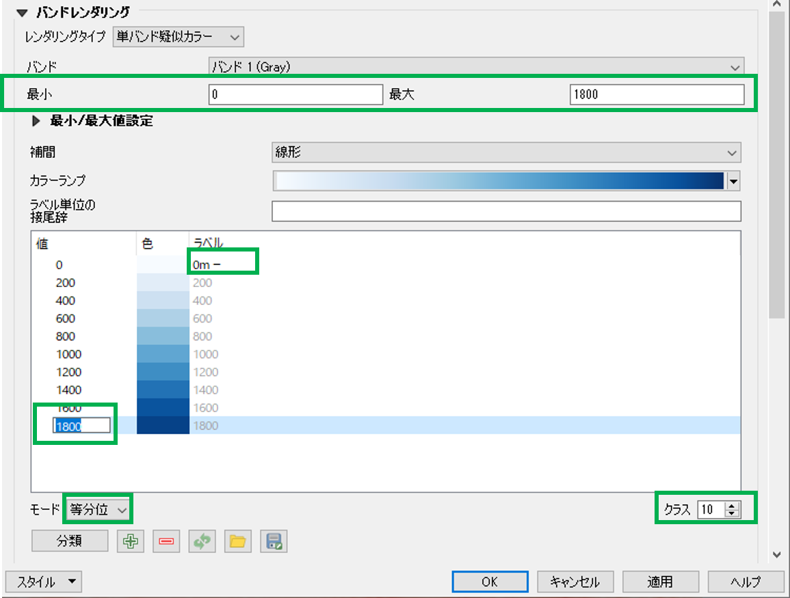

以下では、200ｍ間隔で標高値を色分けした。
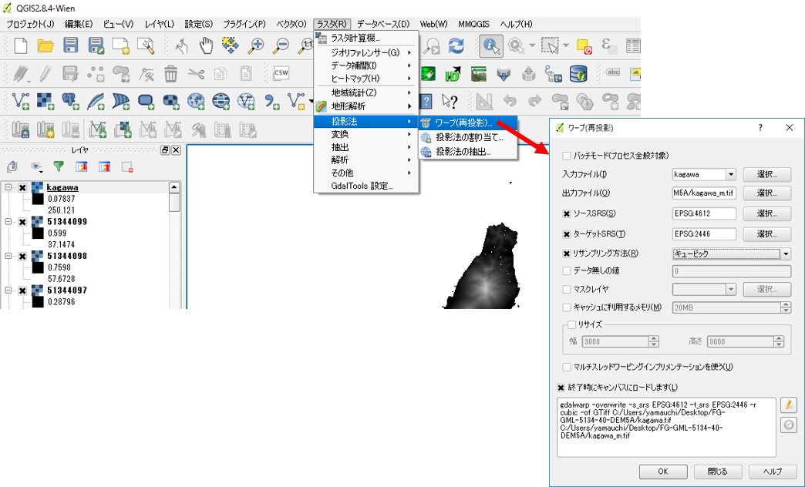

### 傾斜区分図の作成
`ラスタ＞解析＞傾斜`を選択し、`実行`をクリックすると傾斜区分が計算できる。
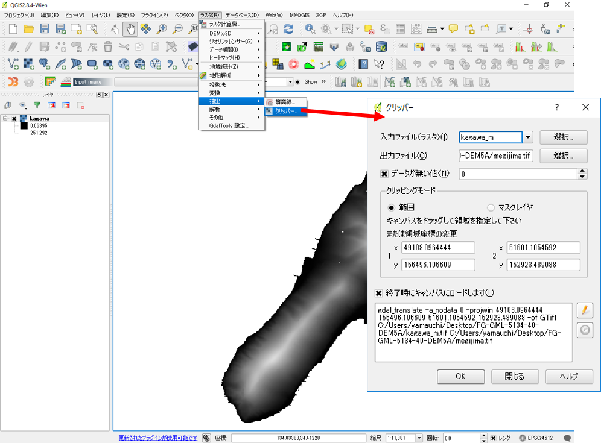

下の図のように、傾斜区分図が表示された。

### 斜面方位図の作成
`ラスタ＞地形解析＞傾斜方位`を実行すると傾斜方位が計算できる。

下の図のように、斜面方位図が表示された。
斜面は、360°で計算されるため角度に応じて値を分類する。

### 陰影図の作成
`ラスタ＞地形解析＞陰影図`を実行すると陰影図が計算できる。

下の図のように、陰影図が表示された。
右下の図のように陰影図を元にしたラスタを重ねて、透過率を設定することで立体的な地形表現ができ地形の高低差が読み取りやすくなる。

※透過率は、`プロパティ＞透過性`から設定する。

### 鳥瞰図の作成
`ビュー＞新しい3Dマップビュー`を選択し、`3Dビューの設定`アイコンをクリックする。

高さに標高値のラスタデータを指定し、ＯＫをクリックする。ウィンドウ内で地図を動かすと3次元表示されていることが確認できる。鉛直スケールを1以上とすると、下の図のように地形を誇張して表現できる。

### 地形断面図の作成
`プラグイン＞プラグインの管理とインストール`から`VoGIS Profile tool` をインストールする。

`ラスタ>VoGIS ProfileTool > VoGIS Profile Tool`から起動する。

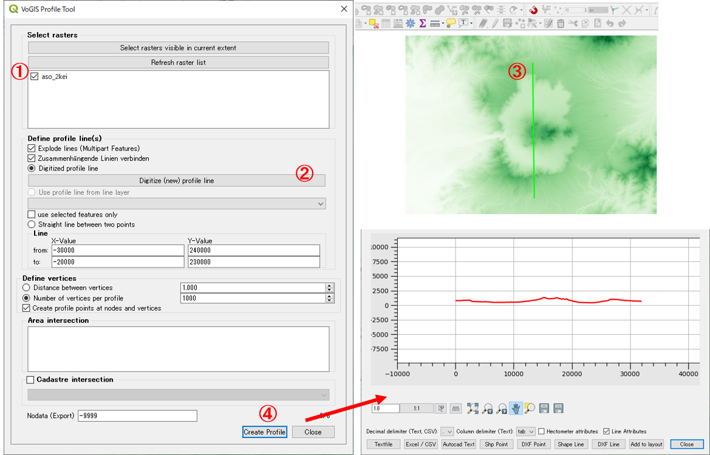
1. 断面図を作成するラスタにチェックを入れる。
2. `Digitize (new) profile line` をクリックする。
3. QGISの地図上でクリックしながらラインを作成する。（右クリックで終了）
4. `Create Profile`をクリックすると別ウィンドウに断面形状が表示される。

[▲メニューへもどる]

## 基本的な統計量の確認
以下では、QGISでラスタデータが保持する情報を確認する手法を解説しています。

`ラスタ＞その他＞ラスター情報`を開き、統計情報を表示するラスタを選択し、`画像統計量を読み込んで表示する`にチェックをつけ、実行をクリックする
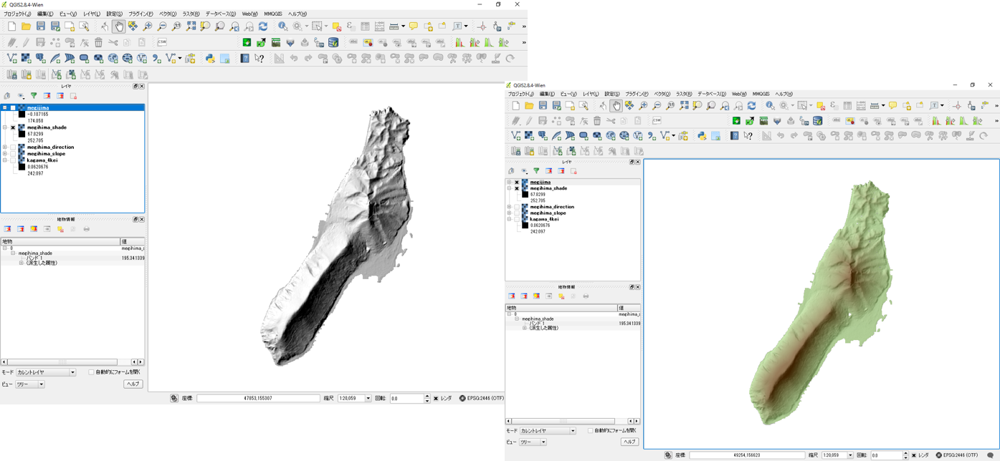

実行結果は、結果ビューアの`File path`をクリックし、html形式で確認する（座標系、セルサイズ、最低標高、最高標高、平均標高、標高の標準偏差等）。
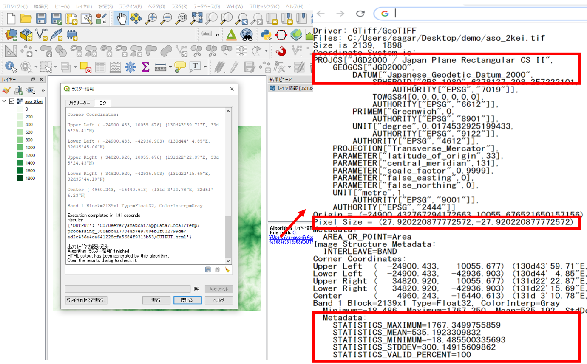

[▲メニューへもどる]

## ベクタの処理とラスタの集計の組み合わせ分析
　GISでは、ラスタデータとベクトルデータを重ねて、情報を取得することができます。以下では、地震計から100ｍの範囲を示すポリゴンを用いて、そのポリゴンと重なるラスタのセル値を計算する手法について解説します。

以下では、地震計のある地点周辺の標高値を計算する。今回は阿蘇データセットの中からaso_seismometers_100m_2kei.shpを使用する。
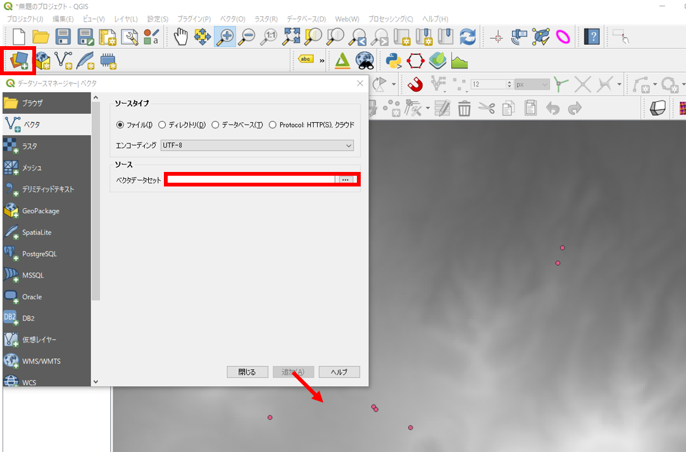

`プロセッシング＞ツールボックス`から地域統計を検索し`地域統計`をクリックする。
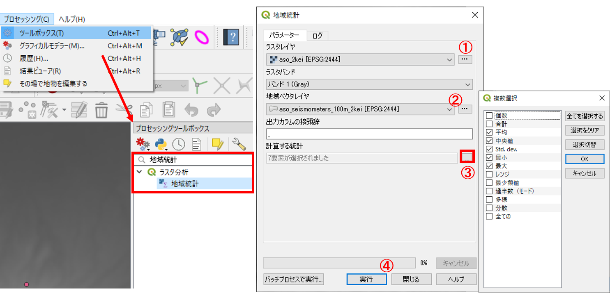
1. ラスタレイヤに標高値のラスタデータを指定する。
2. 地域ベクタレイヤに地震計から100ｍの範囲を示すポリゴンのデータを指定する。
3. 計算する統計を指定する。今回は、`平均・中央・Std.dev,・最小・最大`を選択した。
4. `実行`をクリックする。

属性テーブルを開き、最大標高、最小標高等の計算結果を確認する。
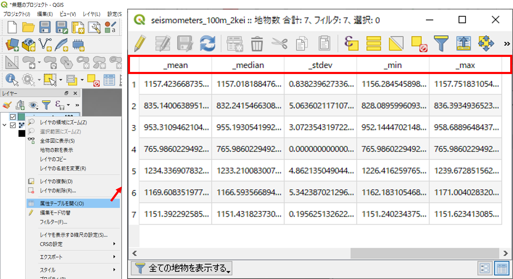

[▲メニューへもどる]

## フィルタリング（ふるい）
フィルタリングは、近傍のセルの値を考慮して、セルの値を変化させる処理のことを指します。以下では、QGISのふるい機能を用いてフィルタリングする手法について解説しています。

`ラスタ＞解析＞ふるい`を実行する。
入力ファイルと出力ファイルを指定し、`実行`をクリックする。
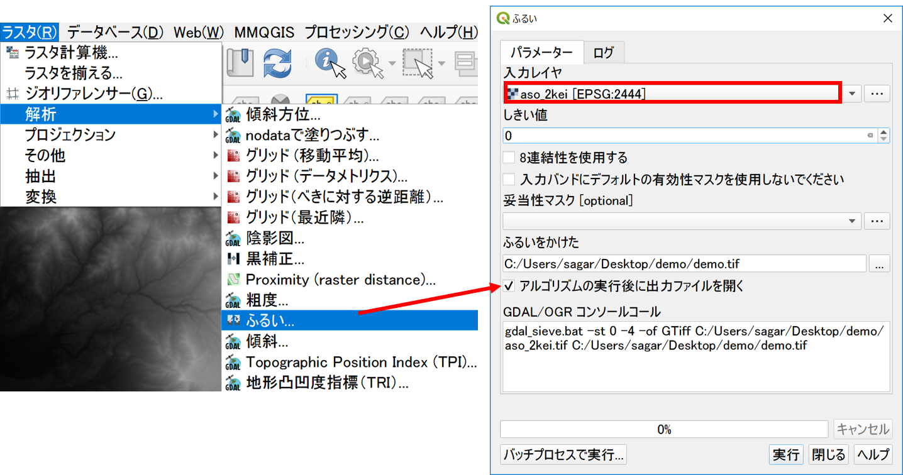

地物情報表示ツールから、値が変わっていることを確認する。
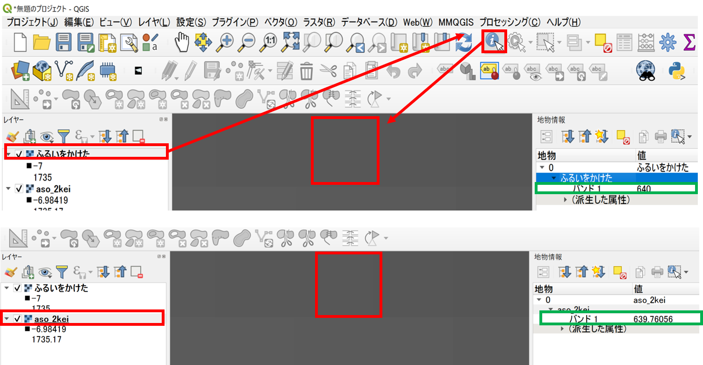
[▲メニューへもどる]

## ラスタ演算
　GISでは、ラスタデータのセルの大きさや領域が同一であれば、演算によって新規のデータを出力できます。この処理は、地形の変化を計算する際などに用いられます。例えば、10年前に取得された標高データと現在取得したデータを引き算することで地形の変化量を求めることができます。以下では、標高データや傾斜データを用いて、条件指定したエリアを抽出する手法について解説します。

はじめに、標高値と傾斜角のラスタを読み込む。`ラスタ＞ラスタ計算機`から計算結果を出力するための新規ラスタを作成する。
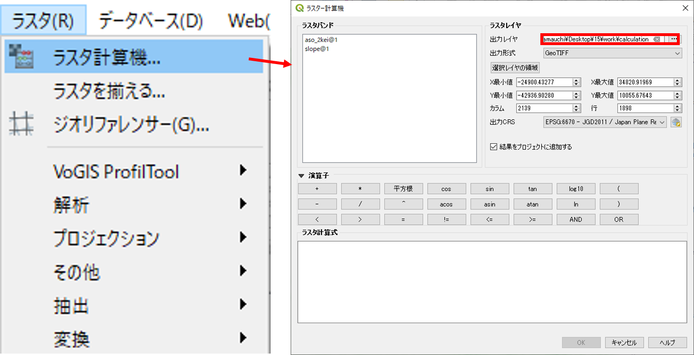

DEMから標高450ｍ以上の地域を抽出する。
ラスタ計算式に`“aso_2kei@1” >= 450`を入力後、OKをクリックすると右下の図のように表示される。
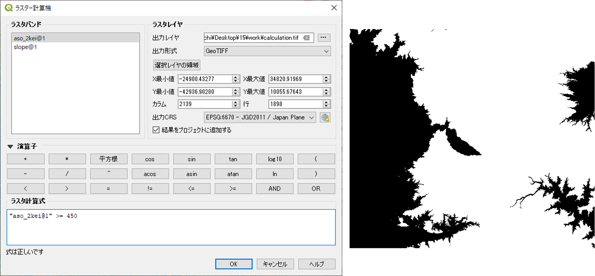

DEMから標高300m以上で傾斜が5度以下の地域を抽出する。
ラスタ計算式に`“aso_2kei@1” >= 450 AND “slope@1” <= 5`を入力後、`OK`をクリックすると右下の図のように表示される。
※"slope@"1は[斜面方位図の作成]で作成した傾斜ラスタである。

[▲メニューへもどる]

## 流域解析
　DEMデータから流域を求める際に、流域解析を行います。以下では、その手法について解説します。

`プロセッシング＞ツールボックス`から`r.watershed`を選択する。
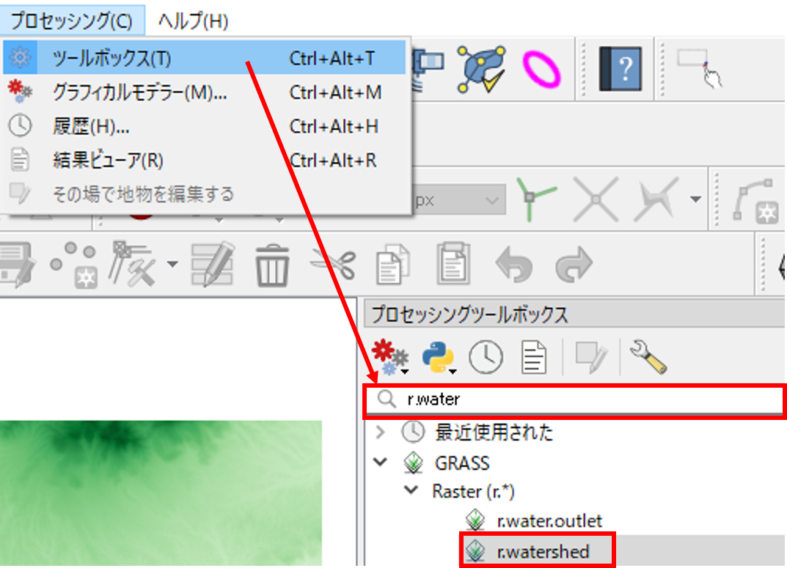

`Elevation`に標高ラスタを指定し、流域とするセル数を10000とし、累積流量、流れの方向、河川、流域を抽出する。
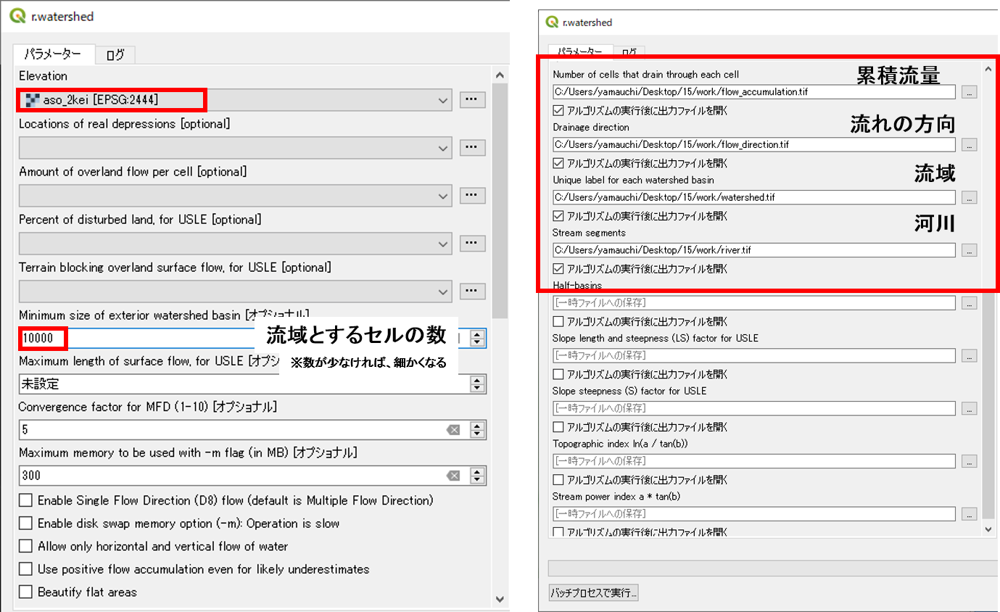

各項目ごとに下のような図ができる。
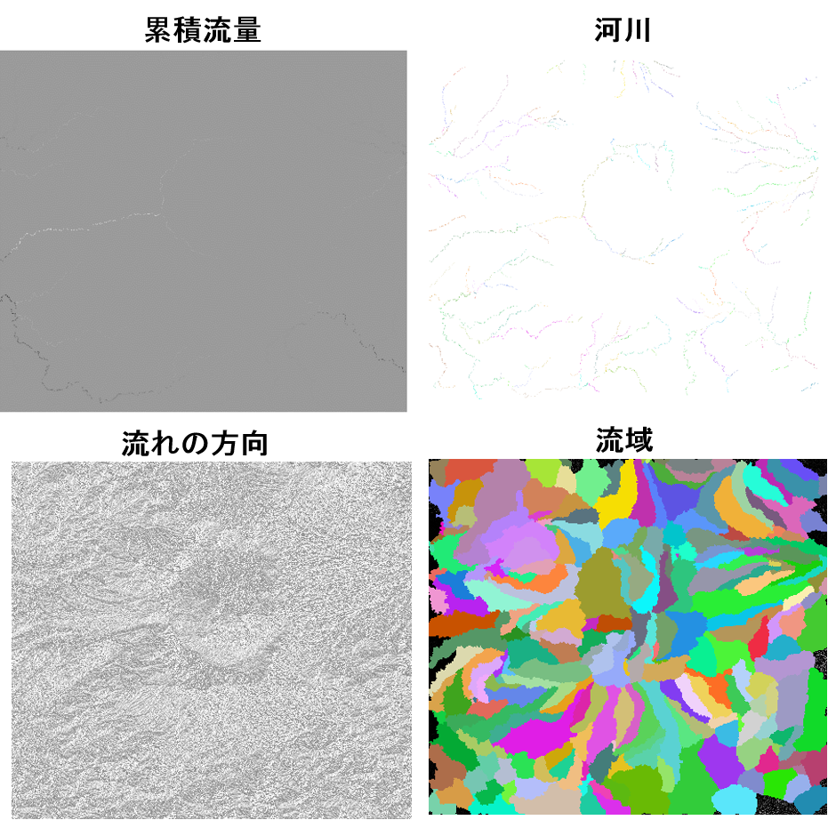

以下から、流域と河川のラスタをベクトルに変換していく。河川は、ラインに出力できるように河川のラスタを単純化する。`プロセッシング＞ツールボックス`をクリックする。次に`r.thin`を検索し`r.thin`を選択する。河川のラスターを設定し実行をクリックする。
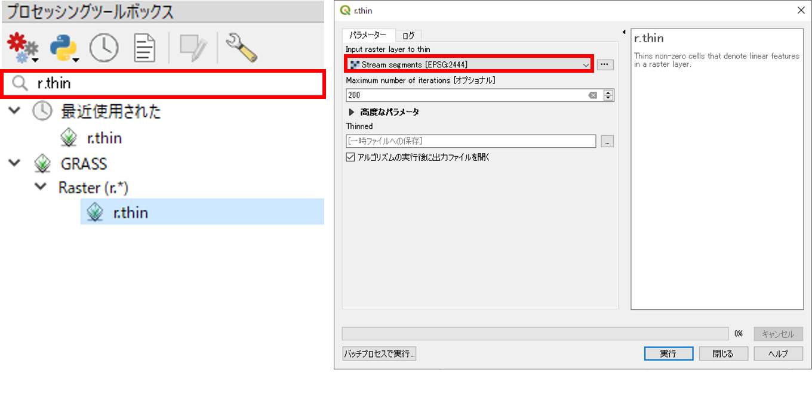

ラスタをベクトル（ライン）に変換し`プロセッシング＞ツールボックス`をクリックする。次に`r.to.vect`を選択する。Thinnedのラスタを指定し、feture typeでlineを選択する。出力のファイル名を一時ファイルへの保存として実行する。
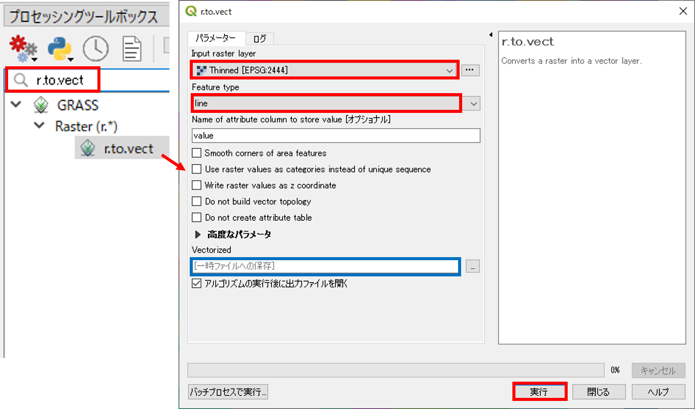

`プロパティ＞シンボロジー`を選択し、データのスタイルを調節する。
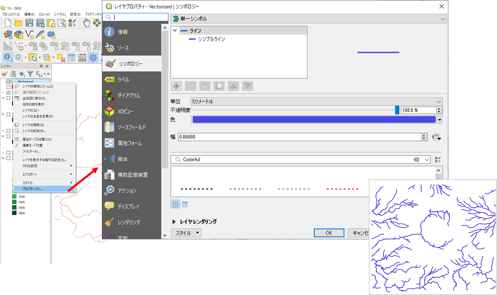

出力したデータを保存するため、河川の`プロパティ＞エクスポート＞地物の保存`を選択し、形式を`ESRI Shapefile`、出力場所とファイル名、CRSを指定し、`OK`をクリックする。
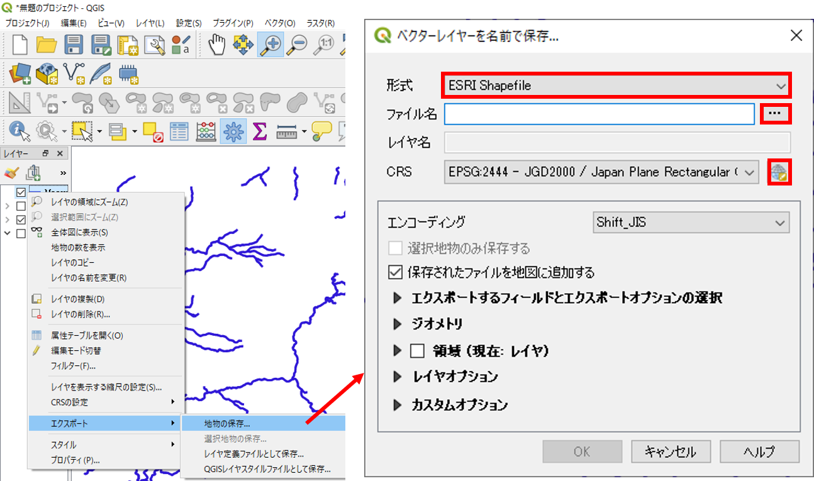

同様の手法で、流域ラスタを指定し、Feature type をareaとし、流域のポリゴンを出力する。
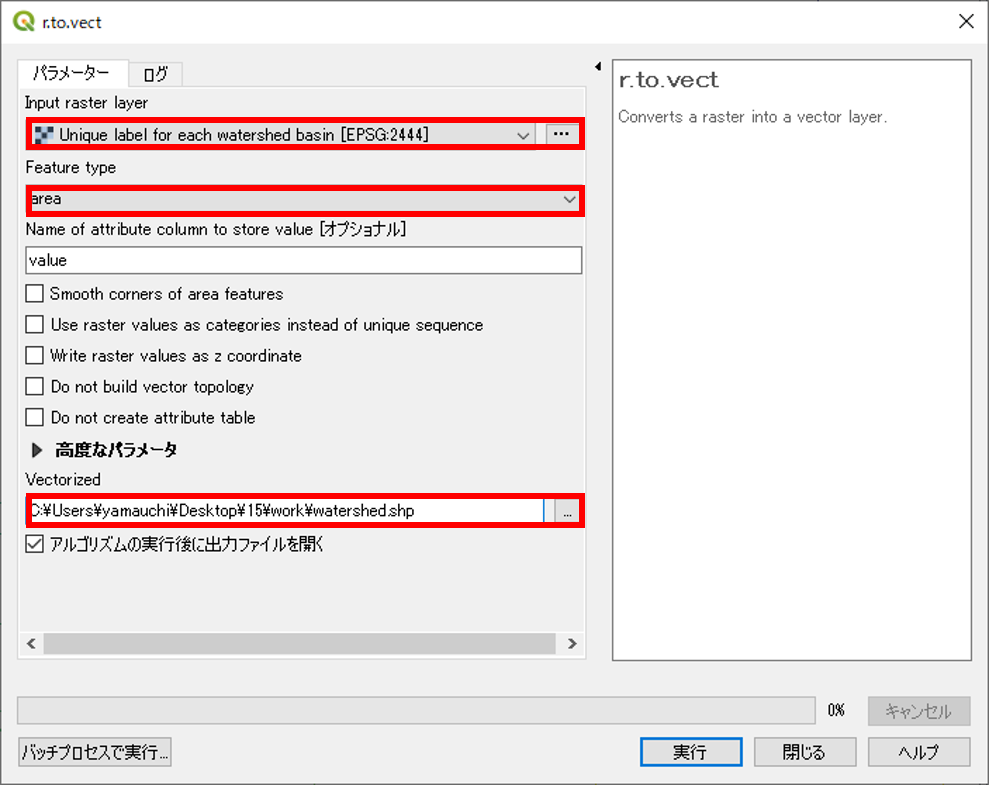

`プロパティ＞シンボロジー＞分類された`からカラムをcatとし、`分類`をクリックする。データを保存するには、河川レイヤと同様に`プロパティ＞エクスポート＞地物の保存`を実行する。
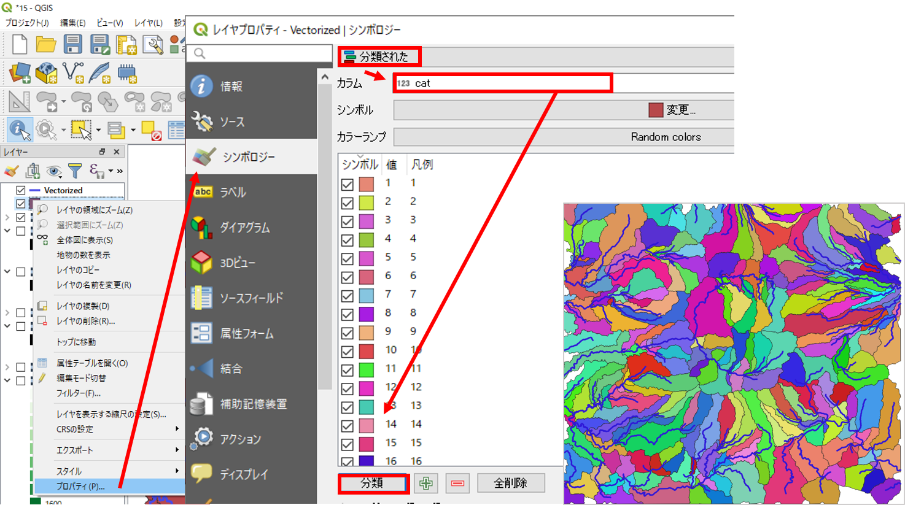

[▲メニューへもどる]

## コストパス解析
　コストパス解析は、DEMデータを用いて、任意の地点間の経路を求める場合等に用いられます。以下では、傾斜をもとに移動コストを算出する手法を解説する。この実習の前に、QGISに標高ラスタと傾斜ラスタを読み込んでおく。

Asoフォルダ内の`aso_2kei.tif、slope.tif、start.shp、end.shp`をQGISにインポートする。`プロセッシング＞ツールボックス`を開き、検索で`r.walk.points`を検索し`r.walk.points`選択する。
1. 傾斜ラスタを指定する。
2. フリクションコストを含むラスタに、傾斜角を指定する。
3. 出発点としてstart.shpを指定する。
4. 出力ラスタを指定する。
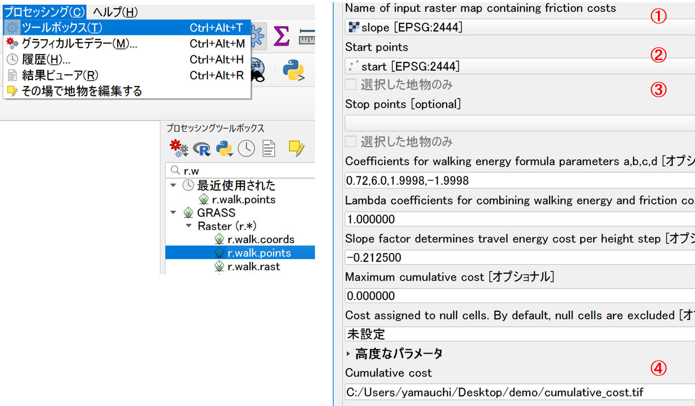

以下のように、Cumulative_costのラスタの配色を調整すると、解析結果を確認できる。

### 移動コストをもとに任意の2転換の最短経路を検索する
`プラグインの管理とインストール＞Least-Cost path`をインストールする。
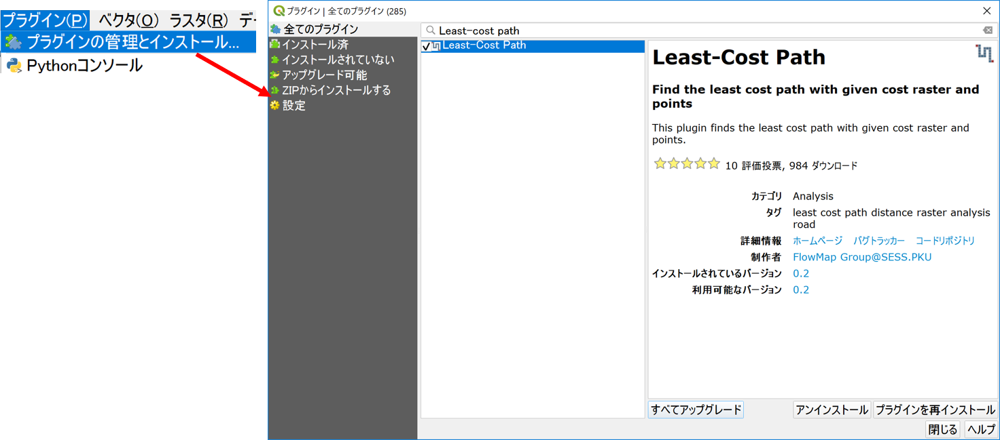

`プロセッシング＞ツールボックス`から、インストールした`Least Cost Path`を起動する。
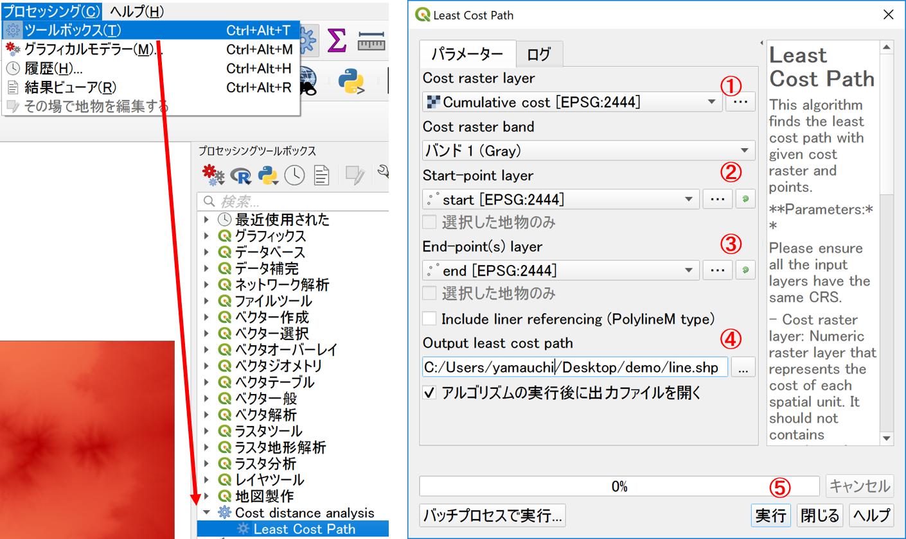

1. cululative_costのラスタを指定する。
2. Start-point layerにstart.shpを指定する。
3. End-point(s) layerにend.shpを指定する。
4. 出力レイヤを指定する。
5. 実行をクリックする。

下の図のように、任意の2点間で傾斜に基づく最短経路が検索できる。
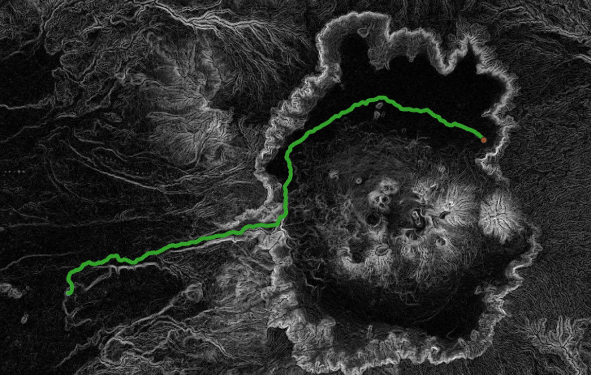

[▲メニューへもどる]

#### この教材の[課題ページ_ラスタデータの分析]へ進む

#### ライセンスに関する注意事項
本教材で利用しているキャプチャ画像の出典やクレジットについては、[その他のライセンスについて]よりご確認ください。

[▲メニューへもどる]:./15.md#Menu
[株式会社エコリスのＨＰ]:http://www.ecoris.co.jp/contents/demtool.html
[利用規約]:../../policy.md
[その他のライセンスについて]:../license.md
[よくある質問とエラー]:../questions/questions.md

[GISの基本概念]:../00/00.md
[QGISビギナーズマニュアル]:../QGIS/QGIS.md
[GRASSビギナーズマニュアル]:../GRASS/GRASS.md
[リモートセンシングとその解析]:../06/06.md
[既存データの地図データと属性データ]:../07/07.md
[空間データ]:../08/08.md
[空間データベース]:../09/09.md
[空間データの統合・修正]:../10/10.md
[基本的な空間解析]:../11/11.md
[ネットワーク分析]:../12/12.md
[領域分析]:../13/13.md
[点データの分析]:../14/14.md
[ラスタデータの分析]:../15/15.md
[傾向面分析]:../16/16.md
[空間的自己相関]:../17/17.md
[空間補間]:../18/18.md
[空間相関分析]:../19/19.md
[空間分析におけるスケール]:../20/20.md
[視覚的伝達]:../21/21.md
[参加型GISと社会貢献]:../26/26.md

[地理院地図]:https://maps.gsi.go.jp
[e-Stat]:https://www.e-stat.go.jp/
[国土数値情報]:http://nlftp.mlit.go.jp/ksj/
[基盤地図情報]:http://www.gsi.go.jp/kiban/
[地理院タイル]:http://maps.gsi.go.jp/development/ichiran.html

[スライド_GISの基本概念]:https://github.com/gis-oer/gis-oer/raw/master/materials/00/00.pptx
[スライド_QGISビギナーズマニュアル]:https://github.com/gis-oer/gis-oer/raw/master/materials/QGIS/QGIS.pptx
[スライド_GRASSビギナーズマニュアル]:https://github.com/gis-oer/gis-oer/raw/master/materials/GRASS/GRASS.pptx
[スライド_リモートセンシングとその解析]:https://github.com/gis-oer/gis-oer/raw/master/materials/06/06.pptx
[スライド_既存データの地図データと属性データ]:https://github.com/gis-oer/gis-oer/raw/master/materials/07/07.pptx
[スライド_空間データ]:https://github.com/gis-oer/gis-oer/raw/master/materials/08/08.pptx
[スライド_空間データベース]:https://github.com/gis-oer/gis-oer/raw/master/materials/09/09.pptx
[スライド_空間データの統合・修正]:https://github.com/gis-oer/gis-oer/raw/master/materials/10/10.pptx
[スライド_基本的な空間解析]:https://github.com/gis-oer/gis-oer/raw/master/materials/11/11.pptx
[スライド_ネットワーク分析]:https://github.com/gis-oer/gis-oer/raw/master/materials/12/12.pptx
[スライド_領域分析]:https://github.com/gis-oer/gis-oer/raw/master/materials/13/13.pptx
[スライド_点データの分析]:https://github.com/gis-oer/gis-oer/raw/master/materials/14/14.pptx
[スライド_ラスタデータの分析]:https://github.com/gis-oer/gis-oer/raw/master/materials/15/15.pptx
[スライド_空間補間]:https://github.com/gis-oer/gis-oer/raw/master/materials/18/18.pptx
[スライド_視覚的伝達]:https://github.com/gis-oer/gis-oer/raw/master/materials/21/21.pptx
[スライド_参加型GISと社会貢献]:https://github.com/gis-oer/gis-oer/raw/master/materials/26/26.pptx

[課題ページ_QGISビギナーズマニュアル]:../tasks/t_qgis_entry.md
[課題ページ_GRASSビギナーズマニュアル]:../tasks/t_grass_entry.md
[課題ページ_リモートセンシングとその解析]:../tasks/t_06.md
[課題ページ_既存データの地図データと属性データ]:../tasks/t_07.md
[課題ページ_空間データ]:../tasks/t_08.md
[課題ページ_空間データベース]:../tasks/t_09.md
[課題ページ_空間データの統合・修正]:../tasks/t_10.md
[課題ページ_基本的な空間解析]:../tasks/t_11.md
[課題ページ_ネットワーク分析]:../tasks/t_12.md
[課題ページ_領域分析]:../tasks/t_13.md
[課題ページ_点データの分析]:../tasks/t_14.md
[課題ページ_ラスタデータの分析]:../tasks/t_15.md
[課題ページ_空間補間]:../tasks/t_18.md
[課題ページ_視覚的伝達]:../tasks/t_21.md
[課題ページ_参加型GISと社会貢献]:../tasks/t_26.md
<h2 style="background-color:#F8F5FD;text-align:center;">教材の利用に関するアンケート</h2>　本プロジェクトでは、教材の改良を目的とした任意アンケートを実施しています。ご協力いただける方は、<a href="https://customform.jp/form/input/14328/">アンケート</a>にお進みください。ご協力のほどよろしくお願いいたします。  ※ 本アンケートの成果は、教材の改良のほか、学会での発表等の研究目的でも利用します。また、本アンケートでは、個人が特定できるような質問は設けておりません。
