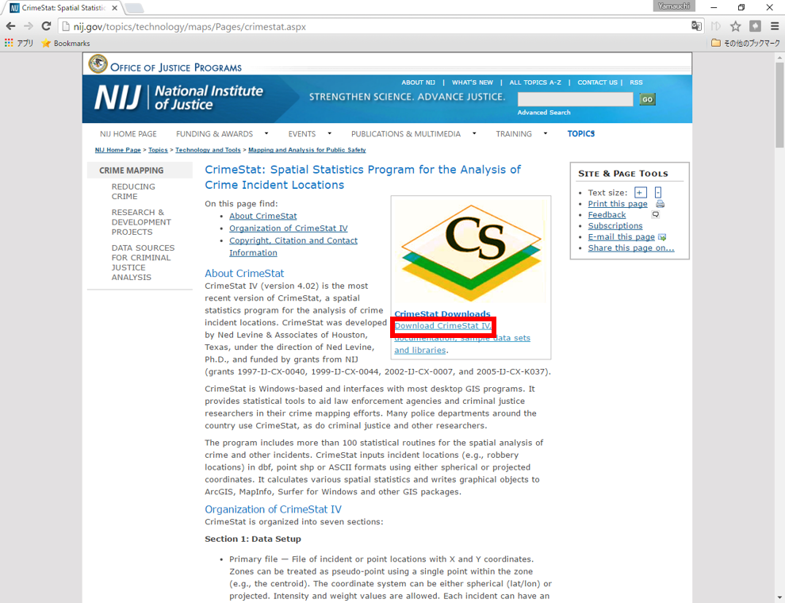
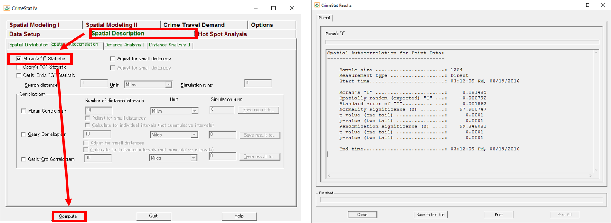

# 空間的自己相関
本教材は、「空間的自己相関」の実習用教材です。GISソフトウェアを用いた、空間的自己相関の分析手法について解説しています。ソフトウェアには、無償で利用できるCrimeStatを用いています。講義用教材として、[地理情報科学教育用スライド（GIScスライド）]の4章が参考になります。本教材を使用する際は、[利用規約]をご確認いただき、これらの条件に同意された場合にのみご利用下さい。


[地理情報科学教育用スライド（GIScスライド）]:http://curricula.csis.u-tokyo.ac.jp/slide/4.html

**Menu**
------
* [CrimeStatのインストール](#CrimeStatのインストール)
* [Moran’s_I統計量](#Moran’s_I統計量)
* [Geary's_C統計量](#Geary's_C統計量)
* [Join_count統計量](#Join_count統計量)

**使用データ**

* 国土数値情報　平成27年東京都地価公示　を加工し利用

----------
## CrimeStatのインストール<a name="CrimeStatのインストール"></a>
NIJ(The　National Institute of Justice,USA) `https://nij.gov/topics/technology/maps/Pages/crimestat.aspx` にアクセスし、CrimeStat IV をダウンロードし、解凍後に.exeファイルを起動する。



[▲メニューへもどる]

## Moran’s_I_統計量<a name="Moran’s_I_統計量"></a>

Select Filesからデータを読み込む。XとYに位置座標を設定し、Zに地価の値を設定する。
Projected, Meters, Days にチェックを入れる。


タブをSpatial Descriptionに切り替え、Moran's I staticにチェックをいれ、「compute」をクリックすると値が算出される。


[▲メニューへもどる]

## Geary's_C統計量統計量<a name="Geary's_C統計量 統計量"></a>
Geary's_C統計量　にチェックをいれ、「compute」をクリックすると値が算出される。


[▲メニューへもどる]

## Join_count統計量
Join_count統計量はR等で、算出することができる。
下記は計算の例である。

```R

#Join_count統計量

chika.hi.low <- cut(chika$h27_chika, breaks=c(0,mean(chika$h27_chika), max(chika$h27_chika)), labels=c("low", "high"))

names(chika.hi.low) <- chika$ID
joincount.multi(chika.hi.low, nb2listw(chika.tri.nb,
style="B"))

 Joincount Expected Variance z-valuelow:
low    2856.000 2542.624  280.119  18.724
high:high   413.000  120.115   90.209  30.837
high:low    502.000 1108.261  445.501 -28.723
Jtot        502.000 1108.261  445.501 -28.723

```

### 参考になる書籍
空間的自己相関の分析にRを利用する手法は、古谷知之（2011）
『Ｒによる空間データの統計分析 (統計科学のプラクティス)』が詳しい。

[▲メニューへもどる]

#### ライセンスに関する注意事項
本教材で利用しているキャプチャ画像の出典やクレジットについては、[その他のライセンスについて]よりご確認ください。

[▲メニューへもどる]:./17.md#Menu
[利用規約]:../../policy.md
[その他のライセンスについて]:../license.md
[よくある質問とエラー]:../questions/questions.md

[GISの基本概念]:../00/00.md
[QGISビギナーズマニュアル]:../QGIS/QGIS.md
[GRASSビギナーズマニュアル]:../GRASS/GRASS.md
[リモートセンシングとその解析]:../06/06.md
[既存データの地図データと属性データ]:../07/07.md
[空間データ]:../08/08.md
[空間データベース]:../09/09.md
[空間データの統合・修正]:../10/10.md
[基本的な空間解析]:../11/11.md
[ネットワーク分析]:../12/12.md
[領域分析]:../13/13.md
[点データの分析]:../14/14.md
[ラスタデータの分析]:../15/15.md
[傾向面分析]:../16/16.md
[空間的自己相関]:../17/17.md
[空間補間]:../18/18.md
[空間相関分析]:../19/19.md
[空間分析におけるスケール]:../20/20.md
[視覚的伝達]:../21/21.md
[参加型GISと社会貢献]:../26/26.md

[地理院地図]:https://maps.gsi.go.jp
[e-Stat]:https://www.e-stat.go.jp/
[国土数値情報]:http://nlftp.mlit.go.jp/ksj/
[基盤地図情報]:http://www.gsi.go.jp/kiban/
[地理院タイル]:http://maps.gsi.go.jp/development/ichiran.html


[スライド_GISの基本概念]:https://github.com/gis-oer/gis-oer/raw/master/materials/00/00.pptx
[スライド_QGISビギナーズマニュアル]:https://github.com/gis-oer/gis-oer/raw/master/materials/QGIS/QGIS.pptx
[スライド_GRASSビギナーズマニュアル]:https://github.com/gis-oer/gis-oer/raw/master/materials/GRASS/GRASS.pptx
[スライド_リモートセンシングとその解析]:https://github.com/gis-oer/gis-oer/raw/master/materials/06/06.pptx
[スライド_既存データの地図データと属性データ]:https://github.com/gis-oer/gis-oer/raw/master/materials/07/07.pptx
[スライド_空間データ]:https://github.com/gis-oer/gis-oer/raw/master/materials/08/08.pptx
[スライド_空間データベース]:https://github.com/gis-oer/gis-oer/raw/master/materials/09/09.pptx
[スライド_空間データの統合・修正]:https://github.com/gis-oer/gis-oer/raw/master/materials/10/10.pptx
[スライド_基本的な空間解析]:https://github.com/gis-oer/gis-oer/raw/master/materials/11/11.pptx
[スライド_ネットワーク分析]:https://github.com/gis-oer/gis-oer/raw/master/materials/12/12.pptx
[スライド_領域分析]:https://github.com/gis-oer/gis-oer/raw/master/materials/13/13.pptx
[スライド_点データの分析]:https://github.com/gis-oer/gis-oer/raw/master/materials/14/14.pptx
[スライド_ラスタデータの分析]:https://github.com/gis-oer/gis-oer/raw/master/materials/15/15.pptx
[スライド_空間補間]:https://github.com/gis-oer/gis-oer/raw/master/materials/18/18.pptx
[スライド_視覚的伝達]:https://github.com/gis-oer/gis-oer/raw/master/materials/21/21.pptx
[スライド_参加型GISと社会貢献]:https://github.com/gis-oer/gis-oer/raw/master/materials/26/26.pptx

[課題ページ_QGISビギナーズマニュアル]:../tasks/t_qgis_entry.md
[課題ページ_GRASSビギナーズマニュアル]:../tasks/t_grass_entry.md
[課題ページ_リモートセンシングとその解析]:../tasks/t_06.md
[課題ページ_既存データの地図データと属性データ]:../tasks/t_07.md
[課題ページ_空間データ]:../tasks/t_08.md
[課題ページ_空間データベース]:../tasks/t_09.md
[課題ページ_空間データの統合・修正]:../tasks/t_10.md
[課題ページ_基本的な空間解析]:../tasks/t_11.md
[課題ページ_ネットワーク分析]:../tasks/t_12.md
[課題ページ_基本的な空間解析]:../tasks/t_13.md
[課題ページ_点データの分析]:../tasks/t_14.md
[課題ページ_ラスタデータの分析]:../tasks/t_15.md
[課題ページ_空間補間]:../tasks/t_18.md
[課題ページ_視覚的伝達]:../tasks/t_21.md
[課題ページ_参加型GISと社会貢献]:../tasks/t_26.md
