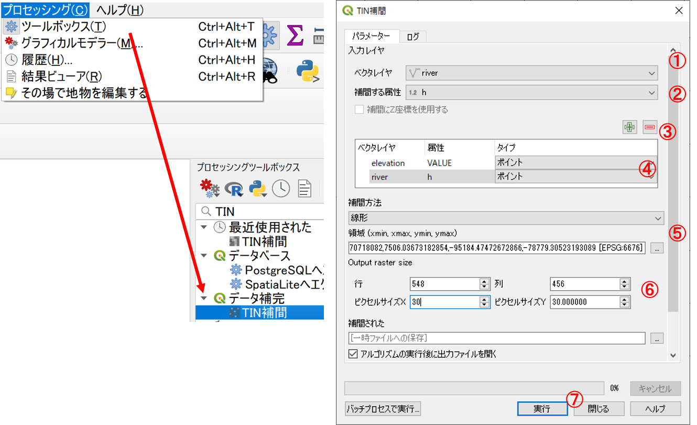
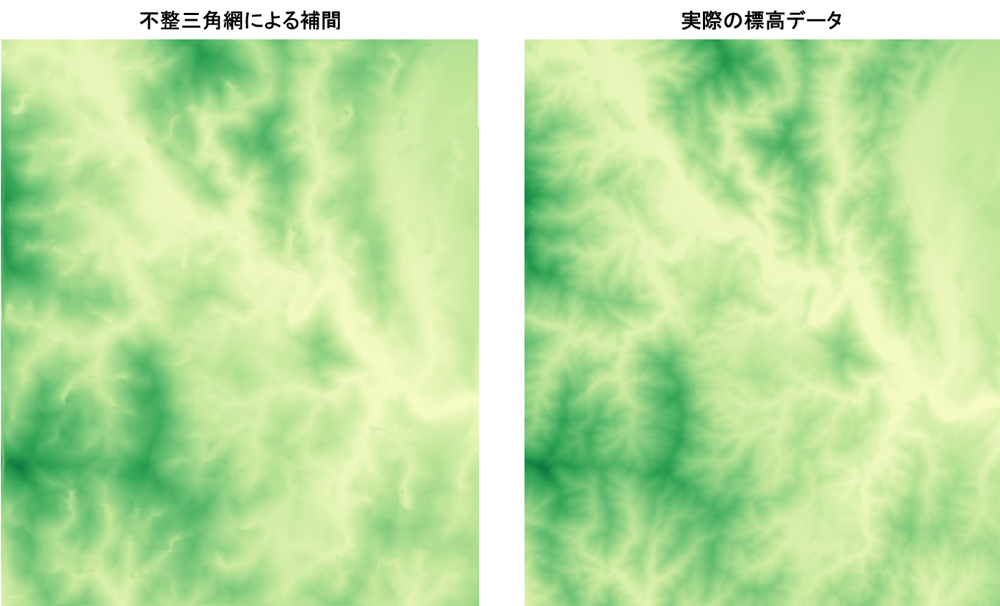
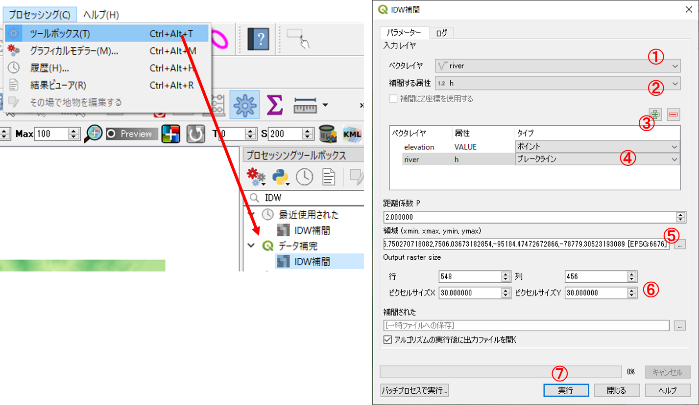
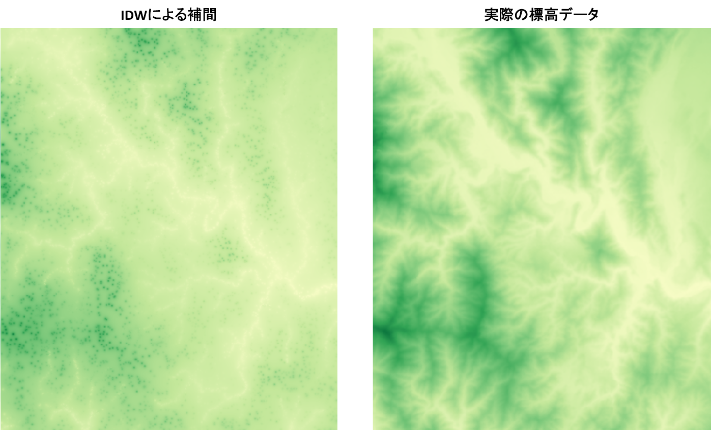
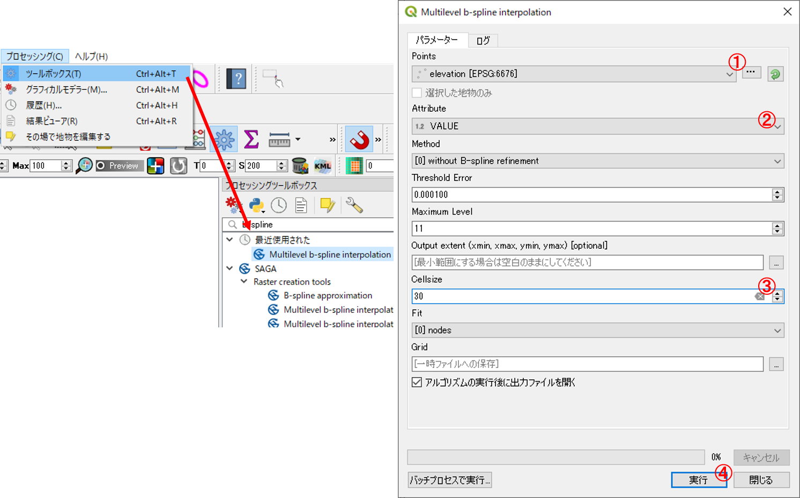
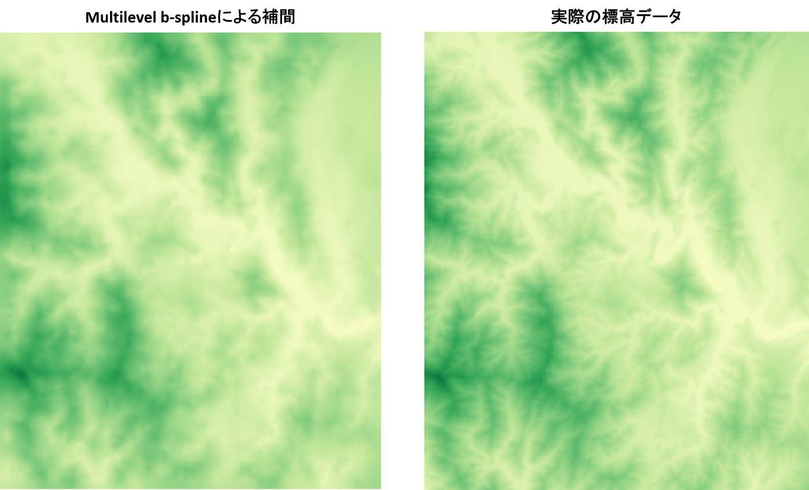
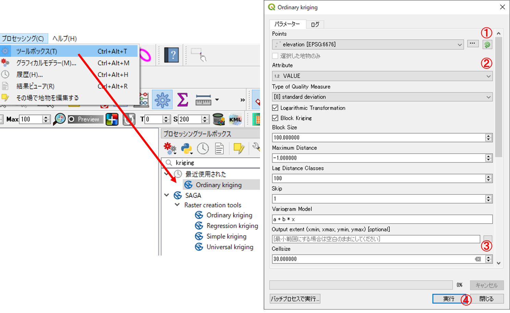
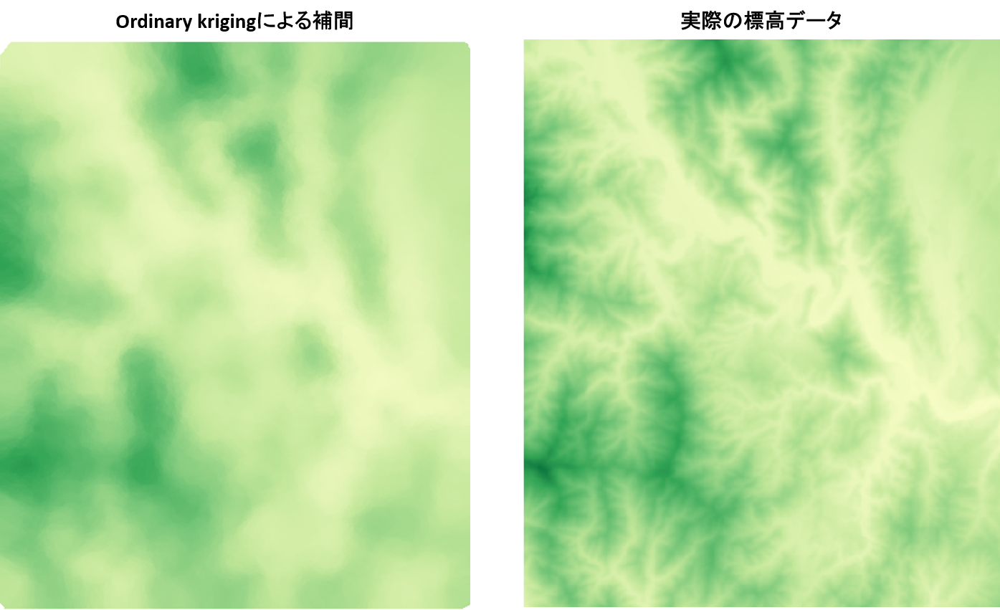

# 空間補間
　本教材は、「空間補間」の実習用教材です。GISソフトウェアを用いた、空間補間の手法について解説しています。空間補間は、観測値などの既知のデータを用いて、周辺のデータを予測する際に用いる手法です。実際に処理をする場合は、値の分布状況や対象となるデータ特性を考慮した空間補間法の選定が重要になります。以下では、GISで不正三角網,逆距離加重法,スプライン,クリギングで空間補間する手法について、解説を行っています。本教材で扱う補間法の理論的な解説は、[地理情報科学教育用スライド（GIScスライド）]の4章が参考になります。

　課題形式で使用する場合は、本教材を一読した後、[課題ページ]へお進みください。本教材を使用する際は、[利用規約]をご確認いただき、これらの条件に同意された場合にのみご利用下さい。

[地理情報科学教育用スライド（GIScスライド）]:http://curricula.csis.u-tokyo.ac.jp/slide/4.html

**Menu**
------
* [不整三角網](#不整三角網)
* [逆距離加重法](#逆距離加重法)
* [スプライン補間](#スプライン補間)
* [クリギング](#クリギング)

**実習用データ**

実習をはじめる前に、[interpolation]をダウンロードしてください。

**スライド教材**

本教材は、[スライド_空間補間]としても、ご利用いただけます。

[interpolation]:https://github.com/gis-oer/datasets/raw/master/interpolation.zip

----------

## 不整三角網
　以下では、ランダム抽出した富士山周辺の標高点を利用し、不整三角網（Triangulated lrregular Network）によって未観測の標高地点の値を補間する手法について解説します。ソフトウェアには、QGISを用います。

まず、elevation.shp, river.shp, fuji.tifをQGISに読み込む。`プロセッシング＞ツールボックス＞データ補間＞TIN補間`を選択し、以下の手順で実行する。

1. ベクタレイヤから標高点を指定する。
2. 補間する属性をVALUEとする。
3. 追加をクリックする。
4. タイプをポイントとする。同様にriverとその補完する属性として`h`を追加し、タイプをブレークラインとする。
5. 領域から、レイヤの領域とする（標高点のレイヤを指定する）。
6. セルサイズのXYを30とする。
7. 実行をクリックする。

出力された結果を`プロパティ＞シンボロジー＞単バンド疑似カラー`で、最小を0、最大を1200とし、5段階の段彩表現とし、実際の標高データとの違いを確認する。余裕があれば、ブレークラインなしでの出力も行い結果の違いを確認する。

[▲メニューへもどる]

## 逆距離加重法
以下では、逆距離加重法(IDW:Inverse Distance Weighted)で補間する手法について解説しています。

`プロセッシング＞ツールボックス＞データ補間＞IDW補間`を選択し、以下の手順で実行する。

1. ベクタレイヤから標高点を指定する。
2. 補間する属性をVALUEとする。
3. 追加をクリックする。
4. タイプをポイントとする。同様にriverとその補完する属性として`h`を追加し、タイプをブレークラインとする。
5. 領域から、レイヤの領域とする（標高点のレイヤを指定する）。
6. セルサイズのXYを30とする。
7. 実行をクリックする。

出力された結果を`プロパティ＞シンボロジー＞単バンド疑似カラー`で、最小を0、最大を1200とし、5段階の段彩表現とし、実際の標高データとの違いを確認する。余裕があれば、ブレークラインなしでの出力も行い結果の違いを確認する。

[▲メニューへもどる]

## スプライン補間
以下では、スプライン補間として、QGISで利用できるSAGA GISのMultilevel b-splineの手法について解説しています。

`プロセッシング＞ツールボックス`から`Multilevel b-spline interpolation`を選択し、以下の手順で実行する。

1. Pointsに標高点を指定する。
2. Attribute をVALUEとする。
3. Cell sizeを30とする。
4. 実行をクリックする。

出力された結果を`プロパティ＞シンボロジー＞単バンド疑似カラー`で、最小を0、最大を1200とし、5段階の段彩表現とし、実際の標高データとの違いを確認する。

## クリギング
　以下では、クリギングとして、QGISで利用できるSAGA GISのOrdinary Kriging(通常クリギング)の手法について解説しています。

`プロセッシング＞ツールボックス`から`Ordinary kriging`を選択し、以下の手順で実行する。

1. Pointsに標高点を指定する。
2. Attribute をVALUEとする。
3. Cell sizeを30とする。
4. 最下段の’Quality Measure’のチェックをはずし、実行をクリックする。

出力された結果を`プロパティ＞シンボロジー＞単バンド疑似カラー`で、最小を0、最大を1200とし、5段階の段彩表現とし、実際の標高データとの違いを確認する。

#### この教材の[課題ページ_空間補間]へ進む

#### ライセンスに関する注意事項
本教材で利用しているキャプチャ画像の出典やクレジットについては、[その他のライセンスについて]よりご確認ください。

[▲メニューへもどる]:./18.md#Menu
[利用規約]:../../policy.md
[その他のライセンスについて]:../license.md
[よくある質問とエラー]:../questions/questions.md

[GISの基本概念]:../00/00.md
[QGISビギナーズマニュアル]:../QGIS/QGIS.md
[GRASSビギナーズマニュアル]:../GRASS/GRASS.md
[リモートセンシングとその解析]:../06/06.md
[既存データの地図データと属性データ]:../07/07.md
[空間データ]:../08/08.md
[空間データベース]:../09/09.md
[空間データの統合・修正]:../10/10.md
[基本的な空間解析]:../11/11.md
[ネットワーク分析]:../12/12.md
[領域分析]:../13/13.md
[点データの分析]:../14/14.md
[ラスタデータの分析]:../15/15.md
[傾向面分析]:../16/16.md
[空間的自己相関]:../17/17.md
[空間補間]:../18/18.md
[空間相関分析]:../19/19.md
[空間分析におけるスケール]:../20/20.md
[視覚的伝達]:../21/21.md
[参加型GISと社会貢献]:../26/26.md

[地理院地図]:https://maps.gsi.go.jp
[e-Stat]:https://www.e-stat.go.jp/
[国土数値情報]:http://nlftp.mlit.go.jp/ksj/
[基盤地図情報]:http://www.gsi.go.jp/kiban/
[地理院タイル]:http://maps.gsi.go.jp/development/ichiran.html

[スライド_GISの基本概念]:https://github.com/gis-oer/gis-oer/raw/master/materials/00/00.pptx
[スライド_QGISビギナーズマニュアル]:https://github.com/gis-oer/gis-oer/raw/master/materials/QGIS/QGIS.pptx
[スライド_GRASSビギナーズマニュアル]:https://github.com/gis-oer/gis-oer/raw/master/materials/GRASS/GRASS.pptx
[スライド_リモートセンシングとその解析]:https://github.com/gis-oer/gis-oer/raw/master/materials/06/06.pptx
[スライド_既存データの地図データと属性データ]:https://github.com/gis-oer/gis-oer/raw/master/materials/07/07.pptx
[スライド_空間データ]:https://github.com/gis-oer/gis-oer/raw/master/materials/08/08.pptx
[スライド_空間データベース]:https://github.com/gis-oer/gis-oer/raw/master/materials/09/09.pptx
[スライド_空間データの統合・修正]:https://github.com/gis-oer/gis-oer/raw/master/materials/10/10.pptx
[スライド_基本的な空間解析]:https://github.com/gis-oer/gis-oer/raw/master/materials/11/11.pptx
[スライド_ネットワーク分析]:https://github.com/gis-oer/gis-oer/raw/master/materials/12/12.pptx
[スライド_領域分析]:https://github.com/gis-oer/gis-oer/raw/master/materials/13/13.pptx
[スライド_点データの分析]:https://github.com/gis-oer/gis-oer/raw/master/materials/14/14.pptx
[スライド_ラスタデータの分析]:https://github.com/gis-oer/gis-oer/raw/master/materials/15/15.pptx
[スライド_空間補間]:https://github.com/gis-oer/gis-oer/raw/master/materials/18/18.pptx
[スライド_視覚的伝達]:https://github.com/gis-oer/gis-oer/raw/master/materials/21/21.pptx
[スライド_参加型GISと社会貢献]:https://github.com/gis-oer/gis-oer/raw/master/materials/26/26.pptx

[課題ページ_QGISビギナーズマニュアル]:../tasks/t_qgis_entry.md
[課題ページ_GRASSビギナーズマニュアル]:../tasks/t_grass_entry.md
[課題ページ_リモートセンシングとその解析]:../tasks/t_06.md
[課題ページ_既存データの地図データと属性データ]:../tasks/t_07.md
[課題ページ_空間データ]:../tasks/t_08.md
[課題ページ_空間データベース]:../tasks/t_09.md
[課題ページ_空間データの統合・修正]:../tasks/t_10.md
[課題ページ_基本的な空間解析]:../tasks/t_11.md
[課題ページ_ネットワーク分析]:../tasks/t_12.md
[課題ページ_領域分析]:../tasks/t_13.md
[課題ページ_点データの分析]:../tasks/t_14.md
[課題ページ_ラスタデータの分析]:../tasks/t_15.md
[課題ページ_空間補間]:../tasks/t_18.md
[課題ページ_視覚的伝達]:../tasks/t_21.md
[課題ページ_参加型GISと社会貢献]:../tasks/t_26.md
<h2 style="background-color:#F8F5FD;text-align:center;">教材の利用に関するアンケート</h2>　本プロジェクトでは、教材の改良を目的とした任意アンケートを実施しています。ご協力いただける方は、<a href="https://customform.jp/form/input/14328/">アンケート</a>にお進みください。ご協力のほどよろしくお願いいたします。  ※ 本アンケートの成果は、教材の改良のほか、学会での発表等の研究目的でも利用します。また、本アンケートでは、個人が特定できるような質問は設けておりません。
