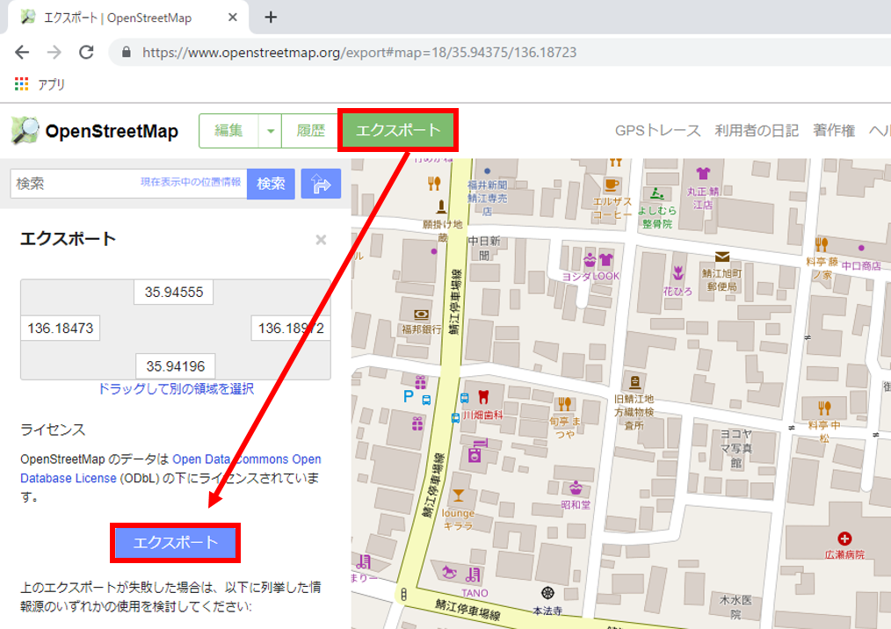
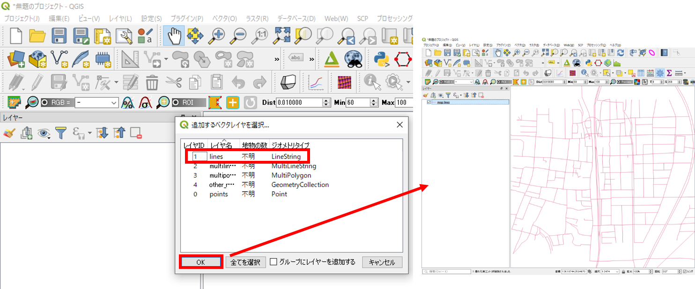
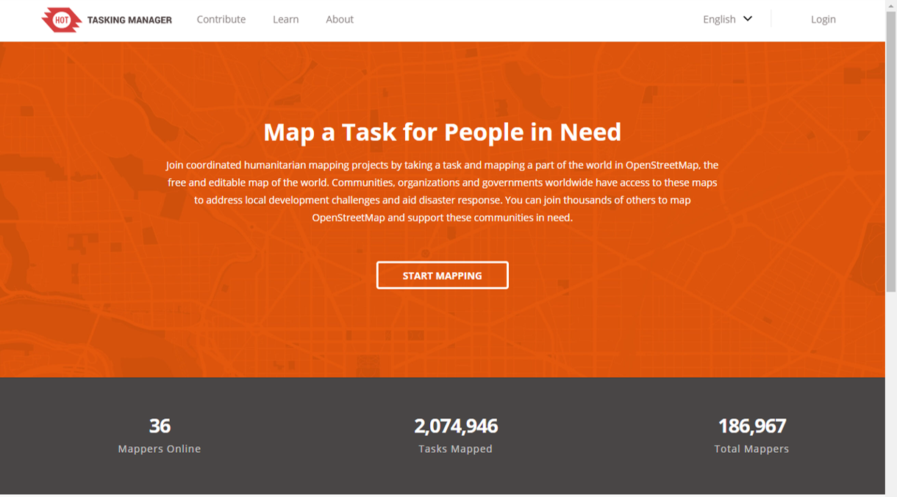
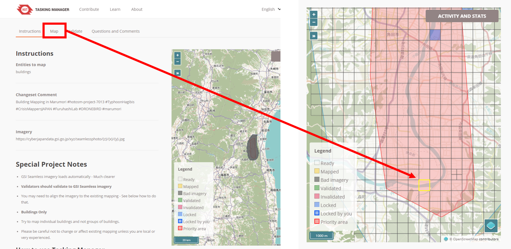
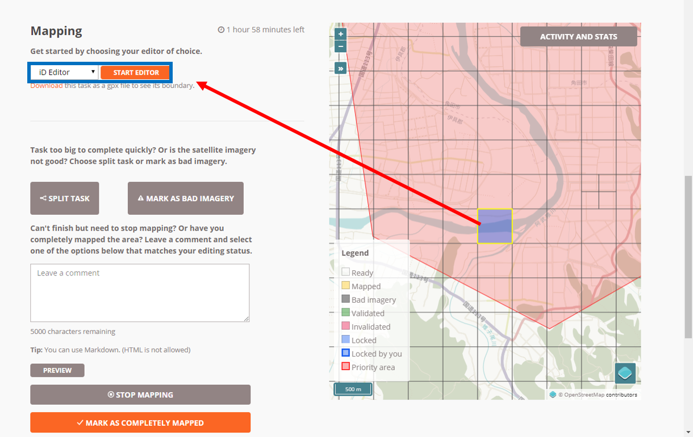
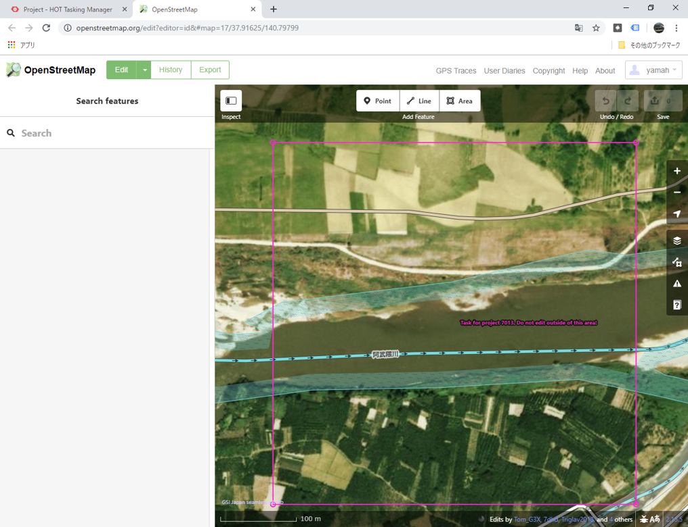
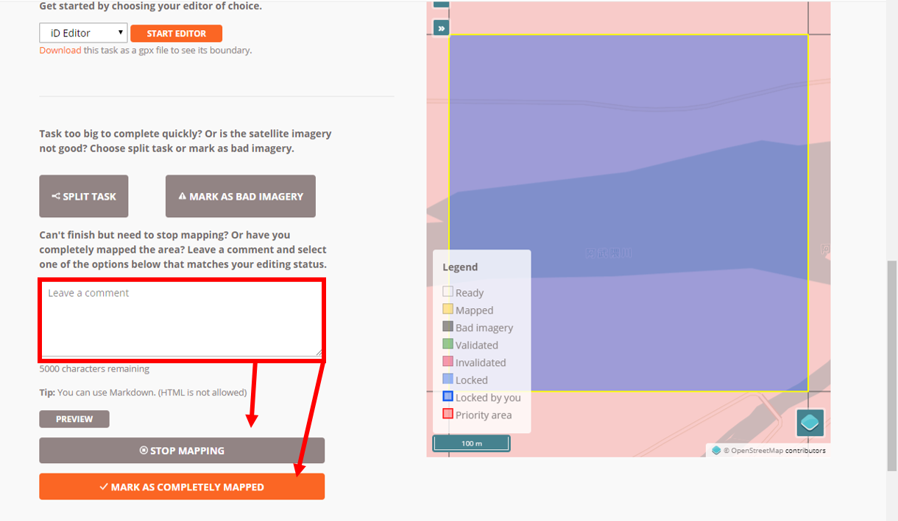

# 参加型GISと社会貢献
　本教材は、「GISと社会貢献」の実習用教材として、OpenStreetMap(OSM)を用いたクライシスマッピングについて解説したものです。以下では、OSMの閲覧方法、地図データの作成、OSMを利用したクライシスマッピングについて解説しています。

　課題形式で使用する場合は、本教材を一読した後、課題ページへお進みください。GIS初学者は、本教材を進める前に[GISの基本概念]の教材を確認しておいてください。本教材を使用する際は、[利用規約]をご確認いただき、これらの条件に同意された場合にのみご利用下さい。

※OSMへの地物の追加や編集は、自己責任で行ってください。実習で利用する際は、担当教員の指導に従ってください。

**Menu**
-----
* [OpenStreetMapとは？](#openstreetmapとは？)
* [基本操作](#基本操作)
* [編集のルール](#編集のルール)
* [アカウントの取得](#アカウントの取得)
* [OSMの編集](#osmの編集)
* [ローカル編集](#ローカル編集)
* [データを利用する](#データを利用する)
* [OpenStreetMapと社会貢献](#openstreetmapと社会貢献)
* [クライシスマッピングとは？](#クライシスマッピングとは？)
* [クライシスマッピングの歴史](#クライシスマッピングの歴史)
* [OSMを利用したクライシスマッピング](#OSMを利用したクライシスマッピング)

**教材中の画像について**

本教材では、OpenStreetMapのキャプチャー画像を利用しています（ © OpenStreetMap Contributors）。

**スライド教材**

　本教材は、スライド形式([スライド_参加型GISと社会貢献])としても、ご利用いただけます。

----------

## OpenStreetMapとは？
　OpenStreetMap（OSM）は、誰もが利用できる空間データを作成するプロジェクトです。OSMの編集者によって、作成されたデータは、© OpenStreetMap Contributors CC BY-SAの条件下で自由に利用することができます。OSMの編集は、アカウントを申請することで、誰もが自由に行うことができます。OSMで作成される空間データは、ライセンス上利用可能な画像（地図、空中写真、衛星画像等）のトレース、現地調査、GPSデータ等によって作成されます。

> OpenStreetMap Japan [https://openstreetmap.jp/](https://openstreetmap.jp/) を参考に作成

[▲メニューへもどる]

## 基本操作
　OpenStreetMapで作成された空間データは、[OpenStreetMap]のサイトから閲覧できます。以下では、[OpenStreetMap]について解説しています。[OpenStreetMap]にアクセスして、以下の機能を確認してください。

(左図)
1. 地名や住所による検索ができる。
2. データの編集やエクスポートができる。
3. 現在地の表示、地図の切り替え、凡例の表示、地図の共有、編集やデータに関するメモ、地図データの詳細確認などができる。

(右図)　どのユーザーがどんな情報の地物を入力したかなどを確認することができる。※表示範囲が大きいとデータが読み込めないので注意。

## 編集のルール
 OSM上での地物の作成や編集は、地物へのタグ付けや、参考した地図や資料等情報の入力が必要で、以下のようなルールがあります。

* ポイント、ライン、ポリゴンで地物を表現。
* ライセンス上利用可能な地図や、空中写真であれば、それらを背景にして地物を作成することが可能
* 地物の属性をタグとして付与。
  >タグの詳細は、[http://wiki.openstreetmap.org/wiki/Tags](https://wiki.openstreetmap.org/wiki/Tags) を参照

※　Google Mapsなどを用いてOSMの編集をすることはできない（ソースにする媒体の利用規約などを参照して利用）点に注意する。

[▲メニューへもどる]

## アカウントの取得
　地物の作成や編集をするためには、アカウントが必要です。ここでは、まず、[OpenStreetMap]にアクセスします。次に、`ユーザー登録`をクリックし、下記の情報を入力します。その後、指定したアドレスにメールが届いていることを確認し、登録を完了させます。

[▲メニューへもどる]

## OSMの編集
　OpenStreetMapでは、背景地図、現地調査、GPSデータを参考に、エディタを使って点、線、面の地物を作成または編集します。以下は、OpenStreetMapで地物を追加する手法について解説したものです。OSMの地物の編集について詳しくは、`https://wiki.openstreetmap.org/wiki/`を参照してください。

[OpenStreetMap]にアクセスし、任意の地域を拡大する。
`編集`をクリックし、IDを起動する。

背景にBingマップが表示されているので、このまま編集することも可能であるが、今回は背景画像から`Japan GSI ortho Imagery`を選択する。

>その他の背景画像のカスタムやタグについては、　
http://wiki.openstreetmap.org/wiki/JA:GSImaps
を参照する。

### 建物の追加
ここでは練習として、建物の作成を試していきます。エリアを選択後、建物にそってポリゴンを描画し、ダブルクリックでポリゴンを閉じる。左の画面からポリゴンの情報を選択する（タグ付け）。すべてのタグから、`+マーク`をクリックし、Sourceを入力する（今回はGSImaps/ort）。

### その他の地物の追加
ポリゴンと同じ方法でポイントやポリゴンなどの地物を追加することができる。地物を追加し、左のウィンドウから属性を設定すると、一番下にタグ(データに記載される情報)が追加される。タグの入力や選択は、https://wiki.openstreetmap.org/wiki/
を参考にする。sourceについて、背景画像から判断できない場合は、現地調査（source = survey）などで取得する。道路等のラインを作成する場合は、接合をチェックする。

### 編集の保存とアップロード
以下では、OSMに編集結果をアップロードする手法について解説しています。**今回、初めてOSMを利用する方は、細心の注意を払った上で以下を行ってください。**

編集を終えるには、`保存`をクリックし変更セットのコメントを入力する。コメントは、英文が望ましい。OSMロゴ画像をクリックまたは、ウインドウを閉じ、編集を終了する。数分後にアップロードが反映される。

[▲メニューへもどる]

## ローカル編集
　OSMでは、ブラウザ上の編集以外に、ローカルで編集したレイヤをアップロードすることも可能です。以下では、JOSMを利用してローカルで編集したレイヤをアップロードする手法について解説しています。

[JOSMダウンロードサイト](https://josm.openstreetmap.de/wiki/Ja%3AWikiStart)にアクセスしJOSMのインストーラをダウンロードする。
ダウンロードしたzipを解凍し、.exeファイルをインストールする。

### JOSMの設定
JOSMを起動し、`編集＞設定`をクリックし、地球アイコンから、OSMのアカウント情報を入力する。

### 編集範囲のダウンロード
`ファイル＞OSMからのダウンロード`をクリックする。
編集したい範囲をドラックし、`ダウンロード`をクリックする。地図の移動は右クリックを使用する点に注意する。

画像から背景地図を追加する。追加された背景画像は、右上のウインドウに表示される。

地物を追加するアイコンをクリックし、ポリゴンを描画する。追加ボタンからsourceなどタグを追加し、`ok`をクリックする。ラインやポイントは描画後にダブルクリックし、ポリゴンはポリゴンを閉じる。削除は選択アイコンで選択し、`Delete`を押す。

`編集＞データをアップロード`をクリックする。変更セットのコメントや、データソースを入力し、アップロードを行う。

数分後にアップロードした地物が追加される。

`編集＞名前をつけて保存`をクリックし作業ファイルを保存する。再開する場合は`編集＞開く`で保存したファイルを選択する。

### GPSデータを読み込む
以下では、フィールド調査等で取得したGPSデータを利用する手法について解説しています

`ファイル＞開く`をクリックし.`gpxファイル`を選択する。GPSデータが表示されるため、編集などに利用することができる。`ファイル＞新規レイヤーを作成`をクリックするとレイヤが作成できる。

[▲メニューへもどる]

## データを利用する
　OSMのデータは、© OpenStreetMap Contributors CC BY SAで、自由に利用できます。以下は、OpenStreetMapからデータをダウンロードする手法について解説しています。

[OpenStreetMap]のページで、データをダウンロードする範囲を選択し、`Export`をクリックする。`.osm`という拡張子のファイルがダウンロードされる。

QGISを開き、ダウンロードした.osmのデータをドラッグアンドドロップする。少し待つとウィンドウが表示されるため読み込みたいデータのタイプ（ここではラインとした）を選択し、`OK`をクリックする。属性テーブルを開くと、データの内容が確認できる。

### 特定の地物のみをダウンロードする
http://overpass-turbo.eu/ にアクセスし、データをダウンロードする。
`ウィザード`をクリックし、` emergency=defibrillator`を入力し、AED情報を書き出す。`エクスポート`をクリックし、`KML`をクリックするとデータが保存できる。

**※データを利用する際は、Map data © OpenStreetMap contributors　などのクレジットが必要となる。詳細は、[https://wiki.openstreetmap.org/wiki/JA:Legal_FAQ](https://wiki.openstreetmap.org/wiki/JA:Legal_FAQ) を確認する。**

[▲メニューへもどる]

# OpenStreetMapと社会貢献
　OpenStreetMapは、誰もが地図を編集することができ、編集結果はほぼリアルタイムで反映され、その成果は自由に利用することができます。そのような特性から災害の発災後の地図や発災前の地図整備するクライシスマッピングに、用いられます。以下では、クライシスマッピングとそのプラットホームについて簡単に解説します。

## クライシスマッピングとは？

* 地震、津波、洪水などの災害、伝染病、政治と関連した暴動や社会問題というような危機に対するマッピング活動

* 地図による救済、復興のための支援活動で、インターネットを利用したリアルタイムかつリモートによる情報の整理と集約を行う

* 地図は世界中のOpenStreetMapの利用者（マッパー）などによるボランティアによって行われる

## クライシスマッピングの歴史

[▲メニューへもどる]

## OSMを利用したクライシスマッピング
　以下は、Humanitarian OSM Team（HOT）のタスキングマネージャーとOSMを利用したクライシスマッピングについて解説しています。

### OSM Tasking Managerの利用
OSM Tasking Managerは、OSM人道支援チーム "Humanitarian OSM Team, HOT"が、クライシスマッピングの支援ツールとして提供しているものである。これを利用するためには、[OSM Tasking Manager]にアクセスする。アクセスすると、タスクの確認ができる。検索や並び替えで、作業するタスクを選択することができる。タスクによっては、初心者の参加が望ましくないものもあるため、実際に利用する際は、注意する。

`解説`からマッピングの概要を把握し、`インストラクション`をクリックすると、マッピングの対象と変更セットの内容が確認できる。`Project Specific Mapping Notes`などその他の説明も確認し、`参加`をクリックする。※画面右上をクリックし、OSMにログインしておく。

凡例をもとに編集するエリアを選択し、`マッピング開始`をクリックする。

`エディタ(ID)`をクリックすると、OSM画面が起動する。
>このタスクの詳しい説明については、
https://www.youtube.com/watch?v=WjNawjN53lw&feature=youtu.be/ を参照する。

タスクに従って、建物をトレースし、`保存`をクリックする。
編集セットのコメントにタスクの内容が自動で入力されていることを確認し、`SAVE`をクリックする。

編集が終了したら、`アンロック`をクリックする。
選択した地域内のタスクが完了している場合は、`完了としてマーク`をクリックする。

[▲メニューへもどる]

#### この教材の[課題ページ_参加型GISと社会貢献]へ進む

#### ライセンスに関する注意事項
本教材で利用しているキャプチャ画像の出典やクレジットについては、[その他のライセンスについて]よりご確認ください。

[OpenStreetMap]:http://www.openstreetmap.org
[OSM Tasking Manager]:http://tasks.hotosm.org/
[▲メニューへもどる]:./26.md#Menu
[利用規約]:../../policy.md
[その他のライセンスについて]:../license.md
[よくある質問とエラー]:../questions/questions.md

[GISの基本概念]:../00/00.md
[QGISビギナーズマニュアル]:../QGIS/QGIS.md
[GRASSビギナーズマニュアル]:../GRASS/GRASS.md
[リモートセンシングとその解析]:../06/06.md
[既存データの地図データと属性データ]:../07/07.md
[空間データ]:../08/08.md
[空間データベース]:../09/09.md
[空間データの統合・修正]:../10/10.md
[基本的な空間解析]:../11/11.md
[ネットワーク分析]:../12/12.md
[領域分析]:../13/13.md
[点データの分析]:../14/14.md
[ラスタデータの分析]:../15/15.md
[傾向面分析]:../16/16.md
[空間的自己相関]:../17/17.md
[空間補間]:../18/18.md
[空間相関分析]:../19/19.md
[空間分析におけるスケール]:../20/20.md
[視覚的伝達]:../21/21.md
[参加型GISと社会貢献]:../26/26.md

[地理院地図]:https://maps.gsi.go.jp
[e-Stat]:https://www.e-stat.go.jp/
[国土数値情報]:http://nlftp.mlit.go.jp/ksj/
[基盤地図情報]:http://www.gsi.go.jp/kiban/
[地理院タイル]:http://maps.gsi.go.jp/development/ichiran.html

[スライド_GISの基本概念]:https://github.com/gis-oer/gis-oer/raw/master/materials/00/00.pptx
[スライド_QGISビギナーズマニュアル]:https://github.com/gis-oer/gis-oer/raw/master/materials/QGIS/QGIS.pptx
[スライド_GRASSビギナーズマニュアル]:https://github.com/gis-oer/gis-oer/raw/master/materials/GRASS/GRASS.pptx
[スライド_リモートセンシングとその解析]:https://github.com/gis-oer/gis-oer/raw/master/materials/06/06.pptx
[スライド_既存データの地図データと属性データ]:https://github.com/gis-oer/gis-oer/raw/master/materials/07/07.pptx
[スライド_空間データ]:https://github.com/gis-oer/gis-oer/raw/master/materials/08/08.pptx
[スライド_空間データベース]:https://github.com/gis-oer/gis-oer/raw/master/materials/09/09.pptx
[スライド_空間データの統合・修正]:https://github.com/gis-oer/gis-oer/raw/master/materials/10/10.pptx
[スライド_基本的な空間解析]:https://github.com/gis-oer/gis-oer/raw/master/materials/11/11.pptx
[スライド_ネットワーク分析]:https://github.com/gis-oer/gis-oer/raw/master/materials/12/12.pptx
[スライド_領域分析]:https://github.com/gis-oer/gis-oer/raw/master/materials/13/13.pptx
[スライド_点データの分析]:https://github.com/gis-oer/gis-oer/raw/master/materials/14/14.pptx
[スライド_ラスタデータの分析]:https://github.com/gis-oer/gis-oer/raw/master/materials/15/15.pptx
[スライド_空間補間]:https://github.com/gis-oer/gis-oer/raw/master/materials/18/18.pptx
[スライド_視覚的伝達]:https://github.com/gis-oer/gis-oer/raw/master/materials/21/21.pptx
[スライド_参加型GISと社会貢献]:https://github.com/gis-oer/gis-oer/raw/master/materials/26/26.pptx

[課題ページ_QGISビギナーズマニュアル]:../tasks/t_qgis_entry.md
[課題ページ_GRASSビギナーズマニュアル]:../tasks/t_grass_entry.md
[課題ページ_リモートセンシングとその解析]:../tasks/t_06.md
[課題ページ_既存データの地図データと属性データ]:../tasks/t_07.md
[課題ページ_空間データ]:../tasks/t_08.md
[課題ページ_空間データベース]:../tasks/t_09.md
[課題ページ_空間データの統合・修正]:../tasks/t_10.md
[課題ページ_基本的な空間解析]:../tasks/t_11.md
[課題ページ_ネットワーク分析]:../tasks/t_12.md
[課題ページ_領域分析]:../tasks/t_13.md
[課題ページ_点データの分析]:../tasks/t_14.md
[課題ページ_ラスタデータの分析]:../tasks/t_15.md
[課題ページ_空間補間]:../tasks/t_18.md
[課題ページ_視覚的伝達]:../tasks/t_21.md
[課題ページ_参加型GISと社会貢献]:../tasks/t_26.md
<h2 style="background-color:#F8F5FD;text-align:center;">教材の利用に関するアンケート</h2>　本プロジェクトでは、教材の改良を目的とした任意アンケートを実施しています。ご協力いただける方は、<a href="https://customform.jp/form/input/14328/">アンケート</a>にお進みください。ご協力のほどよろしくお願いいたします。  ※ 本アンケートの成果は、教材の改良のほか、学会での発表等の研究目的でも利用します。また、本アンケートでは、個人が特定できるような質問は設けておりません。
