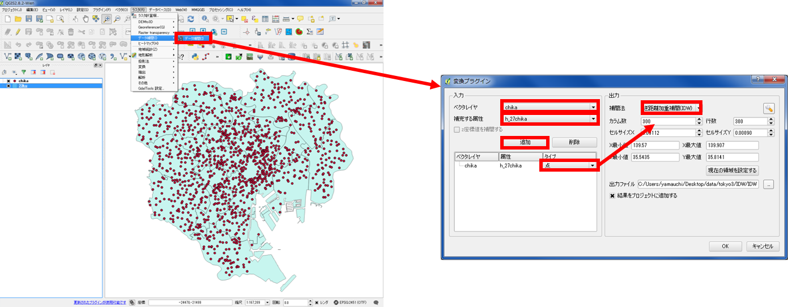
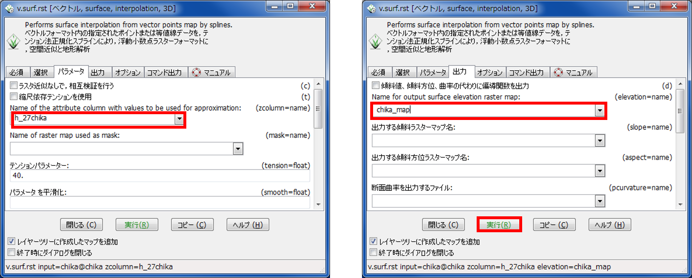

# 空間補間
　本教材は、「空間補間」の実習用教材です。GISソフトウェアを用いた、空間補間の手法について解説しています。空間補間は、観測値などの既知のデータから、周辺のデータを予測する際に用いる手法です。実際に処理をする場合は、値の分布状況や対象となるデータ特性を考慮した空間補間法の選定が重要になります。以下は、Triangulation,IDW,spline,クリギングによる補間手法の解説をQGIS、GRASS GIS、SAGA GISを用いて行ったものです。空間補間の概念や理論については、[地理情報科学教育用スライド（GIScスライド）]の4章が参考になります。

　課題形式で使用する場合は、本教材を一読した後、[課題ページ]へお進みください。本教材を使用する際は、[利用規約]をご確認いただき、これらの条件に同意された場合にのみご利用下さい。

[地理情報科学教育用スライド（GIScスライド）]:http://curricula.csis.u-tokyo.ac.jp/slide/4.html

**Menu**
------
* [不整三角網](#不整三角網)
* [逆距離加重法](#逆距離加重法)
* [スプライン補間](#スプライン補間)
* [クリギング](#クリギング)

**使用データ**

* [国土数値情報] 平成27年東京都地価公示　を加工（23区のみ利用）
* [国土数値情報] 東京都行政区画　を加工（23区のみ利用）
* [国土数値情報] 東京都河川　を加工（23区のみ利用）
* [基盤地図情報]　東京都　標高点 を加工（23区のみ利用）

>ダウンロード手法は、[既存データの地図データと属性データ]の教材を参考とする。座標系の変換手法は[空間データ]の教材を参考とする。

※　実習で使用するデータの属性値が数値データ(integerもしくはreal)になっていない場合は、属性テーブルを開き、フィールド計算機を開く＞新しいフィールドを作るを選択する。出力フィールド名を入力し、以下のようにしOKをクリックする。編集モードが自動でオンになるため、編集を保存しておく。

|-|-|
|---|---|
|出力フィールド名|任意の名前|
|出力フィールドタイプ|integerもしくはreal|
|式|数値にしたい属性のカラム名を指定|

**スライド教材**

　本教材は、スライド形式([スライド_空間補間])としても、ご利用いただけます。

----------

## 不整三角網
　以下では、東京23区の標高点を利用し、不整三角網によって未観測の標高地点の値を補間する手法について解説します。ソフトウェアには、QGISを用います。また、補間されたラスタデータをもとに、等高線の作成も行います。不整三角網の概念や理論は、[地理情報科学教育用スライド（GIScスライド）]を参照してください。

QGISを起動し、使用データ（河川や標高点など）を読み込む。ラスタ＞データ補間＞データ補間をクリックする。データ補間のメニューが表示されない場合は、プラグイン＞プラグインの管理とインストールで、変換プラグインを検索し、チェックボックスにチェックをつける。「ベクタレイヤ」に標高点、「補完する属性」に標高データの列を選択し、追加をクリックし、タイプを点に変更する。

ベクタレイヤに河川を選択し、追加をクリックする。タイプをブレークラインに設定する。補完法を三角形分割補間（ＴＩＮ）とし、設定ボタンから、補間方法を線形に設定し、ＯＫをクリックする。

出力ファイル先とファイル名を指定し、ＯＫをクリックする。左の図のように出力されるので、レイヤのプロパティから標高値に応じてスタイルを整える。

空間補間したデータのセル値を利用して、以下のように等高線が抽出する場合は以下のように行う。

ラスタ＞抽出＞等高線を選択する。入力ファイル、出力先、等高線の間隔を任意で指定する。属性カラムにチェックを入れ、ＯＫをクリックすると等高線が表示される。

[▲メニューへもどる]

## 逆距離加重法
以下では、東京23区の地価データを利用し、値のわかっていない地点をIDW（Inverse Distance Weighted:逆距離加重法）で補間する手法について解説しています。ソフトウェアには、QGISを用いています。
　IDWの概念や理論は、[地理情報科学教育用スライド（GIScスライド）]を参照してください。

ラスタ＞データ補間＞データ補間をクリックする。ベクタレイヤを東京都の地価公示にし、補完する属性を地価データとする（属性テーブルから地価データを数値型に変換しておく）。タイプから点を選択し、補完法を逆距離加重法（IDW）とし、出力ファイル先とファイル名を選択し、OKをクリックする。

左の図のように出力されるので、レイヤのプロパティから配色を整える。

[▲メニューへもどる]

## スプライン補間
　以下では、東京23区の地価データをspline補間する手法について解説しています。ソフトウェアには、GRASS GISを用います。splineの概念や理論は、[地理情報科学教育用スライド（GIScスライド）]を参照してください。

QGISからGrassデータセットを作成し、GRASSを起動する。GRASSでシェープファイルを読み込む。GRASS GISの使用法については、[GRASSビギナーズマニュアル]を参照してください。

コマンドコンソールからv.surf.rstを入力し、Enter キーを押す。
入力するベクトルマップ名（地価データ）を選択する。

パラメーターで地価データの列を選択し、出力から出力データの名称を入力し、実行をクリックする。

左の図のように出力されるので、QGISで読み込み、レイヤのプロパティから配色を整える。
先ほどのマップセットをQGISから読み込む。

先ほど作成したラスタデータを読み込む。

値に応じて配色を整え、QGISで表示する。

## クリギング
　以下では、東京23区の地価データをクリギングする手法について解説しています。ソフトウェアには、SAGA GISを用います。
　クリギングの概念や理論は、[地理情報科学教育用スライド（GIScスライド）]を参照してください。

SAGA GISを利用し、通常クリギングを実行する。
[SAGA GISのダウンロードサイト](https://sourceforge.net/projects/saga-gis/files/)から、ソフトウェアをダウンロードする。

SAGA GISを起動し、File > Shapes > Load からポイントデータ（地価データ）を読み込む。
ManagerからTreeタブをクリックし、入力したデータをダブルクリックするとデータが表示される。

Geoprocessing > Spatial Geostatistics > Ordinary Kriging をクリックする。
pointsで地価データを選択し、Attributeで地価の列を選択し、ＯＫをクリックする。
※今回は、パラメーターをデフォルトとした。

バリオグラムが表示されるので「OK」をクリックし、次のウインドウも「Okay」をクリックする。

下の図のように、クリギングされたデータが表示できた。

以下のように、データをGeoTIFFでエクスポートすることも可能。

[▲メニューへもどる]

#### この教材の[課題ページ_空間補間]へ進む

#### ライセンスに関する注意事項
本教材で利用しているキャプチャ画像の出典やクレジットについては、[その他のライセンスについて]よりご確認ください。

[▲メニューへもどる]:./18.md#Menu
[利用規約]:../../policy.md
[その他のライセンスについて]:../license.md
[よくある質問とエラー]:../questions/questions.md

[GISの基本概念]:../00/00_qgis2_8.md
[QGISビギナーズマニュアル]:../QGIS/QGIS_qgis2_8.md
[GRASSビギナーズマニュアル]:../GRASS/GRASS_qgis2_8.md
[リモートセンシングとその解析]:../06/06_qgis2_8.md
[既存データの地図データと属性データ]:../07/07_qgis2_8.md
[空間データ]:../08/08_qgis2_8.md
[空間データベース]:../09/09_qgis2_8.md
[空間データの統合・修正]:../10/10_qgis2_8.md
[基本的な空間解析]:../11/11_qgis2_8.md
[ネットワーク分析]:../12/12_qgis2_8.md
[領域分析]:../13/13_qgis2_8.md
[点データの分析]:../14/14_qgis2_8.md
[ラスタデータの分析]:../15/15_qgis2_8.md
[傾向面分析]:../16/16_qgis2_8.md
[空間的自己相関]:../17/17_qgis2_8.md
[空間補間]:../18/18_qgis2_8.md
[空間相関分析]:../19/19_qgis2_8.md
[空間分析におけるスケール]:../20/20_qgis2_8.md
[視覚的伝達]:../21/21_qgis2_8.md
[参加型GISと社会貢献]:../26/26_qgis2_8.md

[地理院地図]:https://maps.gsi.go.jp
[e-Stat]:https://www.e-stat.go.jp/
[国土数値情報]:http://nlftp.mlit.go.jp/ksj/
[基盤地図情報]:http://www.gsi.go.jp/kiban/
[地理院タイル]:http://maps.gsi.go.jp/development/ichiran.html

[スライド_空間補間]:https://github.com/gis-oer/gis-oer/raw/master/materials/archive/previous_contents/18/18_qgis2_8.pptx

[課題ページ_QGISビギナーズマニュアル]:../tasks/t_qgis_entry.md
[課題ページ_GRASSビギナーズマニュアル]:../tasks/t_grass_entry.md
[課題ページ_リモートセンシングとその解析]:../tasks/t_06.md
[課題ページ_既存データの地図データと属性データ]:../tasks/t_07.md
[課題ページ_空間データ]:../tasks/t_08.md
[課題ページ_空間データベース]:../tasks/t_09.md
[課題ページ_空間データの統合・修正]:../tasks/t_10.md
[課題ページ_基本的な空間解析]:../tasks/t_11.md
[課題ページ_ネットワーク分析]:../tasks/t_12.md
[課題ページ_基本的な空間解析]:../tasks/t_13.md
[課題ページ_点データの分析]:../tasks/t_14.md
[課題ページ_ラスタデータの分析]:../tasks/t_15.md
[課題ページ_空間補間]:../tasks/t_18.md
[課題ページ_視覚的伝達]:../tasks/t_21.md
[課題ページ_参加型GISと社会貢献]:../tasks/t_26.md
<h2 style="background-color:#F8F5FD;text-align:center;">教材の利用に関するアンケート</h2>　本プロジェクトでは、教材の改良を目的とした任意アンケートを実施しています。ご協力いただける方は、<a href="https://customform.jp/form/input/14328/">アンケート</a>にお進みください。ご協力のほどよろしくお願いいたします。  ※ 本アンケートの成果は、教材の改良のほか、学会での発表等の研究目的でも利用します。また、本アンケートでは、個人が特定できるような質問は設けておりません。
