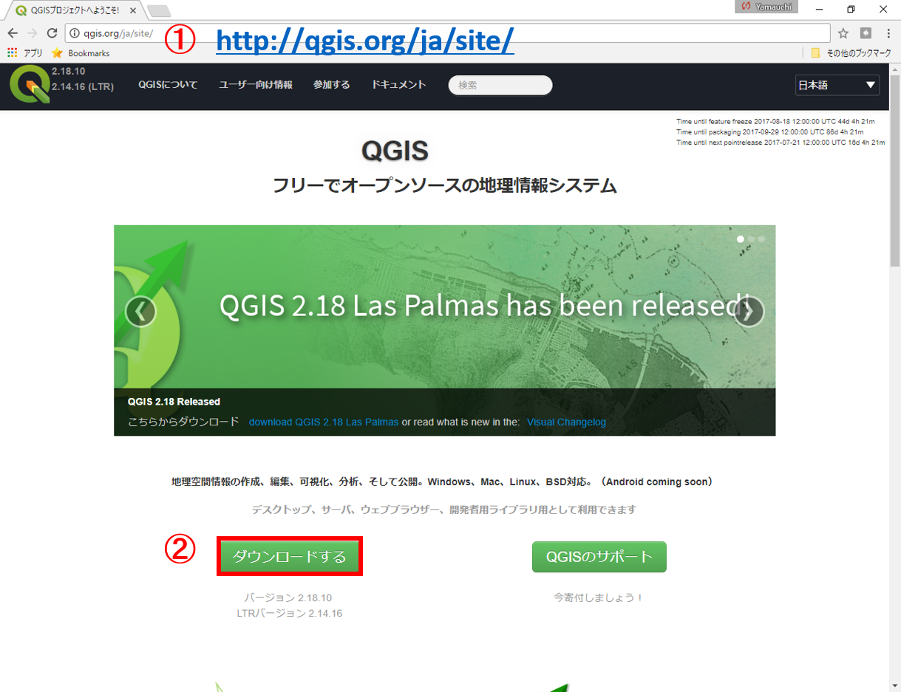
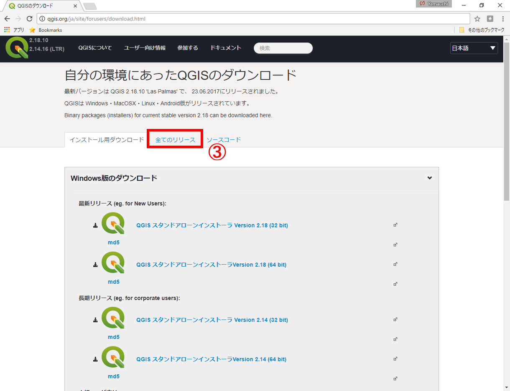
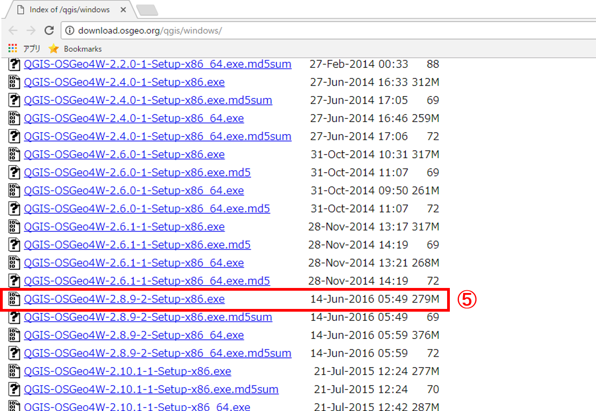

# QGIS2.8のインストール

* [Windows版](q2.8install.md#windows)
* [Mac版](q2.8install.md#mac)

## windows
下記では、QGIS2.8のインストール手法(Windows版)について解説しています。以下の①～⑥の手順に従ってQGISをインストールしてください。インストールの完了後に、ソフトウェアを起動し、動作を確認してください。

1.[QGIS](https://qgis.org/ja/site/)の公式サイトにアクセスする。

2.「ダウンロードする」のボタンをクリックする。

3.「全てのリリース」をクリックする。

4.「QGIS の古いバージョンがダウンロードできます こちら」をクリックする。

5.「QGIS-OSGeo4W-2.8.9-2-Setup-x86_64.exe」をクリックする。

6.ダウンロードした.exeを開き、QGIS2.8をインストールする。

## Mac
下記では、QGIS2.8のインストール手法(Mac版)について解説しています。以下の手順に従ってQGISをインストールしてください。インストールの完了後に、ソフトウェアを起動し、動作を確認してください。

①　Mac版のアーカイブページである`http://www.kyngchaos.com/software/archive/`にアクセスする。

②　ページをスクロールし、QGISの項目まで進む。

③　`QGIS 2.8.9-1` をクリックすると.dmgファイルがダウンロードできる。

④　.dmgを開き、インストーラーに従ってインストールを実行する。　※　インストーラー内の複数のファイルをインストールする。インストールは、各ファイルのダブルクリックで実行される。　
