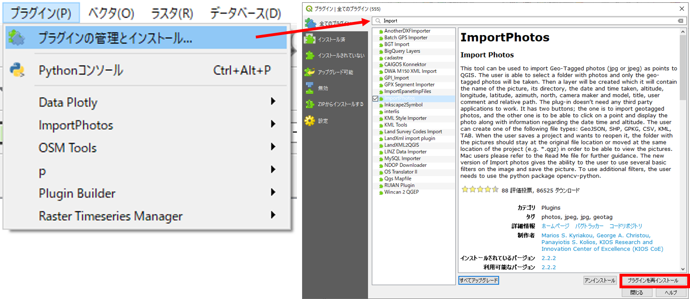
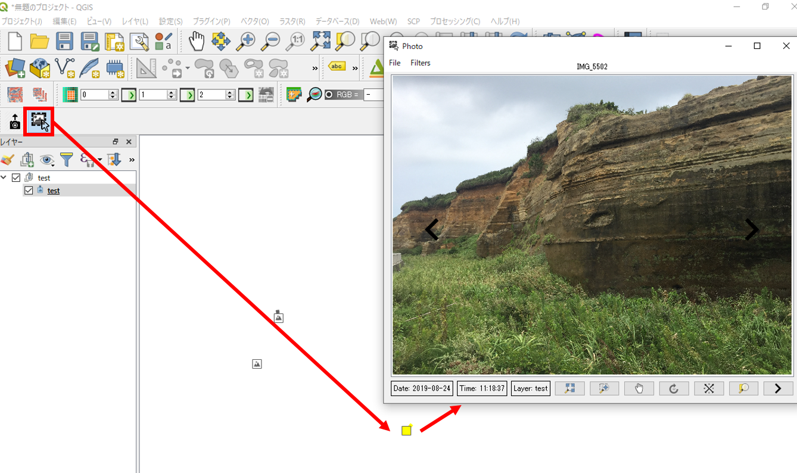
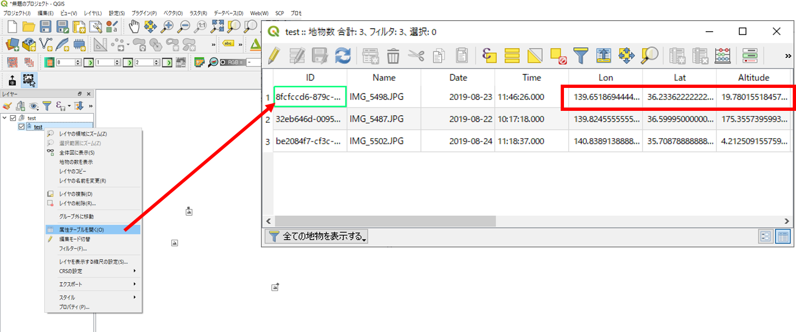
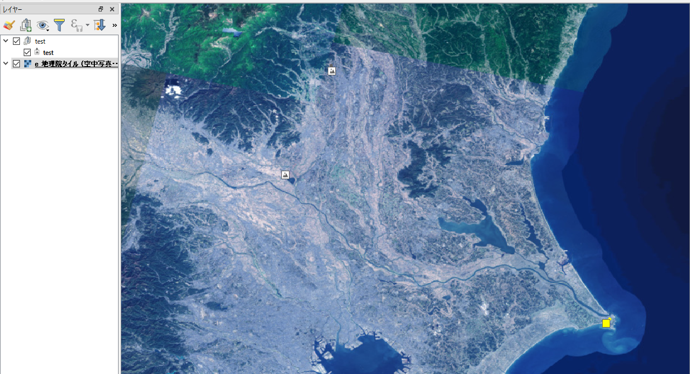

# 位置情報付き写真の地図表示
以下では、スマートフォン等で取得した位置情報付きの写真を、QGISで地図上に表示する手法について解説します。QGIS(3系)をインストールしていない場合は、[QGISビギナーズマニュアル]を参考にインストールしてください。

本教材を使用する際は、[利用規約]をご確認いただき、これらの条件に同意された場合にのみご利用下さい。

**Menu**
- [位置情報付き写真の取得](#位置情報付き写真の取得)
- [ImportPhotosのインストール](#importphotosのインストール)
- [地図表示](#地図表示)

## 位置情報付き写真の取得
　本実習をはじめる前に、スマートフォンで位置情報付きの写真を複数枚撮影してください。写真の撮影が難しい場合は、[実習用写真_kanto_photos]をダウンロードし、.zipを展開してご利用ください。

[実習用写真_kanto_photos]:https://github.com/gis-oer/datasets/raw/master/kanto_photos.zip

## ImportPhotosのインストール
　次に、QGISを起動し、`プラグイン＞プラグインの管理とインストール`から`ImportPhotos`を検索しインストールしてください。

インストールが完了したら、以下の手順で位置情報付き画像を読み込む。1.　プラグイン＞ImportPhotos＞ ImportPhotosを選択、2.写真をまとめたフォルダを選択、3.出力ファイル名を指定、4.OKをクリックする。読み込みが完了したことを確認し、5をクリックする。

## 地図表示
　処理が完了すると、QGIS上にポイントデータとして読み込まれる。下の図赤枠のアイコン（Click Photos）を選択し、地図画面上のポイントをダブルクリックすると写真が表示される。

属性テーブルを開くと写真の位置情報（緯度経度）が確認できる。

[QGISビギナーズマニュアル]を参考に、ブラウザパネルから背景地図を読み込み、目視で位置を確認する。

[▲メニューへもどる]

#### ライセンスに関する注意事項
本教材で利用しているキャプチャ画像の出典やクレジットについては、[その他のライセンスについて]よりご確認ください。

[その他のライセンスについて]:../../license.md
[▲メニューへもどる]:./camera.md#Menu

[GISの基本概念]:../../00/00.md
[QGISビギナーズマニュアル]:../../QGIS/QGIS.md
[ラスタデータの分析]:../../15/15.md
[既存データの地図データと属性データ]:../../07/07.md
[ラスタタイル]:../../web_gis/rastertile/rastertile.md
[利用規約]:../../policy.md
[利用規約]:../../../policy.md
[その他のライセンスについて]:../../license.md
[よくある質問とエラー]:../../questions/questions.md

[GISの基本概念]:../../00/00.md
[QGISビギナーズマニュアル]:../../QGIS/QGIS.md
[GRASSビギナーズマニュアル]:../../GRASS/GRASS.md
[リモートセンシングとその解析]:../../06/06.md
[既存データの地図データと属性データ]:../../07/07.md
[空間データ]:../../08/08.md
[空間データベース]:../../09/09.md
[空間データの統合・修正]:../../10/10.md
[基本的な空間解析]:../../11/11.md
[ネットワーク分析]:../../12/12.md
[領域分析]:../../13/13.md
[点データの分析]:../../14/14.md
[ラスタデータの分析]:../../15/15.md
[傾向面分析]:../../16/16.md
[空間的自己相関]:../../17/17.md
[空間補間]:../../18/18.md
[空間相関分析]:../../19/19.md
[空間分析におけるスケール]:../../20/20.md
[視覚的伝達]:../../21/21.md
[参加型GISと社会貢献]:../../26/26.md

[地理院地図]:https://maps.gsi.go.jp
[e-Stat]:https://www.e-stat.go.jp/
[国土数値情報]:http://nlftp.mlit.go.jp/ksj/
[基盤地図情報]:http://www.gsi.go.jp/kiban/
[地理院タイル]:http://maps.gsi.go.jp/development/ichiran.html

[課題ページ_QGISビギナーズマニュアル]:../../tasks/t_qgis_entry.md
[課題ページ_GRASSビギナーズマニュアル]:../../tasks/t_grass_entry.md
[課題ページ_リモートセンシングとその解析]:../../tasks/t_06.md
[課題ページ_既存データの地図データと属性データ]:../../tasks/t_07.md
[課題ページ_空間データ]:../../tasks/t_08.md
[課題ページ_空間データベース]:../../tasks/t_09.md
[課題ページ_空間データの統合・修正]:../../tasks/t_10.md
[課題ページ_基本的な空間解析]:../../tasks/t_11.md
[課題ページ_ネットワーク分析]:../../tasks/t_12.md
[課題ページ_基本的な空間解析]:../../tasks/t_13.md
[課題ページ_点データの分析]:../../tasks/t_14.md
[課題ページ_ラスタデータの分析]:../../tasks/t_15.md
[課題ページ_空間補間]:../../tasks/t_18.md
[課題ページ_視覚的伝達]:../../tasks/t_21.md
[課題ページ_参加型GISと社会貢献]:../../tasks/t_26.md
