# GPSログの活用
以下では、GPSの概要とスマートフォン等で取得したGPSログを表示する手法について解説します。本実習では、データの表示等にQGIS(3系)を利用します。QGISをインストールしていない場合は、[QGISビギナーズマニュアル]を参考にインストールしてください。

本教材を使用する際は、[利用規約]をご確認いただき、これらの条件に同意された場合にのみご利用下さい。

**Menu**
- [GPSとは](#gpsとは)
- [ログの表示](#ログの表示)
- [標高グラフの作成](#標高グラフの作成)

## GPSとは
　GPS（Global Positioning System）は、アメリカの人工衛星を用いた全地球測位システムを指します。4つ以上のGPS衛星の信号を受信し、地球上の現在位置を取得できます。各国の衛星測位システム（GNSS）として、QZSS（日本）、GLONASS（ロシア）、GALILEO（EU）、北斗（中国）があります。GPSの仕組みや応用例は、[GPSの仕組み ©首都大Channel](https://www.youtube.com/watch?v=3oYW8iyQtgc)や[【仕様】GPSとは？ ©Garmin Japan](https://www.youtube.com/watch?v=oBQMV1D2eKA)が詳しいです。

[▲メニューへもどる]

### スマートフォンでのGPSログの取得
　多くのスマートフォンには、GPSの受信機が内蔵されているため、対応するアプリケーションによって位置情報（地点や移動経路）を収集することができます。GPSログを収集できるアプリケーションとして、Androidでは、Geopaparazzi、Open GPS Tracker、iOSでは、Open GPX Tracker等があります。Geopaparazziの使用法は、本教材の[スマーフォンを用いた野外調査]で解説しています。

[▲メニューへもどる]

## ログの表示
　以下では、実際にスマートフォンで取得したGPSデータ（.gpx）をQGISで表示する手法について解説します。実習を始める前に、[Open GPX Tracker](http://www.merlos.org/iOS-Open-GPX-Tracker/)で取得した[実習用GPSログ]をダウンロードし、.zipを展開してください。

[実習用GPSログ]:https://github.com/gis-oer/datasets/raw/master/track.zip

ファイルが用意できたら、QGISを起動し、`track.gpx`をドラックアンドドロップする。`追加するベクタレイヤを選択`のウィンドウが表示されるため、地物数が記録されているtrack_pointsとtracksを選択し、OKをクリックする。
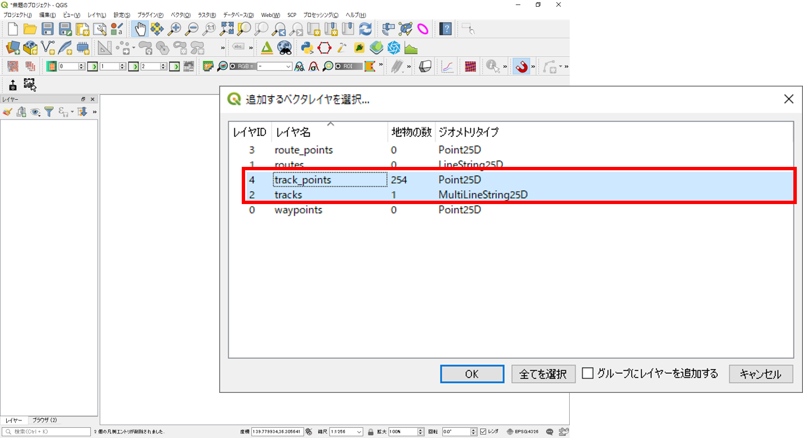

読み込みが完了すると、以下のようにポイントデータとラインデータの経路が表示される。それぞれの属性テーブルを開き、ポイントデータには標高等が記録されていること、ラインデータは属性情報がないことを確認する。
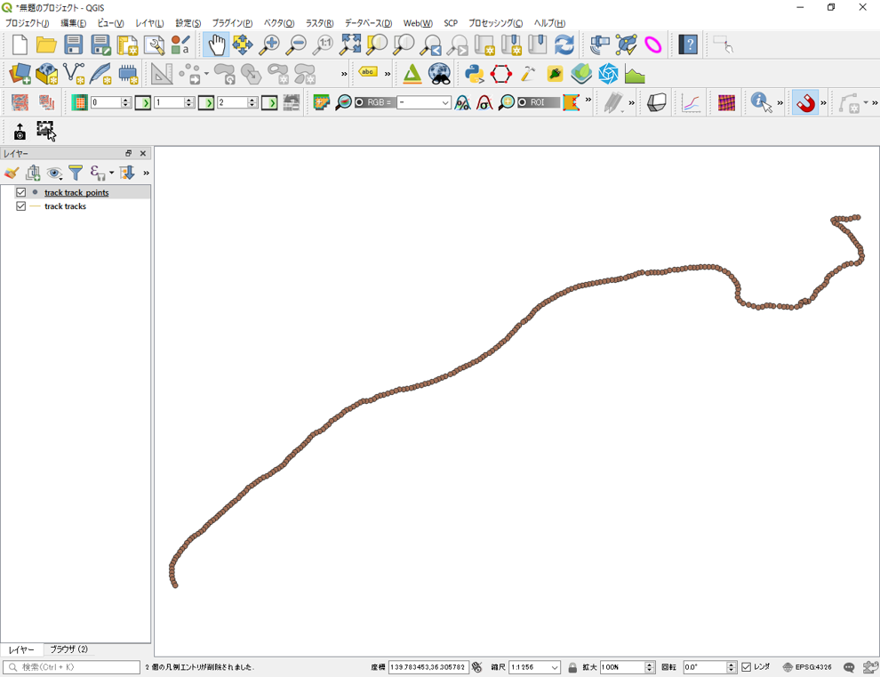

[QGISビギナーズマニュアル]を参考に、ブラウザパネルから背景地図を読み込み、目視で位置を確認する。
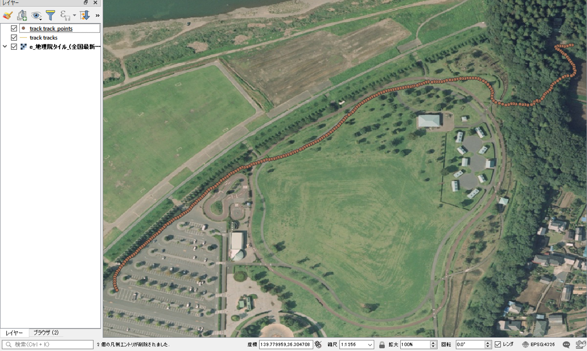

長さを求める等の解析が必要な場合は、データを地理座標系から投影座標系に変換する。ここでは、次の実習用データを作成するため、ポイントデータとラインデータを、JGD2011 / Japan Plane Rectangular CS IXへ変換する。空間座標の変換の詳細は、[空間データ]を参照する。

空間座標の変換が終了したら、変換前の2つのデータを削除し、右下のEPSGボタンをクリックし、JGD2011 / Japan Plane Rectangular CS IXを選択する。
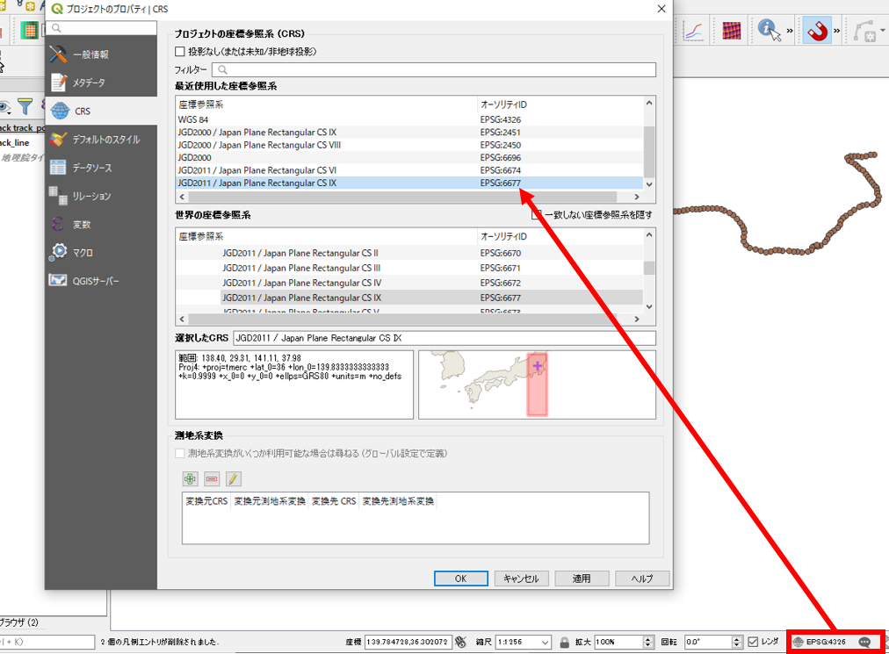

[▲メニューへもどる]

## 標高グラフの作成
　以下では、GPSログを活用し、移動経路（5ｍごと）に応じた標高情報をグラフにする手法を解説します。以下は、中級者向けに解説しているため、解説用画像を一部省略しています。適宜、必要なプラグインの入手やデータ処理を実行してください。

まず、QGISの`Locate points along lines`プラグインを入手し、ラインから5ｍごとのポイントを作成する。`プラグイン＞Locate points along lines＞Locate points along lines`を実行し、入力ファイルをラインとし、出力ファイル名を指定し、Add endpoints にチェックをつける。Intervalを5とし実行する。
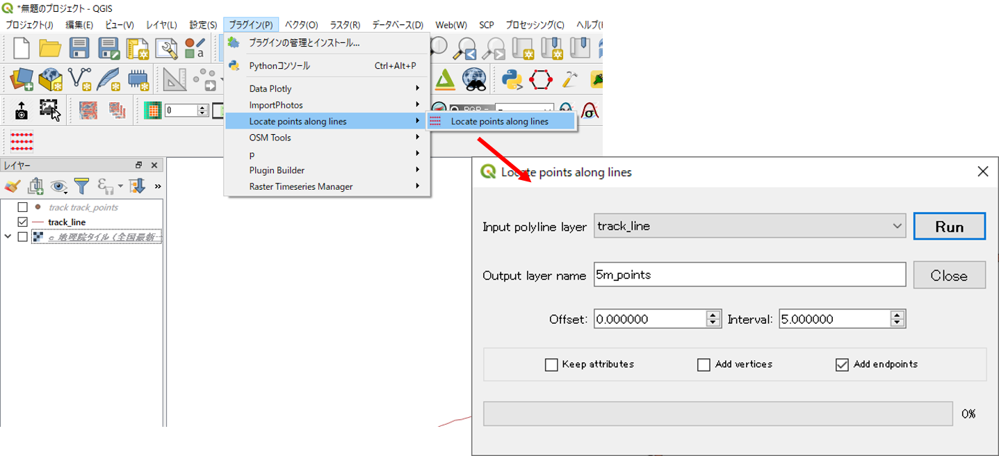

次にGPSログのポイントの標高値を出力したポイントの属性値として追加していく。出力したポイントの属性テーブルを開き、フィールド計算機を用いて、org_idを更新する。
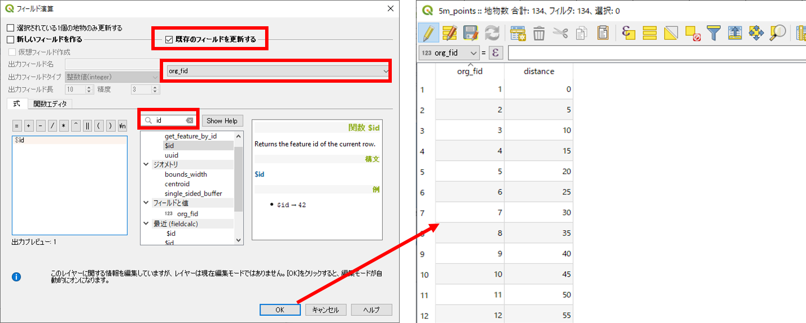

`プロセッシング＞ツールボックス`から、`距離マトリックス`を選択する。1.5mごとのポイントを指定する。2.新規に出力したorg_fidを指定する。3.GPSのポイントを選択する。4.属性テーブルを確認し、idのあるフィールドを指定する。5.1点の値が必要なため、1と入力する。6.実行をクリックする。
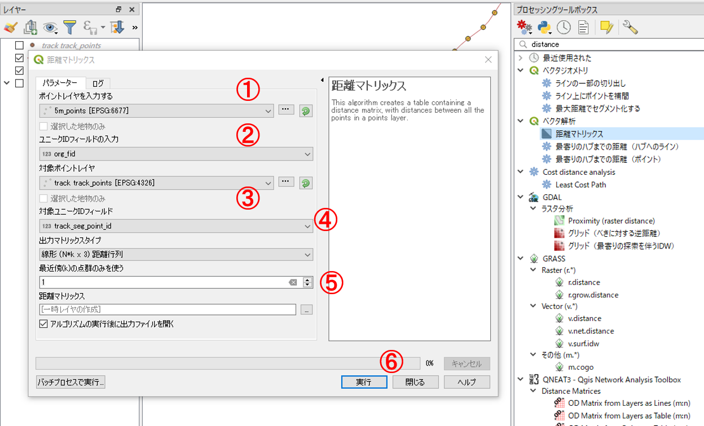

5mのポイントの`プロパティ＞結合`から、距離マトリックスで出力したIDを結合する。次に、もとのGPSのIDを結合する。
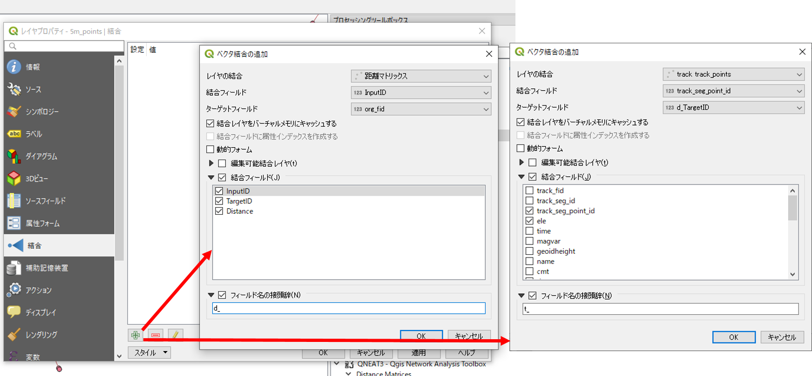

結合が完了したら、属性テーブルを開き、標高が追加されていることを確認する。
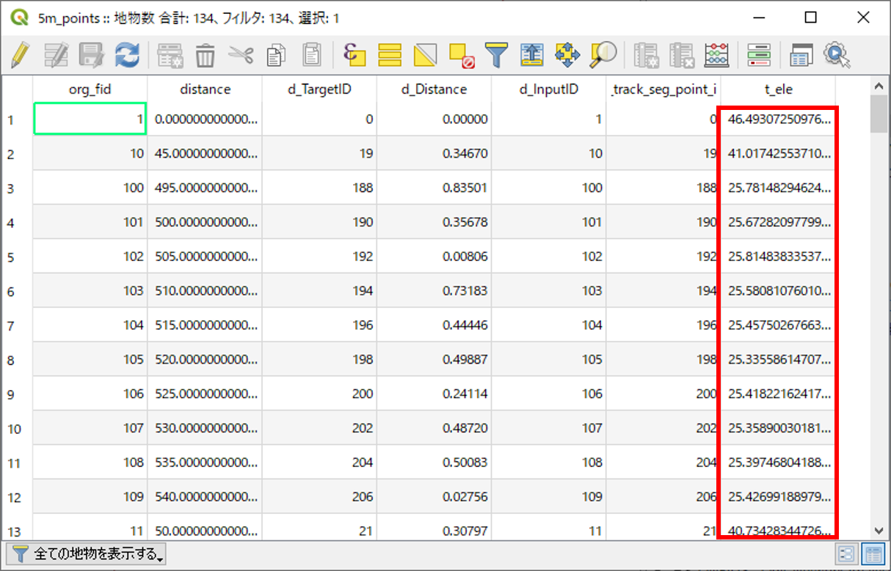

結合したファイルを`エクスポート＞地物の保存`で出力する。次に、出力したファイルを表計算ソフト用に、.csvで書き出す。
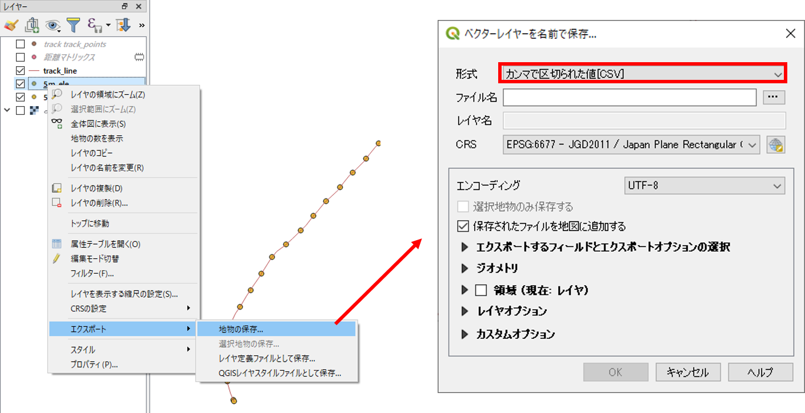

最後に、表計算ソフトで標高のグラフを作成する。以下のようなグラフができたことを確認する。この種のグラフの作成時には、X軸とY軸の設定によって、実際の地形（表面の傾斜等）と異なる点に注意する。
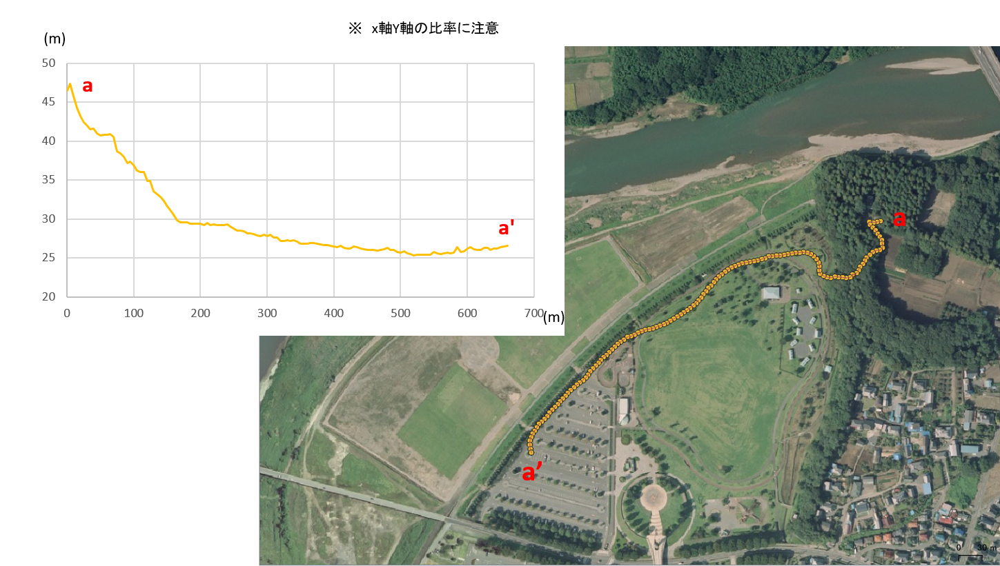

[▲メニューへもどる]

#### ライセンスに関する注意事項
本教材で利用しているキャプチャ画像の出典やクレジットについては、[その他のライセンスについて]よりご確認ください。

[その他のライセンスについて]:../../license.md
[▲メニューへもどる]:./gps.md#Menu

[GISの基本概念]:../../00/00.md
[QGISビギナーズマニュアル]:../../QGIS/QGIS.md
[ラスタデータの分析]:../../15/15.md
[既存データの地図データと属性データ]:../../07/07.md
[ラスタタイル]:../../web_gis/rastertile/rastertile.md
[利用規約]:../../policy.md
[利用規約]:../../../policy.md
[その他のライセンスについて]:../../license.md
[よくある質問とエラー]:../../questions/questions.md

[GISの基本概念]:../../00/00.md
[QGISビギナーズマニュアル]:../../QGIS/QGIS.md
[GRASSビギナーズマニュアル]:../../GRASS/GRASS.md
[リモートセンシングとその解析]:../../06/06.md
[既存データの地図データと属性データ]:../../07/07.md
[空間データ]:../../08/08.md
[空間データベース]:../../09/09.md
[空間データの統合・修正]:../../10/10.md
[基本的な空間解析]:../../11/11.md
[ネットワーク分析]:../../12/12.md
[領域分析]:../../13/13.md
[点データの分析]:../../14/14.md
[ラスタデータの分析]:../../15/15.md
[傾向面分析]:../../16/16.md
[空間的自己相関]:../../17/17.md
[空間補間]:../../18/18.md
[空間相関分析]:../../19/19.md
[空間分析におけるスケール]:../../20/20.md
[視覚的伝達]:../../21/21.md
[参加型GISと社会貢献]:../../26/26.md

[地理院地図]:https://maps.gsi.go.jp
[e-Stat]:https://www.e-stat.go.jp/
[国土数値情報]:http://nlftp.mlit.go.jp/ksj/
[基盤地図情報]:http://www.gsi.go.jp/kiban/
[地理院タイル]:http://maps.gsi.go.jp/development/ichiran.html

[スマーフォンを用いた野外調査]:../../equipment/mobile/mobile.md
