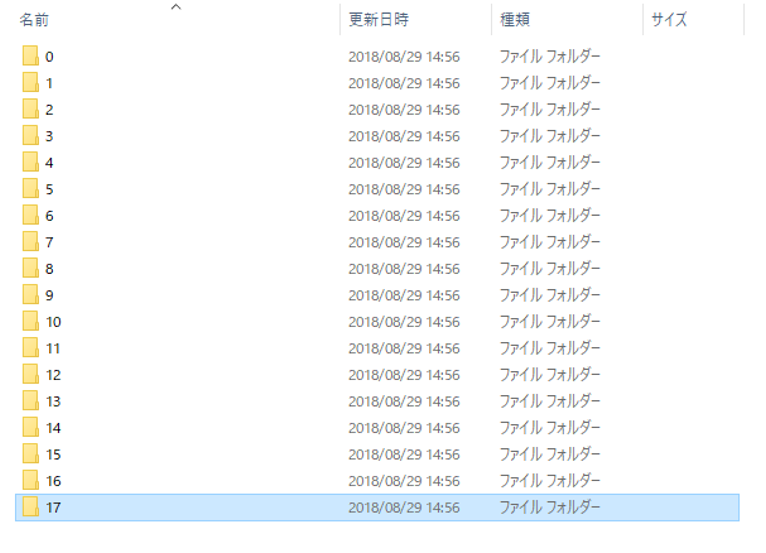
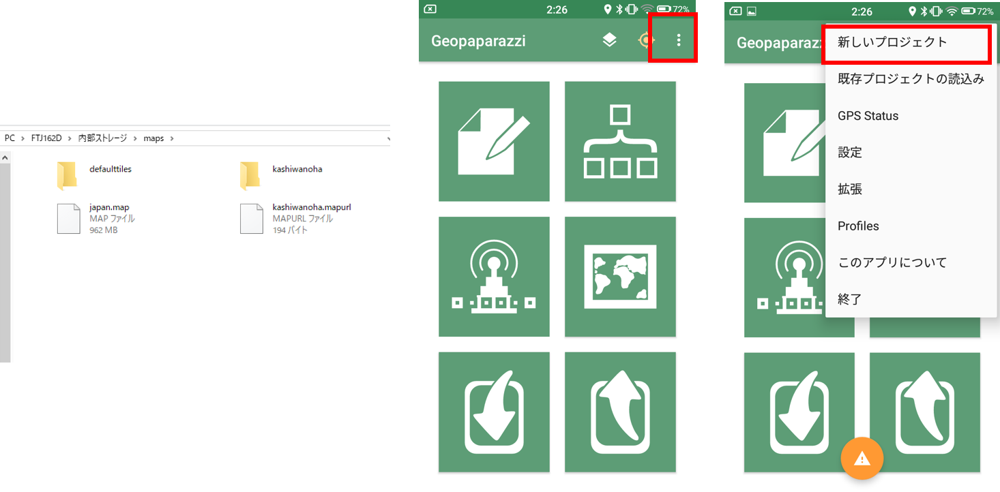
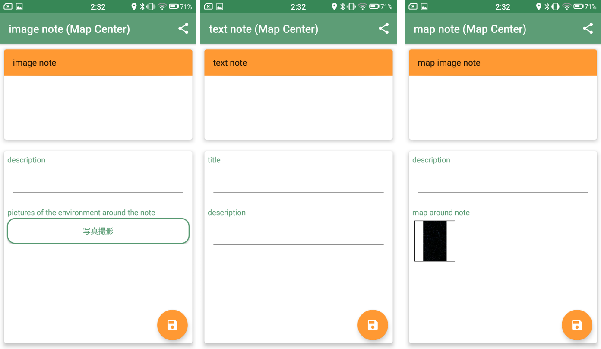

# スマーフォンを用いた野外調査（作成中）
以下では、Android用のスマートフォンアプリであるGeopaparazziを野外調査に活用する手法を解説しています。この教材は、Koichi Kita氏が公開している[Geopaparazziの説明資料（Geopaparazziハンズオン）](https://www.slideshare.net/KouichiKita/2016-07-08)と[Geopaparazziの使い方解説（Ver4）](https://sites.google.com/site/geopapakaisetu/)を参考に作成しました。各機能の詳しい説明は、上記の資料や[Geopaparazzi Reference Manual](https://geopaparazzi.github.io/geopaparazzi/)を参照ください。また、以下ではオフライン環境での調査を想定しています。オンライン環境で調査を行う場合は、デフォルトのmapurlファイルを利用するため、前半部分は読み飛ばしてください。

※iPhone向けの野外調査アプリとして、iGISなどがあります。iGISによる野外調査法については、農研機構が発行している「モバイルGISアプリ「iGIS」とGoogle Earthを用いた荒廃農地の踏査手法マニュアル」`http://www.naro.affrc.go.jp/publicity_report/pub2016_or_later/pamphlet/tech-pamph/077715.html`で詳しく解説されています。

本教材を使用する際は、[利用規約]をご確認いただき、これらの条件に同意された場合にのみご利用下さい。

**Menu**
- [調査用地図の作成](#調査用地図の作成)
- [地図タイルとMapurlの作成](#地図タイルとmapurlの作成)
- [Geopaparazziを起動し、調査用地図を読み込む](#geopaparazziを起動し、調査用地図を読み込む)
- [フィールドワークでデータを記録](#フィールドワークでデータを記録)
- [データの書き出し](#データの書き出し)
- [取得データの表示](#取得データの表示)

## 調査用地図の作成
[QGISビギナーズマニュアル]と[既存データの地図データと属性データ]の教材を参考に、以下のような地図を作成する。※　ここでは、シェープファイルの座標系は、[空間データ]の教材を参考にEPSG:3857へ変換したものを使用した。


## 地図タイルとMapurlの作成
[ラスタタイル]の教材を参考に、ラスタタイルを作成する。このときのラスタタイルを出力するファイルの名称は、任意の名称で良い（以下では、kashiwanoha.zipとした）。



次に、テキストエディタを開き、以下のような.mapurlを作成しkashiwanoha.mapurlとして保存する。url,center,zoomlevelは、利用する地図の状況に応じて変更する。

```text
url=kashiwannoha/ZZZ/XXX/YYY.png
minzoom=14
maxzoom=18
center=139.940 35.903
type=google
format=png
defaultzoom=14
mbtiles=defaulttiles/kashiwannoha.mbtiles
description=地理院地図とe-stat（柏市境界）を利用し作成
```
> 上記は、[Geopaparazziの使い方解説（Ver4）, QGISからタイル地図を作成する](https://sites.google.com/site/geopapakaisetu/tairu-de-tuno-ru-shou-fang-fa/qgistilemap)を参考に作成した。

## Geopaparazziを起動し、調査用地図を読み込む
ラスタタイル（.zip）と.mapurlを作成後、スマートフォンをPCに接続し、スマートフォン内のmapsフォルダに解凍したkashiwanohaのフォルダと.mapurlファイルを移動する。


Geopaparazziを起動し、背景地図を選択するボタンから以下のように、作成したkashiwanoha.mapurlを選択する。


背景地図として、kashiwanoha.mapurlを一度タップし、起動画面の地図表示ボタンをクリックする。上記の操作で地図が表示できる。表示できない場合は、タイルの作成が失敗しているか、.mapurlの記載方法が間違っている。


## フィールドワークでデータを記録

データは、中央の十字の地点に以下のようなデータをnoteとして記録できる。一度作成したnoteを消すには、初期画面から新しいプロジェクトを開始をタップする。




|追加できる項目|詳細|
|---|---|
|image note|写真を追加できる|
|sketch note|スケッチを追加できる|
|map note|地図画像を追加できる|
|text note|テキストを追加できる|
|自作の調査項目|調査項目をまとめたノートが作成できる|

### 調査項目の自作
Geopaparazziでは、`Geopaparazzi>tags.json`に自作の調査項目リストを作成することができる。例えば、文化財の調査をすると仮定した場合、以下のような調査項目を想定し、tags.jsonに追加する。

|調査項目|内容|
|---|---|
|名称|名称を短文で記入|
|種別|種別（像、記念樹、記念碑、その他）を選択し、記入|
|解説|有、無を選択し、記入|
|設置年|日付を選択|
|写真|写真のパスを記載|
|備考|その他必要な情報を記載する。|

```json
},//examplesの}の次に,を付けて以下を記載する
 {
			"sectionname": "モニュメント調査フォーム",
			"sectiondescription": "モニュメント調査フォームです。",
			"forms": [
					{
							"formname": "名称",
							"formitems": [
									{
											"key": "title",
											"value": "",
											"islabel":"true",
											"type": "string",
											"mandatory": "yes"
									}
							]
					},{
							"formname": "種別",
							"formitems": [
									{
											"key": "a single choice combo",
											"values": {
													"items": [
															{"item": ""},
															{"item": "像"},
															{"item": "記念樹"},
															{"item": "記念碑"},
															{"item": "その他"}

													]
											},
											"value": "",
											"type": "stringcombo",
											"mandatory": "yes"
									}
								]
						},{
							"formname": "解説の有無",
							"formitems": [
									{
											"key": "a single choice combo",
											"values": {
													"items": [
															{"item": ""},
															{"item": "有"},
															{"item": "無"}
													]
											},
											"value": "",
											"type": "stringcombo",
											"mandatory": "yes"
									}
								]
							},{
							"formname": "設置年",
							"formitems": [
									{
											"key": "a date",
											"value": "",
											"type": "date"
									}
							]
					},{
							"formname": "写真",
							"formitems": [
									{
											"key": "a picture archive",
											"value": "",
											"type": "pictures"
									}
							]
					},{
							"formname": "備考",
							"formitems": [
									{
											"key": "some text",
											"value": "",
											"type": "string"
									}
							]
					}

			]
 }
]　//JSONの閉じタグとして]を記載する


```
上記のように記載することで、下の左図のようにリストが追加される。


GPSをキャッチできる環境で、上の右図のGPSログを開始するボタンをクリックすると、調査経路の記録ができる。

## データの書き出し
ノートとして作成した情報は、`エクスポート>KMZ`から、調査記録がまとめられたKMZファイルを出力できる。GPSのログデータは、`エクスポート>GPX`を選択する。


## 取得データの表示

### Google Earthに読み込む
出力したKMZファイルを開き、Google Earthで表示する。Google Earthがインストールされた環境で、KMZファイルをダブルクリックし、実行する。または、Google Earthにドラッグ&ドロップする。

### Cesiumで表示する
KMZファイルを[Cesium viewer](https://cesiumjs.org/Cesium/Build/Apps/CesiumViewer/)にドラッグ&ドロップし、表示する。

### GPX
GPSのデータは、GPXファイルとして出力される。出力したデータを、QGISへドラッグ&ドロップするとラインデータとして表示することができる（Multi line stringsを選択する）。


#### QGISで表示する
KMZは、拡張子を.zipに変更して、.zipを解凍する。そうするとkmlと撮影した写真が表示できる。

KMLファイルをQGISへドラッグ&ドロップし、データを表示する。ただし、属性情報は、一つのフィールド内に連続して記録されるため、分析等で使えるように加工する必要がある。

[▲メニューへもどる]

#### ライセンスに関する注意事項
本教材で利用しているキャプチャ画像の出典やクレジットについては、[その他のライセンスについて]よりご確認ください。

[その他のライセンスについて]:../../license.md
[▲メニューへもどる]:./mobile.md#Menu

[GISの基本概念]:../../00/00.md
[QGISビギナーズマニュアル]:../../QGIS/QGIS.md
[ラスタデータの分析]:../../15/15.md
[既存データの地図データと属性データ]:../../07/07.md
[ラスタタイル]:../../web_gis/rastertile/rastertile.md
[利用規約]:../../policy.md
[利用規約]:../../../policy.md
[その他のライセンスについて]:../../license.md
[よくある質問とエラー]:../../questions/questions.md

[GISの基本概念]:../../00/00.md
[QGISビギナーズマニュアル]:../../QGIS/QGIS.md
[GRASSビギナーズマニュアル]:../../GRASS/GRASS.md
[リモートセンシングとその解析]:../../06/06.md
[既存データの地図データと属性データ]:../../07/07.md
[空間データ]:../../08/08.md
[空間データベース]:../../09/09.md
[空間データの統合・修正]:../../10/10.md
[基本的な空間解析]:../../11/11.md
[ネットワーク分析]:../../12/12.md
[領域分析]:../../13/13.md
[点データの分析]:../../14/14.md
[ラスタデータの分析]:../../15/15.md
[傾向面分析]:../../16/16.md
[空間的自己相関]:../../17/17.md
[空間補間]:../../18/18.md
[空間相関分析]:../../19/19.md
[空間分析におけるスケール]:../../20/20.md
[視覚的伝達]:../../21/21.md
[参加型GISと社会貢献]:../../26/26.md

[地理院地図]:https://maps.gsi.go.jp
[e-Stat]:https://www.e-stat.go.jp/
[国土数値情報]:http://nlftp.mlit.go.jp/ksj/
[基盤地図情報]:http://www.gsi.go.jp/kiban/
[地理院タイル]:http://maps.gsi.go.jp/development/ichiran.html

[課題ページ_QGISビギナーズマニュアル]:../../tasks/t_qgis_entry.md
[課題ページ_GRASSビギナーズマニュアル]:../../tasks/t_grass_entry.md
[課題ページ_リモートセンシングとその解析]:../../tasks/t_06.md
[課題ページ_既存データの地図データと属性データ]:../../tasks/t_07.md
[課題ページ_空間データ]:../../tasks/t_08.md
[課題ページ_空間データベース]:../../tasks/t_09.md
[課題ページ_空間データの統合・修正]:../../tasks/t_10.md
[課題ページ_基本的な空間解析]:../../tasks/t_11.md
[課題ページ_ネットワーク分析]:../../tasks/t_12.md
[課題ページ_基本的な空間解析]:../../tasks/t_13.md
[課題ページ_点データの分析]:../../tasks/t_14.md
[課題ページ_ラスタデータの分析]:../../tasks/t_15.md
[課題ページ_空間補間]:../../tasks/t_18.md
[課題ページ_視覚的伝達]:../../tasks/t_21.md
[課題ページ_参加型GISと社会貢献]:../../tasks/t_26.md
