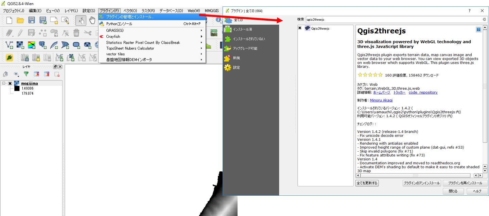
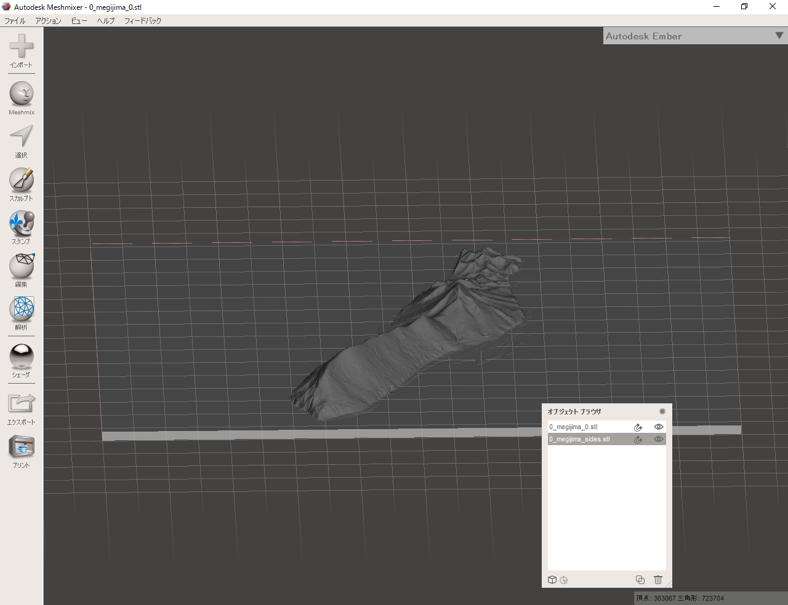
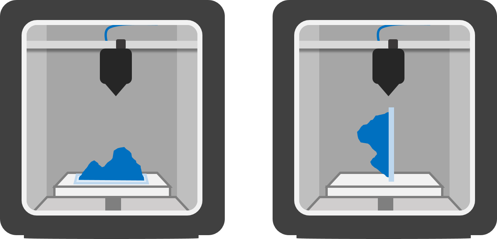
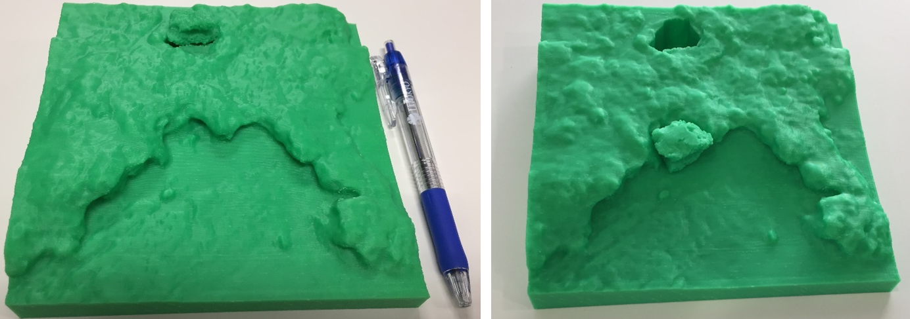
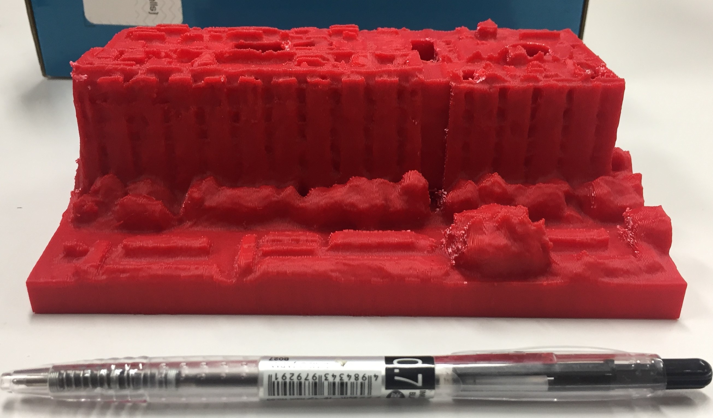

# 3Dプリンタ
この教材では、3Dプリンタによる地形模型の出力手法について解説しています。3Dプリンタの概要や地理院地図とQGISで地形模型（STLファイル）を作成する手法およびSTLファイルの簡単な編集手法について解説しています。また、3Dプリントのデモ動画やプリント時の注意点なども解説しています。本教材を使用する際は、[利用規約]をご確認いただき、これらの条件に同意された場合にのみご利用下さい。

**Menu**
----
- [3Dプリンタとは](#プリンタ)
- [地理院地図でモデルの作成](#地理院地図でモデルの作成)
- [QGISでモデルの作成](#QGISでモデルの作成)
- [STLの編集](#STLの編集)
- [プリントデモ](#プリントデモ)
- [地形モデルの印刷](#地形モデルの印刷)
- [プリントモデルの紹介](#プリントモデルの紹介)

※　この教材を作成する過程で、三好由起（東京大学空間情報科学研究センター） 氏と田村賢哉（ 首都大学東京大学院 システムデザイン研究科インダストリアルアート学域 博士課程 / NPO法人伊能社中 理事長 ） 氏に協力を頂きました（所属は教材作成時のもの）。

> 三好由起 氏には、プロトタイプの3Dモデル作成や機器および原料の選定に関するアドバイスをいただきました。

> 田村賢哉 氏には、自身の博士研究の成果の一部である地形モデルの効果的な見せ方や印刷手法に関するアドバイスをいただきました。

## <a name="プリンタ">3Dプリンタとは</a>
 3Dプリンタは、原料を一定の厚みで積層し、立体的な模型を出力する装置です。原料は、プリンタの積層方法によって異なります。熱溶解積層法式では、ABS樹脂、PLA樹脂が用いられ、光造形では、光硬化性樹脂が用いられます。その他に、紙や石膏を原料としたものなどがあります。また、モデルに着色ができるかは、使用している原料やプリンタの種類によって変わります。

> 3Dプリンタの種類や原料については、国土地理院HPの[立体模型をつくるのページ](http://cyberjapandata.gsi.go.jp/3d/creating.html)が詳しい。

[▲メニューへもどる]

## 地理院地図でモデルの作成
以下では、地理院地図で3Dモデル（STLファイル）を取得または作成する手法について解説します。簡単に3Dモデルを作成する際に利用できます。

[地理院地図]を開き、モデルを作成したい範囲を選択し、3Dボタンをクリックする。
カスタムから範囲を指定し、OKをクリックする。

STLファイルをクリックのダウンロードボタンから、データを保存する。

[▲メニューへもどる]

## QGISでモデルの作成
以下では、QGISで3Dモデル（STLファイル）を作成する手法について解説します。以下の教材では、基盤地図情報の5ｍDEM（高松市周辺）を利用しています。

QGISで平面直角座標系に、変換したラスタデータを読み込む。
プラグインからプラグインの管理とインストール＞Qgis2threejsを読み込む。

① Qgis2threejsのアイコンをクリックする。② FileExport.htmlを選択する。 ③ STL化するDEMを指定する。 ④ Runをクリックするとhtmlファイルが開くため、そこからSTLをダウンロードする。htmlが開かない場合は、Resamplingのバーを左に動かす。デフォルトで作成するモデルは、QGISで表示している範囲と関係する。

sidesやframeにチェックを入れると土台を付けることができる。

※土台の結合には、STLを編集するソフトウェアが必要。

[▲メニューへもどる]

## STLの編集
作成したモデルに土台を作成したり、範囲の切断などの編集をするには、STLモデルを編集するソフトウェアを利用します。以下では、フリーで利用できるoutodesknのMeshmixerを利用して、STLモデルを編集する手法について解説します。

Meshmixerは利用環境によって安定しないことや処理速度が低いことがあるため、有償ソフトウェアの日本ユニシス・エクセリューションズ株式会社のPOLYGONALmeister等と連携して使用するとことが望ましい。

### Meshmixerのインストール
[Meshmixerの提供ページ](http://www.meshmixer.com/)からMeshmixerのインストーラーをダウンロードする。インストーラーに従い、Meshmixerをインストールする。

### モデルのインポート

Meshmixerを起動し、インポートからQGISで作成したSTLを読み込む。

※QGISで土台を作成した場合などモデルが2つある場合は以下のように結合する。

### モデルの結合
QGISで土台を作成している場合は、2つモデルができるため、片方のファイルを先に読み込んだ後に、もう片方のファイルをドラックアンドドロップする。「追加」と「置き換え」のうち、「追加」をクリックする。オブジェクトブラウザに２つレイヤが追加されていれば、読み込みができている。オブジェクトブラウザが表示されない場合は、ビュー＞オブジェクトブラウザを表示をクリックする。

①片方のファイルをオブジェクトブラウザで選択（クリック）する。②次に結合するファイルをShiftキーを押しながら選択する。③メニューが表示されるため、結合をクリックする。

### モデルの切断
Meshmixerでモデルの切断をする場合、以下のように行う。

① 編集＞面でカットを選択する。② モデル上で切り取りたい方向にドラックしてラインを作成する。作成したラインの微調整は、赤、緑、青の矢印をドラッグして行う。この画面の場合、縦方向への移動は赤、横方向の移動が緑となる。青は切り取る面の角度を調整できる。

③ 切り取る面（破棄する面）を選択する。④ 適用をクリックすると切断することができる。

※　この時、切断面の穴埋めがうまくいかない場合がある。その場合は事前にソリッドを作成し、切断後に中穴を作成するなどの処理が必要になる。

### STLの書き出し
エクスポートをクリックして、STLファイルを任意の場所に出力する。3Dプリントする際に、出力したファイルを用いる。ソフトウェアを閉じる際に作業ファイルを保存しておくと良い。

[▲メニューへもどる]

## プリントデモ
以下では、UP BOX+を用いて地形模型出力する様子を動画教材で解説しています。この教材では、出力した模型が分かりやすいように高さ倍率を2倍にしています。

※　この下に動画が表示されない場合は、[動画を表示する](https://www.youtube.com/embed/cH0pr-dIQkc)をクリックしてください。

<iframe width="560" height="315" src="https://www.youtube.com/embed/cH0pr-dIQkc" frameborder="0" allowfullscreen></iframe>

[▲メニューへもどる]

## 地形モデルの印刷

### 積層
3Dプリントでは、印刷時に層の厚みを設定し、それに応じてモデルをスライスします。印刷は層ごとに実行され、出力した層の上に次の層が積層されます。モデルの精巧さは、スライスした層の厚みと数によって決まります。層の厚みは、プリンタの種類によって異なり、上記で利用しているUP BOX+では、最小で0.1mmの積層が可能です。一方で、層の厚みを薄くするほど印刷に時間がかかり、ノズル詰まりが起きやすくなります。

### モデルの起伏
地形模型の印刷では多くの場合、標高の値に対してデータの範囲を広くとるため、平坦なモデルが出力されます。広い範囲の地形模型を出力する場合は、高さ倍率を調整する必要があります。

### スライス数と表面形状の関係
モデルを印刷台に設置するときの向きによって、モデルの表面の滑らかさに違いが生じます（XYZが同一比の場合を除く）。図A,Bでは、印刷台に対して地形面を水平に設置した場合（下図左）と、印刷台に対して地形面を垂直に設置（下図右）した場合を比較しています。下図左では、右に比べスライス数が少なくなります。そのため、等高線を切り抜きそれを積み上げたように造形されます。一方で、下図右をみるとスライス数が多いため、波食台が滑らかに表現できていす。

図A モデルの設置方向の比較(上記の場合、右の方がスライス数が多くなる)

図B 0.3mmで積層した雀島の地形模型(左:地形面水平設置法:124スライス　右:地形面垂直設置法:273スライス)

※　地形の滑らかさには、印刷している層と次層との範囲の差も影響する。印刷台に地形面を水平に設置した場合でも、印刷している層と次層との範囲が大きく変わらない急峻な山地部等では、比較的滑らかに地形が造形できる。

[▲メニューへもどる]

## プリントモデルの紹介
以下では、[地形鮮明化プロジェクト](http://hdtopography.blogspot.com/)と連携して作成した応用的な3Dプリントについて紹介しています。

### 下地島の帯岩とその周辺（沖縄県宮古島市）
帯岩は、1771年の八重山地震に伴う明和の大津波によって、打ち上げられた津波石です。以下のモデルでは、津波石とその周辺を別々に印刷し、津波石が湾岸部のどこにあてはまるのかを推察することができます。

### 雀島（千葉県いすみ市）
雀島は、千葉県いすみ市太東岬の海食崖から続く陸繋島です。雀島には、護岸がないため自然な海岸浸食を観察することができます。以下のモデルは、雀島の2時期のモデルとその差分を抽出したモデルを組み合わせて、地形の変化を表現しています。

### 東京大学柏キャンパス総合研究棟（千葉県柏市）
東京大学柏キャンパスは、千葉県柏市にあります。以下は、柏キャンパス全体の3Dモデルから、CSIS(空間情報科学研究センター)のある総合研究棟のみを切り取り印刷したものです。

[▲メニューへもどる]

#### ライセンスに関する注意事項
本教材で利用しているキャプチャ画像の出典やクレジットについては、[その他のライセンスについて]よりご確認ください。

[▲メニューへもどる]:./3dprinter.md#menu
[利用規約]:../../policy.md
[利用規約]:../../../policy.md
[その他のライセンスについて]:../../license.md
[よくある質問とエラー]:../../questions/questions.md

[GISの基本概念]:../../00/00.md
[QGISビギナーズマニュアル]:../../QGIS/QGIS.md
[GRASSビギナーズマニュアル]:../../GRASS/GRASS.md
[リモートセンシングとその解析]:../../06/06.md
[既存データの地図データと属性データ]:../../07/07.md
[空間データ]:../../08/08.md
[空間データベース]:../../09/09.md
[空間データの統合・修正]:../../10/10.md
[基本的な空間解析]:../../11/11.md
[ネットワーク分析]:../../12/12.md
[領域分析]:../../13/13.md
[点データの分析]:../../14/14.md
[ラスタデータの分析]:../../15/15.md
[傾向面分析]:../../16/16.md
[空間的自己相関]:../../17/17.md
[空間補間]:../../18/18.md
[空間相関分析]:../../19/19.md
[空間分析におけるスケール]:../../20/20.md
[視覚的伝達]:../../21/21.md
[参加型GISと社会貢献]:../../26/26.md

[地理院地図]:https://maps.gsi.go.jp
[e-Stat]:https://www.e-stat.go.jp/
[国土数値情報]:http://nlftp.mlit.go.jp/ksj/
[基盤地図情報]:http://www.gsi.go.jp/kiban/
[地理院タイル]:http://maps.gsi.go.jp/development/ichiran.html

[課題ページ_QGISビギナーズマニュアル]:../../tasks/t_qgis_entry.md
[課題ページ_GRASSビギナーズマニュアル]:../../tasks/t_grass_entry.md
[課題ページ_リモートセンシングとその解析]:../../tasks/t_06.md
[課題ページ_既存データの地図データと属性データ]:../../tasks/t_07.md
[課題ページ_空間データ]:../../tasks/t_08.md
[課題ページ_空間データベース]:../../tasks/t_09.md
[課題ページ_空間データの統合・修正]:../../tasks/t_10.md
[課題ページ_基本的な空間解析]:../../tasks/t_11.md
[課題ページ_ネットワーク分析]:../../tasks/t_12.md
[課題ページ_基本的な空間解析]:../../tasks/t_13.md
[課題ページ_点データの分析]:../../tasks/t_14.md
[課題ページ_ラスタデータの分析]:../../tasks/t_15.md
[課題ページ_空間補間]:../../tasks/t_18.md
[課題ページ_視覚的伝達]:../../tasks/t_21.md
[課題ページ_参加型GISと社会貢献]:../../tasks/t_26.md
