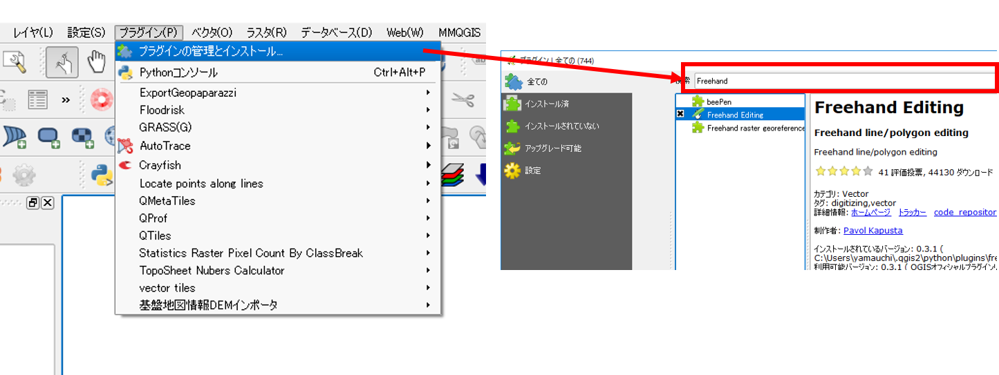
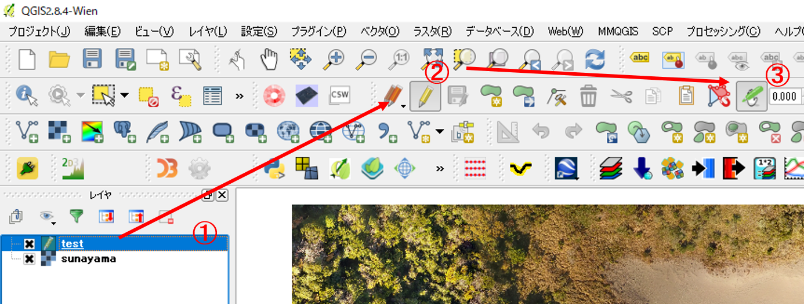
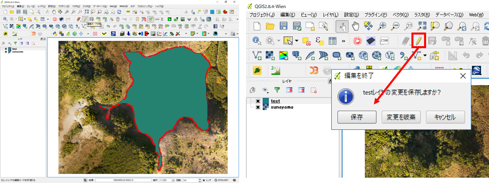

# タブレットを利用したベクトルデータの作成
この教材では、タブレットPC（Surface Pro）とペン型マウス（ Surface Pen ）を用いて、紙地図や空中写真からトレースしてデータを作成する方法について解説します。この操作は、マウスでも代用できます。QGISの初心者は、[QGISビギナーズマニュアル]を一読した後、学習をすることを推奨します。

本教材を使用する際は、[利用規約]をご確認いただき、これらの条件に同意された場合にのみご利用下さい。

## トレースによるポリゴンの作成
以下では、QGISのプラグインであるFreehand Editingを利用してフリーハンドでポリゴンを作成する手法について解説しています。

まず、`プラグイン＞プラグインの管理とインストール`からFreehand Editingプラグインをインストールする。

トレースをするために、位置情報を保持している画像を読み込む。以下では、[sunayama.tif ](https://github.com/gis-oer/datasets/blob/master/raster/sunayama.tif)を使用して解説する。位置情報がついていない画像を利用したい場合は、[空間データ]の教材を参考にジオリファレンスしたものを利用する。

編集用のポリゴンを作成するため、`レイヤ＞レイヤの作成＞新規シェープファイルレイヤ`をクリックする。ポリゴンの作成時の設定は、[空間データの統合・修正]の教材を参照する。新規ポリゴンの座標系は、トレースしたいデータの座標系に合わせる。

出力したポリゴンを編集するため、①新規作成したポリゴンを選択する。② 編集モード（鉛筆アイコン）をクリックする。 ③Free Editアイコンをクリックする。

任意の形状のポリゴンを作成する（マウスの場合、長押しクリックした状態でポリゴンを作成する）。ポリゴンの作成時には、面が交差しないように注意する。解説では、植生のない部分のポリゴンを作成している。

## 操作解説を動画で学ぶ

準備中

※　この下に動画が表示されない場合は、[動画を表示する]()をクリックするか、Gitbookページの[タブレットを利用したベクトルデータの作成]()で閲覧してください。

<iframe width="560" height="315" src="" frameborder="0" allowfullscreen></iframe>

#### ライセンスに関する注意事項
本教材で利用しているキャプチャ画像の出典やクレジットについては、[その他のライセンスについて]よりご確認ください。

[その他のライセンスについて]:../../license.md
[▲メニューへもどる]:./tablet.md#Menu
[QGISビギナーズマニュアル]:../../QGIS/QGIS.md
[空間データの統合・修正]:../../10/10.md
[利用規約]:../../policy.md
[利用規約]:../../../policy.md
[その他のライセンスについて]:../../license.md
[よくある質問とエラー]:../../questions/questions.md

[GISの基本概念]:../../00/00.md
[QGISビギナーズマニュアル]:../../QGIS/QGIS.md
[GRASSビギナーズマニュアル]:../../GRASS/GRASS.md
[リモートセンシングとその解析]:../../06/06.md
[既存データの地図データと属性データ]:../../07/07.md
[空間データ]:../../08/08.md
[空間データベース]:../../09/09.md
[空間データの統合・修正]:../../10/10.md
[基本的な空間解析]:../../11/11.md
[ネットワーク分析]:../../12/12.md
[領域分析]:../../13/13.md
[点データの分析]:../../14/14.md
[ラスタデータの分析]:../../15/15.md
[傾向面分析]:../../16/16.md
[空間的自己相関]:../../17/17.md
[空間補間]:../../18/18.md
[空間相関分析]:../../19/19.md
[空間分析におけるスケール]:../../20/20.md
[視覚的伝達]:../../21/21.md
[参加型GISと社会貢献]:../../26/26.md

[地理院地図]:https://maps.gsi.go.jp
[e-Stat]:https://www.e-stat.go.jp/
[国土数値情報]:http://nlftp.mlit.go.jp/ksj/
[基盤地図情報]:http://www.gsi.go.jp/kiban/
[地理院タイル]:http://maps.gsi.go.jp/development/ichiran.html

[課題ページ_QGISビギナーズマニュアル]:../../tasks/t_qgis_entry.md
[課題ページ_GRASSビギナーズマニュアル]:../../tasks/t_grass_entry.md
[課題ページ_リモートセンシングとその解析]:../../tasks/t_06.md
[課題ページ_既存データの地図データと属性データ]:../../tasks/t_07.md
[課題ページ_空間データ]:../../tasks/t_08.md
[課題ページ_空間データベース]:../../tasks/t_09.md
[課題ページ_空間データの統合・修正]:../../tasks/t_10.md
[課題ページ_基本的な空間解析]:../../tasks/t_11.md
[課題ページ_ネットワーク分析]:../../tasks/t_12.md
[課題ページ_基本的な空間解析]:../../tasks/t_13.md
[課題ページ_点データの分析]:../../tasks/t_14.md
[課題ページ_ラスタデータの分析]:../../tasks/t_15.md
[課題ページ_空間補間]:../../tasks/t_18.md
[課題ページ_視覚的伝達]:../../tasks/t_21.md
[課題ページ_参加型GISと社会貢献]:../../tasks/t_26.md
