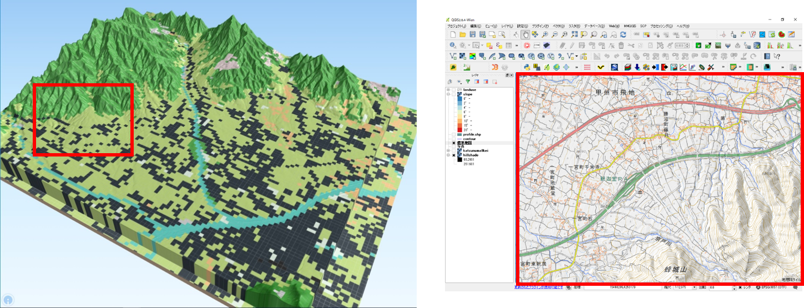

# 地形と土地利用のオーバーレイ分析（第5回～第7回）
　この教材では、地形情報と土地利用情報を重ね合わせて、視覚的に重ね合わせ分析する手法について紹介します。以下に示す手順を参考に学習例と同じ図を作成してください。GIS入門者は、この学習を始める前に、[GISの基本概念]と[QGISビギナーズマニュアル]を利用し、GISの基礎をマスターしておくことを推奨します。この教材は、主に実習を対象としているため、用語や理論に関する解説を省略している箇所があります。各実習にあたっては、参照教材の上段にある講義用教材（GIScスライド）を一読してから学習することを推奨します。

## 学習目標
- GISデータのダウンロード手法を理解する
- 地形情報の可視化手法を理解する
- 空間座標系について理解する

## 実習1：土地利用データのダウンロードと空間座標の変換（第5回）

### 手順
1.[既存の地図データと属性データ]の教材を参考に、国土数値情報から土地利用データをダウンロードする。
2.[空間データ]の教材を参考に、平面直角座標系に変換する
3.[QGISビギナーズマニュアル]を参考に、属性テーブルに基づいた土地利用の色分けを行う。

## 実習2:標高データのダウンロード、空間座標の変換、地形情報の可視化（第6回）

### 完成例

1. [既存の地図データと属性データ]の教材を参考に、標高データ(DEM)をダウンロードする。
2. [ラスタデータの分析]教材を参考に、標高データ（xml）をGeotiffに変換する。
3. [ラスタデータの分析]教材を参考に、空間座標の変換を行う。
4. [ラスタデータの分析]教材を参考に、地形データの可視化（段彩図、陰影図、傾斜区分図)を作成する。

## 実習3:作成データと地理院タイル等を用いた視覚的分析（第7回）

### 完成例

1. 実習1と2で作成したデータをQGISに読み込む。
2. [QGISビギナーズマニュアル]を参考に、タイルレイヤプラグインを利用して、地理院タイルを読み込む（右図）。[ラスタデータの分析]を参考に、鳥瞰図を作成する（左図）。
3. [ラスタデータの分析]を参考に、地形断面を作成するなど、実習1、2を踏まえて様々な情報を比較しながら、土地利用の特性について分析を行う。

### 動画で学ぶ
　上記の手順を動画にまとめています。GISの操作に自信がない方におすすめの学習法です。動画はYoutubeで公開しているため、画面の大きさや再生速度等を調節して、ご利用ください。

準備中

[動画が再生されない場合はこちら]()
> この動画は、GIS実習オープン教材の内容を援用して作成したものです。教材の更新が動画内容の更新よりも優先されるため、紹介するサイトのレイアウト等が異なる箇所は、適宜GIS実習オープン教材を参照してください。動画内では、第3者の著作物を引用という形で使用しています。著作者からの異議申し立てがあった場合は、速やかに当該部分を削除します。
