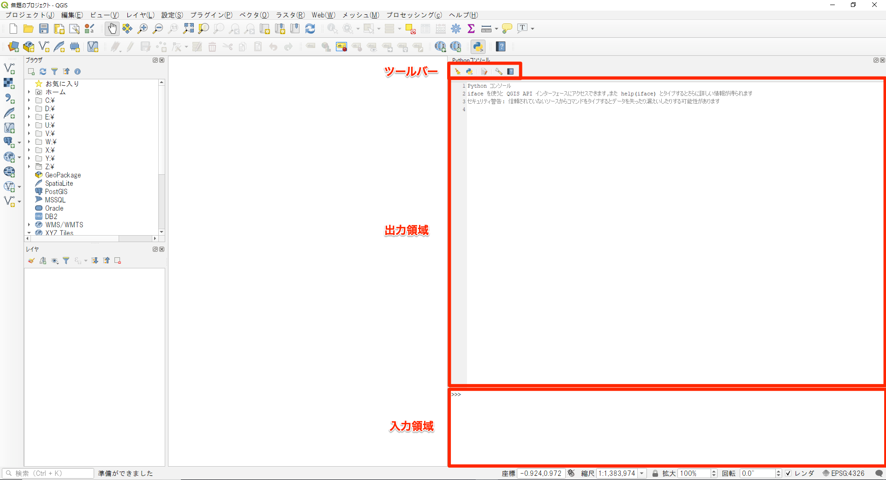

# Pythonの概要とQGISにおけるPythonの役割

**Menu**
------
- [QGISにおけるPythonの役割](#QGISにおけるPythonの役割)
- [Pythonとは](#Pythonとは)
- [QGISのPythonコンソールからの操作](#QGISのPythonコンソールからの操作)
- [Python入門](#Python入門)

## <a name="QGISにおけるPythonの役割"></a>QGISにおけるPythonの役割
QGISはC++で書かれており、インタフェース部分についてはQtライブラリを使用しています。
C++で書かれているQGISですが、SIPというツールを使用して、Python用インタフェースも提供されています。Qtについても同様にPython用のインタフェースが提供されています。これにより、QGISで追加機能の開発する場合、C++で書く、Pythonで書く、の２通りの方法を選択出来ます。ただし、Pythonについては全ての機能を使用出来る訳ではなく、Python用インタフェースが提供されている機能のみ使用出来るという点で注意が必要です。例として、データハンドリングの根幹に関するプラグインについては、アプリケーション全体の実行速度に影響を与えるためPythonでの作成は出来なくなっています。C++、Pythonの使い分けとしては、
- Pythonはコンパイルの必要が無いが、C++ではコンパイルが必要
- QGISのどの部分にアクセスするのか
- 配布先のOSを考慮した場合に、C++ではOSにあったライブラリの作成が必要

といった点を考慮して決める必要があります。とはいえ、どちらで開発するのがお手軽かといえば、Pythonを使用する場合になります。

## <a name="Pythonとは"></a>Pythonとは
Pythonはプログラムの実行前にコンパイルを必要としないスクリプト言語または軽量言語と呼ばれる種類のプログラミング言語です。
他の言語に比べて文法がシンプルで習得がしやすい言語となっています。また、誰が書いても同じような記述になるような工夫がされています。そのひとつとしてインデント(字下げ)が重要という点が挙げられます。例えばループを表す際に、Pythonではループ内のブロックのインデントを揃えることで表します。
QGISの追加機能開発にも利用出来ますし、ArcGISのArcPyでの採用例もありますので、地理情報を扱う技術者としては押さえておきたいプログラミング言語です。

QGIS3から、Pythonのバージョンが以前とは変更されており、Python 3.7となっています。

## <a name="QGISのPythonコンソールからの操作"></a>QGISのPythonコンソールからの操作
QGISにはPythonで操作するためのインターフェイスであるPythonコンソールが用意されています。QGISのメニュー`プラグイン > Pythonコンソール`を選択するとPythonコンソールが表示されます。Pythonコンソールはツールバー、入力領域、出力領域から構成されています。

ツールバーでは各種操作をGUIから選択、実行できます。入力領域にコマンドを実行すると、出力領域に結果の出力や、エラーメッセージなどが表示されます。



## <a name="Python入門"></a>Python入門

Pythonコンソールを使用して、Pythonの基本的な構文を試してみましょう。
Pythonコンソールの入力領域に、コマンドを入力していきます。例文の`>>>`に続く部分を入力してください。1行の入力後には`Returnキー`を押してください。

### 変数への代入

Pythonでは変数の型をあらかじめ指定しておく必要はなく、

`変数名 = 代入する値、オブジェクトなど`

を指定した際に変数が作成されます。変数名をタイプすると、変数に代入されている値・クラスを確認できます。

```python
>>>test = 'QGIS'
>>>test
'QGIS'
```

作成されていない変数がタイプされた際は、エラーとなります。

```python
>>>test2
Traceback (most recent call last):
File "< input >", line 1, in <module>
NameError: name 'test2' is not defined
```

### 組み込み型と扱い
#### 数値型
数値型は整数型、浮動小数点型、複素数型が用意されています。ただし、ここでは複素数型は使用しないので、説明は省きます。数値に対しては「+」「-」「*」「/」「%」「**」といった演算子を使用して計算を行えます。

```python
>>>3*2
6
```

注意する点として、割り算をした場合には浮動小数点型の結果が返されます。

```python
>>>4/2
2.0
```

計算の優先順位は、足し算・引き算より、掛け算・割り算が優先されるというように、通常の四則演算と同様です。優先順位を明示する場合は、`()`でくくります。

```python
>>>1+2*3
7
>>>(1+2)*3
9
```

#### 文字列
Pythonでは文字列は「'(シングルコーテーション)」もしくは「"(ダブルコーテーション)」で囲って表現します。通常はシングルコーテーションを使用します。文字列中のコーテーション記号や、特殊記号はバックスラッシュでエスケープします。

```python
>>>'QGIS'
'QGIS'
>>>'QGIS \'3.4\''
“QGIS '3.4'”
>>>a = 'QGIS \n3.4'
>>>print (a)
QGIS
3.4
```

3重のコーテーション記号を使うと、複数行にまたがった文字列を表現出来ます。

```python
>>>a = '''QGIS
...3.4'''
>>>print(a)
QGIS
3.4
```

文字列は添字表記で一部を参照することが可能です。最初の文字のインデックスは0です。

```python
>>>a = 'QGIS'
>>>a[0]
'Q'
>>>a[1:2]
'G'
```

ただし文字列の一部を書き換えることは出来ないので、注意しておいて下さい。下記の処理はエラーになります。

```python
>>>a = 'QGIS'
>>>a[1] = 'b'
File "<input>", line 1, in <module>
TypeError: 'str' object does not support item assignment
```

文字列は”+”演算子で連結することが出来ます。

```python
>>>a = 'QGIS' + '3.4'
>>>print(a)
QGIS3.4
```

#### リスト
Pythonでは別々のデータをひとつにまとめにして使う場合の複合型がいくつか用意されています。そのうちもっとも汎用的なのがリストになります。カンマで区切られた値を`[]`角括弧で囲んで表します。文字列と同様に添字で各要素にアクセスすることが出来ます。

```python
>>>a = ['QGIS', 3, 4]
>>>a
['QGIS', 3, 4]
>>>a[1]
3
>>>a[0:2]
['QGIS', 3]
```

リストは連結することも出来ますし、要素を指定して入れ替えることも出来ます。

```python
>>>a = ['QGIS', 3] + [4]
>>>a
['QGIS', 3, 4]
>>>a[2] = 6
>>>a
['QGIS', 3, 6]
```

#### 辞書
辞書は他の言語において、”連想配列”として実装されているものです。辞書はキーと値のペアの集合になります。キー：値のペアをコロンで区切り、`{}`波括弧で囲んで表します。

```python
>>>a = {'app':'QGIS', 'ver':3.4}
>>>a['app']
'QGIS'
```

辞書中に特定のキーが存在しているかを調べる場合は、`in`を使用します。返された結果が`True`ならば存在しており、`False`ならば存在していません。

```python
>>>'app' in a
True
```

<h2 style="background-color:#F8F5FD;text-align:center;">教材の利用に関するアンケート</h2>　本プロジェクトでは、教材の改良を目的とした任意アンケートを実施しています。ご協力いただける方は、<a href="https://docs.google.com/forms/d/1r8RTFK3CPo4xNM6SdOEsAtdA0CrChD6KPVVU9kRxWRs/">アンケート</a>にお進みください。ご協力のほどよろしくお願いいたします。<br><br>※ 本アンケートの成果は、教材の改良のほか、学会での発表等の研究目的でも利用します。
