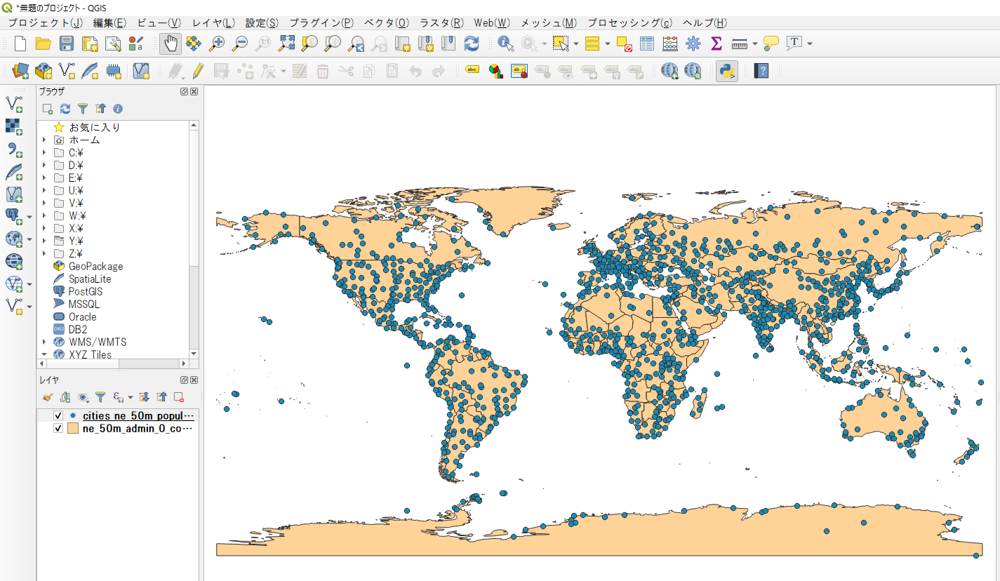

# ベクターデータの読み込みと図形へのアクセス
ベクターデータを読み込みます。すでにQGISで読み込んでいる場合と、ファイルを直接指定して読み込む場合があります。また、読み込んだレイヤの図形への順次アクセスを学びます。


**Menu**
------
- [読み込み済みレイヤへのアクセス](#読み込み済みレイヤへのアクセス)
- [ベクターデータの新規読み込み](#ベクターデータの新規読み込み)
- [アクティブなレイヤへのアクセス](#アクティブなレイヤへのアクセス)
- [レイヤの表示/非表示の切り替え](#レイヤの表示/非表示の切り替え)
- [図形への順次アクセス](#図形への順次アクセス)

## <a name="読み込み済みレイヤへのアクセス"></a>読み込み済みレイヤへのアクセス
QGISで読み込み済みのレイヤへアクセスします。

読み込み済みのレイヤ一覧には`QgsProject`クラスのインスタンスからアクセス出来ます。シングルトンクラスになっているので、`QgsProject.instance()`を使用します。
まずはデータの読み込みがされていない状態実行してみましょう。何も読み込まれていないので空の辞書が返されます。

```python
>>>QgsProject.instance().mapLayers()
{}
```

QGISのユーザーインターフェイス上で、データソースマネージャから、実習用にダウンロードした`ne_50m_admin_0_countries.shp`を追加します（データの取得方法は [README]を参照してください。）。先ほどと同様にデータにアクセスすると、読み込んだ画像のファイル名が辞書で返されます。複数のファイルを読み込んでいる場合には全てのファイル名が辞書に格納されます。

[README]:../README.md

```python
>>>QgsProject.instance().mapLayers()
{'ne_50m_admin_0_countries_8d55f8f5_ddff_4585_888a_caa06235d30a': <qgis._core.QgsVectorLayer object at 0x0000023676C76288>}
```

## <a name="ベクターデータの新規読み込み"></a>ベクターデータの新規読み込み
`addVecterLayer()`を使ってコンソールからレイヤを追加してみましょう。`C:\work\ne_50m_populated_places.shp`を読み込みます。最初の引き数は読み込むファイル名、2番目はレイヤ名称として使用されます。3番目の引き数は使用する`QgisDataProvider`へのキーになります。データの保存先ディレクトリは適宜、ご自分の環境に読み替えてください。
`QgisDataProvider`はデータソースからの読み込み、書き込み、ハンドリング全般を行うクラスです。扱うデータの形式に応じて`QgisDataProvider`を指定します。ここではベクターデータを扱っているので`ogr`を使用します。

```python
>>>iface.addVectorLayer(r'C:\work\ne_50m_populated_places.shp', 'cities', 'ogr')
<qgis._core.QgsVectorLayer object at 0x0000023676C76318>
```
都市のポイントデータがマップキャンバスに追加されました。



## <a name="アクティブなレイヤへのアクセス"></a>アクティブなレイヤへのアクセス
現在選択されている(操作対象となっている)レイヤは`iface`を通して取得します。

```python
>>>layer = iface.activeLayer()
```

## <a name="レイヤの表示/非表示の切り替え"></a>レイヤの表示/非表示の切り替え
`QgsProject.instance()`から、レイヤツリーにアクセスし、レイヤツリーを通して各レイヤの表示/非表示を切り替えます。
```
>>>QgsProject.instance().layerTreeRoot().findLayer(layer).setItemVisibilityChecked(False)
>>>QgsProject.instance().layerTreeRoot().findLayer(layer).setItemVisibilityChecked(True)
```

## <a name="図形への順次アクセス"></a>図形への順次アクセス
QGISで`ne_50m_admin_0_countries.shp`のレイヤを選択し、各要素にアクセスしてみます。

`name()`で読み込んだレイヤの名称を表示します。

```python
>>>layer = iface.activeLayer()
>>>layer.name()
'ne_50m_admin_0_countries'
```

`QgsFeatureIterator`クラスを通して各図形に順次アクセスします。

```python
>>>features = layer.getFeatures()
>>>for feature in features:
... feature.geometry()
<QgsGeometry: MultiPolygon (((31.28789062500001705 -22.40205078125001137, 31.197265625 -22.34492187500001137,
(以下略)
```

`field()`を使ってアクティブなベクターレイヤの全フィールド名を取得します。

```python
>>>fields = layer.fields()
>>>for field in fields:
... print(field.name())
featurecla
scalerank
LABELRANK
(以下略)
```

for文の中で属性'NAME'を指定し、全地物の'NAME'を取得します。

```python
>>>features = layer.getFeatures()
>>>for feature in features:
... feature['NAME']
'Zimbabwe'
'Zambia'
'Yemen'
(以下略)
```

属性'NAME'が'Japan'のベクトル要素を選択して、その要素の範囲にズームしてみましょう。

```python
>>>features = layer.getFeatures()
>>>for feature in features:
... if feature['NAME'] == 'Japan':
...     break
>>>canvas = iface.mapCanvas()
>>>canvas.setExtent(feature.geometry().boundingBox())
>>>canvas.refresh()
```

<h2 style="background-color:#F8F5FD;text-align:center;">教材の利用に関するアンケート</h2>　本プロジェクトでは、教材の改良を目的とした任意アンケートを実施しています。ご協力いただける方は、<a href="https://docs.google.com/forms/d/1r8RTFK3CPo4xNM6SdOEsAtdA0CrChD6KPVVU9kRxWRs/">アンケート</a>にお進みください。ご協力のほどよろしくお願いいたします。<br><br>※ 本アンケートの成果は、教材の改良のほか、学会での発表等の研究目的でも利用します。
