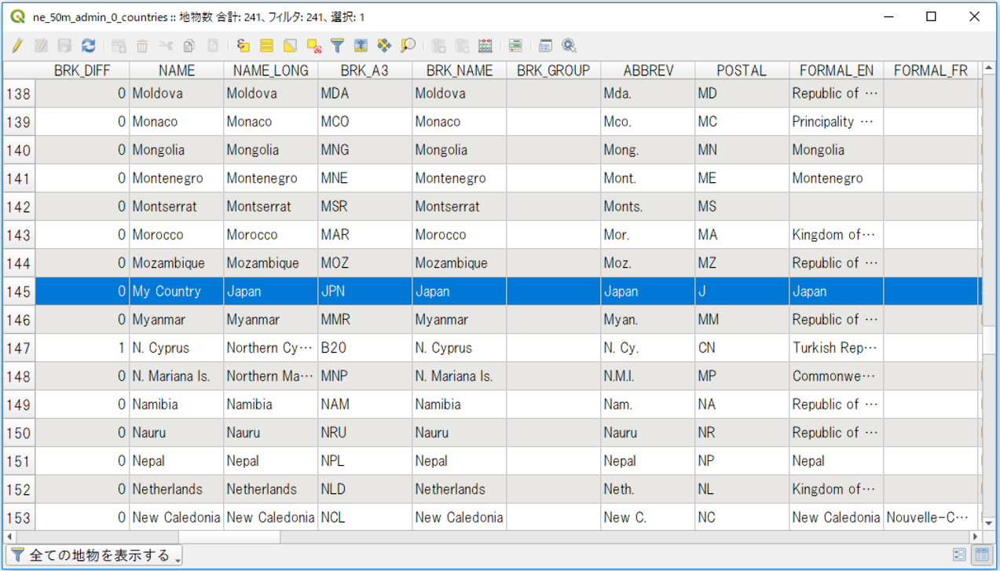
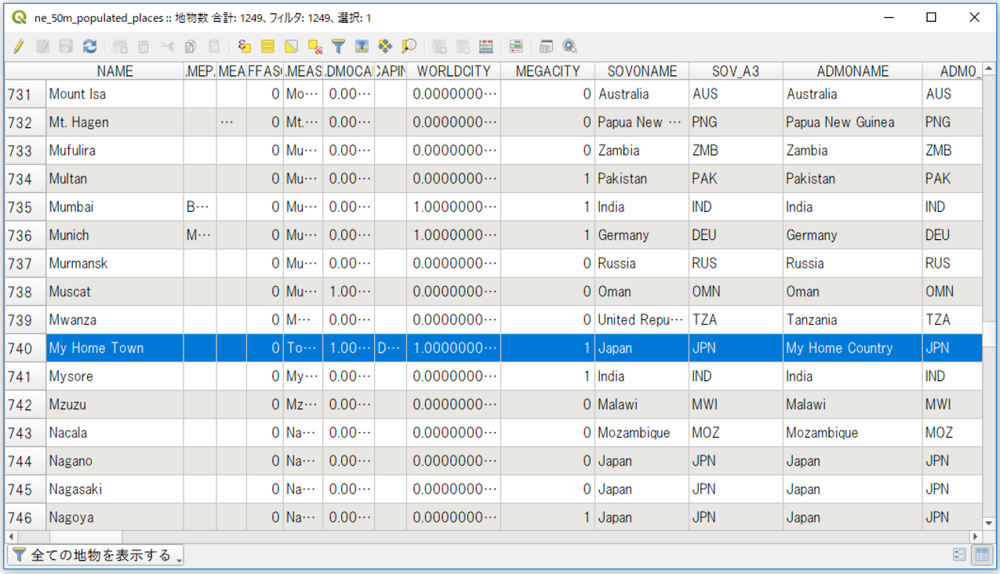

# ベクターデータの属性情報に基づく処理
ベクターデータは各地物が属性情報をもっています。この章ではその属性情報に基づく処理を学びます。

**Menu**
------
- [フィールド名の取得](#フィールド名の取得)
- [属性情報に基づく地物選択](#属性情報に基づく地物選択)
- [地物の属性情報の編集](#地物の属性情報の編集)
- [複数の属性情報を一括で編集](#複数の属性情報を一括で編集)

## <a name="フィールド名の取得"> </a>フィールド名の取得
ここで使うデータは`ne_50m_admin_0_countries.shp`です。データの取得方法は[README]を参照してください。まずはQGISでレイヤを読み込んでおきましょう。
次にコンソールから`iface`を使ってアクティブなレイヤを取得します。
アクティブなベクターレイヤの全フィールド名を取得するには`fields()`を使います。

[README]:../README.md

```python
>>>layer = iface.activeLayer()
>>>fields = layer.fields()
>>>for field in fields:
... print(field.name())
SCALERANK
NATSCALE
LABELRANK
(以下略)
```

## <a name="属性情報基づく地物選択"></a>属性情報に基づく地物選択
`attributes()`は地物の属性情報をリストで返します。

まずは属性"NAME"が'Uganda'の地物を選択してみましょう。

```python
>>>feature = [f for f in layer.getFeatures(QgsFeatureRequest().setFilterExpression('"NAME" = \'Uganda\''))]
```

'Uganda'の地物がリストで取得されました。確認してみましょう。

```python
>>>feature
[<qgis._core.QgsFeature object at 0x0000027872FFF798>]
```

地物が取得されていることを確認したところで`attributes()`で地物の属性情報を表示してみましょう

```python
>>>feature[0].attributes()
['Admin-0 country', 1, 3, 'Uganda', 'UGA', 0, 2, 'Sovereign country', 'Uganda', 'UGA', 0, 'Uganda
(以下略)
```

地物を選択する時にレイヤの持つ地物情報に含まれない属性値を指定すると空のリストが返されます。エラーにはなりません。

```python
>>>feature = [f for f in layer.getFeatures(QgsFeatureRequest().setFilterExpression('"NAME" = \'Tokyo\''))]
>>>feature
[]
```


## <a name="地物の属性情報の編集"></a>地物の属性情報の編集
今度は属性"NAME"が'Japan'の地物を選択して、属性値を編集してみましょう。

属性値を更新する地物を選択します。

```python
>>>feature = [f for f in layer.getFeatures(QgsFeatureRequest().setFilterExpression('"NAME" = \'Japan\''))]
>>>feature
[<qgis._core.QgsFeature object at 0x0000027872FFFAF8>]
>>>feature[0].attributes()
['Admin-0 country', 3, 2, 'Japan', 'JPN', 0, 2, 'Sovereign country', 'Japan', 'JPN', 0, 'Japan'
(以下略)
```

新しい属性値のオブジェクトを辞書型で作ります。

```python
>>>my_country= {feature[0].fieldNameIndex("NAME"): "My Country"}
```

属性値を更新します。

```python
>>>layer.dataProvider().changeAttributeValues({ feature[0].id(): my_country})
True
```

ユーザーインターフェースから属性テーブルを確認し、属性"NAME"'に'My Country'があることを確認しましょう。




## <a name="複数の属性情報を一括で編集"></a>複数の属性情報を一括で編集
地物の複数の属性情報を一括で編集します。
今度は`ne_50m_populated_places.shp`の地物を編集してみましょう。まずは"NAME"が'Tokyo'の地物を編集します。

```python
>>>layer = iface.activeLayer()
>>>provider = layer.dataProvider()
>>>feature = [f for f in layer.getFeatures(QgsFeatureRequest().setFilterExpression('"NAME" = \'Tokyo\''))]
>>>feature[0]["NAME"] = 'My Home Town'
>>>feature[0]["ADM0NAME"] = 'My Home Country'
>>>field_map = provider.fieldNameMap()
>>>attributes = {field_map[key]: feature[0][key] for key in field_map}
>>>attributes
{9: 1.0, 15: 'My Home Country', 16: 'JPN',
(中略)
521.0, 4: 'My Home Town', 6: NULL,
(以下略)
```

属性値ファイルに書き込み更新しましょう。

```python
>>>layer.dataProvider().changeAttributeValues({feature[0].id(): attributes})
True
```
ユーザーインターフェースから属性テーブルを確認すると、属性値が変更されていることがわかります。



<h2 style="background-color:#F8F5FD;text-align:center;">教材の利用に関するアンケート</h2>　本プロジェクトでは、教材の改良を目的とした任意アンケートを実施しています。ご協力いただける方は、<a href="https://docs.google.com/forms/d/1r8RTFK3CPo4xNM6SdOEsAtdA0CrChD6KPVVU9kRxWRs/">アンケート</a>にお進みください。ご協力のほどよろしくお願いいたします。<br><br>※ 本アンケートの成果は、教材の改良のほか、学会での発表等の研究目的でも利用します。
