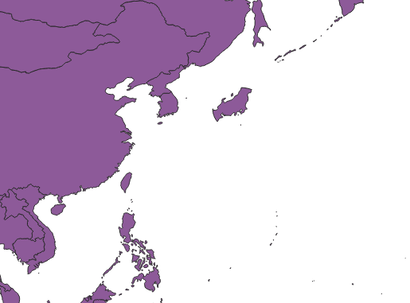

# 基本的な空間演算
ここでは、ベクターデータの基本的な空間演算の手法について解説します。
単一図形に対する空間演算として、 [QgsGeometry](https://qgis.org/api/classQgsGeometry.html)クラスに関数がいくつか用意されていますので、これを中心に見ていきます。

**Menu**
-----
- [バッファー](#バッファー)
- [共通部分の抜き出し](#共通部分の抜き出し)
- [図形の編集](#図形の編集)

## <a name="バッファー"></a>バッファー
QgsGeometryクラスには基本的な空間演算の関数が用意されています。
まず、ポイントを作成し、ポイントからのバッファーを発生させてみましょう。
X座標、Y座標を与えて図形を発生しますが、[Well-known text](https://en.wikipedia.org/wiki/Well-known_text_representation_of_geometry)での記述方法を覚えておくと便利です。ここでは経緯度で座標を与えています。

```Python
>>>point = QgsGeometry.fromWkt('POINT(139.69167 35.68944)')
```

`asWkt()`関数を使うと、図形の情報をWell-known textで出力することが出来ます。

```Python
>>>point.asWkt()
'POINT(139.69166999999998779 35.68943999999999761)'
```

`asJson()`関数を使用すると、GeoJSONでの出力も出来ます。

```Python
>>>point.asJson()
'{"type": "Point", "coordinates": [139.69166999999998779, 35.68943999999999761]}'
```

バッファーの発生には、`buffer()`関数を使用します。距離と補間点数を指定します。
注意点としては、いま作成した図形は経緯度で座標を持っているため、距離も経緯度での指定となります。
下記の例では、ポイントから1度のバッファーを作成しています。

```Python
>>>point.buffer(1.0, 10)
<QgsGeometry: Polygon ((140.69166999999998779 35.68943999999999761, 140.67935834059511535 35.53300553495976999, 140.64272651629514144
(以下略)
```

ポイントから実距離でバッファーを発生させるとすると、一旦実距離に投影変換した上でバッファー作成、再度経緯度に戻す、といった操作が必要になります。
下記例では、WGS84(EPSG:4326)からWEBメルカトル(EPSG:3857)へ変換し、500000mのバッファーを発生した上で、再び経緯度に戻しています。

```Python
>>>point = QgsGeometry.fromWkt('POINT(139.69167 35.68944)')
>>>
>>>coordwgs84 = QgsCoordinateReferenceSystem(4326)
>>>coordweb = QgsCoordinateReferenceSystem(3857)
>>>trans =  QgsCoordinateTransform()
>>>trans.setSourceCrs(coordwgs84)
>>>trans.setDestinationCrs(coordweb)
>>>
>>>re_trans = QgsCoordinateTransform()
>>>re_trans.setSourceCrs(coordweb)
>>>re_trans.setDestinationCrs(coordwgs84)
>>>point.transform(trans)
0
>>>buffer = point.buffer(500000.0, 10)
>>>
>>>buffer.transform(re_trans)
0
>>>buffer.asWkt()
'Polygon ((144.18324642059758389 35.6894399999999834, 144.127947661
(以下略)
```


## <a name="共通部分の抜き出し"></a>共通部分の抜き出し
2図形の共通部分を抜き出すには、`intersection()`を使用します。
`ne_50m_admin_0_countries.shp`がQGISに表示済みで、そのレイヤが選択済みとします。([ベクターデータの属性情報に基づく処理]で属性値を編集している場合は、以下を始める前に、新しいデータをダウンロードしてください。データの取得方法は[README]を参照してください。)

[ベクターデータの属性情報に基づく処理]:../03/03.md
[README]:../README.md

日本の図形を取得して、作成済みのバッファーとの共通部分のみ抜き出してみましょう。

```Python
>>>layer = iface.activeLayer()
>>>geom = [f.geometry() for f in layer.getFeatures(QgsFeatureRequest().setFilterExpression('"NAME" = \'Japan\''))]
>>>intersection_geom = geom[0].intersection(buffer)
>>>intersection_geom.asWkt()
'MultiPolygon (((138.34404296875004547 37.82211914062499858, 138.2490234375 37.819580078125, 138.22519531250003411
(以下略)
```

## <a name="図形の編集"></a>図形の編集
空間演算した結果の図形を`feature`に上書きしてみましょう。
まず、編集の開始と終了の明記が必要になります。対象のレイヤで、`startEditing()`と`commitChanges()`を呼びます。

```Python
>>>layer.startEditing()
...
>>>ここに何らかの処理を記載する
...
>>>layer.commitChanges()
```

`commitChanges()`前であれば、`rollBack()`を使って編集内容を戻すことも出来ます。

日本の図形を取得して、作成済みのバッファーとの共通部分のみ抜き出してみましょう。`commitChanges()`はしないでおきます。`buffer`は作成済みとします。

```Python
>>>layer = iface.activeLayer()
>>>layer.startEditing()
True
>>>feature = [f for f in layer.getFeatures(QgsFeatureRequest().setFilterExpression('"NAME" = \'Japan\''))]
>>>intersection_geom = feature[0].geometry().intersection(buffer)
>>>layer.changeGeometry(feature[0].id(), intersection_geom)
True
>>>iface.mapCanvas().refresh()
```



変更を確認して、問題なければ、通常は`commitChanges()`を行います（今回は不要）。

```Python
>>>layer.commitChanges()
True
```

<h2 style="background-color:#F8F5FD;text-align:center;">教材の利用に関するアンケート</h2>　本プロジェクトでは、教材の改良を目的とした任意アンケートを実施しています。ご協力いただける方は、<a href="https://docs.google.com/forms/d/1r8RTFK3CPo4xNM6SdOEsAtdA0CrChD6KPVVU9kRxWRs/">アンケート</a>にお進みください。ご協力のほどよろしくお願いいたします。<br><br>※ 本アンケートの成果は、教材の改良のほか、学会での発表等の研究目的でも利用します。
